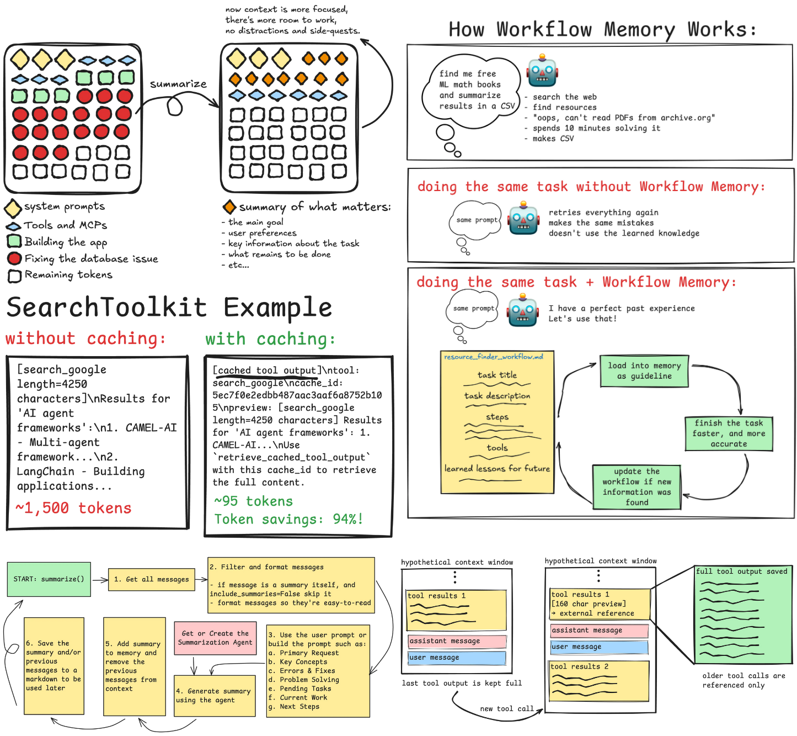
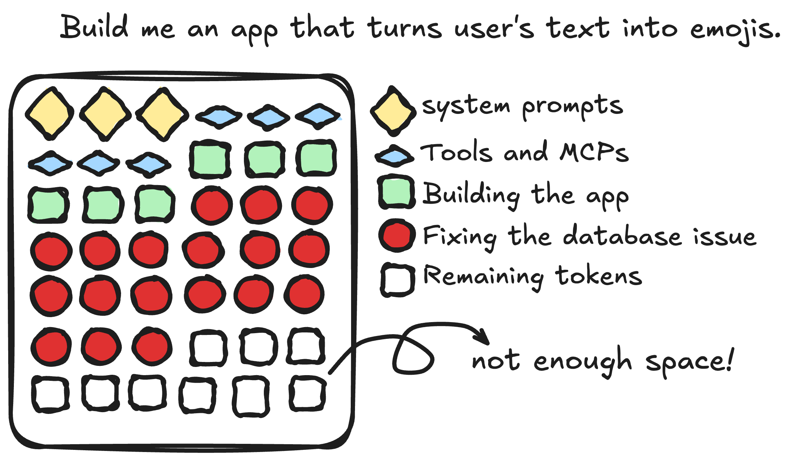
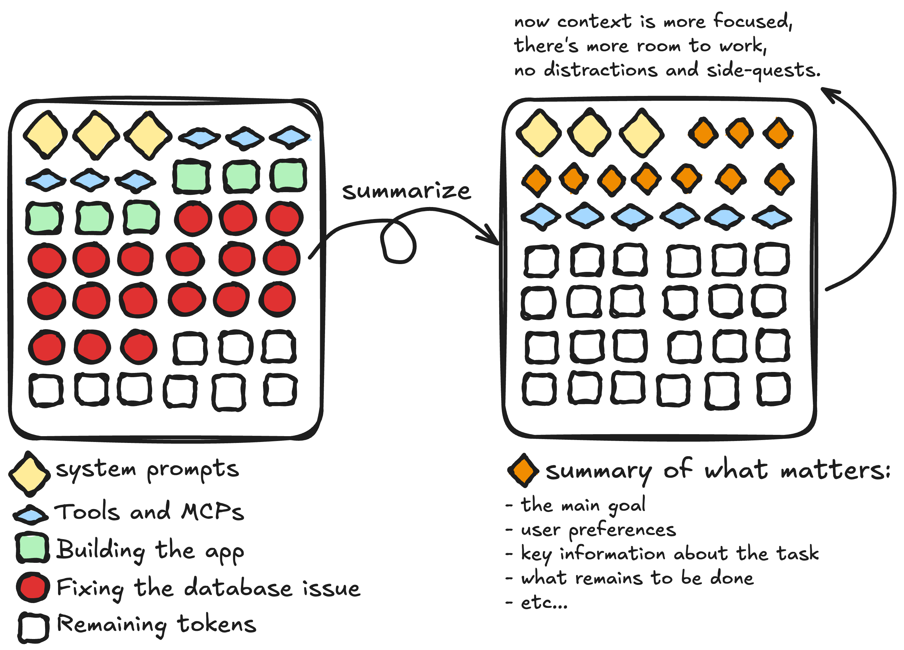
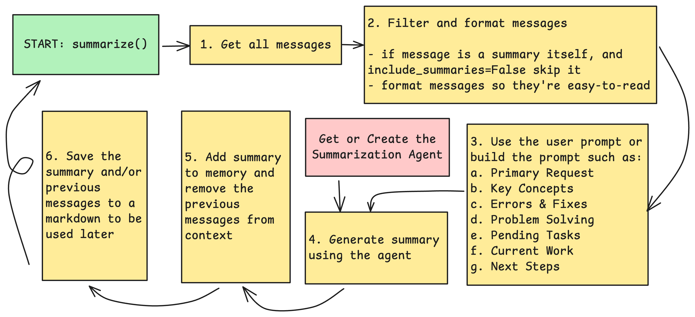
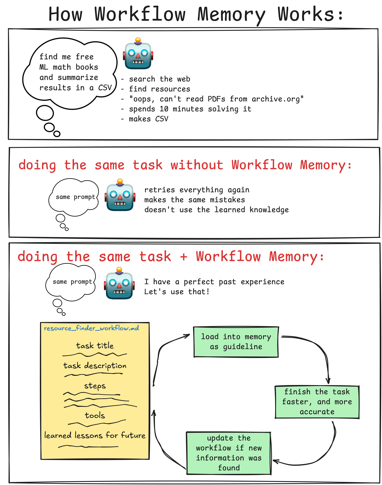
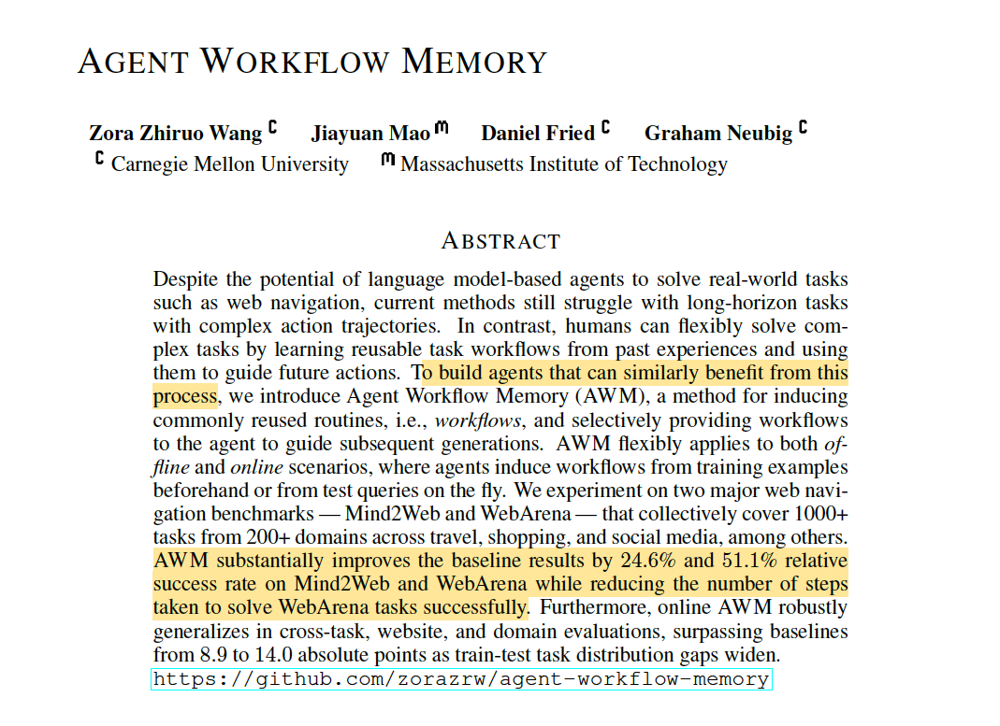
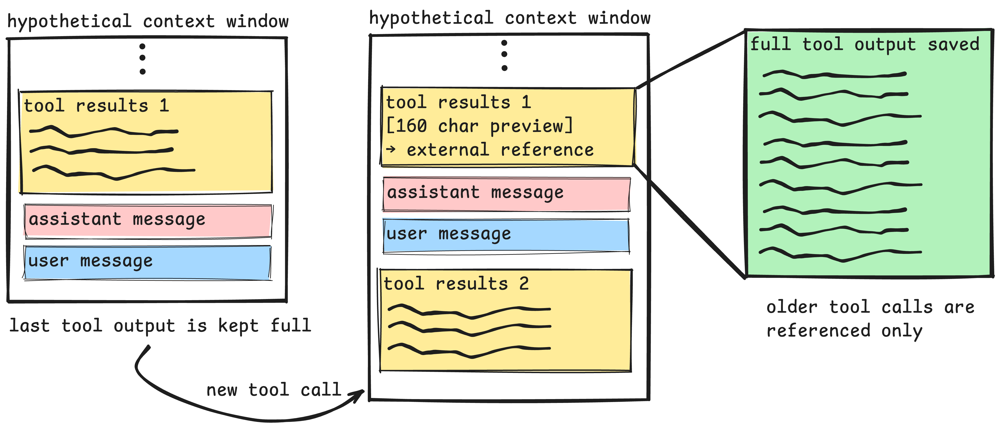
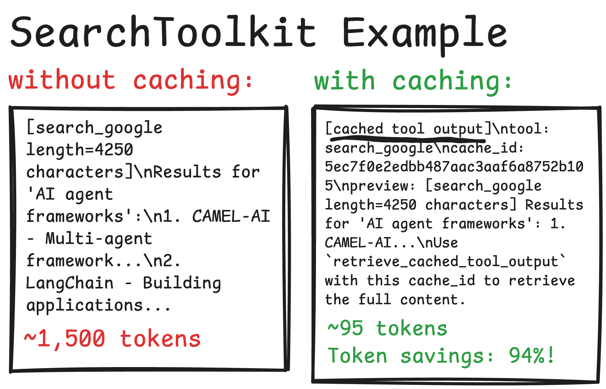

_Three techniques to cut context bloat, keep what matters, and dump the rest._

Your agent only forgets because you let it. You’re actually more in control of the agent’s intelligence than you think, and context engineering is the delicious secret sauce which allows that.

Context engineering has been one of the major focuses of the engineering team at CAMEL. **We are constantly thinking about ways to give control over the context to the developers**, allowing them to optimize the agent’s memory for maximum performance and efficiency.



### **Context Engineering Doesn’t Have to Be Complex**

It may sound like a complex term, but “context engineering” is actually founded on a very simple idea: Only feed the agent what is necessary to achieve its goal.

As you pollute the context with low-signal redundant information, the model’s intelligence suffers a setback. This context rot hurts the agent’s abilities in various ways, e.g. recalling critical information, choosing the right tools, or following explicit prompt instructions.

> You can read [this blog post](https://www.dbreunig.com/2025/06/22/how-contexts-fail-and-how-to-fix-them.html) that explains how and why long contexts fail.

This blog post is not an explanation of context engineering techniques. There are many high-quality articles out there explaining the creative ways companies engineer their agent’s context, and I don’t intend to repeat the same information. But as you read more about context engineering and how it is practically applied in the industry, you begin to see very simple techniques you can easily learn and apply to your own agents.

### Why This Matters

because if you develop agents, or if you work with them, you must take seriously the methods and techniques to optimize how they perceive the context. Some of these techniques are actually low-hanging fruits. They don’t require extensive implementation and change to your working agents, but they’re just as effective in the performance and cost as the backend LLM that fuels your agents.

### In This Blog Post

…we explain **three of the techniques** implemented in the CAMEL framework that keep agent memory clean and context sharp: **Context Summarization, Workflow Memory,** and **Tool Output Caching.**

Yes, simple and intuitive in principle, and intricate in implementation.

You’ll see:

- The real problems we hit with agentic workflows
- The methods we have used to optimize the context
- What remains to be done **(and how you can help)**

We have also opened a number of issues in the CAMEL repo so you can jump in, challenge yourself, ship fixes, and make agents remember better.

### Context Summarization: Keeping What Matters

Let’s imagine a scenario which might sound familiar to you. You prompt your agent to build a simple text-to-emoji app that:

- takes an input text from the user,
- calls a text-to-image model to create an emoji,
- shows it to the user,
- stores it in a PostgreSQL database,
- and finally, handle the auth so users can login to their account.

The agent builds a perfect app, the UI looks good enough, the emoji images look good, and ooops… the images are not stored in the database, there has to be a bug. So the agent starts searching the web to find why this is not working, checks the versions, and even takes a look at the official documentation. The process takes so much longer than you expected, and now a simple sub-task has become the main problem of the agent and has been taking 10 minutes to solve.

The agent does find the root cause in the end, but there’s a problem here, and let’s look at the hypothetical context of our hypothetical agent to see what’s wrong:



A simple bug-fix or “side quest” may completely overtake the purpose and the token consumption of your agent. If you have used coding agents such as Cursor or Claude Code, you most definitely have experienced this derailment, and it is just as true for general purpose agents as well.

This is the purpose of context summarization. It takes the conversation, and breaks it down to its most critical components, focusing on what matters, throwing in the bin what doesn’t.



Now context summarization is a common context management technique that is used in a number of situations:

- The agent has used the majority (e.g. 80%) of its context window.
- The context has been derailed by side-quests and you want to refresh it.
- You want to reference this session in another run, so you need a summary of what happened.

Summarization is a Swiss knife that you can whip out in various scenarios, and it’s a must-have in your agentic kit.

#### How Context Summarization is Used in CAMEL

CAMEL provides **three main approaches** to context summarization:

1. **Automatic token-based summarization**: The ChatAgent monitors token usage and automatically triggers summarization.
2. **Manual summarization API**: Explicit call by the developer, so you have full control even if you want to summarize the context when you see fit.
3. **Toolkit-based summarization**: Agent-accessible tool for summarizing the full context, and also searching for the messages that have been summarized.

Even though these approaches work slightly differently, the core summarization process follows the same pattern.



Now among this workflow, what’s the most critical part? Of course, it’s the prompt. The summarization prompt is what tells the agent how to summarize the context, what things to focus on, and how to handle uninformative bits. **The prompt is what truly makes or breaks this method.**

This is an evolving bit for us, and we’re constantly looking for ways to improve prompts for maximum clarity and best outcomes—even though we allow developers to also use their custom prompts. We instruct the agent to extract key information from the conversation history, including: the main request of the user, the work that still needs to be done (necessary if you want to pass this to a fresh conversation), the current work that is being done, etc. In case of tokenlimit context summarization, we also pass a minimal list of user messages, which don’t consume too many tokens, but are highly informative, and **reduce our reliance on the LLM summarization** to keep the full picture in mind (after all, LLM summarizations could be unreliable, or miss some of the bits, so we have to take cautionary measures.)

<https://github.com/camel-ai/camel/issues/3371>

<https://github.com/camel-ai/camel/issues/3372>

<https://github.com/camel-ai/camel/issues/3373>

<https://github.com/camel-ai/camel/issues/3374>

### Workflow Memory: Past Experiences Matter

You ask your agent to get a list of the top available free books on ML mathematics and then create a CSV of each book, a description, subject, prerequisites, link, etc. The agent searches the web, finds a few titles, but can’t read some of the books available on [archive.org](http://archive.org) website. It tries a few things, searches for a while, and finally, figures out a way to do this successfully. The agent has spent five minutes figuring out what it was doing wrong, which is perfectly fine for an agentic run, but it’s a problem if we need to do a similar task again in the future, especially if this is a recurring workflow.

Workflow memory solves this problem with a simple idea:

> Record what you learned about solving this task, so you have a clear strategy for similar problems in the future.



#### The Intricate Details That Matter

Behind the scenes, workflow memory is a wrapper around the context summarization. The key is to keep this summary **general enough** so it can be **useful in similar tasks**, but also **detailed enough** to be beneficial and helpful **in practice**.

Here is a list of what we ask the agent to summarize and the prompt used to describe each:

- Task title: A short, generic title of the main task (e.g. Remind weekly meetings on Slack)
- Task description: One-paragraph summary of what the user asked for. No implementation details; just the outcome the user wants.
- Solving steps: Numbered, ordered actions the agent took to complete the task. Each step starts with a verb and is generic enough to be repeatable.
- Tools: Bullet list of tool calls or functions calls used. For each: name → what it did → why it was useful (one line each). This field is explicitly for tool call messages or the MCP servers used.
- Failure and recovery strategy: [Optional] Bullet each incident with symptom, cause (if known), fix/workaround, verification of recovery. Leave empty if no failures.
- Notes and observations: [Optional] Anything not covered in previous fields that is critical to know for future executions of the task. Leave empty if no notes. Do not repeat any information, or mention trivial details. Only what is essential.
- Tags: 3-10 categorization tags that describe the workflow type, domain, and key capabilities. Use lowercase with hyphens. Tags should be broad, reusable categories to help with semantic matching to similar tasks.

#### Loading the Right Workflows

How does the agent find the right workflow memory for the current task? We help the agents by three methods of filtering:

1. the developer can pass a specific session that they find most relevant to the current task.
2. the workflow memories are saved with the role_name of the agent as the filename (e.g. researcher_agent_workflow.md), and the same agent can find workflows previously saved by itself, which is most likely the one that’s needed.
3. The agent is provided by the full list of workflow information: the title, concise description, and tags of all workflows. Then it can choose a maximum of N workflows which are most relevant. This selection procedure is then wiped out of memory to save context.

As you might have noticed, we have refrained from RAG to retrieve the workflows. This was a conscious decision to avoid the unnecessary complexity and uncertainty that RAG brings, which is absolutely not needed for this use case. If we’re at a point, in which we have so many workflow[.md] files that we need RAG, a critical principle of workflow memory is defeated: **to have a handful of dynamic external memory files for each agent**.

#### Workflows in Research

Workflow memory is a new feature, and naturally, there’s much to learn and improve about it. Its effectiveness has been experimented in research and benchmarked in a [paper](https://arxiv.org/pdf/2409.07429) in which the authors report a significant gain in web-navigation tasks, which you can read and learn more about this technique.



There are multiple areas of improvement when it comes to workflows, which again, have been turned into bite-sized issues for interested developers:

https://github.com/camel-ai/camel/issues/3375

‍

### Tool Output Caching (A Cautionary Tale)

Research papers only cherry-pick what works best. But not us. Tool output caching was another effort by CAMEL developers to keep the agentic context clean, but was later reverted. The reason is the concern for information loss and performance degradation. While this is not a “failed” attempt and simply needs more refinement and testing, it pays off to learn about it as a cautionary tale of how over-engineering the context for the sake of “efficiency” may hinder the agent’s intellect.

This represents a foundational challenge of memory management: **token efficiency vs accuracy.**

#### Tool Outputs are Boring!

Well not exactly, but they are a challenge to handle. Tools are an essential part of what makes an agent, an agent. However, while tool outputs are absolutely necessary, they’re not usually useful after they serve their purpose.

```
# Agent searches the web
from camel.toolkits import SearchToolkit
tool_result_1 = SearchToolkit.search_google("AI agent frameworks")
# Returns: 4,250 characters of search results with snippets, URLs, metadata

# Agent reads a large file
from camel.toolkits import FileToolkit
tool_result_2 = FileToolkit.read_file("documentation.md")
# Returns: 8,100 characters of markdown documentation

# Agent makes 10 more tool calls
# Each subsequent LLM call includes all previous tool results
# → 60,000+ tokens of tool output in context
# → Context window polluted by stale tool data
```

Tool results are often needed once, but stay in the context forever. This is especially a time-bomb in long-horizon real world tasks, in which the agent will make numerous tool calls.

#### Saving the Tool Outputs Outside Context

One way to handle this is to store tool outputs outside the LLM's context (like saving them to a markdown file on disk) and just keep an ID reference in context. That way, if you need the full output later, you can retrieve it by the ID.

CAMEL’s implementation of this strategy is to simply:

- Monitor tool result sizes and identify if length >2000 chars
- Keep latest tool output full
- Cache older verbose outputs
- Replace full output with reference
- Include preview (first 160 chars)
- Provide retrieval instructions so the agent can load the full outputs if necessary



In theory this would drastically save the token consumption. You must know, if you haven’t been exposed to agents any more than courses and tutorial codes, that tools are more complicated than a get_weather API. Web navigation tools like Playwright or browser automation agents can return extremely large outputs, maybe even the entire DOM of a webpage, which can easily surpass 10,000 of tokens.



#### A Pinch of Salt.

Like any context engineering technique, you must be careful not to pay for extra efficiency with a drop of accuracy. Here’s some ways the tool output caching might have negative effect.

1. **Information loss:** Agent processes verbose tool output → system caches it and replaces with a preview + reference → agent later sees the preview and doesn’t think it needs the full output → makes decision based on incomplete data.
2. **Cognitive Load on Agent:** Agent must recognize when/if full output is needed, call the retrieve function at the right time, track which cache IDs relate to which output, and also decide whether the preview is sufficient or not. **This is an extra cognitive load that is not directly related to solving the user-provided task.**

We believe the complete, fool-proof implementation of the tool output caching can be quite valuable. For the curious reader, we have created an issue to bring this feature back to life, and make sure it serves the purpose of context hygiene.

https://github.com/camel-ai/camel/issues/3376

‍

### The Future Road Ahead

While these methods are backed by research and common industry best-practices, we make it our mission to ensure they have substantial gains in the CAMEL repository. We commit to this by:

- Implementing new techniques to optimize the Agent’s memory.
- Fix and improve the existing methods.
- Benchmark the existing methods and raise the bar.

What’s particularly fascinating about context engineering and memory management, **is the abundance of creative and novel techniques** that is made possible by how new this field is.

The fact that an agent can become so much smarter and more efficient, not by changing the LLM or spending more money and compute, but by simply changing how the agent views the conversation and its memory is managed, is pretty thrilling.

What was covered in this blog post was only parts of the effort CAMEL has put into better memory of the agents. Our wish is that through this blog, you are **more inspired** to work on this section of AI, and maybe even use this opportunity to **start your open-source arc** by opening PRs for each issue, review and contribute to the ones opened by others, or create new issues if you find ways to fix/improve these techniques.

‍
