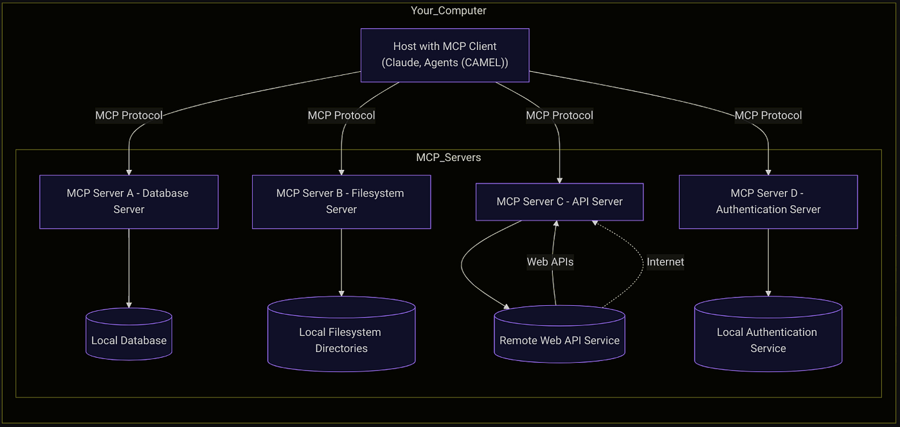
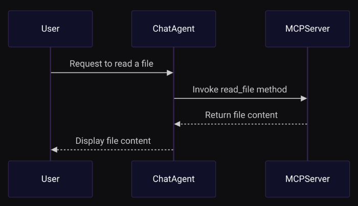

**Author :**[**Parth Sharma**](https://github.com/parthshr370)**_‍_**

> **_Have you noticed how everyone in the AI community is buzzing about MCP?_**

But what exactly is the Model Context Protocol, and why should you care?

Let’s face it — while **Large Language Models (LLMs)** are changing the game with _creative writing_ and _dynamic Q&A_, they still hit a wall when it comes to managing memory and handling real-world data. I’ve been there, and _trust me, it’s frustrating_.

That’s why MCP is such a breakthrough — it bridges the gap between powerful AI reasoning and everyday usability.

LLMs still face significant limitations:

- **Local Filesystem Interaction:** Can your LLM easily manage your local files?
- **GitHub Integration:** Could it push updates to your repositories without a hitch?
- **Tool Accessibility:** Does it work seamlessly with your favorite tools like Cursor or other LLM toolkits?

These questions highlight the current gaps in LLM functionalities, emphasizing the need for protocols like MCP to bridge these divides.

Think of MCP for LLMs as the USB-C of AI — it transfers data effortlessly and supercharges your system while keeping everything secure.

It opens a gateway for LLMs to interact seamlessly with external tool servers while preserving security and structure.



Example MCP Structure

Setting up an MCP server is like giving your AI a backstage pass to the real world. By connecting MCP clients to the server, you unlock your AI’s ability to perform practical tasks — like reading files or listing directories — without risking your sensitive data.

Here’s a quick breakdown of the **MCP architecture**:

- **MCP Hosts:** Think of these as the control centers (like Claude Desktop or your favorite IDE) that kick off the connection.
- **MCP Clients:** These are the one-on-one communicators that keep the conversation between the host and server running smoothly.
- **MCP Servers:** Lightweight yet powerful, these servers expose the tools your AI needs while keeping everything secure.

## Why CAMEL AI?

So, why choose CAMEL AI? Because it takes MCP to the next level. CAMEL AI comes with a powerful toolkit -[MCPToolkit](https://github.com/camel-ai/camel/blob/master/camel/toolkits/mcp_toolkit.py)-that lets you build agents which can easily interact with MCP servers.

This means your agents can handle complex tasks on their own, making your life a whole lot easier.

Curious to learn more? Check out my previous post on [building cool agents with CAMEL AI.](https://medium.com/@parthshr370/building-cool-agents-with-camel-ai-1053b502e582)

Now, let’s dive into creating our own MCP server, then connect it to CAMEL agents to really see the magic in action.

### **Building the server**

###### Setting Up Your Environment

Before we jump into code, let’s ensure you have the necessary tools:

- Python 3.8+ — Your scripts need a modern Python runtime
- CAMEL AI and MCP Package — Install it via pip:

```
uv pip install camel-ai mcp
```

‍

- Once all the dependencies are installed its time to implement your **filesystem.py** server
- Additional Dependencies — Tools like dotenv help manage API keys via environment variables.

Once all the dependencies are installed its time to implement your **filesystem.py** server -

### Implementing the Filesystem MCP Server

Let’s start building our **Filesystem MCP Server**. First, we import the necessary modules and create an **MCP server** in the filespace namespace.

```
import os
import asyncio

from mcp.server.fastmcp import FastMCP
from camel.logger import get_logger

# Configure logging and create the MCP server instance.
logger = get_logger(__name__)
mcp = FastMCP("filesystem")
```

We use the **FastMCP** class (thanks to the official MCP docs) to handle the heavy lifting of server setup.

Next, we define our server methods. For example, here’s how you can create a simple file reader using the **@mcp.tool()** decorator. This tells your agent, “Hey, this is an MCP tool you can use!”

### Defining Server Methods

These methods specify actions our agent (or client) can request from the server. They abstract the logic behind each operation, enabling our server to know precisely when and how to execute each function based on client requests.

• read_file: Reads the content of a given file.  
• list_directory: Lists the contents of a specified directory.

we define the **read_file** method clearly and simply, using the **@mcp.tool()** decorator so our agent recognizes it as an MCP tool.

```
@mcp.tool()
async def read_file(file_path: str) -> str:
    r"""Reads the content of the file at the given file path.

    Args:
        file_path (str): The path to the file.

    Returns:
        str: The file content or an error message if reading fails.
    """
    logger.info(f"read_file triggered with file_path: {file_path}")
    try:
        with open(file_path, "r", encoding="utf-8") as f:
            content = f.read()
        return content.rstrip()  # Remove trailing whitespace.
    except Exception as e:
        return f"Error reading file '{file_path}': {e}" # exceptions

# Attach an input schema for better agent understanding.
read_file.inputSchema = {
    "type": "object",
    "properties": {
         "file_path": {
             "type": "string",
             "title": "File Path",
             "description": "The path to the file to read. Default is 'README.md'."
         }
    },
    "required": ["file_path"]
}
```

Similarly, the **list_directory** method is defined clearly to list directory contents:

```
@mcp.tool()
async def list_directory(directory_path: str) -> str:
    r"""Lists the contents of the specified directory.

    Args:
        directory_path (str): The directory to list.

    Returns:
        str: A newline-separated list of directory entries or an error message.
    """
    logger.info(f"list_directory triggered with directory_path: {directory_path}")
    try:
        entries = os.listdir(directory_path) # enter the directory path
        return "\n".join(entry.rstrip() for entry in entries)
    except Exception as e:
        return f"Error listing directory '{directory_path}': {e}"

# Attach an input schema for better agent understanding.
list_directory.inputSchema = {
    "type": "object",
    "properties": {
         "directory_path": {
             "type": "string",
             "title": "Directory Path",
             "description": "The directory to list. Default is '.'."
         }
    },
    "required": ["directory_path"]
}
```

With our tools and logic in place, it’s time to **fire up the server!** We’ll write a main function that lets you choose between running it in **standard I/O mode** or using **Server-Sent Events (SSE)**. Pick your mode, run the script, and watch your MCP server come to life.

```
def main(transport: str = "stdio"):
    r"""Runs the Filesystem MCP Server.

    Args:
        transport (str): The transport mode ('stdio' or 'sse').
    """
    if transport == 'stdio': # standard input output
        mcp.run(transport='stdio')
    elif transport == 'sse': # sse
        mcp.run(transport='sse')
    else:
        print(f"Unknown transport mode: {transport}")

if __name__ == "__main__":
    import sys
    transport_mode = sys.argv[1] if len(sys.argv) > 1 else "stdio"
    main(transport_mode) # runn in the defined transport mode
```

‍  
Once we have written all the logic we can now save this file as **filesystem_server.py** as we will later use this with our CAMEL agent.

### Integrating with CAMEL AI’s ChatAgent

Now that our MCP server is up and running, let’s explore how CAMEL AI can transform a basic LLM into a smart, interactive agent by connecting it to our MCP server.

In this part, you’ll see just how easy it is to integrate external tools with your agent.

##### If you’re curious about more advanced setups, [check out our documentation](https://docs.camel-ai.org/) [‍](https://medium.com/@parthshr370/building-cool-agents-with-camel-ai-1053b502e582) Dealing with Imports

To set up our chat agent client, we’ll start by handling the necessary imports. Modules like **ModelFactory** offer extensive configurations for different Large Language Model (LLM) vendors.

The **\_MCPServer** class in CAMEL assists in setting up our MCP server.

```
import asyncio # Manages asynchronous operations
import os # Provide interaction with the operating system.
import sys
from pathlib import Path
from dotenv import load_dotenv # for api keys

from camel.agents import ChatAgent # creates Agents
from camel.models import ModelFactory # encapsulates LLM
from camel.toolkits import MCPToolkit # import tools
from camel.types import ModelPlatformType
from camel.toolkits.mcp_toolkit import _MCPServer # camel class for mcp clients

load_dotenv()
```

To enhance the usability of our **MCP server**, we can implement an interactive _command-line interface (CLI)_ that allows users to seamlessly choose between various functionalities, such as reading a file or listing directory contents.

This approach makes our agent more user-friendly and streamlined.

**Implementing the Interactive Input Loop**

We’ll define an asynchronous function, **interactive input loop**, which makes user interact through the command line.

```
async def interactive_input_loop(agent: ChatAgent):
    loop = asyncio.get_event_loop()
    print("\nEntering interactive mode. Type 'exit' at any prompt to quit.")

    while True: # the loop
        choice = await loop.run_in_executor(
            None,
            input,
            "\nChoose an action:\n"
            "1. Read a file\n"
            "2. List a directory\nYour choice (1/2): "
        )
        choice = choice.strip().lower()
        if choice == "exit": # if exit then end loop
            print("Exiting interactive mode.")
            break

        if choice == "1": # if choice is 1 then read the file
            file_path = await loop.run_in_executor(
                None,
                input,
                "Enter the file path (default: README.md): "
            )
            file_path = file_path.strip() or "README.md"
            query = f"Use the read_file tool to display the content of {file_path}. Do not generate an answer from your internal knowledge."
        elif choice == "2":
            dir_path = await loop.run_in_executor(
                None,
                input,
                "Enter the directory path (default: .): "
            )
            dir_path = dir_path.strip() or "." # either this or current dir
            query = f"Call the list_directory tool to show me all files in {dir_path}. Do not answer directly."
        else:
            print("Invalid choice. Please enter 1 or 2.")
            continue

        response = await agent.astep(query)
        print(f"\nYour Query: {query}") # prinitng the output
        print("Full Agent Response:")
        print(response.info)
        if response.msgs and response.msgs[0].content:
            print("Agent Output:")
            print(response.msgs[0].content.rstrip()) # paste the content displayed by the agent
        else:
            print("No output received.")
```

We begin by obtaining the current event loop using the **asyncio.get_event_loop()** function, which manages asynchronous tasks within our function. Entering interactive mode, users are informed they can type 'exit' at any prompt to quit. A continuous **whilt True** loop then prompts users for input until they decide to exit.

Within this loop, users are presented with a menu of actions:

- **Read a File**: The user is prompted for the file path, a query is constructed to use the **read_file** tool, and this query is then sent to the agent.​
- **List a Directory**: The user is prompted for the directory path, a query is constructed to use the **list_directory** tool, default being the current directory.

After executing the desired action, the agent’s response is displayed, including any output or error messages.

#### The main( ) function and agent building with CAMEL

To set up our client, we begin by defining the **main** function, which determines whether to use:

- **Standard input/output (stdio) or**
- **Server-Sent Events (SSE)**

as the *transport method.*‍

This function also specifies the location of our server file, filesystem.py



Working of our CAMEL-MCP system

We then define our system message, wrap our large language model (LLM) with **Modelfactory,** create an agent by binding tools with **ChatAgent**, and start the loop with our **_MCP filesystem server_**.​

```
async def main(server_transport: str = 'stdio'):
    if server_transport == 'stdio':
        server_script_path = Path(__file__).resolve().parent / "filesystem_server_mcp.py"
        if not server_script_path.is_file():
            print(f"Error: Server script not found at {server_script_path}")
            return
        server = _MCPServer(
            command_or_url=sys.executable,
            args=[str(server_script_path)]
        )
        mcp_toolkit = MCPToolkit(servers=[server]) # camels toolkit to define mcp tools
    else:
        mcp_toolkit = MCPToolkit("tcp://localhost:5000")

    async with mcp_toolkit.connection() as toolkit:
        tools = toolkit.get_tools()
        sys_msg = (
            "You are a helpful assistant. Always use the provided external tools for filesystem operations "
            "Also remember to use the tools to answer questions about the filesystem. Always use the tools "
            "Make sure to keep the messages short and to the point so that tokens are not wasted. "
            "when asked, rather than relying on your internal knowledge. Ensure that your final answer does not "
            "end with any trailing whitespace."
        )
        model = ModelFactory.create( # define the LLM to create agent
            model_platform=ModelPlatformType.ANTHROPIC,
            model_type="claude-3-7-sonnet-20250219",
            api_key=os.getenv("ANTHROPIC_API_KEY"),
            model_config_dict={"temperature": 0.8, "max_tokens": 4096},
        )
        camel_agent = ChatAgent( # create agent with our mcp tools
            system_message=sys_msg,
            model=model,
            tools=tools,
        )
        camel_agent.reset() # reset after each loop
        camel_agent.memory.clear()
        await interactive_input_loop(camel_agent) # start the interactive loop

if __name__ == "__main__":
    asyncio.run(main())
```

‍

- **Server Transport Method**: The **main** function accepts a server\*transport parameter to choose between \*'\*\*\*\_stdio'**\* and **_'sse'_\*\* modes. Based on this choice, it sets up the _appropriate server connection_.​
- ‍**System Message**: guides the assistant’s behavior, emphasizing the use of external tools for filesystem operations and ensuring responses are token-efficient.​
- **Model Initialization**: We use the **ModelFactory** class to initialise the LLM with specified parameters, including the _model platform_, _type_, _API key,_ and _configuration settings._
- **Chat Agent Creation**: The **ChatAgent** binds the system message, model, and tools, creating an agent capable of interacting with the filesystem through the defined tools.​**‍**
- **Interactive Input Loop**: The script enters an interactive loop, allowing users to input commands that the agent processes using the filesystem server.​

And now we have our Agent MCP ready !

We can **_expect output_** like :

```
Entering interactive mode. Type 'exit' at any prompt to quit.

Choose an action (or press Enter for default):
1. Read a file
2. List a directory
Your choice (1/2): 1

Enter file path to read (default: README.md):
/home/xyz/Downloads/camel/CONTRIBUTING.md

2025-03-15 13:01:17,879 - WARNING - Token limit reached (5801 > 4096).
Some messages will be pruned from memory.

Your Query: Use the read_file tool to display the content of
/home/xyz/Downloads/camel/CONTRIBUTING.md. Do not generate an answer from your internal knowledge.

Full Agent Response:
{
  'id': None,
  'usage': None,
  'termination_reasons': ['max_tokens_exceeded'],
  'num_tokens': 5739,
  'tool_calls': [
    ToolCallingRecord(
      tool_name='read_file',
      args={'file_path': '/home/xyz/Downloads/camel/CONTRIBUTING.md'},
      result='🐫 **Welcome to CAMEL!** 🐫\n\nThank you
                for your interest in contributing to the CAMEL project!
                🎉 We\re excited to have your support.
                 As an open-source initiative in a rapidly evolving
                and open-ended field, we wholeheartedly welcome contributions of all kinds. Whether you want to introduce new features, enhance the infrastructure, improve documentation, asking issues, add more examples, implement state-of-the-art research ideas, or fix bugs, we appreciate your enthusiasm and efforts. 🙌  You are welcome to join our [discord](https://discord.camel-ai.org/) for more efficient communication. 💬\n\n## Join Our Community 🌍\n\n### Schedule an Introduction Call 📞 \n- English speakers: [here](https://calendly.com/roman-georgio/camel-ai-introduction-call?month=2024-05)\n- Chinese speakers: [here](https://calendly.com/sisi-qu/welcome-to-camel-onboarding-meeting?month=2024-05)'
    )
  ],
  'external_tool_call_request': None
}

Choose an action:
1. Read a file
2. List a directory
Your choice (1/2): exit
Exiting interactive mode.
```

### **Conclusion**

​Integrating **LLMs** with **MCP** **servers** via **CAMEL** AI bridges the gap between AI reasoning and practical application. This connection allows your AI to perform tasks like file management and directory navigation securely.

Building an **MCP** server with **CAMEL AI** isn’t just about learning a new technology — it’s about transforming how your AI interacts with the real world. Now that you’ve seen how straightforward it can be to set up your own **MCP** server, why not give it a try?

You can take a look at the github repo for more servers — [here](https://github.com/parthshr370/MCP-Servers)

##### **That's everything:**

**‍**Got questions about 🐫 CAMEL-AI? Join us on [Discord](https://discord.camel-ai.org)! Whether you want to share feedback, explore the latest in multi-agent systems, get support, or connect with others on exciting projects, we’d love to have you in the community! 🤝

Check out some of our other work:

1.  🐫 Creating Your First CAMEL Agent [free Colab](https://docs.camel-ai.org/cookbooks/create_your_first_agent.html).

2.   Graph RAG Cookbook [free Colab](https://colab.research.google.com/drive/1uZKQSuu0qW6ukkuSv9TukLB9bVaS1H0U?usp=sharing).

3.  🧑‍⚖️ Create A Hackathon Judge Committee with Workforce [free Colab.](https://colab.research.google.com/drive/18ajYUMfwDx3WyrjHow3EvUMpKQDcrLtr?usp=sharing)

4.  🔥 3 ways to ingest data from websites with Firecrawl & CAMEL [free colab](https://colab.research.google.com/drive/1lOmM3VmgR1hLwDKdeLGFve_75RFW0R9I?usp=sharing).

5.  🦥 Agentic SFT Data Generation with CAMEL and Mistral Models, Fine-Tuned with Unsloth [free Colab](https://colab.research.google.com/drive/1lYgArBw7ARVPSpdwgKLYnp_NEXiNDOd-?usp=sharingg).

If you found this helpful, give us a ⭐ on [GitHub](https://github.com/camel-ai/camel), Thanks from everyone at 🐫 CAMEL-AI!
