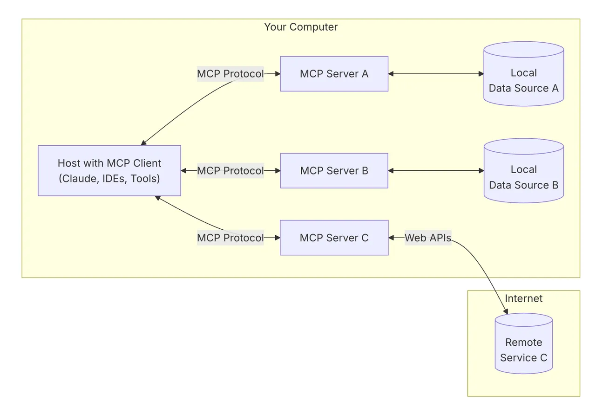
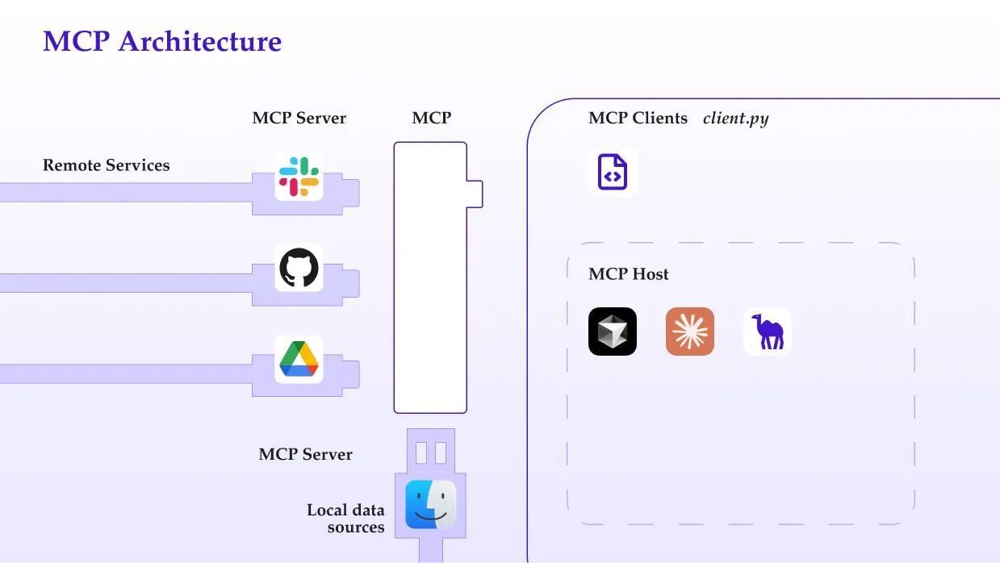
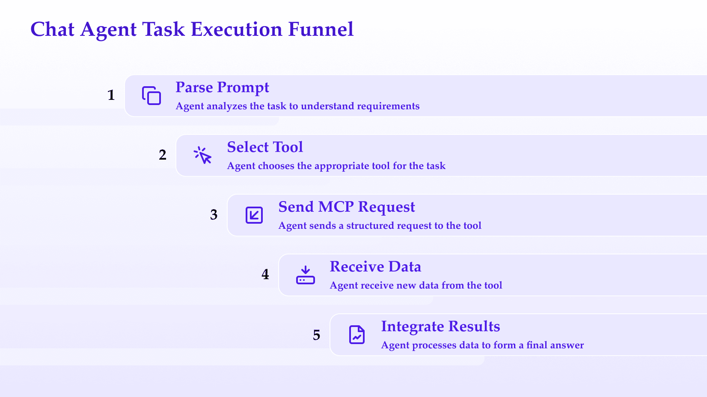
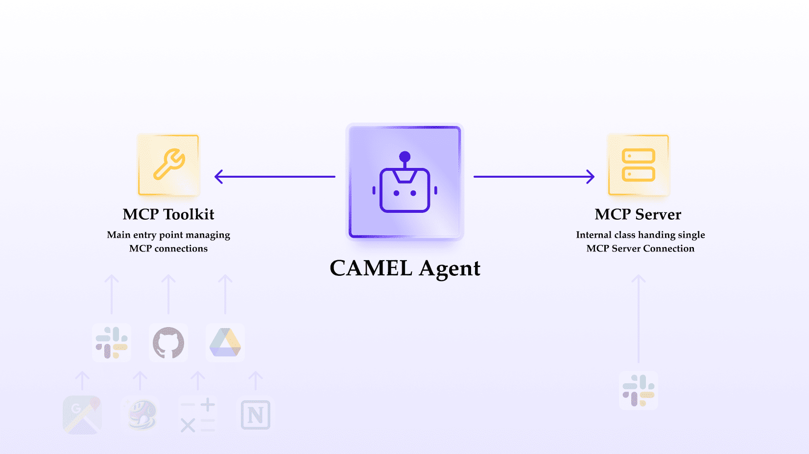
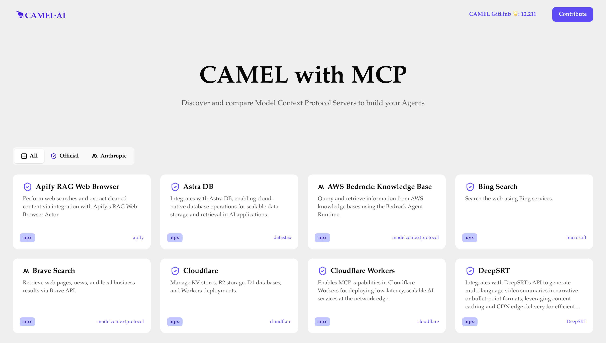

Have you ever watched a powerful AI model get stumped because it couldn’t access a simple piece of external information? Maybe you wanted it to read a local file or browse a web page, but it just sat there as if the outside world didn’t exist. It’s like having a genius with their hands tied behind their back.

**CAMEL-AI agents** aim to change that. In this blog, we’ll explore how CAMEL’s intelligent agents leverage the [**Model Context Protocol (MCP)**](https://www.anthropic.com/news/model-context-protocol#:~:text=secure%2C%20two,that%20connect%20to%20these%20servers) to break free of isolation, dynamically manage context, and seamlessly invoke external tools. By the end, you’ll see how MCP acts as an “AI USB-C connector,” linking advanced reasoning to real-world action in a secure and flexible way

## **What is the Model Context Protocol (MCP)?**

**Model Context Protocol** is an open standard designed to bridge AI models with external data sources, tools, and environments. Think of Model Context Protocol as a universal **intermediate protocol layer** between a language model and the outside world. Instead of hard-coding bespoke integrations for each app or data source, MCP offers _one standardized interface_ that any AI agent can use to discover and interact with any tool. It’s essentially the _“USB-C of AI integration”_ – one plug that connects to many devices.

How does MCP work at a high level?It follows a simple **client-server architecture**



[Host with MCP client connecting to three MCP servers for local and remote data sources](https://modelcontextprotocol.io/introduction)

- **MCP Servers** are standalone services that expose some functionality or data (e.g. file system access, web browsing, database queries) in a standardized way. Each server acts as a tool **endpoint**.
- **MCP Clients** (in our case, the CAMEL-AI agent) connect to these servers over a secure channel (often WebSocket or HTTP SSE). The agent can send structured requests (usually JSON) and receive results from the server.
- An **MCP Host** is sometimes mentioned (for example, a UI application or hub that brokers the connection), but fundamentally the agent’s code is the client that calls out to tool servers.

When an AI agent needs to use a tool, it doesn’t execute that tool’s logic internally. Instead, it sends a request via Model Context Protocol to the appropriate server, which performs the action and returns the result.

This two-way connection means the agent can **pull in external information or trigger actions on the fly**, then incorporate the results into its own reasoning. All of this happens through a controlled protocol layer, keeping the model’s internal reasoning and the external operations neatly separated.

‍

### **Exploring the MCP Ecosystem: Key Platforms & Resources**

The Model Context Protocol has rapidly gained traction, fostering a vibrant ecosystem of tools, hubs, and frameworks. Below are key platforms and repositories that empower developers and organizations to build, discover, and integrate MCP servers seamlessly:

1. [**Smithery**](https://smithery.ai/)

A centralized registry for MCP servers, offering pre-built tools for common tasks like web scraping, database access, and code execution. Smithery simplifies discovery and deployment, making it ideal for developers seeking plug-and-play solutions.

2. [**Composio**](https://composio.dev/)

An AI orchestration platform that integrates MCP servers into complex workflows. Composio excels at connecting LLMs to enterprise systems (e.g., CRMs, ERPs) via standardized MCP interfaces, enabling scalable automation).

3. [**mcp.run**](https://mcp.run/)

A lightweight hub for testing and deploying MCP servers. Designed for rapid prototyping, it provides templates and sandboxed environments to experiment with tools like file system access or API integrations.

4. [**ACI.dev**](https://www.aci.dev/)

Focuses on advanced context management for MCP servers, offering tools to handle large datasets, real-time data streams, and hybrid cloud environments. ACI.dev bridges the gap between AI reasoning and enterprise-grade infrastructure.

5. [**ModelScope**](https://www.modelscope.cn/mcp)

A Chinese-focused MCP platform under Alibaba’s ModelScope initiative. It hosts region-specific tools (e.g., multilingual NLP models, local databases) and fosters collaboration within Asia-Pacific developer communities.

6. [**awesome-mcp-servers**](https://github.com/punkpeye/awesome-mcp-servers)

A community-curated GitHub repository listing open-source MCP servers. From niche tools (e.g., IoT device controllers) to experimental integrations, this resource is invaluable for developers seeking inspiration or reusable code

‍

## **CAMEL-AI Agents + MCP: How Does It All Come Together?**

CAMEL-AI is an open-source framework for building advanced **multi-agent systems** – essentially, AI agents that can collaborate and perform complex tasks. These agents are built on large language models (LLMs) and can reason about problems, talk to each other, and now, thanks to MCP, **use external tools** to augment their capabilities. Integrating MCP into CAMEL’s agents turns them into tool-empowered assistants with dynamic context management..

In practice, here’s how a CAMEL-AI agent utilizes MCP step by step:


CAMEL AI agent task execution flow: from receiving a task to invoking Model Context Protocol and integrating results into a final answer

1. **Agent Receives a Task:** Suppose you ask a CAMEL agent a question like, _“Find the sentiment of the latest tweet from a given user”_. The agent recognizes that it may need to fetch external data (the tweet text) to answer this.
2. **Agent Identifies a Tool Need:** Based on its prompt and programming, the agent decides it should use a web **fetch tool** to retrieve the tweet. (CAMEL agents have knowledge of available tools through their MCP client interface.)
3. **MCP Request Sent:** The agent’s MCP client layer formulates a request to the appropriate MCP server (in this case, a _Fetch_ server) – for example, “fetch the content at https://twitter.com/… URL.” This request is sent out over the MCP channel in a structured format.
4. **Server Executes and Responds:** The MCP Fetch server receives the request, carries out the action (e.g., performing an HTTP GET or web scrape), and returns the result (the tweet text, in this case) back to the agent over MCP.
5. **Agent Incorporates Result:** The CAMEL agent gets the fetched data and now continues its reasoning. Perhaps it then decides to use a **sentiment analysis tool** (if one is available via MCP) or just uses its own LLM capabilities to analyze the text. The key is that the agent’s context now _includes that external data_ it fetched.
6. **Final Answer:** With the external info in hand, the agent formulates the final answer and responds to the user.

Throughout this process, Model Context Protocol is working behind the scenes as the **communication layer**. The agent doesn’t need to know the low-level details of _how_ the fetch is performed – it just knows “there’s a tool I can call for that.” MCP standardizes the call and response so that any tool looks the same to the AI. This design makes the agent’s life much easier (and the developer’s life too!).

**Dynamic context management** is a big deal here. Because the agent can pull in information as needed, it isn’t limited to the static context it was given at the start of the conversation. The context can _expand dynamically_ – the agent maintains a coherent conversation while bringing in new data from tools when relevant.

In other words, the assistant can maintain context across multiple tools instead of being siloed into one fixed knowledge base. One moment it’s reading a file, next it’s browsing the web, all the while remembering the core goal of the task. This fluid movement between different contexts and tools is orchestrated smoothly by MCP.

‍

## **Why Use MCP? – Benefits for CAMEL-AI Agents**



MCP servers ingest remote services and local data, expose an MCP interface, and drive MCP clients.

Integrating MCP into CAMEL-AI agents brings a host of benefits that elevate the agents’ capabilities. Let’s highlight a few key advantages:

- **Modularity and Extensibility:** MCP makes tools **modular** – each tool is an independent server that can be added or removed without changing the agent’s code. Need a new capability (say, controlling IoT devices)? Just spin up the appropriate MCP server and point your agent to it. The agent discovers and uses it via the common protocol, no custom integration required. This plug-and-play modularity is possible because of MCP’s _one-standard-fits-all_ design.
- **Flexible Tool Invocation:** With MCP, CAMEL agents can invoke tools _on the fly, as needed_. They aren’t limited to a fixed set of built-in functions; they can decide at runtime which external resource to tap into. The protocol allows agents to **dynamically fetch data or trigger actions** during their reasoning process. This flexibility means our agents can handle a wide range of requests – from searching the web to analyzing a local document – by simply calling the right tool via MCP. Essentially, the agent’s capabilities become fluid and context-driven, not predetermined.
- **Secure Context Management:** MCP provides a **secure, structured interface** between the AI and external system. Tool use is mediated by the MCP servers, which act as controlled gateways. This has two big implications for security and context:
  - _Safety:_ Because interactions go through servers with defined APIs, you can enforce what the AI is allowed to do. The filesystem server, for instance, might allow read-only access to certain directories and not others. The agent only gets the data it’s permitted to have. This sandboxing prevents a runaway AI from doing anything truly dangerous on your machine.
  - _Context Offloading:_ Large data can reside on the server and doesn’t all need to be dumped into the AI’s prompt context. The agent can request specific pieces (like “search for X in the docs repository”) and get back just the relevant snippet. This keeps the AI’s working context lean while still **connecting it to virtually unlimited external context on demand**. The heavy lifting (scanning files, crawling pages) happens outside the model, and the model just sees the results.
- **Standardization and Ecosystem:** By using MCP, CAMEL agents tap into a growing ecosystem of community and enterprise-supported tools. Everyone speaking the same “language” (protocol) means compatibility out-of-the-box. An MCP-compliant database tool or email tool can be used by a CAMEL agent just as easily as a web browsing tool. This standardization has been a [breakthrough that bridges the gap between powerful AI reasoning and everyday usability](https://medium.com/@parthshr370/building-mcp-servers-with-camel-ai-dbb419b083ad#:~:text=That%E2%80%99s%20why%20MCP%20is%20such,AI%20reasoning%20and%20everyday%20usability), it transforms what was once a hacky, one-off integration task into a consistent process across the board.

In summary, MCP turns CAMEL-AI agents into **tool-augmented AI** with a modular toolkit, flexible skills, and a safe way to handle external information. It’s a big step toward more practical and trustworthy AI assistants.

‍

## **Example: Connecting a CAMEL Agent to MCP Tools**

Now for the fun part – wiring up a single **CAMEL-AI agent** to your MCP servers. CAMEL’s toolkit gives you a handy MCPToolkit that reads your config file, launches each server, and hands you ready-to-go tool interfaces. Let’s dive into a minimal Python example.

You can install the Playwright MCP service globally via npm:

‍

```
npm install -g @executeautomation/playwright-mcp-server
```

‍

Or you may define your MCP servers in a json file like mcp_servers_config.json:

```
{
  "mcpServers": {
    "desktop-commander": {
      "command": "npx",
      "args": ["-y", "@wonderwhy-er/desktop-commander"]
    },
    "playwright": {
      "command": "npx",
      "args": ["-y", "@executeautomation/playwright-mcp-server", "--browser", "chromium"]
    },
    "mcp-server-firecrawl": {
      "command": "npx",
      "args": ["-y", "firecrawl-mcp"]
    }
  }
}
```

‍

With that in place, here’s the code to connect your agent, discover all MCP tools, and run a simple scraping task:

```
import sys
from pathlib import Path
from dotenv import load_dotenv
from camel.logger import set_log_level
from camel.toolkits import MCPToolkit
from camel.agents import ChatAgent

# 1. Setup logging and environment
set_log_level(level="DEBUG")
load_dotenv()

# 2. Load MCP server configuration and connect
def main():
    config_path = Path(__file__).parent / "mcp_servers_config.json"
    mcp_toolkit = MCPToolkit(config_path=str(config_path))
    mcp_toolkit.connect()

    # 3. Define the task prompt (override via CLI if provided)
    default_task = (
        "Scrape the top news headlines from TechCrunch using the firecrawl tool "
        "and return the 5 most recent titles as a JSON array."
    )
    task = sys.argv[1] if len(sys.argv) > 1 else default_task

    # 4. Retrieve all MCP tool clients
    tools = [*mcp_toolkit.get_tools()]

    # 5. Initialize a ChatAgent with system message and MCP tools
    agent = ChatAgent(
        system_message="You are a retrieval assistant. Use available tools to fetch or scrape data as needed.",
        tools=tools
    )

    # 6. Execute the task
    response = agent.step(task)
    print("Result:", response)

    # 7. Disconnect from MCP servers
    mcp_toolkit.disconnect()

if __name__ == "__main__":
    main()
```

‍

In this example, we instantiated a **ChatAgent** and provided it with the full set of tools discovered via MCPToolkit.get_tools(). When you call **agent.step(task)**, the agent will:

1. **Parse the prompt** (e.g., "Scrape the top news headlines from TechCrunch...").
2. **Select the right tool** (such as firecrawl for scraping headlines).
3. **Send a structured MCP request** to that server over the live connections managed by MCPToolkit.
4. **Receive raw data** (HTML, JSON, etc.) from the tool.
5. **Integrate results into its reasoning** and generate the final answer.

Under the hood, **MCPToolkit** handles launching, connecting, and orchestrating all MCP servers, keeping your agent code focused on high‑level tasks.

**Execution flow recap:** prompt → agent → tool → result → agent → output.

This pattern leverages asynchronous MCP calls for smooth tool invocation, yet returns a straightforward, synchronous answer from the agent’s perspective.

‍



ChatAgent task funnel: from parsing prompts through MCP tool calls to integrated results.

## **The CAMEL-AI MCP Ecosystem and Next Steps**

By integrating MCP, CAMEL-AI has essentially opened the door for its agents to **plug into a vast (and growing) ecosystem of tools**. The CAMEL-AI platform has an array of MCP “plugin” servers available – from simple utilities like the ones we used, to more specialized connectors for services like Google Docs, GitHub, databases, calendars, and even coding assistants.

CAMEL currently implements MCP client capabilities through two main classes: MCPToolkit and \_MCPServer. These components allow CAMEL agents to connect to and use tools from external MCP servers.

CAMEL’s MCP implementation follows this structure:



MCPToolkit manages connections to multiple servers; \_MCPServer handles one server at a time.

‍

### MCPToolkit

MCPToolkit is the main entry point for MCP functionality in CAMEL. It manages connections to multiple MCP servers and aggregates their tools.

Key features:

- Configuration via JSON files or programmatic setup
- Management of multiple MCP server connections
- Aggregation of tools from all connected servers
- Asynchronous connection handling

Usage example:

```
from camel.toolkits.mcp_toolkit import MCPToolkit

# Create toolkit from config file
toolkit = MCPToolkit(config_path="mcp_config.json")

# Use connection as context manager
async with toolkit.connection() as connected_toolkit:
    # Get all tools from connected servers
    tools = connected_toolkit.get_tools()

    # Use tools in an agent
    agent = ChatAgent(tools=tools)
```

‍

### \_MCPServer

\_MCPServer is an internal class that handles the connection to a single MCP server. It supports two connection modes:

1. **stdio mode**: Connects via standard input/output for local command-line tools
2. **SSE mode**: Connects via HTTP for web-based MCP servers

Key features:

- Dynamic function generation from MCP tool definitions
- Support for various content types in responses (text, images, embedded resources)
- Tool schema conversion for compatibility with different LLM frameworks
- Resource management for clean connections and disconnections

### **MCP Hub: Discover & Integrate Tools for CAMEL Agents**

The **MCP Hub** ([mcp.camel-ai.org](https://mcp.camel-ai.org/) ) is the official directory of Model Collaboration Protocol (MCP)-compliant servers, designed to empower CAMEL agents with specialized capabilities. Browse, filter, and deploy tools directly into your workflows without manual configuration.

### **Key Features:**

1. **Interactive Tool Catalog** :



The “CAMEL with MCP” page shows cards for available MCP servers like Apify, Astra DB, Bing Search, etc.

Explore pre-built MCP servers categorized by use case (e.g., databases, web search, cloud services).

- Filter by **Official** (CAMEL-maintained) or third-party tools (e.g., Anthropic, Microsoft).

2. **One-Click Configuration** :

Click any tool to reveal its **JSON configuration snippet** , ready to copy into your **mcp_config.json**


Example JSON snippet in a modal showing how to configure the Astra DB MCP server

## **Next Steps: Expanding the MCP Ecosystem**

### **1. RolePlaying as an MCP Server**

Roleplaying is a part of CAMEL’s core _Society_ module, will be exposed as an MCP server to enable **dynamic social behavior simulations** (e.g., debates, negotiations) as reusable tools.

- Define tasks via prompts and assign roles (e.g., AI User, AI Assistant).
- Simulate turn-taking interactions for collaborative problem-solving.
- Expose role-based servers for dynamic integration into workflows.

### **2. Workforce as an MCP Server**

CAMEL’s native solution for multi-agent orchestration, will become an MCP-compliant server to streamline **hierarchical agent team deployment** .

- Deploy task planners and coordinators to decompose and assign subtasks.
- Support worker nodes with specialized capabilities (e.g., research, coding).
- Automated failure handling (e.g., task retries, worker regeneration).

### **3. MCP Search Agent**

Intelligent discovery of relevant tools from registries like [Smithery](https://smithery.ai/) and the [MCP Hub.](https://mcp.camel-ai.org/)

- Analyze task requirements to recommend compatible MCP servers.
- Streamline integration with auto-generated configuration templates.
- Future support for registry-agnostic querying (e.g., MCP Hub, vendor-specific stores).

**In conclusion**, CAMEL-AI agents with MCP represent a leap toward more **autonomous, context-aware AI**. They combine the raw intelligence of LLMs with the practicality of software tools and the richness of real-world data. We started with the frustration of an isolated AI; we end with a vision (now a reality) of AI agents that can read, write, browse, click, and more – all safely and on demand.

It truly feels like the AI comes alive with abilities beyond its neural weights, reaching into a dynamic toolkit whenever the situation calls for it. You can checkout how you can use [OWL with MCP](https://www.camel-ai.org/blogs/owl-mcp-toolkit-practice)

Happy experimenting, and may your agents never again complain about being stuck in a box when they have the whole world of tools at their fingertips! 🚀

‍

#### **🐫Thanks from everyone at CAMEL-AI**

Hello there, passionate AI enthusiasts! 🌟 We are 🐫 CAMEL-AI.org, a global coalition of students, researchers, and engineers dedicated to advancing the frontier of AI and fostering a harmonious relationship between agents and humans.

**📘 Our Mission:** To harness the potential of AI agents in crafting a brighter and more inclusive future for all. Every contribution we receive helps push the boundaries of what’s possible in the AI realm.

**🙌 Join Us:** If you believe in a world where AI and humanity coexist and thrive, then you’re in the right place. Your support can make a significant difference. Let’s build the AI society of tomorrow, together!

- Find all our updates on [X](https://twitter.com/CamelAIOrg).
- Make sure to star our [GitHub](https://github.com/camel-ai) repositories.
- Join our  [Discord,](https://discord.gg/nCpraan3sS) [WeChat](https://ghli.org/camel/wechat.png), [Reddit](https://www.reddit.com/r/CamelAI/) or [Slack](https://join.slack.com/t/camel-ai/shared_invite/zt-2icssxnkj-YHwFVhoZHMYpIG~ZU86WVw)

- You can contact us by email: camel.ai.team@gmail.com
- Dive deeper and explore our projects on <https://www.camel-ai.org/>

‍
