If you've been working with our original **Camel BrowserToolkit**, you might have noticed a pattern: it got the job done but had some limitations. It operated mainly by taking screenshots and injecting custom IDs into pages to find elements. It was a single-mode, monolithic Python setup that worked for basic tasks, but we knew we could do better. The screenshot-based approach meant you were essentially teaching an AI to click on pictures, which worked but felt a bit like using a smartphone with thick gloves on. Plus, the quality of those visual snapshots wasn't always great, and you couldn't easily access the underlying page structure when you needed it.

### **Enter the Hybrid Browser Toolkit**

That's where our new Hybrid Browser Toolkit comes in. We've rebuilt everything from the ground up using a TypeScript-Python architecture that gives you the best of both worlds. Why TypeScript? It's not just about Playwright's native AI-friendly snapshot features – TypeScript is fundamentally better suited for efficient browser operations with its event-driven nature, native async/await support, and direct access to browser APIs without the overhead of language bridges. The TypeScript server handles all the heavy lifting of browser control while Python provides the familiar interface you love. But we didn't stop there. We've added support for CDP (Chrome DevTools Protocol) mode to connect to existing browser instances, and MCP (Model Context Protocol) integration for enhanced AI agent capabilities. You're not just limited to visual operations anymore – now you can seamlessly switch between visual and text-based interactions, access detailed DOM information, and enjoy snapshots that are crisp, accurate, and actually make sense. We've obsessed over the details too, from better element detection to smarter action handling, making the whole experience feel more natural and reliable. It's like upgrading from that smartphone-with-gloves setup to having direct, precise control over everything you need to do in a browser.

This blog organized into four main chapters:

## Table of Contents

1. [Architecture Overview](https://about:blank#chapter-1-architecture-overview)
2. [Tools Reference](https://about:blank#chapter-2-tools-reference)
3. [Operating Modes](https://about:blank#chapter-3-operating-modes)
4. [Connection Modes](https://about:blank#chapter-4-connection-modes)

# Architecture Overview

This chapter provides a comprehensive comparison between the legacy BrowserToolkit and the new HybridBrowserToolkit, highlighting the architectural improvements, new features, and enhanced capabilities.

## Table of Contents

- Architecture Evolution
- Core Architectural Improvements
  - 1. Multi-Mode Operation System
    2. TypeScript Framework Integration

- 3. Enhanced Element Identification
- 4. \_snapshotForAI and ARIA Mapping Mechanism
- 5. Enhanced Stealth Mechanism
- 6. Tool Registration and Screenshot Handling

## Architecture Evolution

The name "Hybrid" hints at the key change: we combined **Python** and **TypeScript** to get the best of both worlds. Instead of one heavy Python process doing everything, we now have a layered architecture where Python and a Node.js (TypeScript) server work together.

**In the hybrid_browser_toolkit architecture**, when you issue a command, it goes through a WebSocket to a **TypeScript server** that is tightly integrated with Playwright's Node.js API. This server manages a pool of browser instances and routes commands asynchronously. Python remains the interface (so you still write Python code to use the toolkit), but the heavy lifting happens in Node.js. Why is this good news? Because direct Node.js calls to Playwright are faster, and Playwright's latest features (like new selectors or the \_snapshotForAI function) are fully available to us.

This layered design also makes the system modular. We have:

- A **Python layer** for the API you call and configuration management.
- A **WebSocket bridge** connecting the Python and TypeScript layers.
- A **TypeScript server layer** that acts as the controller (routing commands, managing sessions).
- A **Browser control layer** with controllers for different modes (text, visual, hybrid) and connection types.
- The **Playwright integration layer** where actual browser actions happen with Playwright's Node.js capabilities (including things like \_snapshotForAI and ARIA selectors).

In simpler terms, Python is the brain giving high-level instructions, and TypeScript is the brawn executing them efficiently. By splitting responsibilities this way, the toolkit can do more in parallel and handle complicated tasks without getting stuck.

### HybridBrowserToolkit Architecture

The HybridBrowserToolkit introduces a modular, multi-layer architecture:

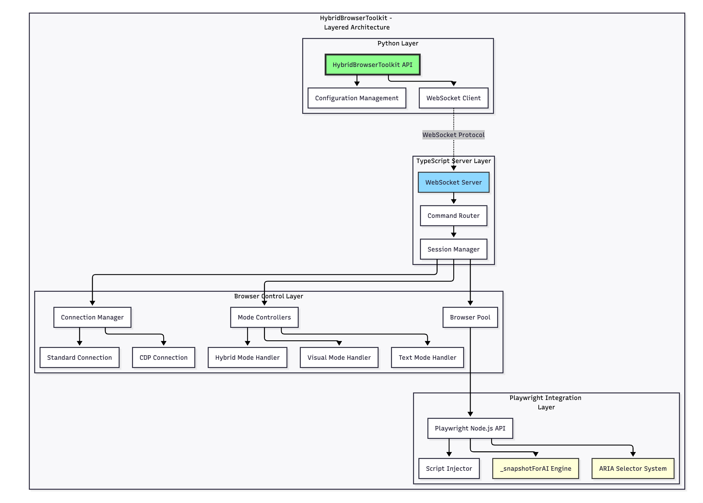

## Core Architectural Improvements

### 1. Multi-Mode Operation System

The HybridBrowserToolkit supports three distinct operating modes:

- **Text Mode**: Pure textual snapshot from \_snapshotForAI
- **Visual Mode**: Text snapshot filtered and visualized as SoM screenshot
- **Hybrid Mode**: Intelligent switching between text and visual outputs

### 2. TypeScript Framework Integration

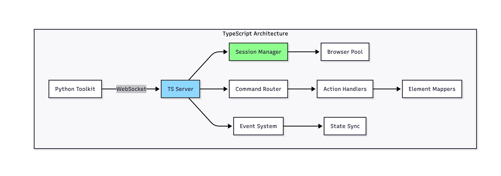

| Advantage               | Legacy Python Approach           | TypeScript Framework               | Benefits                                                                  |
| ----------------------- | -------------------------------- | ---------------------------------- | ------------------------------------------------------------------------- |
| Browser API Integration | Python → JS bridge with overhead | Direct native Playwright API calls | - Lower latency - Better performance - Access to latest features          |
| Asynchronous Operations | Limited async support            | Native async/await throughout      | - Non-blocking operations - Better concurrency - Efficient resource usage |
| Element Interaction     | Custom JavaScript injection      | Native Playwright methods          | - More reliable - Better error handling - Cleaner code                    |
| Real-time Events        | Polling-based updates            | WebSocket event streaming          | - Instant updates - Lower resource usage - Better responsiveness          |
| Type Safety             | Runtime type checking only       | Compile-time type checking         | - Catch errors early - Better IDE support - Safer refactoring             |
| Performance             | Multiple language contexts       | Single runtime environment         | - Low-latency calls - Lower CPU usage                                     |
| Browser Features        | Limited to Python bindings       | Full Playwright API access         | - Playwright SnapshotForAI - Advanced debugging                           |
| Error Handling          | Cross-language error propagation | Native error boundaries            | - Clearer stack traces - Better error recovery - Easier debugging         |

### 3. Enhanced Element Identification

### Legacy System:

```
# Custom ID injection
page.evaluate("__elementId = '123'")
target = page.locator("[__elementId='123']")
```

`‍`

### New ARIA Mapping System

```
// Native Playwright ARIA selectors
await page.locator('[aria-label="Submit"]').click()
await page.getByRole('button', { name: 'Submit' }).click()//
_snapshotForAI integration
const snapshot = await page._snapshotForAI();// Returns structured element data with ref mappings
```

‍

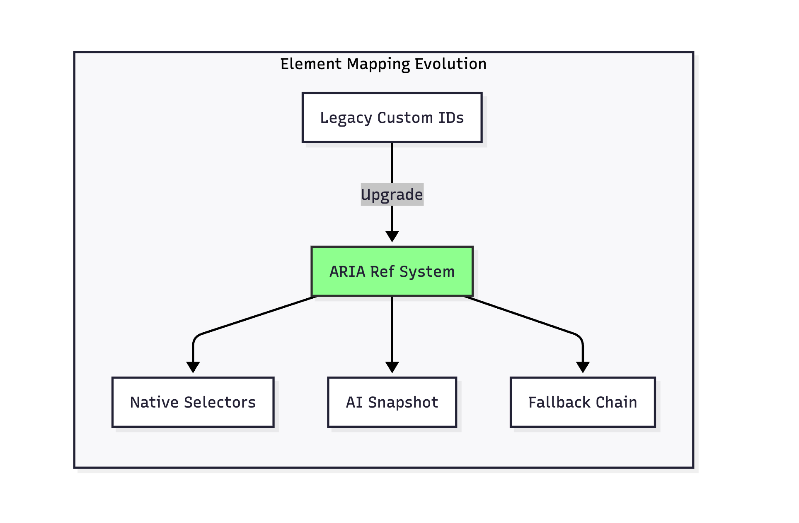

### 4. \_snapshotForAI and ARIA Mapping Mechanism

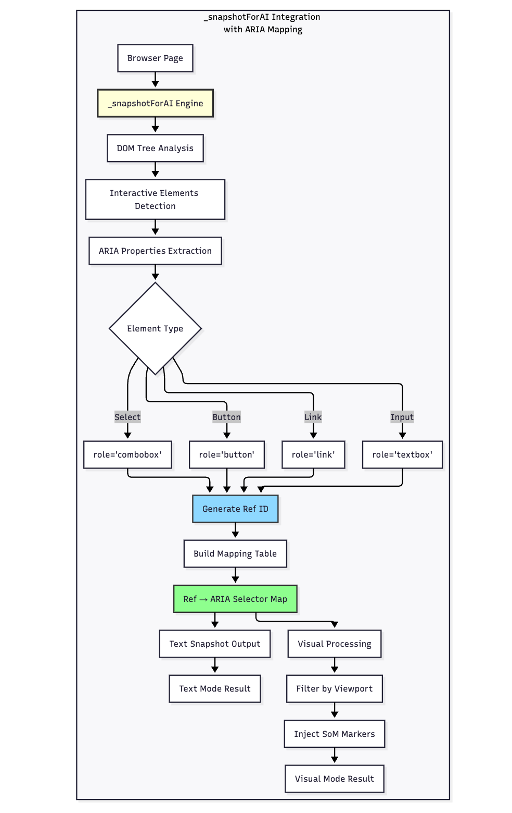

‍

Pipeline:

- **\_snapshotForAI** analyzes the DOM and extracts ARIA properties
- Elements are classified by their semantic roles
- A unified ref ID system maps to ARIA selectors
- The same foundation serves both text and visual modes
- Visual mode is built on top of the text snapshot by filtering and adding markers

### 5. Enhanced Stealth Mechanism

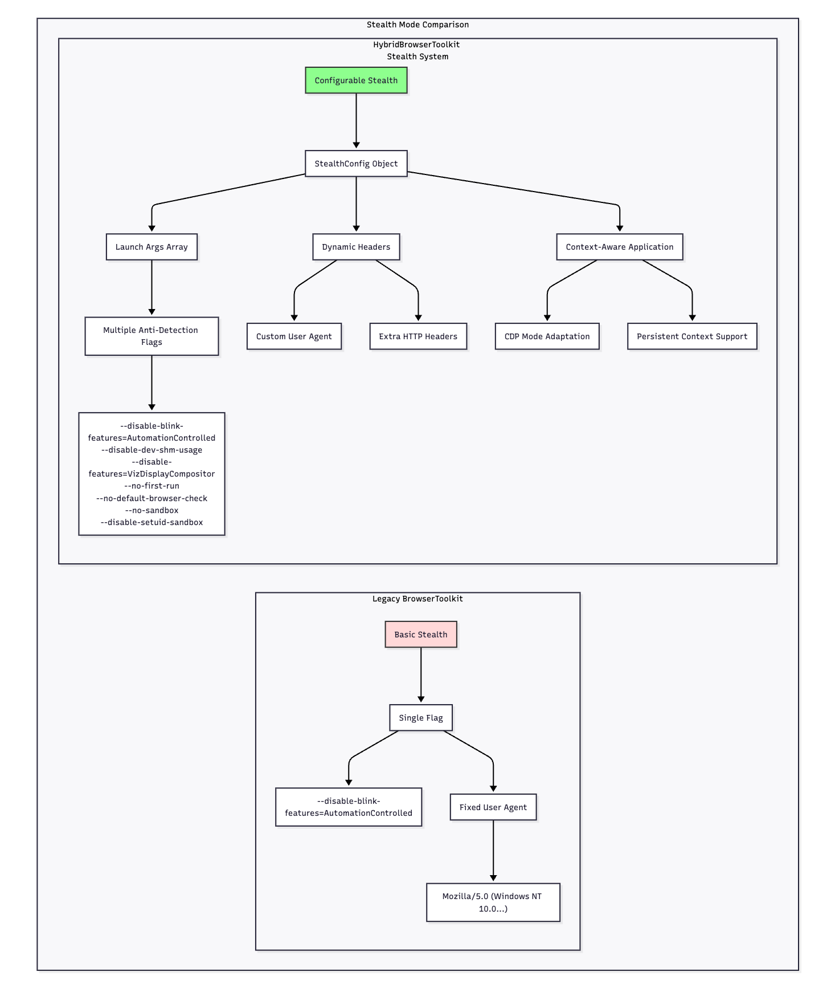

**Key Stealth Enhancements:**

1. **Legacy Approach:**
   - Single flag
   - Hardcoded user agent string
   - Applied only during browser launch
   - No flexibility for different contexts
2. **HybridBrowserToolkit Approach:**
   - **Comprehensive Flag Set**: Multiple anti-detection browser arguments
   - **Configurable System**: StealthConfig object allows customization
   - **Context Adaptation**: Different behavior for CDP vs standard launch
   - **Dynamic Headers**: Can set custom HTTP headers and user agents
   - **Persistent Context Support**: Maintains stealth across sessions

### 6. Tool Registration and Screenshot Handling

**Key Differences from Legacy:**

- **Legacy**: Screenshot stored in memory, passed as object
- **Hybrid**: Screenshot saved to disk, agent accesses via file path
- **Memory Efficiency**: Only file path in memory, not entire image
- **Agent Integration**: Uses registered agent pattern for clean separation

### 7. Form Filling Optimization

**New Features:**

- Multi-input support in single command
- Intelligent dropdown detection
- Diff snapshot for dynamic content
- Error recovery mechanisms

‍

# Tools Reference

This chapter provides a comprehensive reference for all tools available in the HybridBrowserToolkit. Each tool is designed for specific browser automation tasks, from basic navigation to complex interactions

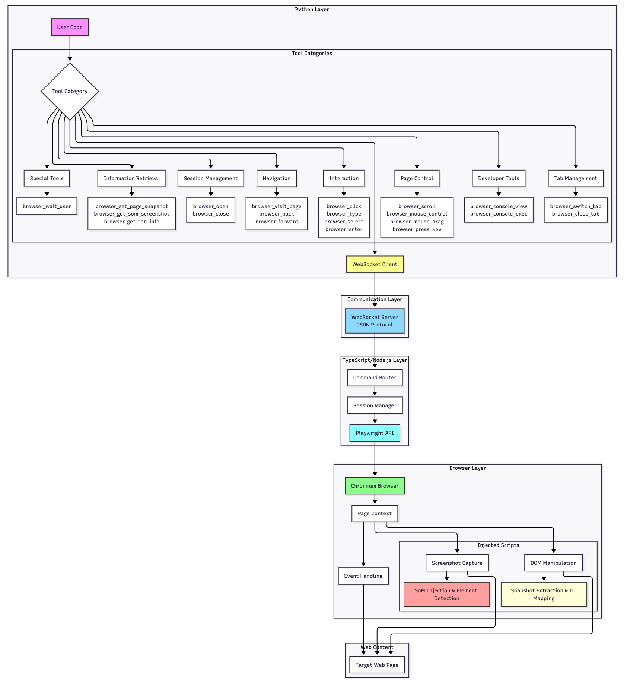

## Browser Session Management

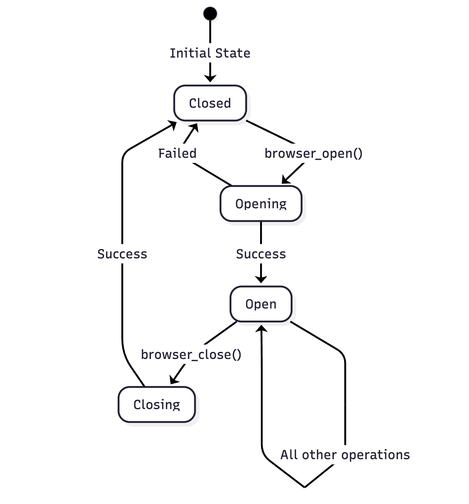

### browser_open

Opens a new browser session. This must be the first browser action before any other operations.

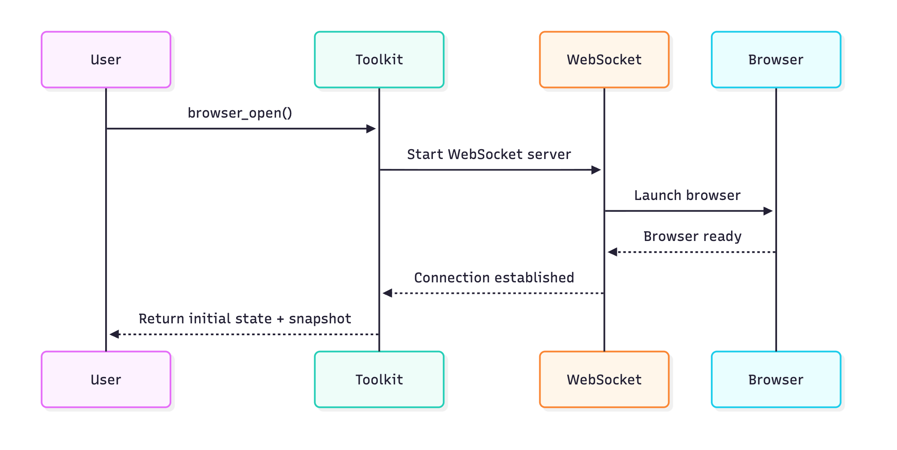

**Parameters:**

- None

**Returns:**

- result (str): Confirmation message
- snapshot (str): Initial page snapshot (unless in full_visual_mode)
- tabs (List[Dict]): Information about all open tabs
- current_tab (int): Index of the active tab
- total_tabs (int): Total number of open tabs

**Example:**

```
# Basic browser opening
toolkit = HybridBrowserToolkit(headless=False)
result = await toolkit.browser_open()

print(f"Browser opened: {result['result']}")
print(f"Initial page snapshot: {result['snapshot']}")
print(f"Total tabs: {result['total_tabs']}")

# With default URL configuration
toolkit = HybridBrowserToolkit(
    default_start_url="https://www.google.com"
)
result = await toolkit.browser_open()
# Browser opens directly to Google
```

‍

### browser_close

Closes the browser session and releases all resources. Should be called at the end of automation tasks.

**Parameters:**

- None

**Returns:**

- (str): Confirmation message

**Example:**

```
# Always close the browser when done
try:
    await toolkit.browser_open()
    # ... perform automation tasks ...
finally:
    result = await toolkit.browser_close()
    print(result)  # "Browser session closed."
```

‍

### Navigation Tools

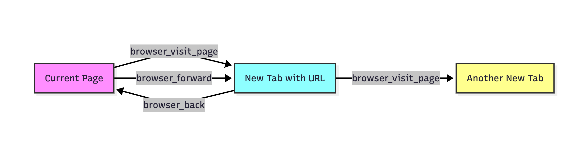

### browser_visit_page

Opens a URL in a new browser tab and switches to it. Creates a new tab each time it’s called.

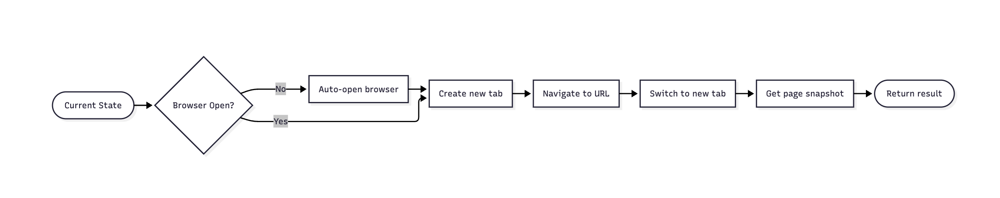

**Parameters:**

- url (str): The web address to load

**Returns:**

- result (str): Confirmation message
- snapshot (str): Page snapshot after navigation
- tabs (List[Dict]): Updated tab information
- current_tab (int): Index of the new active tab
- total_tabs (int): Updated total number of tabs

**Example:**

```
# Visit a single page
result = await toolkit.browser_visit_page("https://example.com")
print(f"Navigated to: {result['result']}")
print(f"Page elements: {result['snapshot']}")

# Visit multiple pages (creates multiple tabs)
sites = ["https://github.com", "https://google.com", "https://stackoverflow.com"]
for site in sites:
    result = await toolkit.browser_visit_page(site)
    print(f"Tab {result['current_tab']}: {site}")
print(f"Total tabs open: {result['total_tabs']}")
```

‍

### browser_back

Navigates back to the previous page in browser history for the current tab.

**Parameters:**

- None

**Returns:**

- result (str): Confirmation message
- snapshot (str): Snapshot of the previous page
- tabs (List[Dict]): Current tab information
- current_tab (int): Index of active tab
- total_tabs (int): Total number of tabs

**Example:**

```
# Navigate through history
await toolkit.browser_visit_page("https://example.com")
await toolkit.browser_visit_page("https://example.com/about")

# Go back
result = await toolkit.browser_back()
print(f"Navigated back to: {result['result']}")
```

‍

### browser_forward

Navigates forward to the next page in browser history for the current tab.

**Parameters:**

- None

**Returns:**

- Same as browser_back

**Example:**

```
# Navigate forward after going back
await toolkit.browser_visit_page("https://example.com")
await toolkit.browser_back()  # Back to homepage

# Go forward again
result = await toolkit.browser_forward()
print(f"Navigated forward to: {result['result']}")
```

‍

## Information Retrieval Tools

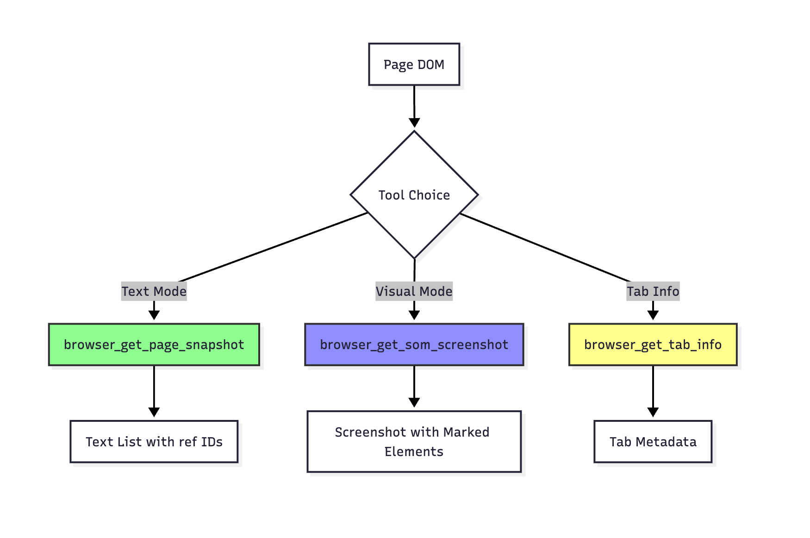

### browser_get_page_snapshot

**Note:** This is a passive tool that must be explicitly called to retrieve page information. It does not trigger any page actions.

Gets a textual snapshot of all interactive elements on the current page. Each element is assigned a unique ref ID for interaction.

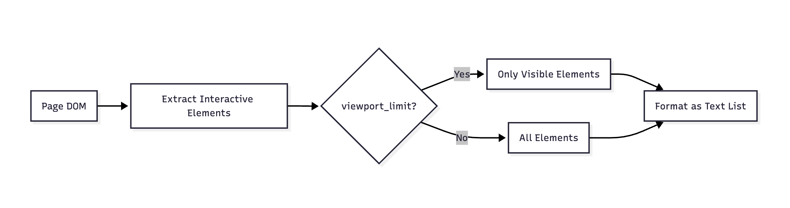

**Parameters:**

- None (uses viewport_limit setting from toolkit initialization)

**Returns:**

- (str): Formatted string listing all interactive elements with their ref IDs

**Example:**

```
# Get full page snapshot
snapshot = await toolkit.browser_get_page_snapshot()
print(snapshot)
# Output:
# - link "Home" [ref=1]
# - button "Sign In" [ref=2]
# - textbox "Search" [ref=3]
# - link "Products" [ref=4]

# With viewport limiting
toolkit_limited = HybridBrowserToolkit(viewport_limit=True)
visible_snapshot = await toolkit_limited.browser_get_page_snapshot()
# Only returns elements currently visible in viewport
```

‍

### browser_get_som_screenshot

Captures a screenshot with interactive elements highlighted and marked with ref IDs (Set of Marks). This tool uses an advanced injection-based approach with browser-side optimizations for accurate element detection.

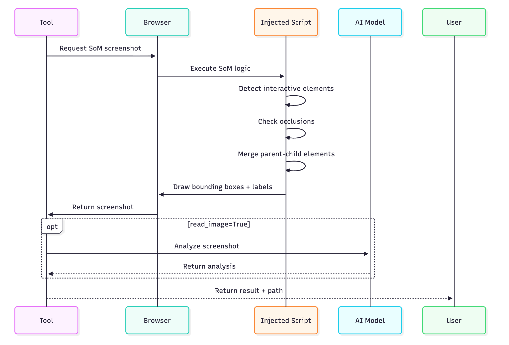

**Technical Features:**

**‍**1. **Injection-based Implementation**: The SoM (Set of Marks) functionality is injected directly into the browser context, ensuring accurate element detection and positioning

2. **Efficient Occlusion Detection**: Browser-side algorithms detect when elements are hidden behind other elements, preventing false positives

3. **Parent-Child Element Fusion**: Intelligently merges parent and child elements when they represent the same interactive component (e.g., a button containing an icon and text)

4. **Smart Label Positioning**: Automatically finds optimal positions for ref ID labels to avoid overlapping with page content

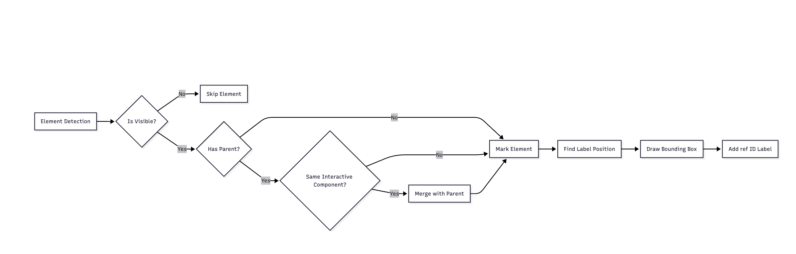

**Parameters:**

- read_image (bool, optional): If True, uses AI to analyze the screenshot. Default: True
- instruction (str, optional): Specific guidance for AI analysis

**Returns:**

- (str): Confirmation message with file path and optional AI analysis

**Example:**

```
# Basic screenshot capture
result = await toolkit.browser_get_som_screenshot(read_image=False)
print(result)
# "Screenshot captured with 42 interactive elements marked (saved to: ./assets/screenshots/page_123456_som.png)"

# With AI analysis
result = await toolkit.browser_get_som_screenshot(
    read_image=True,
    instruction="Find all form input fields"
)
# "Screenshot captured... Agent analysis: Found 5 form fields: username [ref=3], password [ref=4], email [ref=5], phone [ref=6], submit button [ref=7]"

# For visual verification
result = await toolkit.browser_get_som_screenshot(
    read_image=True,
    instruction="Verify the login button is visible and properly styled"
)

# Complex UI with overlapping elements
result = await toolkit.browser_get_som_screenshot(read_image=False)
# The tool automatically handles:
# - Dropdown menus that overlay other content
# - Modal dialogs
# - Nested interactive elements
# - Elements with transparency

# Parent-child fusion example
# A button containing an icon and text will be marked as one element, not three
# <button [ref=5]>
#   <i class="icon"></i>
#   <span>Submit</span>
# </button>
# Will appear as single "button Submit [ref=5]" instead of separate elements
```

‍

### browser_get_tab_info

**Note:** This is a passive information retrieval tool that provides current tab state without modifying anything.

Gets information about all open browser tabs including titles, URLs, and which tab is active.

**Parameters:**

- None

**Returns:**

- tabs (List[Dict]): List of tab information, each containing:
- id (str): Unique tab identifier
- title (str): Page title
- url (str): Current URL
- is_current (bool): Whether this is the active tab
- current_tab (int): Index of the active tab
- total_tabs (int): Total number of open tabs

**Example:**

```
# Check all open tabs
tab_info = await toolkit.browser_get_tab_info()

print(f"Total tabs: {tab_info['total_tabs']}")
print(f"Active tab index: {tab_info['current_tab']}")

for i, tab in enumerate(tab_info['tabs']):
    status = "ACTIVE" if tab['is_current'] else ""
    print(f"Tab {i}: {tab['title']} - {tab['url']} {status}")

# Find a specific tab
github_tab = next(
    (tab for tab in tab_info['tabs'] if 'github.com' in tab['url']),
    None
)
if github_tab:
    await toolkit.browser_switch_tab(tab_id=github_tab['id'])
```

‍

## Interaction Tools

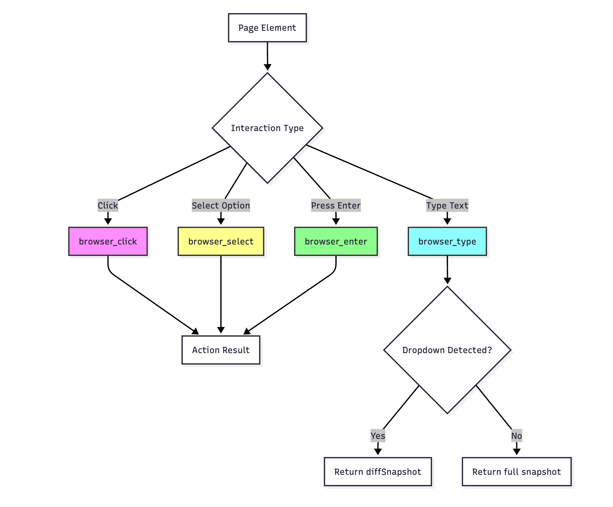

### browser_click

Performs a click action on an element identified by its ref ID.

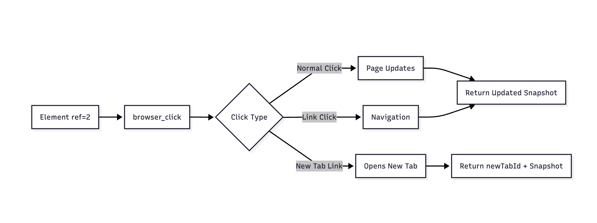

**Parameters:**

- ref (str): The ref ID of the element to click

**Returns:**

- result (str): Confirmation of the action
- snapshot (str): Updated page snapshot after click
- tabs (List[Dict]): Current tab information
- current_tab (int): Index of active tab
- total_tabs (int): Total number of tabs
- newTabId (str, optional): ID of newly opened tab if click opened a new tab

**Example:**

```
# Simple click
result = await toolkit.browser_click(ref="2")
print(f"Clicked: {result['result']}")

# Click that opens new tab
result = await toolkit.browser_click(ref="external-link")
if 'newTabId' in result:
    print(f"New tab opened with ID: {result['newTabId']}")
    # Switch to the new tab
    await toolkit.browser_switch_tab(tab_id=result['newTabId'])

# Click with error handling
try:
    result = await toolkit.browser_click(ref="submit-button")
except Exception as e:
    print(f"Click failed: {e}")
```

‍

### browser_type

Types text into input elements. Supports both single and multiple inputs with intelligent dropdown detection and automatic child element discovery.

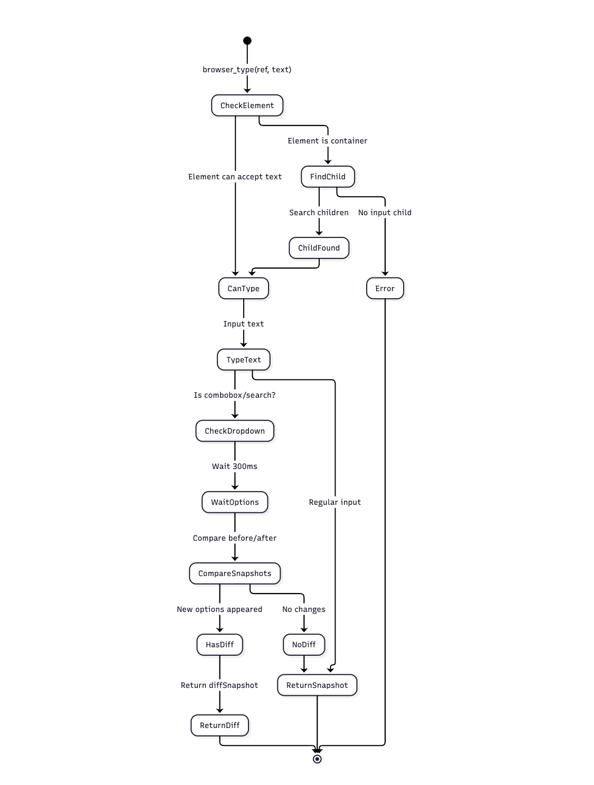

**Special Features:**

1. **Intelligent Dropdown Detection:**
   - When typing into elements that might trigger dropdown options (such as combobox, search fields, or autocomplete inputs), the tool automatically:
     - Detects if new options appear after typing
     - Returns only the newly appeared options via diffSnapshot instead of the full page snapshot
     - This optimization reduces noise and makes it easier to interact with dynamic dropdowns
2. **Automatic Child Element Discovery:**
   - If the specified ref ID points to a container element that cannot accept text input directly, the tool automatically:
     - Searches through child elements to find an input field
     - Attempts to type into the first suitable child input element found
     - This is particularly useful for complex UI components where the visible element is a wrapper around the actual input

**Parameters (Single Input):**

- ref (str): The ref ID of the input element (or container with input child)
- text (str): The text to type

**Parameters (Multiple Inputs):**

- inputs (List[Dict[str, str]]): List of dictionaries with ‘ref’ and ‘text’ keys

**Returns:**

- result (str): Confirmation message
- snapshot (str): Updated page snapshot (full snapshot for regular inputs)
- diffSnapshot (str, optional): For dropdowns, shows only newly appeared options
- details (Dict, optional): For multiple inputs, success/error status for each
- Tab information fields

**Example:**

```
# Single input
result = await toolkit.browser_type(ref="3", text="john.doe@example.com")

# Handle dropdown/autocomplete with intelligent detection
result = await toolkit.browser_type(ref="search", text="laptop")
if 'diffSnapshot' in result:
    print("Dropdown options appeared:")
    print(result['diffSnapshot'])
    # Example output:
    # - option "Laptop Computers" [ref=45]
    # - option "Laptop Bags" [ref=46]
    # - option "Laptop Accessories" [ref=47]

    # Click on one of the options
    await toolkit.browser_click(ref="45")
else:
    # No dropdown appeared, continue with regular snapshot
    print("Page snapshot:", result['snapshot'])

# Autocomplete example with diff detection
result = await toolkit.browser_type(ref="city-input", text="San")
if 'diffSnapshot' in result:
    # Only shows newly appeared suggestions
    print("City suggestions:")
    print(result['diffSnapshot'])
    # - option "San Francisco" [ref=23]
    # - option "San Diego" [ref=24]
    # - option "San Antonio" [ref=25]

# Multiple inputs at once
inputs = [
    {'ref': '3', 'text': 'username123'},
    {'ref': '4', 'text': 'SecurePass123!'},
    {'ref': '5', 'text': 'john.doe@example.com'}
]
result = await toolkit.browser_type(inputs=inputs)
print(result['details'])  # Success/failure for each input

# Clear and type
await toolkit.browser_click(ref="3")  # Focus
await toolkit.browser_press_key(keys=["Control+a"])  # Select all
await toolkit.browser_type(ref="3", text="new_value")  # Replaces content

# Working with combobox elements
async def handle_searchable_dropdown():
    # Type to search/filter options
    result = await toolkit.browser_type(ref="country-select", text="United")

    if 'diffSnapshot' in result:
        # Shows only countries containing "United"
        print("Filtered countries:", result['diffSnapshot'])
        # - option "United States" [ref=87]
        # - option "United Kingdom" [ref=88]
        # - option "United Arab Emirates" [ref=89]

        # Select one of the filtered options
        await toolkit.browser_click(ref="87")

# Automatic child element discovery
# When the ref points to a container, browser_type finds the input child
result = await toolkit.browser_type(ref="search-container", text="product name")
# Even though ref="search-container" might be a <div>, the tool will find
# and type into the actual <input> element inside it

# Complex UI component example
# The visible element might be a styled wrapper
result = await toolkit.browser_type(ref="styled-date-picker", text="2024-03-15")
# Tool automatically finds the actual input field within the date picker component
```

‍

### browser_select

Selects an option in a dropdown (<select>) element.

**Parameters:**

- ref (str): The ref ID of the select element
- value (str): The value attribute of the option to select (not the visible text)

**Returns:**

- Standard action response with snapshot and tab information

**Example:**

```
# Select by value attribute
result = await toolkit.browser_select(ref="country-select", value="US")

# Common pattern: type to filter, then select
await toolkit.browser_type(ref="5", text="Uni")  # Type to filter
# Snapshot shows filtered options
result = await toolkit.browser_select(ref="5", value="united-states")
```

### browser_enter

Simulates pressing the Enter key on the currently focused element. Useful for form submission.

**Parameters:**

- None

**Returns:**

- Standard action response with potentially new page snapshot

**Example:**

```
# Submit search form
await toolkit.browser_type(ref="search-box", text="Python tutorials")
result = await toolkit.browser_enter()
# Page navigates to search results

# Submit login form
await toolkit.browser_type(ref="username", text="user123")
await toolkit.browser_type(ref="password", text="pass123")
await toolkit.browser_enter()  # Submits the form
```

‍

## Page Control Tools

### browser_scroll

Scrolls the current page window in the specified direction.

**Parameters:**

- direction (str): Either “up” or “down”
- amount (int, optional): Number of pixels to scroll. Default: 500

**Returns:**

- Standard action response with updated snapshot showing newly visible elements

**Example:**

```
# Basic scrolling
await toolkit.browser_scroll(direction="down", amount=500)
await toolkit.browser_scroll(direction="up", amount=300)

# Scroll to load more content
async def scroll_to_bottom():
    """Scroll until no new content loads"""
    previous_snapshot = ""
    while True:
        result = await toolkit.browser_scroll(direction="down", amount=1000)
        if result['snapshot'] == previous_snapshot:
            break  # No new content loaded
        previous_snapshot = result['snapshot']
        await asyncio.sleep(1)  # Wait for content to load

# Paginated scrolling
for i in range(5):
    await toolkit.browser_scroll(direction="down", amount=800)
    snapshot = await toolkit.browser_get_page_snapshot()
    print(f"Page {i+1} content loaded")
```

‍

### browser_mouse_control

Controls mouse actions at specific coordinates.

**Parameters:**

- control (str): Action type - “click”, “right_click”, or “dblclick”
- x (float): X-coordinate
- y (float): Y-coordinate

**Returns:**

- Standard action response

**Example:**

```
# Click at specific coordinates
await toolkit.browser_mouse_control(control="click", x=350.5, y=200)

# Right-click for context menu
await toolkit.browser_mouse_control(control="right_click", x=400, y=300)

# Double-click to select text
await toolkit.browser_mouse_control(control="dblclick", x=250, y=150)

# Click on canvas or image maps
canvas_result = await toolkit.browser_mouse_control(
    control="click",
    x=523.5,
    y=412.3
)
```

‍

### browser_mouse_drag

Performs drag and drop operations between elements.

**Parameters:**

- from_ref (str): Source element ref ID
- to_ref (str): Target element ref ID

**Returns:**

- Standard action response

**Example:**

```
# Drag item to trash
await toolkit.browser_mouse_drag(from_ref="item-5", to_ref="trash-bin")

# Reorder list items
await toolkit.browser_mouse_drag(from_ref="task-3", to_ref="task-1")

# Move file to folder
result = await toolkit.browser_mouse_drag(
    from_ref="file-report.pdf",
    to_ref="folder-documents"
)
print(f"Drag result: {result['result']}")
```

### browser_press_key

Presses keyboard keys or key combinations.

**Parameters:**

- keys (List[str]): List of keys to press (can include modifiers)

**Returns:**

- Standard action response

**Example:**

```
# Single key press
await toolkit.browser_press_key(keys=["Tab"])
await toolkit.browser_press_key(keys=["Escape"])

# Key combinations
await toolkit.browser_press_key(keys=["Control+a"])  # Select all
await toolkit.browser_press_key(keys=["Control+c"])  # Copy
await toolkit.browser_press_key(keys=["Control+v"])  # Paste

# Navigation shortcuts
await toolkit.browser_press_key(keys=["Control+t"])  # New tab
await toolkit.browser_press_key(keys=["Control+w"])  # Close tab
await toolkit.browser_press_key(keys=["Alt+Left"])   # Back

# Function keys
await toolkit.browser_press_key(keys=["F5"])         # Refresh
await toolkit.browser_press_key(keys=["F11"])        # Fullscreen
```

‍

## Tab Management Tools

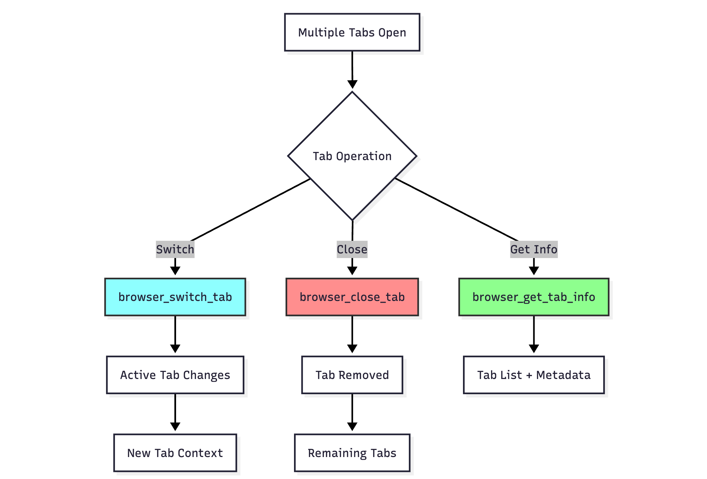

### browser_switch_tab

Switches to a different browser tab using its ID.

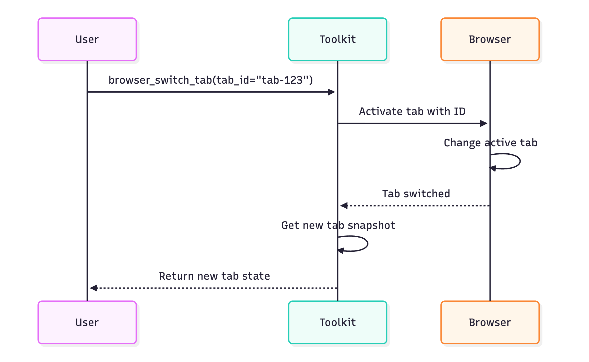

**Parameters:**

- tab_id (str): The ID of the tab to activate

**Returns:**

- Standard action response with snapshot of the newly active tab

**Example:**

```
# Get current tabs and switch
tab_info = await toolkit.browser_get_tab_info()
tabs = tab_info['tabs']

# Switch to the second tab
if len(tabs) > 1:
    await toolkit.browser_switch_tab(tab_id=tabs[1]['id'])

# Switch back to first tab
await toolkit.browser_switch_tab(tab_id=tabs[0]['id'])

# Pattern: Open link in new tab and switch
result = await toolkit.browser_click(ref="external-link")
if 'newTabId' in result:
    await toolkit.browser_switch_tab(tab_id=result['newTabId'])
```

### browser_close_tab

Closes a specific browser tab.

**Parameters:**

- tab_id (str): The ID of the tab to close

**Returns:**

- Standard action response with information about remaining tabs

**Example:**

```
# Close current tab
tab_info = await toolkit.browser_get_tab_info()
current_tab_id = None
for tab in tab_info['tabs']:
    if tab['is_current']:
        current_tab_id = tab['id']
        break

if current_tab_id:
    await toolkit.browser_close_tab(tab_id=current_tab_id)

# Close all tabs except the first
tab_info = await toolkit.browser_get_tab_info()
for i, tab in enumerate(tab_info['tabs']):
    if i > 0:  # Keep first tab
        await toolkit.browser_close_tab(tab_id=tab['id'])
```

‍

## Developer Tools

### browser_console_view

Views console logs from the current page.

**Parameters:**

- None

**Returns:**

- console_messages (List[Dict]): List of console messages with:
- type (str): Message type (log, warn, error, info)
- text (str): Message content
- timestamp (str): When the message was logged

**Example:**

```
# Check for JavaScript errors
console_info = await toolkit.browser_console_view()

errors = [
    msg for msg in console_info['console_messages']
    if msg['type'] == 'error'
]

if errors:
    print("Page has JavaScript errors:")
    for error in errors:
        print(f"- {error['text']}")

# Monitor console during interaction
await toolkit.browser_click(ref="dynamic-button")
console_info = await toolkit.browser_console_view()
print(f"Console messages after click: {len(console_info['console_messages'])}")
```

‍

### browser_console_exec

Executes JavaScript code in the browser console.

**Parameters:**

- code (str): JavaScript code to execute

**Returns:**

- Standard action response with execution result

**Example:**

```
# Get page information
result = await toolkit.browser_console_exec(
    "document.title + ' - ' + window.location.href"
)

# Modify page elements
await toolkit.browser_console_exec("""
    document.querySelector('#message').innerText = 'Updated by automation';
    document.querySelector('#message').style.color = 'red';
""")

# Extract data
result = await toolkit.browser_console_exec("""
    Array.from(document.querySelectorAll('.product')).map(p => ({
        name: p.querySelector('.name').textContent,
        price: p.querySelector('.price').textContent
    }))
""")

# Trigger custom events
await toolkit.browser_console_exec("""
    const event = new CustomEvent('customAction', { detail: { action: 'refresh' } });
    document.dispatchEvent(event);
""")

# Check element states
is_visible = await toolkit.browser_console_exec("""
    const elem = document.querySelector('#submit-button');
    elem && !elem.disabled && elem.offsetParent !== null
""")
```

‍

## Special Tools

### browser_wait_user

Pauses execution and waits for human intervention. Useful for manual steps like CAPTCHA solving.

**Parameters:**

- timeout_sec (float, optional): Maximum seconds to wait. None for indefinite wait.

**Returns:**

- result (str): How the wait ended (user resumed or timeout)
- snapshot (str): Page snapshot after the wait
- Standard tab information

**Example:**

```
# Wait for CAPTCHA solving
print("Please solve the CAPTCHA in the browser window...")
result = await toolkit.browser_wait_user(timeout_sec=120)

if "Timeout" in result['result']:
    print("User didn't complete CAPTCHA in time")
else:
    print("User completed the action, continuing...")
    await toolkit.browser_click(ref="submit")

# Indefinite wait for complex manual steps
print("Please complete the payment process manually.")
print("Press Enter when done...")
await toolkit.browser_wait_user()  # No timeout

# Wait with instructions
async def handle_manual_verification():
    await toolkit.browser_get_som_screenshot()  # Show current state
    print("\nManual steps required:")
    print("1. Complete the identity verification")
    print("2. Upload required documents")
    print("3. Press Enter when finished")

    result = await toolkit.browser_wait_user(timeout_sec=300)
    return "User resumed" in result['result']
```

‍

## Complete Automation Example

```
async def complete_web_automation():
    """Example combining multiple tools for a complete workflow"""

    toolkit = HybridBrowserToolkit(
        headless=False,
        viewport_limit=True
    )

    try:
        # Start browser
        await toolkit.browser_open()

        # Navigate to site
        await toolkit.browser_visit_page("https://example-shop.com")

        # Check page loaded
        snapshot = await toolkit.browser_get_page_snapshot()

        # Search for product
        await toolkit.browser_type(ref="search", text="laptop")
        await toolkit.browser_enter()

        # Scroll through results
        await toolkit.browser_scroll(direction="down", amount=800)

        # Take screenshot for verification
        await toolkit.browser_get_som_screenshot(
            read_image=True,
            instruction="Find laptops under $1000"
        )

        # Click on product
        await toolkit.browser_click(ref="product-1")

        # Check multiple tabs
        tab_info = await toolkit.browser_get_tab_info()
        print(f"Tabs open: {tab_info['total_tabs']}")

        # Add to cart and checkout
        await toolkit.browser_click(ref="add-to-cart")
        await toolkit.browser_click(ref="checkout")

        # Fill checkout form
        inputs = [
            {'ref': 'name', 'text': 'John Doe'},
            {'ref': 'email', 'text': 'john@example.com'},
            {'ref': 'address', 'text': '123 Main St'}
        ]
        await toolkit.browser_type(inputs=inputs)

        # Select shipping
        await toolkit.browser_select(ref="shipping", value="standard")

        # Execute custom validation
        await toolkit.browser_console_exec(
            "document.querySelector('form').checkValidity()"
        )

        # Submit order
        await toolkit.browser_click(ref="place-order")

    finally:
        # Always close browser
        await toolkit.browser_close()
```

`‍`

This comprehensive reference covers all available tools in the HybridBrowserToolkit, providing you with the complete set of browser automation capabilities.

‍

# Operating Modes

The HybridBrowserToolkit offers two primary operating modes for web automation, each optimized for different use cases and interaction patterns. This chapter provides a comprehensive guide to understanding and using both modes effectively.

## Overview

The HybridBrowserToolkit combines non-visual DOM-based automation with visual screenshot-based capabilities, providing flexibility for various web automation scenarios. Understanding when and how to use each mode is crucial for building efficient automation solutions.

## Text Mode

Text mode provides a DOM-based, non-visual approach to browser automation. This is the default operating mode where the toolkit returns textual snapshots of page elements.

### Text Mode Key Features

- **Automatic Snapshots**: Every action that modifies page state returns a textual snapshot
- **Unique Element IDs**: Elements are identified by ref IDs (e.g., [ref=1], [ref=2])
- **Lightweight Operation**: Minimal overhead, suitable for headless execution
- **Smart Diff Detection**: Special handling for dropdown and menu interactions

### Text Mode Basic Usage

### Standard Text Mode Operation

```
from camel.toolkits import HybridBrowserToolkit

# Initialize toolkit in default text mode
toolkit = HybridBrowserToolkit(
    headless=True,              # Can run without display
    viewport_limit=False,       # Include all elements, not just visible ones
    default_timeout=30000,      # 30 seconds default timeout
    navigation_timeout=60000    # 60 seconds for page loads
)

# Open browser and get initial snapshot
result = await toolkit.browser_open()
print(result['snapshot'])  # Shows all interactive elements with ref IDs
print(f"Total tabs: {result['total_tabs']}")

# Navigate to a page - automatically returns new snapshot
result = await toolkit.browser_visit_page("https://example.com")
print(result['snapshot'])
# Output example:
# - link "Home" [ref=1]
# - button "Login" [ref=2]
# - textbox "Username" [ref=3]
# - textbox "Password" [ref=4]
# - link "Register" [ref=5]

# Interact with elements
result = await toolkit.browser_click(ref="2")
print(f"Action result: {result['result']}")
print(f"Updated snapshot: {result['snapshot']}")

# Type into input fields
result = await toolkit.browser_type(ref="3", text="user@example.com")
result = await toolkit.browser_type(ref="4", text="password123")

# Submit form
result = await toolkit.browser_enter()  # Simulates pressing Enter
```

‍

### On-Demand Snapshot Retrieval

```
# Get snapshot without performing actions
snapshot = await toolkit.browser_get_page_snapshot()
print(snapshot)

# Viewport-limited snapshot (only visible elements)
toolkit_limited = HybridBrowserToolkit(viewport_limit=True)
visible_snapshot = await toolkit_limited.browser_get_page_snapshot()
```

‍

### Advanced Text Mode

### Full Visual Mode (No Automatic Snapshots)

```
# Initialize with full_visual_mode to disable automatic snapshots
toolkit = HybridBrowserToolkit(
    full_visual_mode=True  # Actions won't return snapshots
)

# Actions now return minimal information
result = await toolkit.browser_click(ref="1")
print(result)  # {'result': 'Clicked on link "Home"', 'tabs': [...]}

# Must explicitly request snapshots when needed
snapshot = await toolkit.browser_get_page_snapshot()

# Useful for performance-critical operations
async def bulk_operations():
    # Perform multiple actions without snapshot overhead
    await toolkit.browser_click(ref="menu")
    await toolkit.browser_click(ref="submenu-1")
    await toolkit.browser_click(ref="option-3")

    # Get snapshot only at the end
    final_snapshot = await toolkit.browser_get_page_snapshot()
    return final_snapshot
```

‍

### Diff Snapshot Feature

The intelligent diff detection feature for dropdowns is one of the most powerful features in text mode. When typing into a combobox or search field, the toolkit automatically detects if new options appear and returns only the newly appeared options via diffSnapshot instead of the full page snapshot. This optimization reduces noise and makes it easier to interact with dynamic dropdowns.

## Visual Mode

Visual mode enables screenshot-based interaction with visual element recognition. This mode is essential when you need to “see” the page as a human would.

### Visual Mode Key Features

- **Set of Marks (SoM)**: Screenshots with bounding boxes around interactive elements
- **Element Overlays**: Each element is marked with its ref ID
- **AI Integration**: Optional AI-powered image analysis
- **Visual Verification**: Confirm UI states and layouts visually

### Visual Mode Basic Usage

### Taking SoM Screenshots

```
# Initialize toolkit for visual operations
toolkit = HybridBrowserToolkit(
    headless=False,    # Often used with display for debugging
    cache_dir="./screenshots",  # Directory for saving screenshots
    screenshot_timeout=10000    # 10 seconds timeout for screenshots
)

# Basic screenshot capture
result = await toolkit.browser_get_som_screenshot()
print(result)
# Output: "Screenshot captured with 23 interactive elements marked
# (saved to: ./assets/screenshots/example_com_home_123456_som.png)"

# Screenshot with custom analysis
result = await toolkit.browser_get_som_screenshot(
    read_image=True,
    instruction="Identify all buttons related to shopping cart"
)
# print(result)
# ref e4 is shopping cart
```

‍

### Quick Decision Matrix

| Use Case               | Recommended Mode    | Key Method                                | Example                          |
| ---------------------- | ------------------- | ----------------------------------------- | -------------------------------- |
| Form automation        | Text Mode           | `browser_type()`                          | Login forms, data entry          |
| Data extraction        | Text Mode           | `browser_get_page_snapshot()`             | Scraping text content            |
| Visual verification    | Visual Mode         | `browser_get_screenshot()`                | UI testing, layout checks        |
| Element finding        | Visual Mode + AI    | `browser_get_screenshot(read_image=true)` | “Find the red button”            |
| CAPTCHA / Manual steps | Visual Mode         | `browser_wait_user()`                     | Human intervention needed        |
| Dynamic content        | Text Mode with diff | `browser_type()` with diff detection      | Autocomplete, dropdowns          |
| Complex workflows      | Hybrid              | Combination of methods                    | E-commerce, multi-step processes |

### Best Practices

1. **Start with Text Mode**: It’s faster and works for most automation tasks
2. **Use Visual Mode When Needed**: For visual verification, complex UIs, or human-like understanding
3. **Combine Modes**: Use text for navigation/interaction, visual for verification/discovery
4. **Optimize for Performance**: Use full_visual_mode=True when you don’t need constant snapshots
5. **Handle Dynamic Content**: Leverage diff snapshots for dropdowns and menus

Both modes are designed to work seamlessly together, allowing you to build sophisticated automation solutions that can handle any web interaction scenario.

‍

# Connection Modes

This chapter describes the different connection modes available in HybridBrowserToolkit, including standard Playwright connection and Chrome DevTools Protocol (CDP) connection.

## Overview

HybridBrowserToolkit supports two primary connection modes:

1. **Standard Playwright Connection**: Creates and manages its own browser instance
2. **CDP Connection**: Connects to an existing browser instance via Chrome DevTools Protocol

Each mode serves different purposes and offers unique advantages for various automation scenarios.

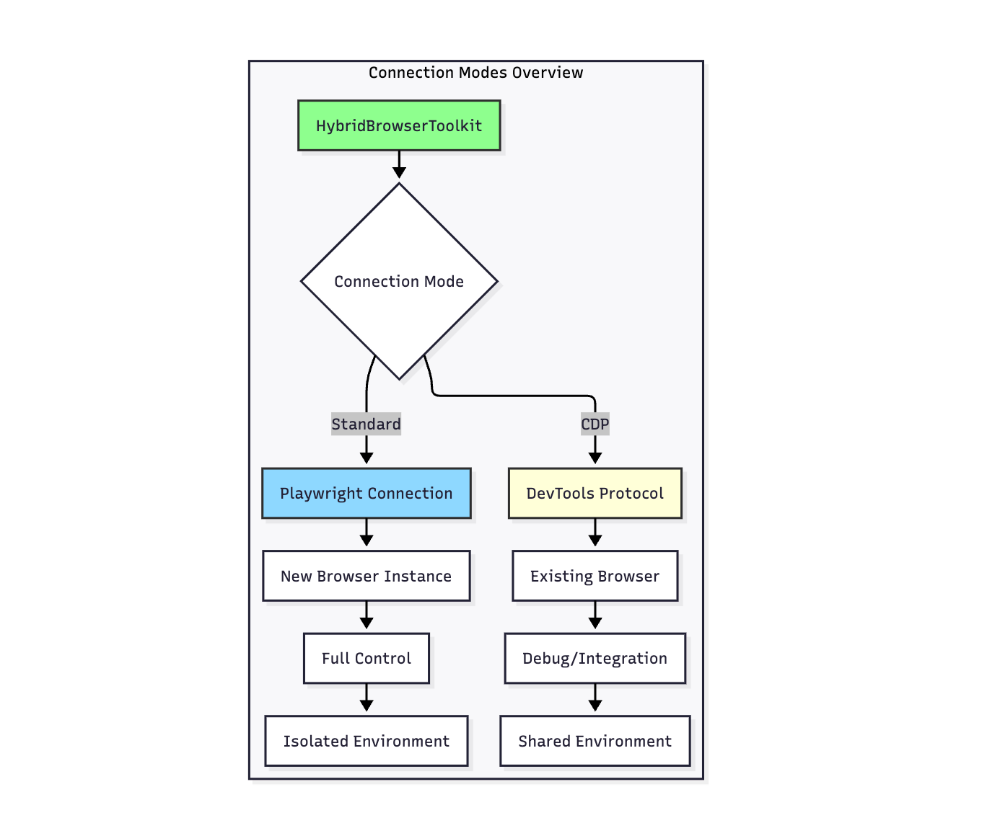

## Standard Playwright Connection

The standard mode creates a new browser instance managed entirely by the toolkit. This is the default and most common usage pattern.

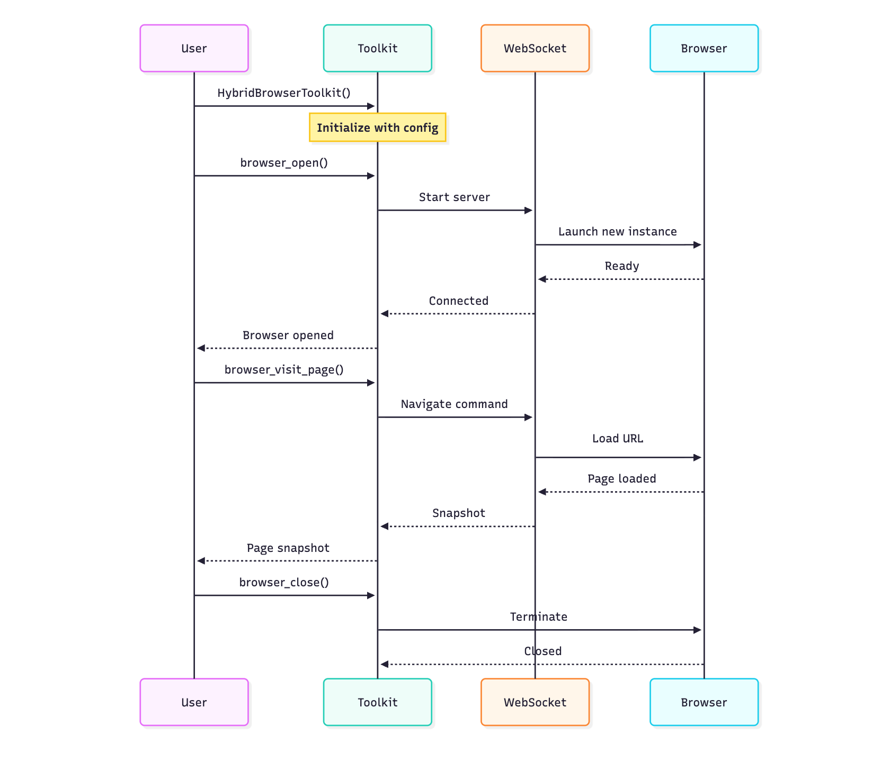

## Basic Setup

```
from camel.toolkits import HybridBrowserToolkit

# Basic initialization - creates new browser instance
toolkit = HybridBrowserToolkit()

# Open browser
await toolkit.browser_open()

# Perform actions
await toolkit.browser_visit_page("https://example.com")
await toolkit.browser_click(ref="1")

# Close browser when done
await toolkit.browser_close()
```

### Configuration Options

### Headless vs Headed Mode

```
# Headless mode (default) - no visible browser window
toolkit_headless = HybridBrowserToolkit(
    headless=True
)

# Headed mode - visible browser window
toolkit_headed = HybridBrowserToolkit(
    headless=False
)

# Headed mode with specific window size
toolkit_sized = HybridBrowserToolkit(
    headless=False,
    # Additional viewport configuration can be set via browser launch args
)
```

‍

## User Data Persistence

```
# Persist browser data (cookies, localStorage, etc.)
toolkit_persistent = HybridBrowserToolkit(
    user_data_dir="/path/to/user/data"
)

# Example: Login once, reuse session
async def persistent_session_example():
    # First run - perform login
    toolkit = HybridBrowserToolkit(
        user_data_dir="./browser_sessions/user1",
        headless=False
    )

    await toolkit.browser_open()
    await toolkit.browser_visit_page("https://example.com/login")
    # ... perform login ...
    await toolkit.browser_close()

    # Subsequent runs - already logged in
    toolkit_reuse = HybridBrowserToolkit(
        user_data_dir="./browser_sessions/user1"
    )
    await toolkit_reuse.browser_open()
    await toolkit_reuse.browser_visit_page("https://example.com/dashboard")
    # Already authenticated!
```

‍

### Stealth Mode

The comprehensive stealth mode helps avoid bot detection by applying multiple anti-detection techniques. This includes browser fingerprint masking, WebDriver property hiding, and normalized navigator properties.

### Timeout Configuration

```
# Comprehensive timeout configuration
toolkit_custom_timeouts = HybridBrowserToolkit(
    default_timeout=30000,           # 30 seconds default
    navigation_timeout=60000,        # 60 seconds for page loads
    network_idle_timeout=5000,       # 5 seconds for network idle
    screenshot_timeout=10000,        # 10 seconds for screenshots
    page_stability_timeout=2000,     # 2 seconds for page stability
    dom_content_loaded_timeout=30000 # 30 seconds for DOM ready
)
```

‍

### Standard Use Cases

### 1. Testing and Development

```
# Development setup with logging
toolkit_dev = HybridBrowserToolkit(
    headless=False,
    browser_log_to_file=True,
    log_dir="./test_logs",
    session_id="test_run_001"
)

# All browser actions will be logged
await toolkit_dev.browser_open()
await toolkit_dev.browser_visit_page("http://localhost:3000")
# Logs include timing, inputs, outputs, and errors
```

‍

## 2. Multi-Session Automation

‍

```
# Create multiple independent browser sessions
async def multi_session_example():
    # Create base toolkit
    base_toolkit = HybridBrowserToolkit(
        headless=True,
        cache_dir="./base_cache"
    )

    # Clone for parallel sessions
    session1 = base_toolkit.clone_for_new_session("user_1")
    session2 = base_toolkit.clone_for_new_session("user_2")

    # Run parallel automations
    await asyncio.gather(
        automate_user_flow(session1),
        automate_user_flow(session2)
    )
```

‍

## 3. Long-Running Automation

‍

```
# Configuration for long-running tasks
toolkit_long = HybridBrowserToolkit(
    headless=True,
    user_data_dir="./long_running_session",
    default_timeout=60000,  # Longer timeouts
    navigation_timeout=120000
)

async def monitor_website():
    await toolkit_long.browser_open()

    while True:
        try:
            await toolkit_long.browser_visit_page("https://status.example.com")
            snapshot = await toolkit_long.browser_get_page_snapshot()

            # Check status
            if "All Systems Operational" not in snapshot:
                send_alert()

            await asyncio.sleep(300)  # Check every 5 minutes

        except Exception as e:
            logger.error(f"Monitoring error: {e}")
            # Reconnect on error
            await toolkit_long.browser_close()
            await toolkit_long.browser_open()
```

## CDP Connection Mode

Chrome DevTools Protocol (CDP) connection allows the toolkit to connect to an already running browser instance. This is particularly useful for debugging, connecting to remote browsers, or integrating with existing browser sessions.

### What is CDP?

CDP (Chrome DevTools Protocol) is a protocol that allows tools to instrument, inspect, debug, and profile Chrome/Chromium browsers. The toolkit can connect to any browser that exposes a CDP endpoint.

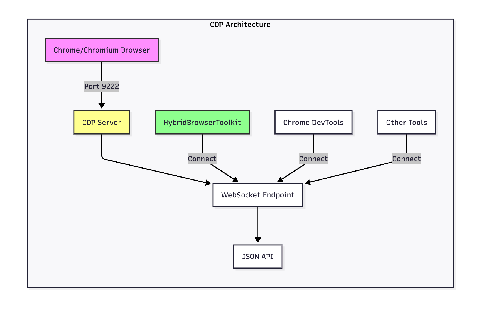

### Step 1: Launch Browser with Remote Debugging

```
# Launch Chrome with remote debugging port
# macOS
/Applications/Google\ Chrome.app/Contents/MacOS/Google\ Chrome \
    --remote-debugging-port=9222 \
    --user-data-dir=/tmp/chrome-debug

# Windows
"C:\Program Files\Google\Chrome\Application\chrome.exe" \
    --remote-debugging-port=9222 \
    --user-data-dir=C:\temp\chrome-debug

# Linux
google-chrome \
    --remote-debugging-port=9222 \
    --user-data-dir=/tmp/chrome-debug
```

‍

### Step 2: Get WebSocket Endpoint

```
import requests

# Get browser WebSocket endpoint
response = requests.get('http://localhost:9222/json/version')
ws_endpoint = response.json()['webSocketDebuggerUrl']
print(f"WebSocket endpoint: {ws_endpoint}")
# Example: ws://localhost:9222/devtools/browser/abc123...
```

‍

### Step 3: Connect via CDP

```
# Connect to existing browser
toolkit_cdp = HybridBrowserToolkit(
    cdp_url="ws://localhost:9222/devtools/browser/abc123..."
)

# The browser is already running, so we don't call browser_open()
# We can immediately start interacting with it

# Get current tab info
tab_info = await toolkit_cdp.browser_get_tab_info()
print(f"Connected to {tab_info['total_tabs']} tabs")

# Work with existing tabs
await toolkit_cdp.browser_switch_tab(tab_info['tabs'][0]['id'])
snapshot = await toolkit_cdp.browser_get_page_snapshot()
```

‍

CDP Configuration

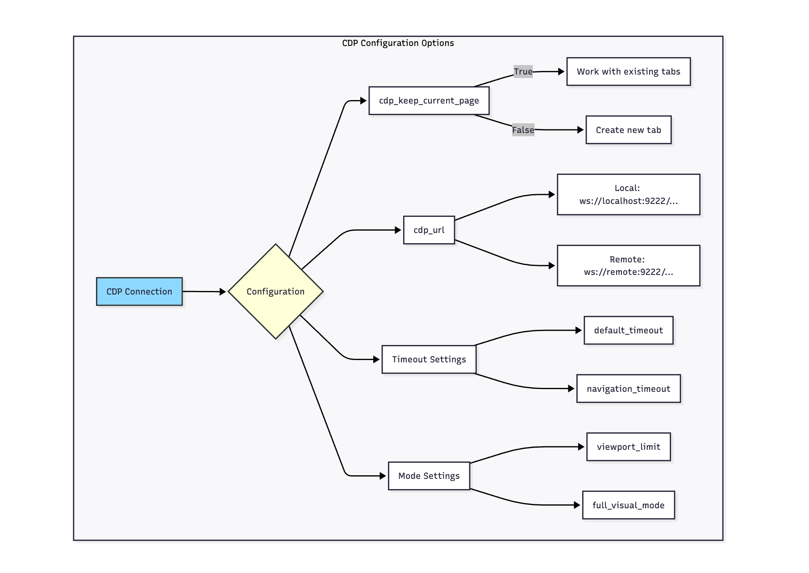

### Keep Current Page Mode

In this mode, Hybrid_browser_toolkit won’t open new web page in browser but directly using current page.

```
# Connect without creating new tabs
toolkit_keep_page = HybridBrowserToolkit(
    cdp_url=ws_endpoint,
    cdp_keep_current_page=True  # Don't create new tabs
)

# Work with the existing page
current_snapshot = await toolkit_keep_page.browser_get_page_snapshot()
await toolkit_keep_page.browser_click(ref="1")
```

‍

### CDP with Custom Configuration

```
# CDP connection with full configuration
toolkit_cdp_custom = HybridBrowserToolkit(
    cdp_url=ws_endpoint,
    cdp_keep_current_page=False,    # Create new tab on connection
    headless=False,                  # Ignored in CDP mode
    default_timeout=30000,           # Still applies to operations
    viewport_limit=True,             # Limit to viewport elements
    full_visual_mode=False          # Return snapshots normally
)
```

## MCP configuration

The HybridBrowserToolkit can be accessed through MCP (Model Context Protocol), allowing AI assistants like Claude to control browsers directly.

## **Quick Setup**

### **1. Install the MCP Server**

```
git clone https://github.com/camel-ai/browser_agent.git
cd browser_agent
pip install -e .
```

‍

### **2. Configure Claude Desktop**

Add to your Claude configuration file:

- **macOS**: ~/Library/Application Support/Claude/claude_desktop_config.json
- **Windows**: %APPDATA%\Claude\claude_desktop_config.json

```
{
  "mcpServers": {
    "hybrid-browser": {
      "command": "python",
      "args": ["-m", "hybrid_browser_mcp.server"]
    }
  }
}
```

‍

**Configuration Success Example:**

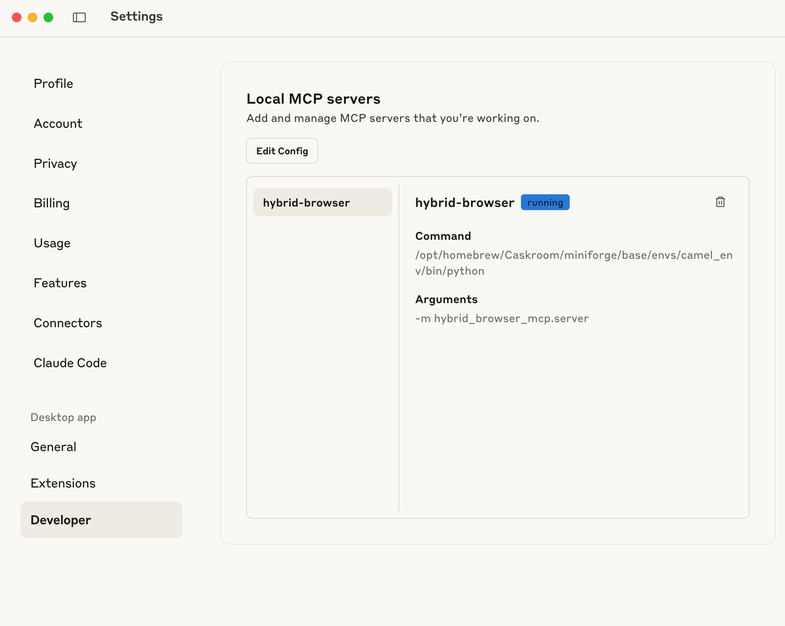

### **3. Restart Claude Desktop**

After adding the configuration, completely restart Claude Desktop. The browser tools will appear when you click the 🔌 icon in the chat interface.

**Browser Tools in Action:**

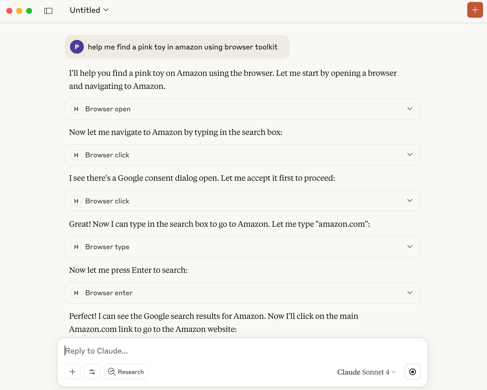

## **Available Browser Tools**

Once connected, you'll have access to:

- **Navigation**: browser_open, browser_visit_page, browser_back, browser_forward
- **Interaction**: browser_click, browser_type, browser_select, browser_scroll
- **Screenshots**: browser_get_som_screenshot (captures page with clickable elements marked)
- **Tab Management**: browser_switch_tab, browser_close_tab
- **Advanced**: browser_console_exec, browser_mouse_control

## **Basic Usage Example**`‍`

```
# Claude can now control browsers with simple commands:
await browser_open()
await browser_visit_page("https://example.com")
await browser_type(ref="search", text="AI automation")
await browser_click(ref="submit-button")
await browser_get_som_screenshot()
await browser_close()
```

‍

## **Customization**

Modify browser behavior in browser_agent/config.py:

```
BROWSER_CONFIG = {
    "headless": False,    # Show browser window
    "stealth": True,      # Avoid bot detection
    "enabled_tools": [...] # Specify which tools to enable
}
```

## **Troubleshooting**

If the server doesn't appear in Claude:

1. Check installation: python -m hybrid_browser_mcp.server (should run without errors)
2. Verify the config file path and JSON syntax
3. Ensure you restarted Claude Desktop completely
4. Check Claude logs for error messages

For more details, visit the [hybrid-browser-mcp repository](https://github.com/camel-ai/hybrid-browser-mcp).

‍

# Summary

This journey reflects a fundamental rethinking of how browser automation should work. Instead of treating the browser as a black box that we interact with through screenshots, the new HybridBrowserToolkit speaks the browser's native language through TypeScript while maintaining Python's friendly interface for developers.

The toolkit now operates in multiple modes to suit different needs. When speed matters, text mode provides a lightweight DOM-based view of the page. When you need to verify layouts or find elements visually, visual mode captures annotated screenshots. The hybrid mode intelligently switches between these approaches based on the task at hand. This flexibility extends to how you connect to browsers too – you can spin up fresh instances, attach to existing browsers through Chrome DevTools Protocol, or integrate with AI systems via Model Context Protocol.

What really makes the new toolkit shine are the thoughtful details scattered throughout. It knows when you're typing in a search box that might trigger a dropdown and shows you just the new suggestions that appear. It can fill out entire forms in one go, automatically finding the right input fields even if you click on their labels. The screenshot tool has gotten smarter too, handling overlapping elements gracefully and finding clear spots to place element markers. All these improvements come together to create a tool that feels natural to use, whether you're building test suites, scraping data, or creating AI agents that can navigate the web.

‍
