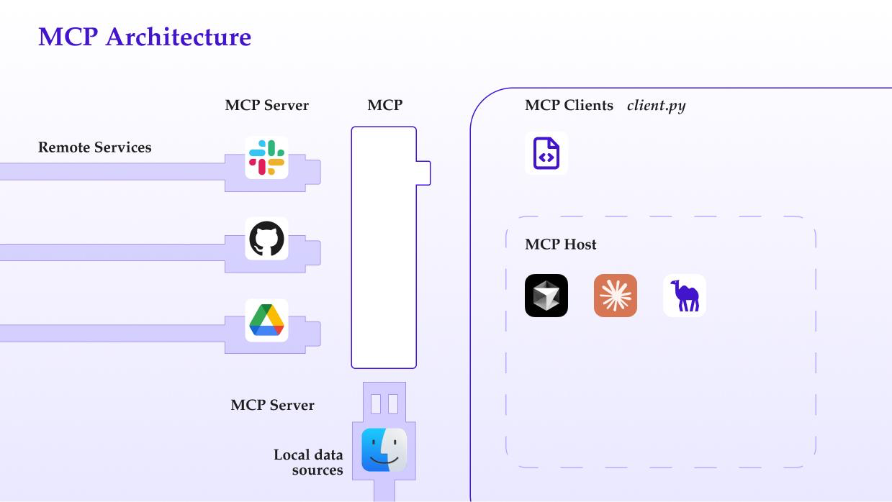
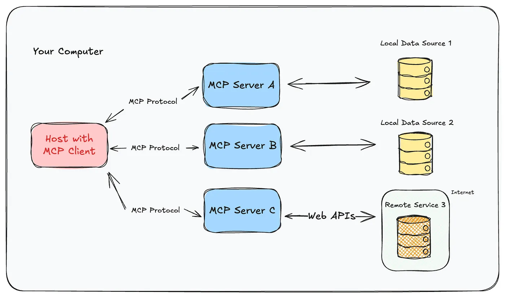
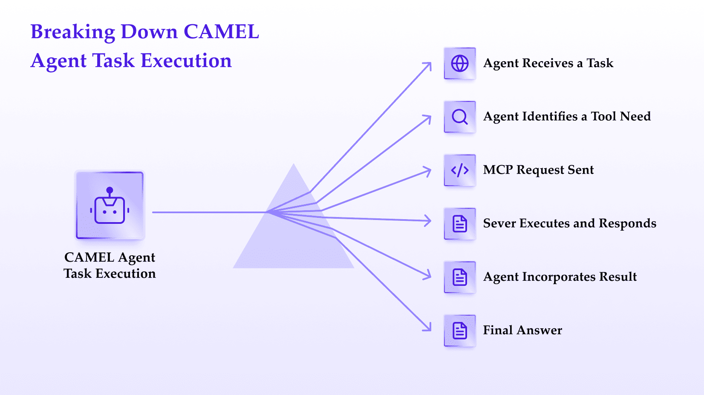
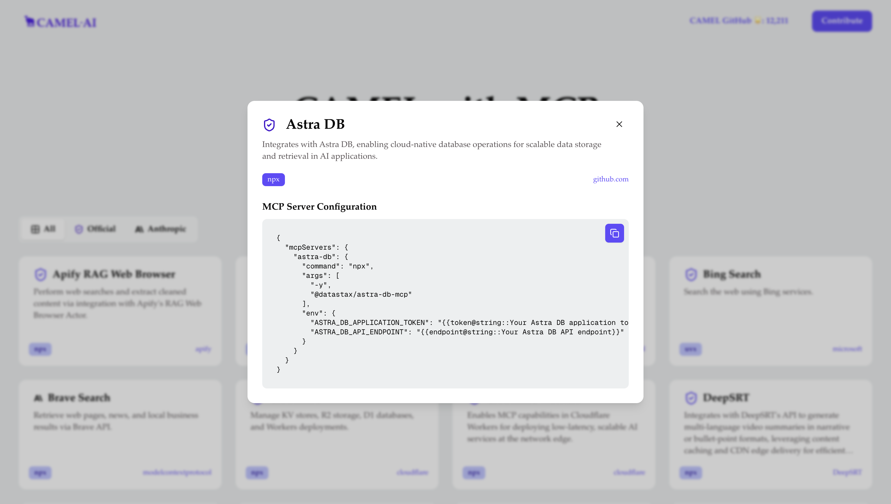
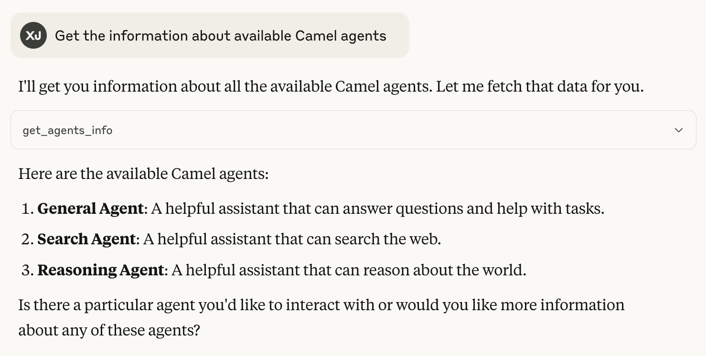
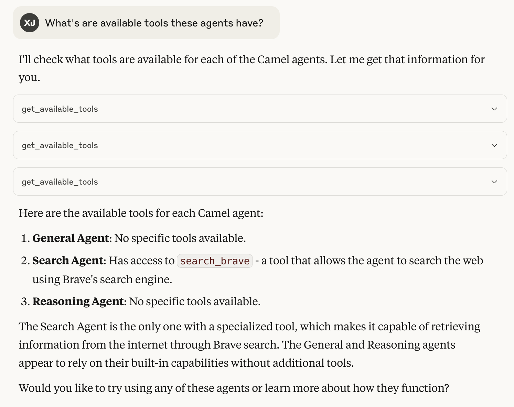
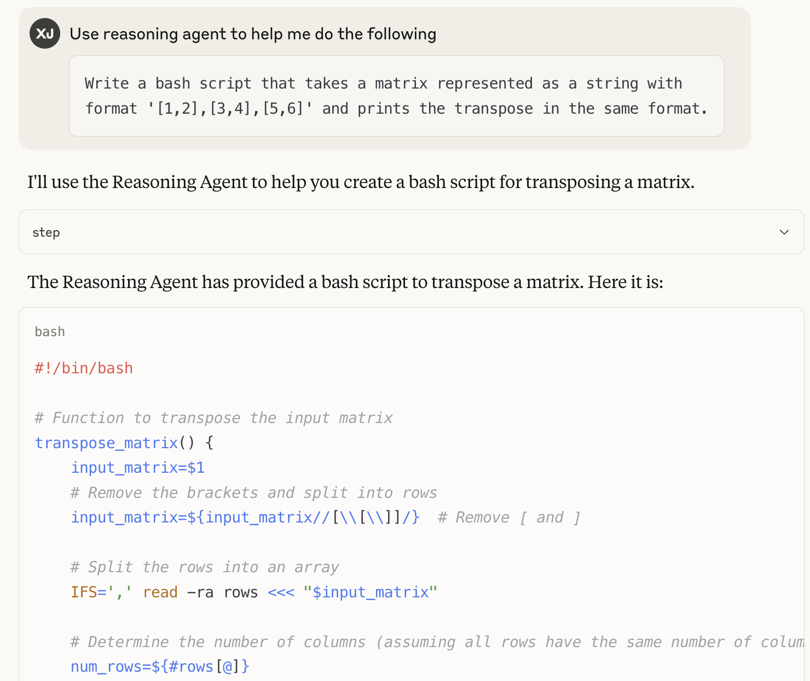

## Introduction

The world of AI agents are rapidly evolving, and one of the most exciting developments is the [Model Context Protocol (MCP)](https://modelcontextprotocol.io/introduction) Its a groundbreaking standard that promises to revolutionize how AI models interact with external tools and resources.

Today, We are excited to share how [CAMEL-AI](https://www.camel-ai.org/), our multi-agent framework, is embracing MCP to create more powerful, flexible, and interoperable AI systems.

## What is MCP and Why Does It Matter?

The Model Context Protocol (MCP) is a standardized way for AI models to communicate with external tools and resources using JSON-RPC 2.0. But to understand why MCP is so important, let's first look at the history of function calling in AI agent systems.

### The Evolution of Function Calling

**Pre-2023**: In the early days, LLMs had no native ability to use external tools. Developers had to rely on creative prompt engineering and parse unstructured model outputs to create any semblance of tool use. Frameworks like LangChain and CAMEL-AI provided some structure, but the process was error-prone and inconsistent.

**June 2023**: OpenAI made a significant leap forward by introducing native function calling in GPT-4 and GPT-3.5-turbo. This feature used structured JSON outputs to call tools and pass arguments, making tool integration more reliable and scalable.

**November 2024**: Anthropic proposed the Model Context Protocol (MCP), formalizing tool interaction using JSON-RPC 2.0 and standardizing how AI systems communicate with external tools and resources.

**2025**: MCP gained industry-wide adoption, with major players like OpenAI and DeepMind implementing the standard. Function calling became a core capability for advanced agentic AI systems.

### Why Standardization Matters

MCP solves a critical problem in the AI agents ecosystem - the lack of standardization in how models interact with external tools. Before MCP, developers had to create custom integrations for each model and tool combination, leading to fragmentation and unnecessary complexity.

With (MCP) Model Context Protocol, we have a universal language that enables any MCP-compatible model to seamlessly interact with any MCP-compatible tool. This dramatically reduces development overhead and enables greater innovation in the AI ecosystem.



MCP Architecture

## How Does MCP Work?

The (MCP) Model Context Protocol ecosystem consists of three main components:

1. **MCP Hosts**: These are the deployment environments for AI systems, such as Claude Desktop App or CAMEL-AI agents. Hosts provide the runtime environment for AI models to execute.
2. **MCP Clients**: These internal protocol engines handle sending and receiving JSON-RPC messages between the model and external tools.
3. **MCP Servers**: These programs receive incoming messages from clients, process them, and return structured responses. They encapsulate the actual functionality of external tools.

The beauty of this architecture is its simplicity and flexibility. Any tool can be wrapped as an MCP server, making it instantly accessible to any MCP-compatible AI agents system.



A single MCP client can orchestrate multiple mcp servers against any data source.

## CAMEL-AI’s Integration of MCP

### Basic Tool Integration in CAMEL-AI

Even before MCP, CAMEL-AI had robust support for tool integration. Here's a simple example of how we can integrate a custom function as a tool:

```
from camel.toolkits import FunctionTool

def my_weird_add(a: int, b: int) -> int:
    """Adds two numbers and includes a constant offset.
    Args:
        a (int): The first number to be added.
        b (int): The second number to be added.
    Returns:
        integer: The sum of the two numbers plus 7.
    """
    return a + b + 7

agent = ChatAgent(
    tools=[FunctionTool(my_weird_add)]
)

response = agent.step("What is 15+15")
print(response.msgs[0].content)

'''
15 + 15 is 30. However, using a specific calculation with an added constant offset, the result is 37.
'''
```

‍

But with MCP, we can take this to the next level.

### Camel Agent as MCP Client

Integrating (MCP) Model Context Protocol tools into CAMEL-AI is straightforward. Here's how you can use a Time MCP server with a CAMEL-AI agent:

First, set up your MCP server configuration:

```
{
  "mcpServers": {
    "time": {
      "command": "uvx",
      "args": ["mcp-server-time", "--local-timezone=Asia/Riyadh"]
    }
  }
}
```

‍

Then, use the MCPToolkit to connect to your server and make its tools available to your agent:

```
import asyncio
from camel.toolkits.mcp_toolkit import MCPToolkit, MCPClient

async def run_time_example():
    # Initialize the MCPToolkit with your configuration file
    mcp_toolkit = MCPToolkit(config_path="config/time.json")
    # Connect to all configured MCP servers
    await mcp_toolkit.connect()
    camel_agent = ChatAgent(
        model=model,
        tools=[*mcp_toolkit.get_tools()],
    )
    response = await camel_agent.astep("What time is it now?")
    print(response.msgs[0].content)
    print(response.info['tool_calls'])
    # Disconnect from all servers
    await mcp_toolkit.disconnect()
await run_time_example()

'''
The current local time in Riyadh is 15:57 (3:57 PM).

[ToolCallingRecord(tool_name='get_current_time', args={'timezone': 'Asia/Riyadh'}, result='{\n "timezone": "Asia/Riyadh",\n "datetime": "2025-05-01T15:57:59+03:00",\n "is_dst": false\n}', tool_call_id='toolu_01Gwdy3Ppzf2z42t6YL7n7cE')]
'''
```

‍

## **How Does It All Come Together?**

These agents are built on large language models (LLMs) and can reason about problems, talk to each other, and now, thanks to MCP, **use external tools** to augment their capabilities. Integrating MCP into CAMEL’s agents turns them into tool-empowered assistants with dynamic context management..

In practice, here’s how a CAMEL-AI agent utilizes MCP step by step:



CAMEL-AI agent task execution flow: from receiving a task to invoking Model Context Protocol and integrating results into a final answer

1. **Agent Receives a Task:** Suppose you ask a CAMEL agent a question like, _“Find the sentiment of the latest tweet from a given user”_. The agent recognizes that it may need to fetch external data (the tweet text) to answer this.
2. **Agent Identifies a Tool Need:** Based on its prompt and programming, the agent decides it should use a web **fetch tool** to retrieve the tweet. (CAMEL agents have knowledge of available tools through their MCP client interface.)
3. **MCP Request Sent:** The agent’s MCP client layer formulates a request to the appropriate MCP server (in this case, a _Fetch_ server) – for example, “fetch the content at https://twitter.com/… URL.” This request is sent out over the MCP channel in a structured format.
4. **Server Executes and Responds:** The MCP Fetch server receives the request, carries out the action (e.g., performing an HTTP GET or web scrape), and returns the result (the tweet text, in this case) back to the agent over MCP.
5. **Agent Incorporates Result:** The CAMEL agent gets the fetched data and now continues its reasoning. Perhaps it then decides to use a **sentiment analysis tool** (if one is available via MCP) or just uses its own LLM capabilities to analyze the text. The key is that the agent’s context now _includes that external data_ it fetched.
6. **Final Answer:** With the external info in hand, the agent formulates the final answer and responds to the user.

We have some of the community use cases for CAMEL Agent as MCP client integrations:

**CAMEL-AI agents with Airbnb MCP server**

[
Your browser does not support the video tag.
](https://camel-ai.github.io/camel_asset/videos/airbnb_mcp.mp4)

**CAMEL-AI agents with Gitingest MCP Server**

[
Your browser does not support the video tag.
](https://camel-ai.github.io/camel_asset/videos/github_repo.mp4)

‍

## CAMEL-AI Agents as MCP Servers

Perhaps most excitingly, we're making it possible to expose [CAMEL-AI agents themselves as MCP servers](https://github.com/camel-ai/camel/blob/master/services/agent_config.py). This means you can create specialized agents for different tasks and make them available to any MCP-compatible model:

```
# Create a default chat agent
chat_agent = ChatAgent()
chat_agent_description = "A general-purpose assistant that can answer questions and help with various tasks."

# Create a reasoning agent
reasoning_agent = ChatAgent(
    model=ModelFactory.create(
        model_platform=ModelPlatformType.OPENAI,
        model_type="gpt-4o-mini",
    )
)
reasoning_agent_description = "A specialized assistant focused on logical reasoning and problem-solving."

# Create a search agent
search_agent = ChatAgent(
    model=ModelFactory.create(
        model_platform=ModelPlatformType.OPENAI,
        model_type="gpt-4o",
    ),
    tools=[FunctionTool(SearchToolkit().search_brave)],
)
search_agent_description = "A research assistant capable of retrieving information from the web."

# Define your agent dictionary
agents_dict = {
    "general": chat_agent,
    "search": search_agent,
    "reasoning": reasoning_agent,
}

# Add descriptions
description_dict = {
    "general": chat_agent_description,
    "search": search_agent_description,
    "reasoning": reasoning_agent_description,
}
```

‍

These agents can then be exposed as MCP servers, allowing other systems to leverage their specialized capabilities.

### Integrating with Claude Desktop

[
Your browser does not support the video tag.
](https://camel-ai.github.io/camel_asset/videos/camel_agent_as_a_mcp_server.mp4)

You can also use Claude Desktop to interact with your CAMEL-AI agents by providing the proper configuration:

```
"camel-chat-agent": {
  "command": "/path/to/python",
  "args": [
    "/path/to/camel/services/agent_mcp_server.py"
  ],
  "env": {
    "OPENAI_API_KEY": "...",
    "OPENROUTER_API_KEY": "...",
    "BRAVE_API_KEY": "..."
  }
}
```

‍

This configuration allows Claude to seamlessly interact with your CAMEL-AI agents, creating a powerful hybrid system for AI agents that combines the strengths of both platforms.

After configuration, we can talk to CAMEL-AI agents in Claude desktop, attached are some screenshots in Claude. As we can see, it successfully connects to CAMEL-AI agents, and execute tasks using one of the agent.

## How to turn your tool as MCP server in CAMEL

[
Your browser does not support the video tag.
](https://camel-ai.github.io/camel_asset/videos/tool_as_MCP_server_in_CAMEL.mp4)

One of the most exciting features of our (MCP) Model Context Protocol integration is the ability to turn any [CAMEL-AI toolkit into an MCP server](https://docs.camel-ai.org/key_modules/tools.html#creating-an-mcp-server-from-a-toolkit). This means that any tool you build in CAMEL-AI can be easily shared with the broader AI agents ecosystem.

Here's how you can turn the ArxivToolkit into an MCP server:

```
# arxiv_toolkit_server.py
import argparse
import sys
from camel.toolkits import ArxivToolkit

if __name__ == "__main__":
    parser = argparse.ArgumentParser(
        description="Run Arxiv Toolkit in MCP server mode.",
        usage=f"python {sys.argv[0]} [--mode MODE]",
    )
    parser.add_argument(
        "--mode",
        choices=["stdio", "sse"],
        default="stdio",
        help="MCP server mode (default: 'stdio')",
    )
    parser.add_argument(
        "--timeout",
        type=float,
        default=None,
        help="Timeout for the MCP server (default: None)",
    )
    args = parser.parse_args()
    toolkit = ArxivToolkit(timeout=args.timeout)
    # Run the toolkit as an MCP server
    toolkit.mcp.run(args.mode)
```

### OWL x MCP

[OWL](https://github.com/camel-ai/owl) is a cutting-edge framework for multi-agent collaboration that pushes the boundaries of task automation, built on top of the [CAMEL-AI Framework](https://github.com/camel-ai/camel). OWL enables the most powerful part in CAMEL-AI, such as

- **Role-Playing Agents:**
- OWL leverages role-play agents that deconstruct tasks and work collaboratively, ensuring robust automation.
- **Real-Time Decision-Making:**
- Using methods such as POMDP (Partially Observable Markov Decision Processes), OWL optimizes decisions dynamically.
- **Multi-Modal Tool Integration:**
- From web data scraping to code execution and document processing, OWL integrates various toolkits to empower agent collaboration.

Not only CAMEL-AI agents can connect to the MCP servers, but also the OWL agents! We have already some of the community use cases for OWL x MCP integrations:

- WhatsAPP MCP use case: <https://github.com/camel-ai/owl/tree/main/community_usecase/Whatsapp-MCP>
- Notion MCP use case: <https://github.com/camel-ai/owl/tree/main/community_usecase/Notion-MCP>
- QWEN3 MCP use case: <https://github.com/camel-ai/owl/tree/main/community_usecase/qwen3_mcp>

‍

## The Growing MCP Ecosystem

The MCP ecosystem has grown to include several key platforms (registries and hubs) that provide access to a wide range of MCP servers .

Each of these platforms offers numerous tools that can be easily integrated with any MCP-compatible AI model . Notably, the CAMEL agent framework integrates directly with **ACI.dev** and **Smithery**, allowing CAMEL agents to seamlessly use tools from those platforms. Below are some of the major MCP platforms and registries:

- [**ACI.dev**](https://www.aci.dev/) – _ACI.dev_ is an open-source platform focusing on advanced context management for MCP servers, offering tools to handle large datasets, real-time data streams, and hybrid cloud environments. It bridges the gap between AI reasoning and enterprise-grade infrastructure . Camel’s agent framework integrates with ACI.dev, enabling CAMEL agents to directly leverage its extensive library of tools in their workflows.
- [**KlavisAI**](https://www.klavis.ai/) – _KlavisAI_ offers a curated marketplace of MCP servers—everything from web-data extractors (YouTube, GitHub) to domain-specific AI pipelines. With built-in OAuth flows and monitoring dashboards, KlavisAI makes it easy to deploy and scale MCP servers. CAMEL agents can register and call KlavisAI tools out of the box.
- [**PulseMCP**](https://www.pulsemcp.com/) – _PulseMCP_ is a community-driven directory showcasing over 4,000 MCP servers, complete with search, trending tags, and categorization. It streamlines discovery and adoption of new tools. [CAMEL’s framework can query PulseMCP](https://github.com/camel-ai/camel/blob/master/examples/toolkits/mcp/mcp_search_toolkit.py) for available servers and seamlessly integrate any listed tool into agent workflows.
- [**Smithery**](https://smithery.ai/) – _Smithery_ serves as a centralized registry for MCP servers, offering many pre-built tools for common tasks like web scraping, database access, and code execution. Smithery simplifies discovery and deployment, making it ideal for developers seeking plug-and-play solutions . Camel’s framework also supports Smithery as a native MCP registry, so CAMEL agents can easily discover and use Smithery-hosted tools.
- [**Composio**](https://composio.dev/) – _Composio_ is an AI orchestration platform that integrates MCP servers into complex workflows. Composio excels at connecting LLMs to enterprise systems (e.g. CRM or ERP software) via standardized MCP interfaces, enabling scalable automation .
- [**mcp.run**](https://mcp.run/) – _mcp.run_ provides a lightweight hub for testing and deploying MCP servers. Designed for rapid prototyping, it offers templates and sandboxed environments to experiment with tools like file system access or API integrations .
- [**ModelScope**](https://www.modelscope.cn/mcp) – _ModelScope_ (by Alibaba Cloud) is a Chinese-focused MCP platform under Alibaba’s ModelScope initiative. It hosts a large collection of region-specific MCP services (for example, multilingual NLP models and local data services) and fosters collaboration in the Asia-Pacific AI developer community .
- [**Awesome MCP Servers**](https://github.com/punkpeye/awesome-mcp-servers) – _Awesome MCP Servers_ is a community-curated GitHub repository listing open-source MCP servers. Ranging from niche tools (e.g. IoT device controllers) to experimental integrations, this list is an invaluable resource for developers looking for inspiration or reusable MCP server code .

‍

Each of these platforms offers a variety of tools that can be easily integrated with any MCP-compatible model.

‍

## Discovering MCP Servers

### **MCP Hub: Discover & Integrate Tools for CAMEL Agents**

The **MCP Hub** ([mcp.camel-ai.org](https://mcp.camel-ai.org/) ) is the official directory of Model Collaboration Protocol (MCP)-compliant servers, designed to empower CAMEL agents with specialized capabilities. Browse, filter, and deploy tools directly into your workflows without manual configuration.

### **Key Features:**

1. **Interactive Tool Catalog**


Explore pre-built MCP servers categorized by use case (e.g., databases, web search, cloud services).

Filter by **Official** (CAMEL-maintained) or third-party tools (e.g., Anthropic, Microsoft).

**2. One-Click Configuration** :

Click any tool to reveal its **JSON configuration snippet** , ready to copy into your **mcp_config.json**



We've also developed tools to help you discover existing MCP servers. Our MCPSearchToolkit makes it easy to find the right tool for your needs:

```
search_toolkit = PulseMCPSearchToolkit()
search_toolkit.search_mcp_servers(
    query="Slack",
    package_registry="npm",  # Only search for servers registered in npm
    top_k=1,
)

'''
{
  "name": "Slack",
  "url": "https://www.pulsemcp.com/servers/slack",
  "external_url": null,
  "short_description": "Send messages, manage channels, and access workspace history.",
  "source_code_url": "https://github.com/modelcontextprotocol/servers/tree/HEAD/src/slack",
  "github_stars": 41847,
  "package_registry": "npm",
  "package_name": "@modelcontextprotocol/server-slack",
  "package_download_count": 188989,
  "EXPERIMENTAL_ai_generated_description": "This Slack MCP Server, developed by the Anthropic team, provides a robust interface for language models to interact with Slack workspaces. It enables AI agents to perform a wide range of Slack-specific tasks including listing channels, posting messages, replying to threads, adding reactions, retrieving channel history, and accessing user information. The implementation distinguishes itself by offering comprehensive Slack API integration, making it ideal for AI-driven workplace communication and automation. By leveraging Slack's Bot User OAuth Tokens, it ensures secure and authorized access to workspace data. This tool is particularly powerful for AI assistants designed to enhance team collaboration, automate routine communication tasks, and provide intelligent insights from Slack conversations."
}
'''
```

‍

This returns detailed information about available Slack MCP servers, including their capabilities, documentation, and usage statistics.

‍

### MCP Search Agents

To make MCP server discovery even easier, we've created [MCPAgent](https://github.com/camel-ai/camel/blob/master/examples/agents/mcp_agent/mcp_agent_using_registry.py), which can dynamically search for and integrate MCP servers based on your queries, here we use Smithery MCP registry:

```
from camel.agents import MCPAgent, MCPRegistryConfig, MCPRegistryType
smithery_config = MCPRegistryConfig(
  type=MCPRegistryType.SMITHERY,
  api_key=os.getenv("SMITHERY_API_KEY")
)

# Create MCPAgent with registry configurations
agent = MCPAgent(
  model=model,
  registry_configs=[smithery_config]
)

async with agent:
    response = await agent.astep("Use Brave API to search info about CAMEL-AI.org")
    print(response.msgs[0].content)

"""
Response from Use Brave MCP search tools to search info about CAMEL-AI.org.:
 # CAMEL-AI.org: Information and Purpose
 Based on my search results, here's what I found about CAMEL-AI.org:
 ## Organization Overview
 CAMEL-AI.org is the first LLM (Large Language Model) multi-agent framework and
 an open-source community. The name CAMEL stands for "Communicative Agents for
 Mind Exploration of Large Language Model Society."
 ## Core Purpose
 The organization is dedicated to "Finding the Scaling Law of Agents" - this
 appears to be their primary research mission, focusing on understanding how
 agent-based AI systems scale and develop.
 ## Research Focus
 CAMEL-AI is a research-driven organization that explores:
 - Scalable techniques for autonomous cooperation among communicative agents
 - Multi-agent frameworks for AI systems
 - Data generation for AI training
 - AI society simulations
 ## Community and Collaboration
 - They maintain an active open-source community
 - They invite contributors and collaborators through platforms like Slack and
 Discord
 - The organization has a research collaboration questionnaire for those
 interested in building or researching environments for LLM-based agents
 ## Technical Resources
 - Their code is available on GitHub (github.com/camel-ai) with 18 repositories
 - They provide documentation for developers and researchers at
 docs.camel-ai.org
 - They offer tools and cookbooks for working with their agent framework
 ## Website and Online Presence
 - Main website: https://www.camel-ai.org/
 - GitHub: https://github.com/camel-ai
 - Documentation: https://docs.camel-ai.org/
 The organization appears to be at the forefront of research on multi-agent AI
 systems, focusing on how these systems can cooperate autonomously and scale
 effectively.
 """
```

‍

This agent can search for relevant MCP servers, explain their capabilities, and even execute queries using them. For example, asking about Gmail tools would return information about various Google Workspace servers, while a query about CAMEL-AI would search the web and return comprehensive information about our organization.







## Future Developments

We're continuously working to enhance our MCP integration. Here are some of the developments we're excited about:

- **MCP Search Agents**: We're expanding our integration to more MCP registries, e.g., Composio, to give you access to a wider range of tools.
- **MCP Hub**: We're building our own repository of validated MCP servers to ensure high-quality, reliable tools for our community.
- **Role-Playing/Workforce as MCP Servers**: We're transforming CAMEL-AI's multi-agent module into MCP servers, allowing for more complex agent interactions and workflows.

## Conclusion

MCP represents a significant step forward in the evolution of AI systems. By standardizing how models interact with external tools, Model Context Protocol is making AI agents more powerful, flexible, and accessible than ever before.

At CAMEL-AI, we're fully embracing this standard and building powerful integrations that leverage the full potential of MCP. Whether you're using existing MCP servers, creating your own, or turning CAMEL-AI agents into (MCP) Model Context Protocol servers, our framework provides the tools you need to build cutting-edge AI agents ecosystems.

We invite you to join us on this journey and explore the exciting possibilities that MCP opens up for AI development.

## Connect with Camel-AI

- [CAMEL-AI](https://camel-ai.org/)
- [GitHub: camel-ai/camel](https://github.com/camel-ai/camel)
- [Documentation](https://docs.camel-ai.org/)
- [Discord Community](https://discord.gg/CNcNpquyDc)

## Resources

- [MCP Examples](https://github.com/camel-ai/camel/tree/master/examples/mcp)
- [Model Context Protocol](https://modelprotocol.org/)

‍
