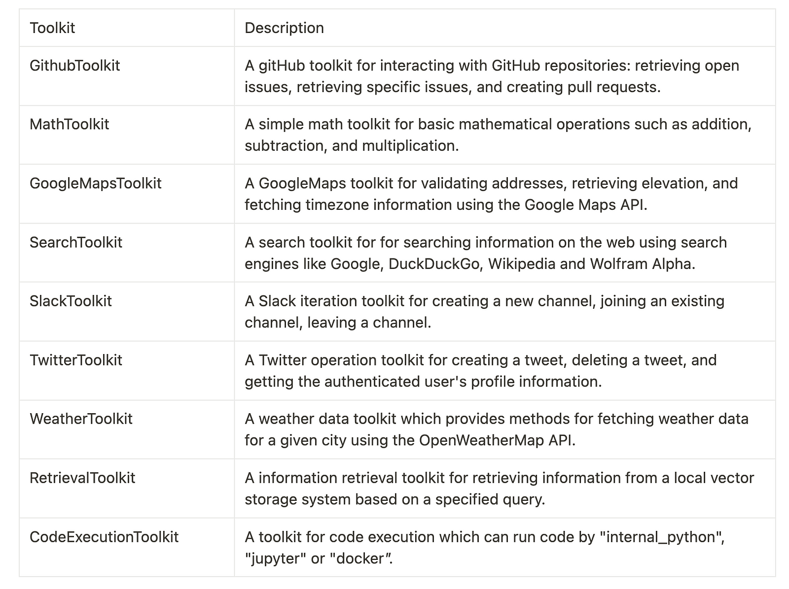

**TLDR:** CAMEL allows AI agents to extend their capabilities by integrating custom tools, similar to how humans use tools to surpass natural limits. This tutorial shows how to set up and customize tools within CAMEL, from basic functions like calculators to creating multi-agent systems that collaborate on tasks. You’ll learn to equip AI agents with the ability to use tools for various tasks, making them more powerful and versatile. Engage with the CAMEL-AI community and explore extensive resources to push the boundaries of AI development. Ready to enhance your AI agents? Dive into the tutorial and start building.

### ‍ **Table of Content:**

1. **Introduction**
2. **Tool Usage of a Single Agent (Customize Your Own Tools)**
3. **AI Society with Tool Usage**
4. **Toolkits supported by CAMEL**
5. **Conclusion**

### **Introduction**

The key difference between humans and animals lies in the human ability to create and use tools, allowing us to shape the world beyond natural limits. Similarly, in AI, Large Language Models (LLMs) enable agents to utilize external tools, acting as extensions of their capabilities. These tools, each with a specific name, purpose, input, and output, empower agents to perform tasks otherwise impossible.

**This tutorial will show you how to use tools integrated by CAMEL and how to customize your own tools. All the codes are also available on** [**colab notebook**](https://colab.research.google.com/drive/1-pvKDw_mh6NjyXg5rGYLoVle6RG8g32F?usp=sharing)**.**

### Tool Usage of a Single Agent

A single agent can utilize multiple tools to answer questions, take actions, or perform complex tasks forming the backbone of autonomous agent frameworks. Here you will build an agent using both the supported toolkit in CAMEL and the tool customized by you.

First we are going to take the _search_ tool (_SEARCH_FUNCS_ imported from _camel.toolkits_) as an example for utilizing existing tools but you can also see some of the other tools supported by CAMEL below.

```
pip install camel-ai[all]==0.1.6.4
```

```
from camel.agents import ChatAgent
from camel.configs import ChatGPTConfig
from camel.toolkits import (
    SEARCH_FUNCS,
    # MAP_FUNCS,
    # MATH_FUNCS,
    # TWITTER_FUNCS,
    # WEATHER_FUNCS,
    # RETRIEVAL_FUNCS,
    # TWITTER_FUNCS,
    # SLACK_FUNCS,
)
from camel.messages import BaseMessage
from camel.models import ModelFactory
from camel.types import ModelPlatformType, ModelType
```

‍

After importing necessary modules, you need to set up your OpenAI key.

```
import os
from getpass import getpass

# Prompt for the API key securely
openai_api_key = getpass('Enter your API key: ')
os.environ["OPENAI_API_KEY"] = openai_api_key
```

‍

**Now you have done that,** let’s customize a tool by taking the simple math calculator, functions **_add_** and **_sub_**, as an example. When you define your own function, make sure the argument name and docstring are clear so that the agent can understand what this function can do and when to use the function based on the function information you provide.

```
def add(a: int, b: int) -> int:
    r"""Adds two numbers.

    Args:
        a (int): The first number to be added.
        b (int): The second number to be added.

    Returns:
        integer: The sum of the two numbers.
    """
    return a + b

def sub(a: int, b: int) -> int:
    r"""Do subtraction between two numbers.

    Args:
        a (int): The minuend in subtraction.
        b (int): The subtrahend in subtraction.

    Returns:
        integer: The result of subtracting :obj:`b` from :obj:`a`.
    """
    return a - b
```

‍

Add these 2 customized functions as CAMEL’s OpenAIFunction list:

```
from camel.toolkits import OpenAIFunction

MATH_FUNCS: list[OpenAIFunction] = [
    OpenAIFunction(func) for func in [add, sub]
]
```

‍

Then you can add the tool from CAMEL and the one defined by yourself to the tool list:

```
tool_list = [*SEARCH_FUNCS, *MATH_FUNCS]
```

‍

Next let's set the parameters to the agent and initianize _ChatAgent_ to call the tool:

```
# Set the backend mode, this model should support tool calling
model=ModelFactory.create(
    model_platform=ModelPlatformType.OPENAI,
    model_type=ModelType.GPT_3_5_TURBO,
    model_config_dict=ChatGPTConfig(
        tools=tool_list,
        temperature=0.0,
    ).as_dict(),
)

# Set message for the assistant
assistant_sys_msg = BaseMessage.make_assistant_message(
    role_name="Search Agent",
    content= """You are a helpful assistant to do search task."""
)

# Set the config parameter for the model
assistant_model_config = ChatGPTConfig(
    tools=tool_list,
    temperature=0.0,
)

# Set the agent
agent = ChatAgent(
    assistant_sys_msg,
    model=model,
    tools=tool_list
)
```

‍

Here we define two test prompts for the agent, asking about the facts about University of Oxford. Here the agent needs to take advantage of the searching capability to know when University of Oxford is founded and the calculating skills to obtain the estimated age of the Uni.

```
# Set prompt for the search task
prompt_search = ("""When was University of Oxford set up""")
# Set prompt for the calculation task
prompt_calculate = ("""Assume now is 2024 in the Gregorian calendar, University of Oxford was set up in 1096, estimate the current age of University of Oxford""")

# Convert the two prompt as message that can be accepted by the Agent
user_msg_search = BaseMessage.make_user_message(role_name="User", content=prompt_search)
user_msg_calculate = BaseMessage.make_user_message(role_name="User", content=prompt_calculate)

# Get response
assistant_response_search = agent.step(user_msg_search)
assistant_response_calculate = agent.step(user_msg_calculate)
```

‍

Let’s see the agent' performance for answering above questions. The agent should tell you correctly when University of Oxford was set up and its estimated age!

```
print(assistant_response_search.info['tool_calls'])
```

‍

```
print(assistant_response_calculate.info['tool_calls'])
```

### Toolkits supported by CAMEL

Now you've enabled a single agent to utilize tools, but you can surelytake this concept further. Let's establish a small AI Agent ecosystemscenarios where sub-agents collaborate across platforms, mimicking real-world **multi-agent systems** . This setup will consist of two agents: a user agent and an assistant agent. The assistant agent will be the one we've just configured with tool-using capabilities.

```
from camel.societies import RolePlaying
from camel.agents.chat_agent import FunctionCallingRecord
from camel.utils import print_text_animated
from colorama import Fore
```

‍

```
# Set a task
task_prompt=("Assume now is 2024 in the Gregorian calendar, "
        "estimate the current age of University of Oxford "
        "and then add 10 more years to this age.")

# Set role playing
role_play_session = RolePlaying(
    assistant_role_name="Searcher",
    user_role_name="Professor",
    assistant_agent_kwargs=dict(
        model=ModelFactory.create(
            model_platform=ModelPlatformType.OPENAI,
            model_type=ModelType.GPT_3_5_TURBO,
            model_config_dict=assistant_model_config.as_dict(),
        ),
        tools=tool_list,
    ),
    user_agent_kwargs=dict(
        model=ModelFactory.create(
            model_platform=ModelPlatformType.OPENAI,
            model_type=ModelType.GPT_3_5_TURBO,
            model_config_dict=ChatGPTConfig(temperature=0.0).as_dict(),
        ),
    ),
    task_prompt=task_prompt,
    with_task_specify=False,
)

# Set the limit for the chat turn
chat_turn_limit=10

print(
    Fore.GREEN
    + f"AI Assistant sys message:\n{role_play_session.assistant_sys_msg}\n"
)
print(
    Fore.BLUE + f"AI User sys message:\n{role_play_session.user_sys_msg}\n"
)

print(Fore.YELLOW + f"Original task prompt:\n{task_prompt}\n")
print(
    Fore.CYAN
    + "Specified task prompt:"
    + f"\n{role_play_session.specified_task_prompt}\n"
)
print(Fore.RED + f"Final task prompt:\n{role_play_session.task_prompt}\n")

n = 0
input_msg = role_play_session.init_chat()
while n < chat_turn_limit:
    n += 1
    assistant_response, user_response = role_play_session.step(input_msg)

    if assistant_response.terminated:
        print(
            Fore.GREEN
            + (
                "AI Assistant terminated. Reason: "
                f"{assistant_response.info['termination_reasons']}."
            )
        )
        break
    if user_response.terminated:
        print(
            Fore.GREEN
            + (
                "AI User terminated. "
                f"Reason: {user_response.info['termination_reasons']}."
            )
        )
        break

    # Print output from the user
    print_text_animated(
        Fore.BLUE + f"AI User:\n\n{user_response.msg.content}\n"
    )

    # Print output from the assistant, including any function
    # execution information
    print_text_animated(Fore.GREEN + "AI Assistant:")
    tool_calls: list[FunctionCallingRecord] = assistant_response.info[
        'tool_calls'
    ]
    for func_record in tool_calls:
        print_text_animated(f"{func_record}")
    print_text_animated(f"{assistant_response.msg.content}\n")

    if "CAMEL_TASK_DONE" in user_response.msg.content:
        break

    input_msg = assistant_response.msg
```

‍

Check the answer and feel free to set up your own agent with customzied tools!

### Toolkits Supported by CAMEL

Toolkits are collections of tools that are designed to be used together for specific tasks. You can utilize it simply:

```
from camel.toolkits import SlackToolkit

# Initialize a toolkit
toolkit = SlackToolkit()

# Get list of tools
tools = toolkit.get_tools()
```

‍

CAMEL-AI and [OWL( **autonomous agent framework)**](https://github.com/camel-ai/owl) now supports various toolkits as shown in the following table and keeps integrating new ones.



### **Conclusion**

We anticipate that the integration of custom tool usage within AI agents, as demonstrated through CAMEL, will continue to evolve and expand. This approach not only empowers agents to perform tasks beyond their native capabilities but also fosters collaboration in multi-agent systems and autonomous agent frameworks. By standardizing the interface for tool usage, CAMEL simplifies the process of customizing and deploying tools across various AI applications, saving time and enhancing versatility. To fully utilize these capabilities, ensure your CAMEL-AI setup is up to date. Dive into the tutorial and start building more powerful AI agents today!

### 🐫 Thanks from everyone at CAMEL-AI

Hello there, passionate AI enthusiasts! 🌟 We are 🐫 CAMEL-AI.org, a global coalition of students, researchers, and engineers dedicated to advancing the frontier of AI and fostering a harmonious relationship between agents and humans.

📘 Our Mission: To harness the potential of AI agents in crafting a brighter and more inclusive future for all. Every contribution we receive helps push the boundaries of what’s possible in the AI realm.

🙌 Join Us: If you believe in a world where AI and humanity coexist and thrive, then you’re in the right place. Your support can make a significant difference. Let’s build the AI society of tomorrow, together!

- Find all our updates on [X](https://twitter.com/CamelAIOrg).
- Make sure to star our [GitHub](https://github.com/camel-ai) repositories.
- Join our [Discord,](https://discord.gg/nCpraan3sS) [WeChat](https://ghli.org/camel/wechat.png) or [Slack,](https://join.slack.com/t/camel-ai/shared_invite/zt-2icssxnkj-YHwFVhoZHMYpIG~ZU86WVw) community.
- You can contact us by email: camel.ai.team@gmail.com
- Dive deeper and explore our projects on <https://www.camel-ai.org/>

‍
