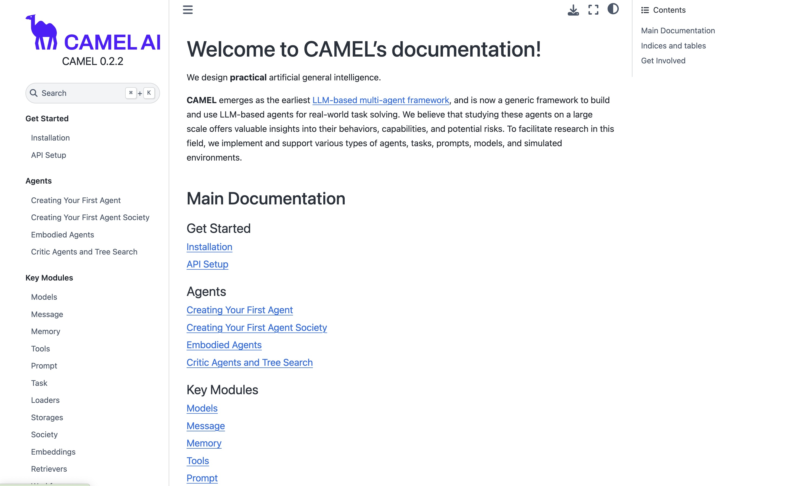
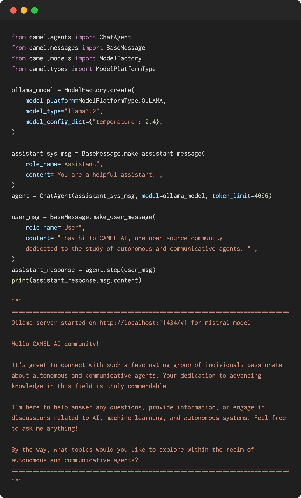
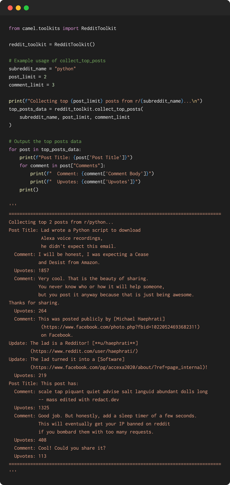
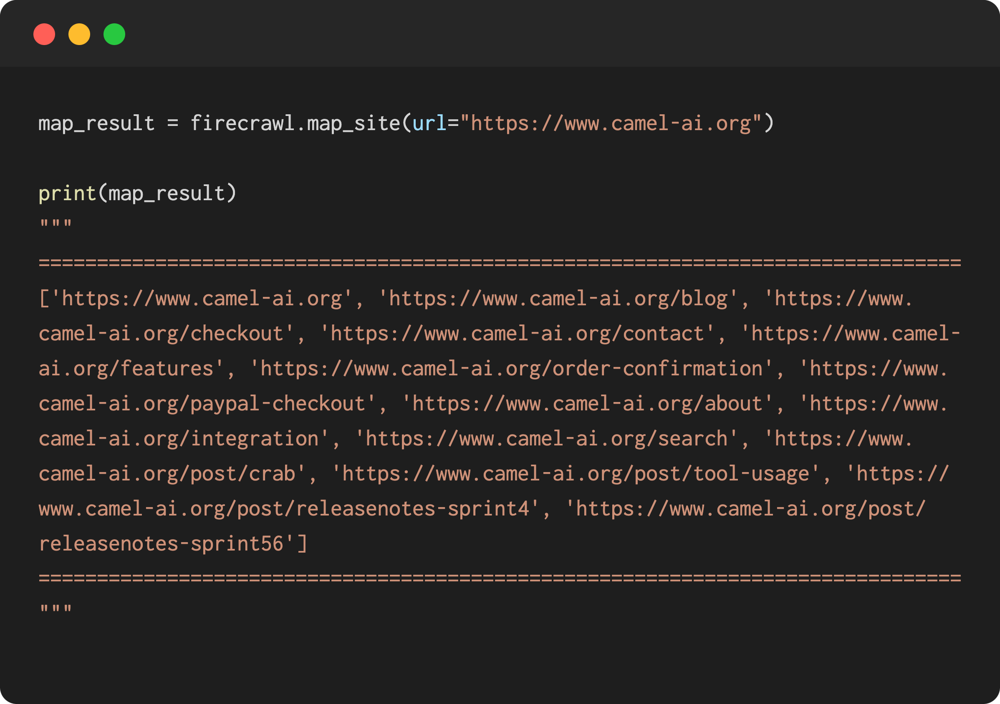
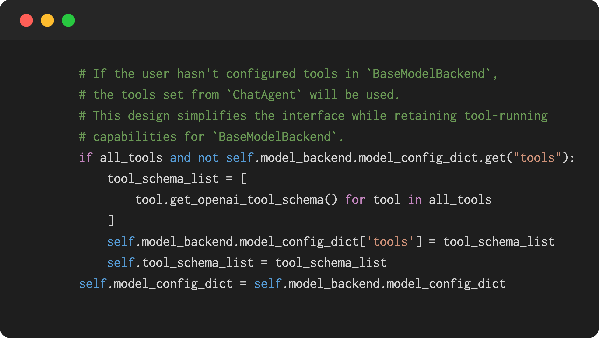
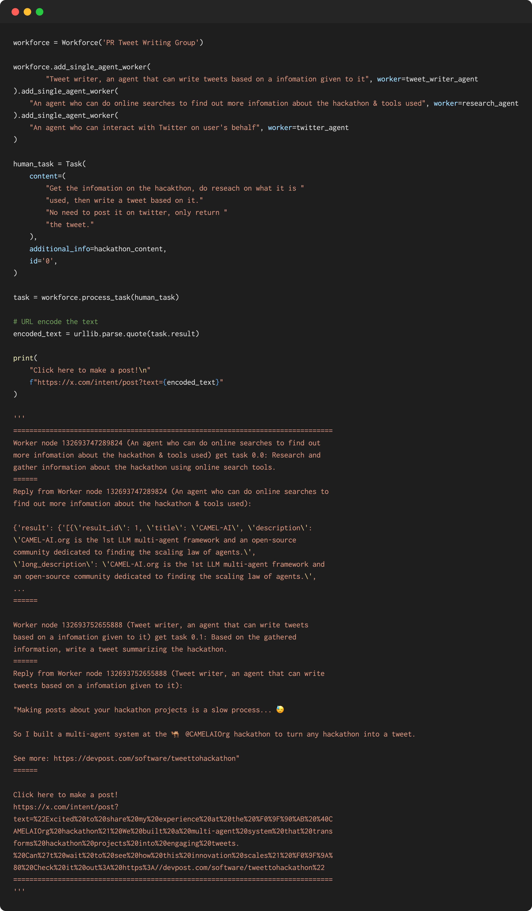

### 🗂️Docs updates

**- Updated CAMEL-AI website Docs:** The highlight of Sprint 11 is our update to the 🐫 CAMEL-AI website Docs. If you're interested in CAMEL, you can follow these guidelines on the website to set up your own project easily. Thanks to our founder [Guohao Li](https://github.com/lightaime) and other contributors for working on this. 🤝 Explore more [here](https://docs.camel-ai.org/).

### ✨Model updates

**- Added subprocess support for Ollama and vLLM models:** By integrating Ollama, users can now efficiently host LLMs locally, optimizing user experience, improving accessibility, and enhancing seamless integration with the CAMEL framework. Thanks to our contributor [Wendong-Fan](https://github.com/Wendong-Fan) for this enhancement. 🤝 Explore more [here](https://github.com/camel-ai/camel/pull/912).

### 🛠️Tool updates

**- Integrated the Reddit toolkit:** This integration empowers our agents to interact with the Reddit API, enabling them to collect top postsand track keyword discussions across multiple subreddits. Huge thanks to our contributor [Wendong-Fan](#) for this fantastic addition! Explore more [here](https://github.com/camel-ai/camel/pull/886).

‍

**- Integrated Firecrawl's map:** We empower developers with a robust tool to efficiently map websites and extract data. This integration gets sub links from the provided link. A big thanks to our contributor [Wendong-Fan](https://github.com/Wendong-Fan) for their hard work. Explore more [here](https://github.com/camel-ai/camel/pull/881).

‍

**- Simplified tool settings**: This update streamlines the configuration process, making it more intuitive and efficient for users to set up all tools like MathToolkit, OpenAIFunction, DalleToolkit, and others. Thanks to our contributor Wendong-Fan for this enhancement. 🤝 Explore more [here](https://github.com/camel-ai/camel/pull/891).

### 🤖️Agent updates

**- Enhanced our workforce module to make it more stable:** This update enhances task handling, agent functionalities, and overall stability, providing a more robust experience for users. Thanks to our contributor [WHALEEYE](https://github.com/WHALEEYE) for this significant improvement. 🤝 Explore more [here](https://github.com/camel-ai/camel/pull/877).

‍

### 🐫 Thanks from everyone at CAMEL-AI

Hello there, passionate AI enthusiasts! 🌟 We are 🐫 CAMEL-AI.org, a global coalition of students, researchers, and engineers dedicated to advancing the frontier of AI and fostering a harmonious relationship between agents and humans.

📘 Our Mission: To harness the potential of AI agents in crafting a brighter and more inclusive future for all. Every contribution we receive helps push the boundaries of what’s possible in the AI realm.

🙌 Join Us: If you believe in a world where AI and humanity coexist and thrive, then you’re in the right place. Your support can make a significant difference. Let’s build the AI society of tomorrow, together!

- Find all our updates on [X](https://twitter.com/CamelAIOrg).
- Make sure to star our [GitHub](https://github.com/camel-ai) repositories.
- Join our [Discord,](https://discord.gg/nCpraan3sS) [WeChat](https://ghli.org/camel/wechat.png) or [Slack,](https://join.slack.com/t/camel-ai/shared_invite/zt-2icssxnkj-YHwFVhoZHMYpIG~ZU86WVw) community.
- You can contact us by email: camel.ai.team@gmail.com
- Dive deeper and explore our projects on <https://www.camel-ai.org/>
