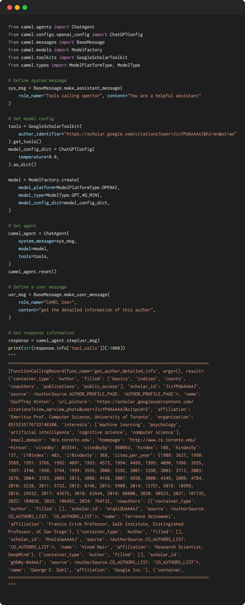
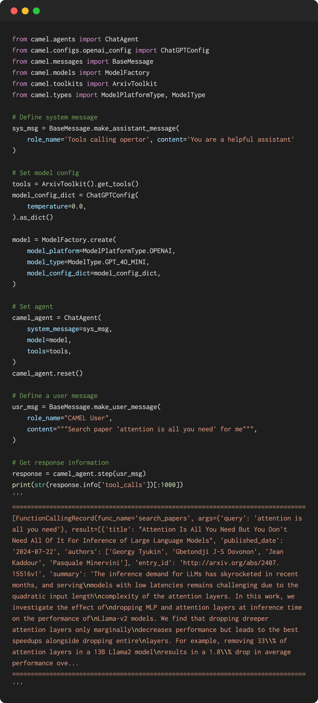
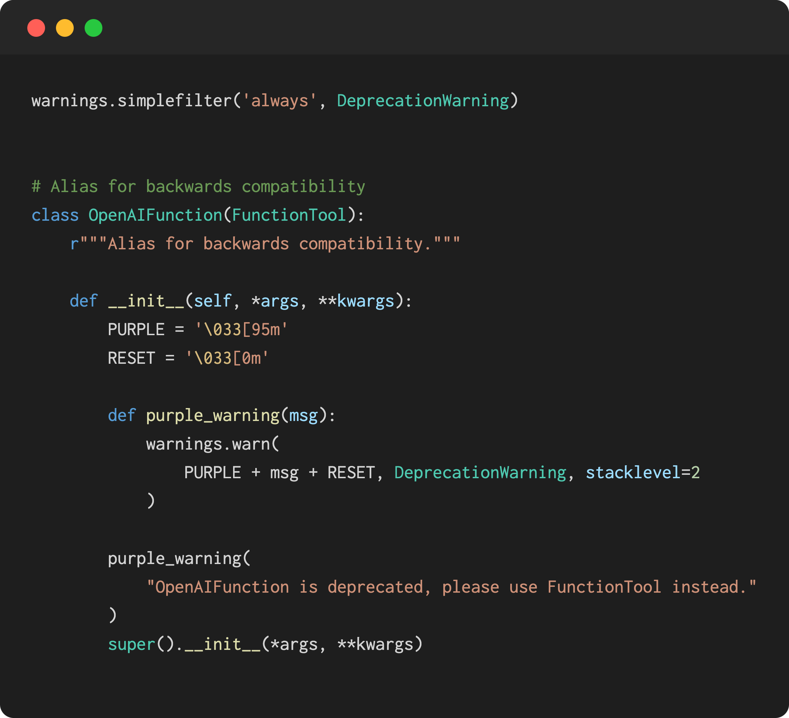
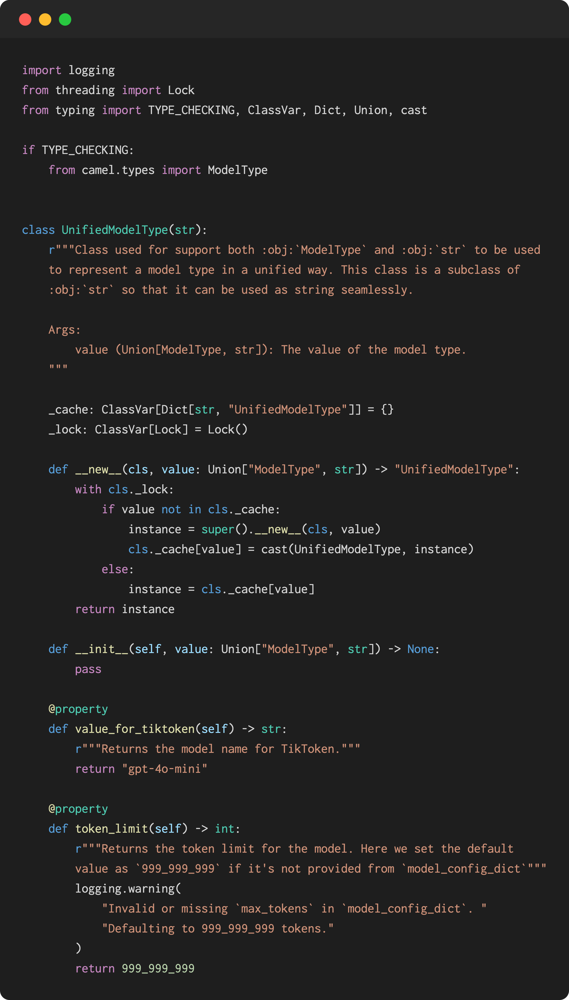
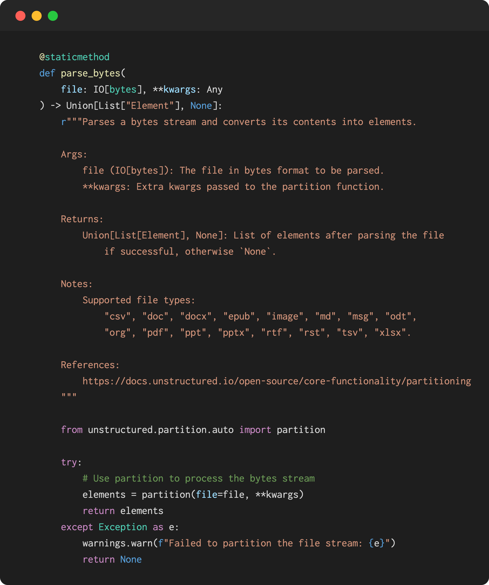

### 🛠️Tool updates

**- Integrated the Google Scholar Toolkit:** This toolkit enhances research capabilities by allowing users to get author information, retrieve publication details, and access paper content directly from Google Scholar. Thanks to our contributor [Wendong-Fan](https://github.com/Wendong-Fan) for this implementation. 🤝 Explore more [here](https://github.com/camel-ai/camel/pull/997).

‍

**- Added the arxiv toolkit:** This toolkit enhances our capabilities in managing and analyzing academic papers and research data from arXiv, making it easier for users to access and utilize valuable scientific information. Thanks to our contributor [Wendong-Fan](https://github.com/Wendong-Fan) for this implementation. 🤝 Explore more [here](https://github.com/camel-ai/camel/pull/994‍).

‍

**- Refactored the OpenAIFunction to FunctionTool:** This transition enhances the function calling mechanism, which improves the overall architecture of our toolkit. Thanks to our contributor [Tom-Doerr](https://github.com/tom-doerr) for this significant update. 🤝 Explore more [here](https://github.com/camel-ai/camel/pull/966).

‍

### ✨Model updates

**- Refactored the `ModelType`:** This enhancement integrates various AI models and backend roles, improving the flexibility and functionality of our codebase. With support for both `ModelType` and `str` as input, we're set to elevate our capabilities. Thanks to our contributor Isaac for this significant update. 🤝 Explore more [here](https://github.com/camel-ai/camel/pull/998).

‍

### 💡 Other **updates**:

**- Added support for handling bytes in vector retrieval:** This enhancement allows the processing of binary file objects, broadening the types of content that can be handled, thanks to the new `parse\_bytes` method. A big thank you to our contributor [Shengsong](https://github.com/Asher-hss) for this improvement! 🤝 Explore more [here](https://github.com/camel-ai/camel/pull/1003).

### 🐫 Thanks from everyone at CAMEL-AI

Hello there, passionate AI enthusiasts! 🌟 We are 🐫 CAMEL-AI.org, a global coalition of students, researchers, and engineers dedicated to advancing the frontier of AI and fostering a harmonious relationship between agents and humans.

📘 Our Mission: To harness the potential of AI agents in crafting a brighter and more inclusive future for all. Every contribution we receive helps push the boundaries of what’s possible in the AI realm.

🙌 Join Us: If you believe in a world where AI and humanity coexist and thrive, then you’re in the right place. Your support can make a significant difference. Let’s build the AI society of tomorrow, together!

- Find all our updates on [X](https://twitter.com/CamelAIOrg).
- Make sure to star our [GitHub](https://github.com/camel-ai) repositories.
- Join our [Discord,](https://discord.gg/nCpraan3sS) [WeChat](https://ghli.org/camel/wechat.png) or [Slack,](https://join.slack.com/t/camel-ai/shared_invite/zt-2icssxnkj-YHwFVhoZHMYpIG~ZU86WVw) community.
- You can contact us by email: camel.ai.team@gmail.com
- Dive deeper and explore our projects on <https://www.camel-ai.org/>‍
