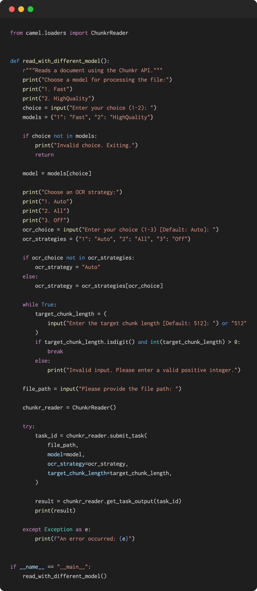
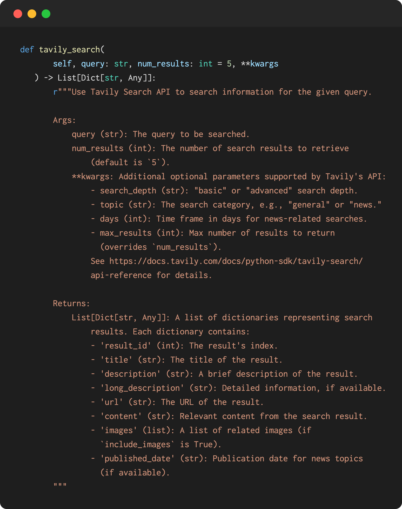
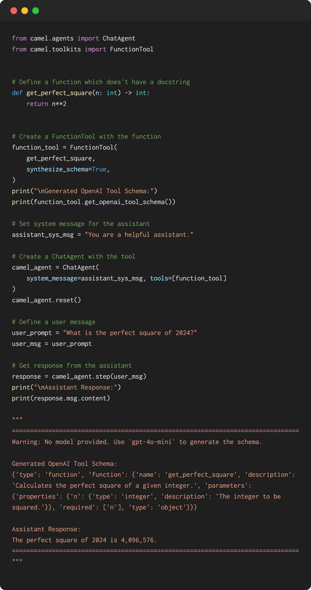
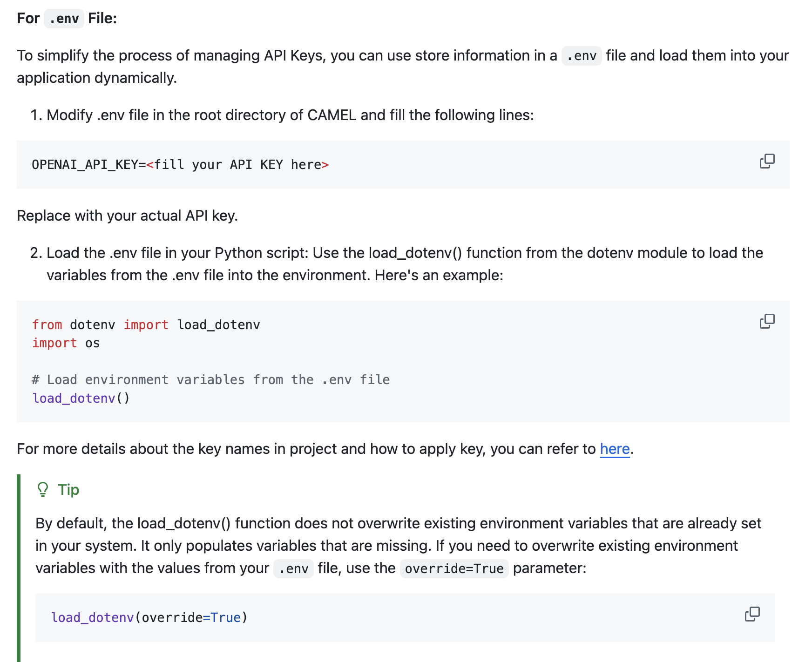
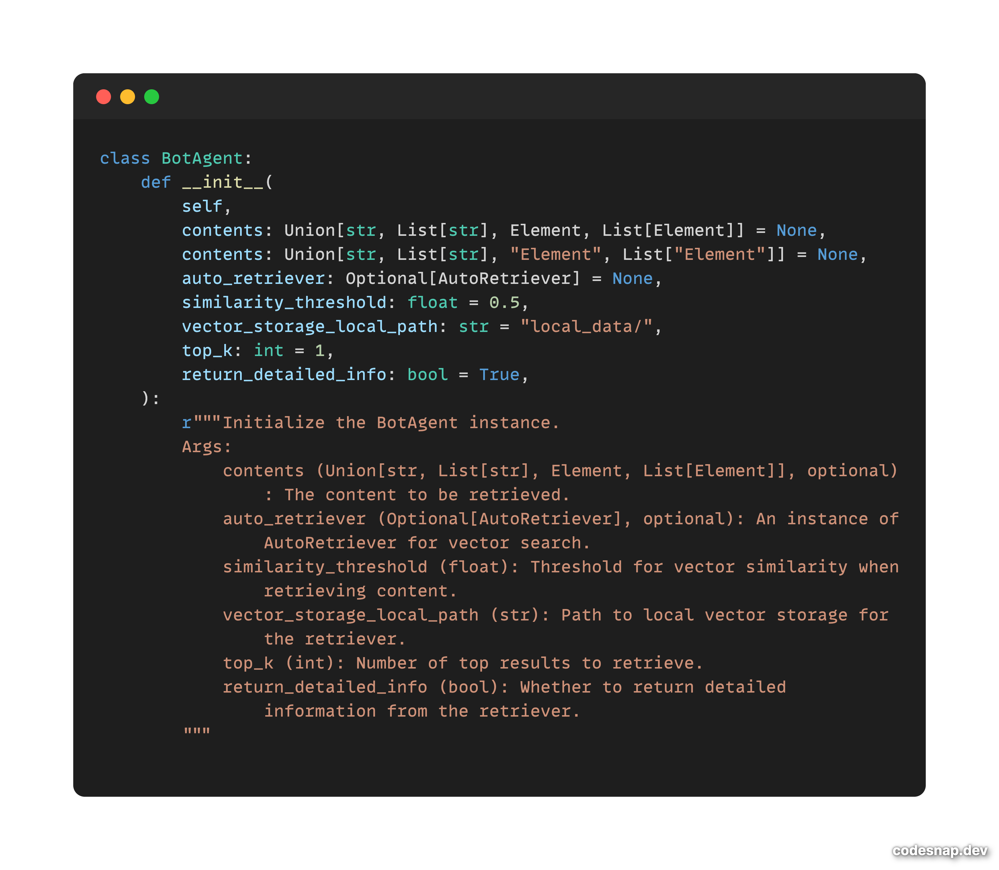

### 🛠️ Tool updates

**- Integrated Chunkr:** Chunkr is a powerful tool for processing and converting various document formats, including PDFs, PPTX, DOCX, and Excel files, into data optimized for RAG and LLMs in self-hosted environments. It enables seamless integration by allowing users to submit Chunkr tasks and retrieve task responses efficiently, streamlining the document processing workflow. Thanks to our contributor [yaoxie220](https://github.com/yaoxie220) for this implementation. 🤝 Explore more [here](https://github.com/camel-ai/camel/pull/1103).

‍

**- Integrated the Tavily search functionality**: This new feature introduces the search feature powered by Tavily API. It addresses the need for efficient search capabilities. This feature enhances the user experience by enabling faster, more relevant search results. Thanks to our contributor [Daniel](https://github.com/dxmaptin) for this implementation. 🤝 Explore more [here](https://github.com/camel-ai/camel/pull/1039).

‍

**- Added a new feature that allows for generating OpenAI tool schemas:** This enhancement to the `FunctionTool` class introduces the `generate\_docstring` method, which utilizes an optional assistant model (defaulting to GPT_4O_MINI) for schema generation. It includes robust schema validation and a retry mechanism to ensure reliability. Thanks to our contributor [Zhangzeyu97](https://github.com/Zhangzeyu97) for this fantastic work! 🤝 Explore more [here](https://github.com/camel-ai/camel/pull/1070).

### 💡Other updates

**- Updated the guide for applying and using API keys:** This enhancement includes improved documentation, the addition of a .env file for secure environment variable management, and fixes for the API key file, ensuring enhanced usability and security for our users. Thanks to our contributor [Neil Johnson](https://github.com/NeilJohnson0930) for this valuable update! 🤝 Explore more [here](https://github.com/camel-ai/camel/pull/1176).

‍

‍**- Added support for Python 3.12:** This update resolves compatibility issues, including a fix for the torch version on x86 MacOS and an upgrade to the unstructured io library. Thanks to our contributor [Wendong-Fan](https://github.com/Wendong-Fan) for this essential improvement. 🤝 Explore more [here](https://github.com/camel-ai/camel/pull/1082).

### 🐫 Thanks from everyone at CAMEL-AI

Hello there, passionate AI enthusiasts! 🌟 We are 🐫 CAMEL-AI.org, a global coalition of students, researchers, and engineers dedicated to advancing the frontier of AI and fostering a harmonious relationship between agents and humans.

📘 Our Mission: To harness the potential of AI agents in crafting a brighter and more inclusive future for all. Every contribution we receive helps push the boundaries of what’s possible in the AI realm.

🙌 Join Us: If you believe in a world where AI and humanity coexist and thrive, then you’re in the right place. Your support can make a significant difference. Let’s build the AI society of tomorrow, together!

- Find all our updates on [X](https://twitter.com/CamelAIOrg).
- Make sure to star our [GitHub](https://github.com/camel-ai) repositories.
- Join our [Discord,](https://discord.gg/nCpraan3sS) [WeChat](https://ghli.org/camel/wechat.png) or [Slack,](https://join.slack.com/t/camel-ai/shared_invite/zt-2icssxnkj-YHwFVhoZHMYpIG~ZU86WVw) community.
- You can contact us by email: camel.ai.team@gmail.com
- Dive deeper and explore our projects on <https://www.camel-ai.org/>‍
