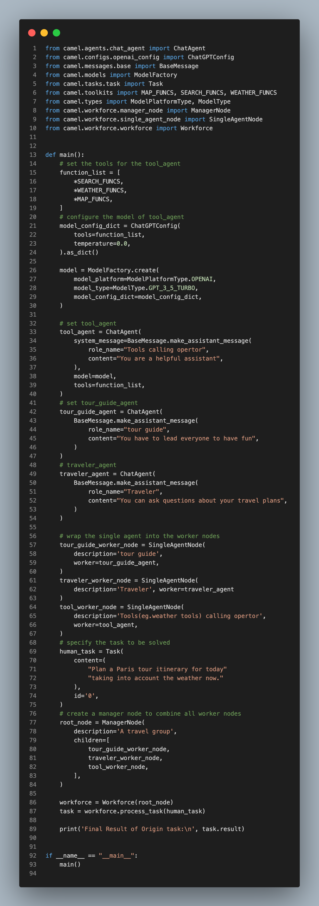
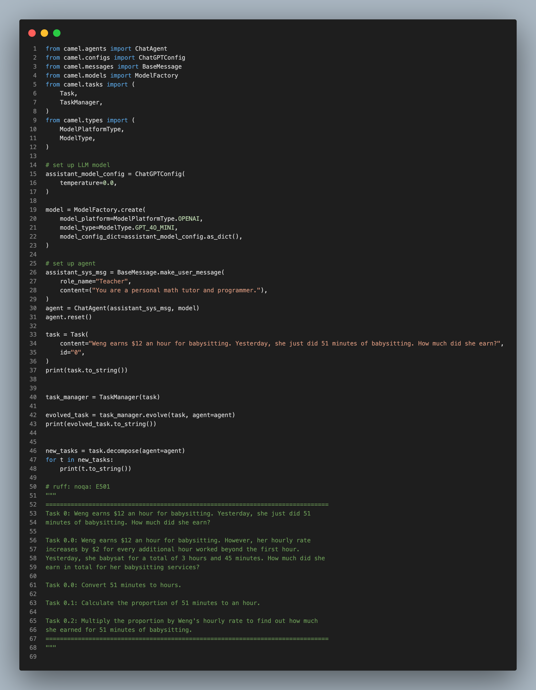
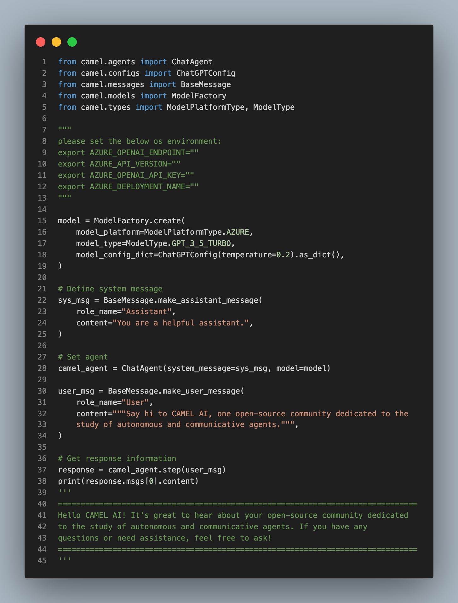
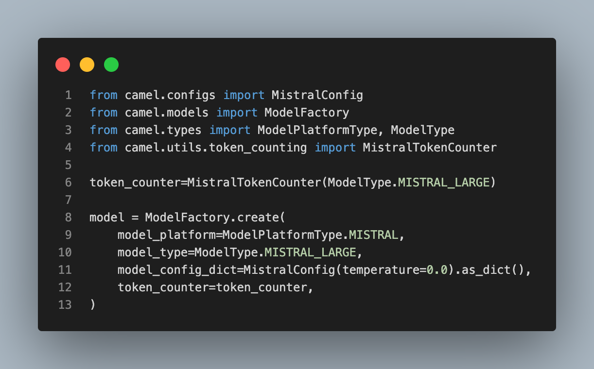
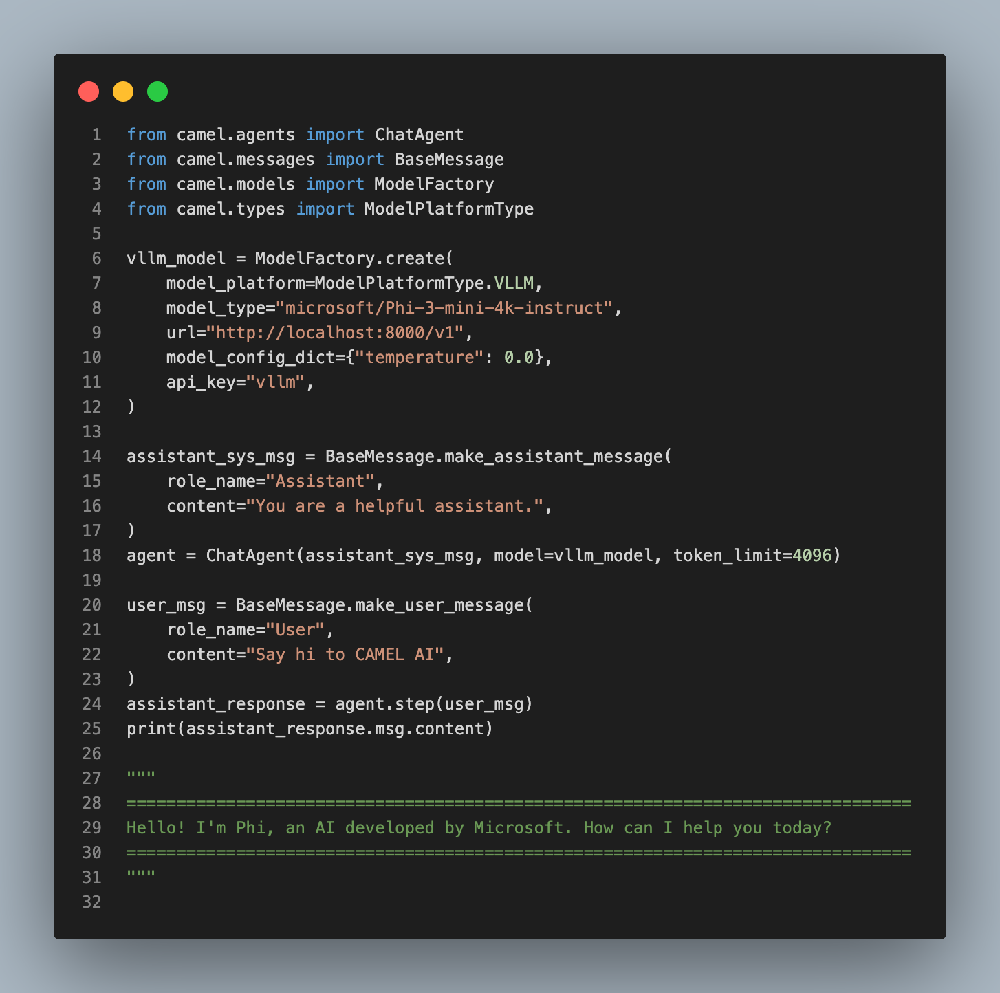
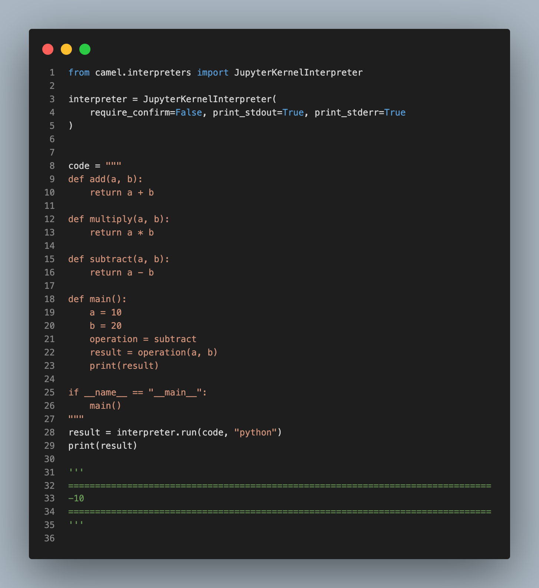
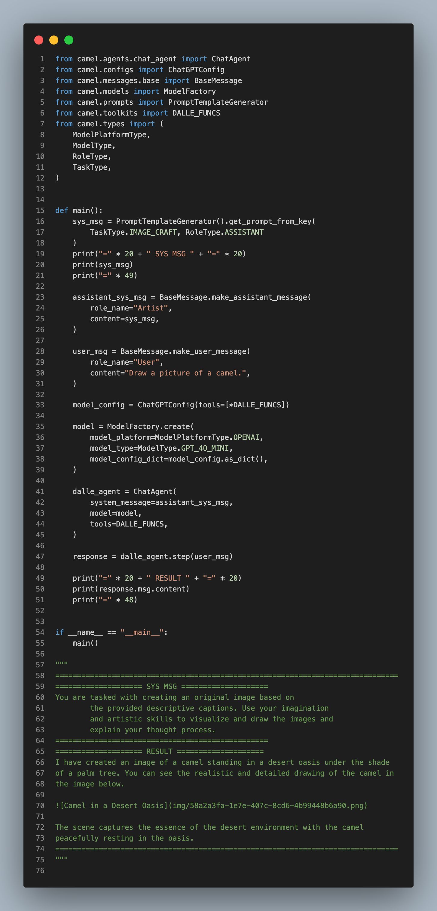
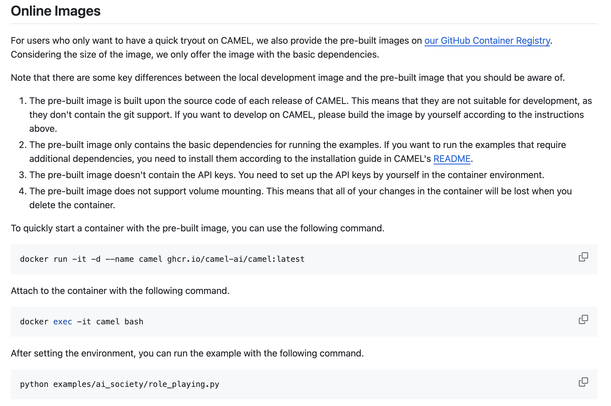

Hello everyone! We're thrilled to announce some fantastic updates that significantly enhance our frameworks functionality, check out the details below!

### ‍ **🤖** Agent updates:

‍**We've just added the Workforce Module:** By doing so, we allow users to solve one complex task using multiple agents with role playing. Thanks to our contributors [WHALEEYE](https://github.com/WHALEEYE) and [yiyiyi0817](https://github.com/yiyiyi0817) for working on this. 🤝 Explore more [here](https://github.com/camel-ai/camel/pull/713).

**We've added a Task Channel**: By doing so, we ensure enhanced coordination and efficient task management across different workforces. Thanks to our contributor [onemquan](https://github.com/onemquan) for making this happen. 🤝 Explore more [here](https://github.com/camel-ai/camel/pull/699).

### ‍ **✨ Model updates:**

‍**We've integrated Azure's OpenAI services**: By doing so, this expands your options for accessing OpenAI’s services. Thanks to our contributor [onemquan](https://github.com/onemquan) for this integration. 🤝 Explore more [here.](https://github.com/camel-ai/camel/pull/733)

**We've added a self-setting token counter feature:** This enhancement provides users the flexibility to specify custom token counters, leading to better integration with various language models and precise token management. Thanks to our contributor [lllllyh01](https://github.com/lllllyh01) for implementing this. 🤝 Explore more [here](https://github.com/camel-ai/camel/pull/730).

**We've just integrated vLLM**: By doing so, we have enhanced our framework with a high-throughput, memory-efficient inference engine, enabling faster and more efficient deployments of large language models. Thanks to our contributor [zechengz](https://github.com/zechengz) for this integration. 🤝 Explore more [here](https://github.com/camel-ai/camel/pull/734).

### **🛠 Tool updates:**

**We've integrated ipython kernel:** By doing so, we provide a versatile tool capable of executing both Python and Bash code strings. Thanks to our contributor [onemquan](https://github.com/onemquan) for this update. 🤝 Explore more [here](https://github.com/camel-ai/camel/pull/726).

**We've integrated OpenAI's DALL-E**: By doing so, we enhance our agents with image generation based on text inputs. Thanks to our contributor [willshang76](https://github.com/willshang76) for making this happen. 🤝 Explore more [here](https://github.com/camel-ai/camel/pull/698).

### 💡 Other **updates**:

‍**We've improved the Dockerfile quality**: By enhancing Docker installation processes and introducing volume mounting in Docker containers, we ensure changes in the working directory inside the container are synced to the CAMEL repo on the host system. This setup allows for development without losing progress when using docker. Thanks to our contributor [WHALEEYE](https://github.com/WHALEEYE) for working on this update. 🤝 Explore more [here](https://github.com/camel-ai/camel/pull/722).

### 🐫 Thanks from everyone at CAMEL-AI

Hello there, passionate AI enthusiasts! 🌟 We are 🐫 CAMEL-AI.org, a global coalition of students, researchers, and engineers dedicated to advancing the frontier of AI and fostering a harmonious relationship between agents and humans.

**📘 Our Mission:** To harness the potential of AI agents in crafting a brighter and more inclusive future for all. Every contribution we receive helps push the boundaries of what’s possible in the AI realm.

**🙌 Join Us:** If you believe in a world where AI and humanity coexist and thrive, then you’re in the right place. Your support can make a significant difference. Let’s build the AI society of tomorrow together!

- Find all our updates on [X](https://twitter.com/CamelAIOrg).
- Make sure to star our [GitHub](https://github.com/camel-ai) repositories.
- Join our [Discord,](https://discord.gg/nCpraan3sS) [WeChat](https://ghli.org/camel/wechat.png) or [Slack](https://join.slack.com/t/camel-ai/shared_invite/zt-2icssxnkj-YHwFVhoZHMYpIG~ZU86WVw) community.
- You can contact us by email: camel.ai.team@gmail.com
- Dive deeper and explore our projects on <https://www.camel-ai.org/>

‍
