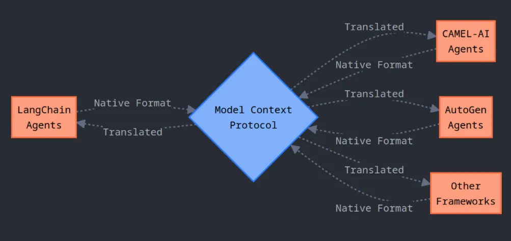
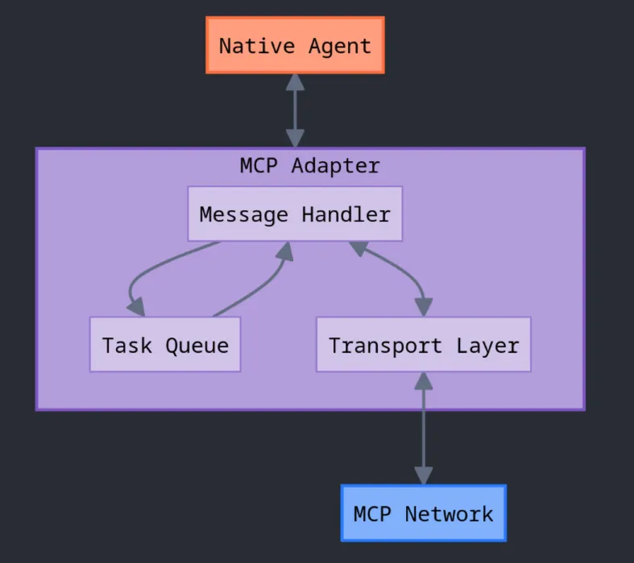
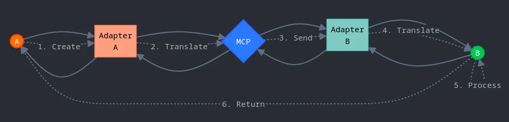
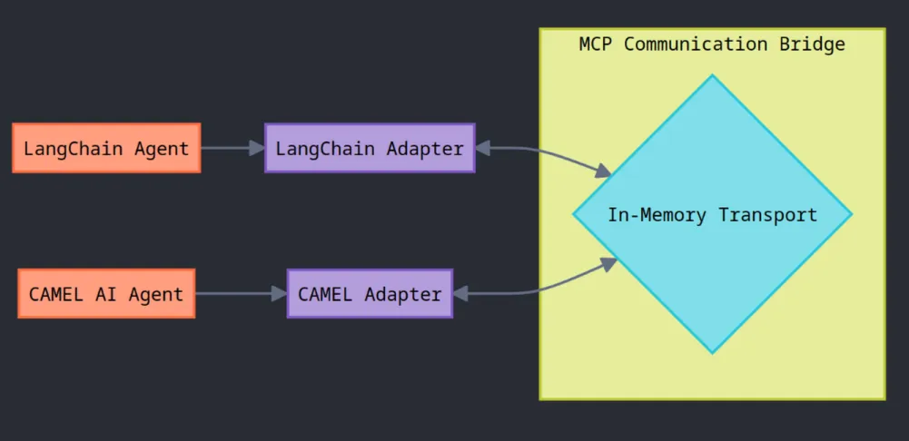

_Have you ever imagined agents from different frameworks shaking hands and sharing ideas?_ Different AI assistants from various platforms talking to each other through a common communication stream?

But is this even possible? Each framework approaches agent modeling and tool binding so differently:

**LangChain** creates agents using:

```
agent = ChatOpenAI(
    model="gpt-4o",
    temperature=0.2
)
```

‍

**Camel-AI** does it a bit differently:

```
model = ModelFactory.create(
    model_platform=ModelPlatformType.ANTHROPIC,
    model_type="claude-3-7-sonnet",
    api_key=anthropic_api_key,
    model_config_dict={"temperature": 0.4}
)

agent = ChatAgent(
    system_message=sys_msg,
    model=model
)
```

‍

Like how in LangChain you can build agents with _a lot of abstraction_, Camel offers a _detailed way_ to do things by letting the user decide each configuration.

Despite sharing the same design principles, these frameworks speak completely different “dialects,” making agent-to-agent communication feel **impossible**.

_Until you layer in MCP._

‍

## **The Model Context Protocol: Bridging AI Worlds**

Have you noticed how everyone in the AI community is buzzing about **MCP**?

The **Model Context Protocol (MCP)** is an open standard that creates secure, two-way connections between AI models and external tools or other agents. Think of MCP for LLMs as the **USB-C of AI** — it transfers data effortlessly and supercharges your system while keeping everything secure.

In its most basic form, MCP connects agents (clients) to tools (servers).

Picture your agent connecting to a Figma server to perform design tasks on its own. You have a natural conversation with your agent, telling it what you want, and then it communicates with the Figma server to create that dashboard you requested. No coding required from you!

But what if we could push MCP beyond this simple client-server relationship? What if we could make different AI frameworks actually talk to each other?

‍

## **Agent-to-Agent Communication with MCP**

‍

This is where MCP really **shines** beyond its basic use case. We can actually use MCP to create a **bridge between agents**, allowing them to talk to each other no matter what framework built them or who their vendor is.



**Model Context Protocol** connecting heterogeneous **AI agent frameworks**

By making our agents function as **both MCP clients AND servers simultaneously**, we create what’s essentially a **universal translator** for AI systems. Each agent can speak its _native language_ internally while using MCP as the _common communication protocol_ externally.

_Sounds magical? Impossible?_ Let me walk you through how we’re building an **Agent Network** that makes heterogeneous multi-agent communication not just possible but surprisingly straightforward.

‍

## **The Architecture: How It All Works**

**1. Protocol Translator**  
‍  
Normalizes your agent’s native message format (JSON, dictionaries, prompts) into a unified Markdown-style schema that any agent can understand.

**2. Communication Layer**‍

Handles transport (HTTP, WebSockets, STDIO), reliable queuing, acknowledgments, and even Server-Sent Events (SSE) for real-time streams.

**3. Context Manager**

Synchronizes each agent’s memory and state with the MCP network so nothing gets lost mid-conversation.

**4. Tool Integrator**

Maps and executes external tool calls (APIs, databases, custom functions) with consistent formatting across agents.

Together, these components form a **universal translation layer** that lets any MCP-capable agent converse or invoke tools, no matter the underlying framework.

‍

## **Creating Camel/Langchain MCP Adapter: Becoming Bilingual**

To connect different agent frameworks, we need to create **specialized adapters**. Let’s look at how we can build an adapter for **CAMEL-AI**.



**MCP Adapter** structure for **AI agent frameworks**: message handler, task queue & transport

The adapter acts as a diplomat between the MCP world and the CAMEL-AI world. Here’s a simplified look at the core adapter class:

‍

```
class CamelMCPAdapter(MCPAgent):
    """Adapter for Camel AI ChatAgent to work with MCP"""

    def __init__(self,
                 name: str,
                 transport: Optional[MCPTransport] = None,
                 client_mode: bool = False,
                 camel_agent: ChatAgent = None,
                 system_message: str = "",
                 **kwargs):
        # Initialize with system message
        effective_system_message = system_message or (
            camel_agent.system_message.content
            if camel_agent and camel_agent.system_message
            else "Camel AI Assistant"
        )
        super().__init__(name=name, system_message=effective_system_message, **kwargs)

        # Store important components
        self.transport = transport
        self.client_mode = client_mode
        self.camel_agent = camel_agent
        self.task_queue = asyncio.Queue()

        if not self.camel_agent:
            raise ValueError("A camel.agents.ChatAgent instance must be provided.")
```

‍

This adapter is like a **diplomat** who’s fluent in two languages. When a message arrives from another agent, our adapter:

1. **Receives** the message in MCP format
2. **Translates** it into something CAMEL-AI understands
3. **Passes** it to the CAMEL agent for processing
4. **Takes** the response and converts it back to MCP format
5. **Sends** it to the intended recipient

## _The Message Flow_

When one agent wants to talk to another, it follows this journey:



Message flow sequence between heterogeneous **AI agent frameworks** over MCP

**1. Message Creation**

Agent A creates a message in its native format (think of this as writing a letter in your native language).

**2. Translation to MCP**

Agent A’s adapter translates the message to the standard MCP format (like translating that letter to Esperanto, a universal language).

**3. Transmission**

The message travels through the communication layer to reach Agent B (like sending the letter through the postal service).

**4. Reception & Translation**

Agent B’s adapter receives the message and translates it from MCP format to Agent B’s native format (translating from Esperanto to the recipient’s language).

**5. Processing**

Agent B processes the message, thinks about it, and generates a response.

**6. Reverse Journey**

The response follows the same path back to Agent A.

The most crucial part of this process happens in the message handler:

```
async def handle_incoming_message(self,
                                  message: Dict[str, Any],
                                  message_id: Optional[str] = None):
    """Handle incoming messages from other agents"""
    # Determine message type
    msg_type = message.get("type")
    if not msg_type and "content" in message and isinstance(message["content"], dict):
        msg_type = message["content"].get("type")

    sender = message.get("sender", "Unknown")
    task_id = message.get("task_id") or message.get("content", {}).get("task_id")

    # Skip duplicate messages
    if not super()._should_process_message(message):
        if message_id and self.transport:
            asyncio.create_task(
                self.transport.acknowledge_message(self.name, message_id)
            )
        return

    # Process based on message type
    if msg_type == "task":
        # Queue the task for processing
        task_context = {
            "type": "task",
            "task_id": current_task_id,
            "description": description,
            "reply_to": reply_to,
            "sender": sender,
            "message_id": message_id
        }
        await self.task_queue.put(task_context)

    elif msg_type == "task_result":
        # Create a new conversational task based on received result
        new_task_id = f"conv_{uuid.uuid4()}"
        new_task_context = {
            "type": "task",
            "task_id": new_task_id,
            "description": str(result_content),
            "reply_to": sender,
            "sender": self.name,
            "message_id": message_id
        }
        await self.task_queue.put(new_task_context)
```

‍

This handler ensures messages get **routed correctly** based on their type. Task requests get queued for processing, while results from other agents create new conversational tasks.

## **Building Your Agent Communication Network**

First, we need to initialize the underlying agents from both frameworks. Once initialized in their own unique ways, we can have them talk to each other via MCP.



In-memory transport bridge linking LangChain & CAMEL-AI agents in **AI agent frameworks**

### **MCP Communication Bridge**

```
def setup_langchain_agent():
    # Create the language model with OpenAI
    llm = ChatOpenAI(model="gpt-4o-mini", temperature=0.7)

    # Define the prompt template with placeholders
    prompt = ChatPromptTemplate.from_messages([
        ("system", "You are a helpful assistant called {agent_name}."),
        ("user", "{input}"),
        ("placeholder", "{agent_scratchpad}"),
    ])

    # Create a simple tool (OpenAI functions agents require at least one tool)
    @tool
    def dummy_tool() -> str:
        """A placeholder tool that does nothing."""
        return "This tool does nothing."

    tools = [dummy_tool]

    # Create the agent with the LLM, tools, and prompt
    agent = create_openai_functions_agent(llm, tools, prompt)

    # Wrap the agent in an executor and return it
    return AgentExecutor(agent=agent, tools=tools, verbose=True)
```

‍

This function creates a **LangChain agent** using OpenAI’s functions capability. Let’s break it down:

- We kick things off with a `ChatOpenAI` model running **gpt-4o-mini** at **0.7 temperature** — just creative enough to be interesting but not wild.
- Next, we craft a prompt template with **three key parts**:
  1. A system message giving the agent its identity
  2. A user input placeholder that gets filled with incoming messages
  3. A scratchpad placeholder for intermediate reasoning
- We throw in a `dummy_tool` because OpenAI’s functions agents need at least one tool to work properly. In a real app, you’d replace this with something useful like a search tool or calculator.
- Finally, we wrap everything in an `AgentExecutor`, which handles all the heavy lifting of running the agent and managing its outputs.

Then we move on to create a **CAMEL-AI agent** instance:

```
def setup_camel_agent():
    # Create a model instance using CAMEL's ModelFactory
    model_instance = ModelFactory.create(
        model_platform=ModelPlatformType.OPENAI,
        model_type=ModelType.GPT_4O_MINI,
        model_config_dict={"temperature": 0.7}
    )

    # Define the system prompt for the agent
    system_prompt = "You are a creative AI assistant called {agent_name}, skilled in writing poetry."

    # Create and return the CAMEL ChatAgent
    return ChatAgent(system_message=system_prompt, model=model_instance)
```

‍

Notice how different these initialization methods are—**LangChain** focuses on tools and executors, while **CAMEL-AI** uses a ModelFactory pattern and emphasizes the agent’s capabilities directly.

## **Building the Communication Bridge**

Now that we have our agents set up, let’s wire them together with MCP:

```
async def main():
    # Load API keys from environment variables
    load_dotenv()

    # Initialize our agents from both frameworks
    langchain_executor = setup_langchain_agent()
    camel_chat_agent    = setup_camel_agent()

    # Create a shared transport layer for communication
    transport = InMemoryTransport()

    # Create MCP adapters for each agent
    langchain_adapter = LangchainMCPAdapter(
        name="LangchainAgent",
        agent_executor=langchain_executor,
        transport=transport
    )
    camel_adapter = CamelMCPAdapter(
        name="CamelAgent",
        camel_agent=camel_chat_agent,
        transport=transport
    )

    # Connect each agent to the transport layer
    await transport.connect("LangchainAgent")
    await transport.connect("CamelAgent")

    # Start both agents running in background tasks
    task1 = asyncio.create_task(langchain_adapter.run())
    task2 = asyncio.create_task(camel_adapter.run())

    # Give the agents a moment to start up properly
    await asyncio.sleep(2)

    # Generate a unique ID for this chat
    initial_task_id = f"conv_start_{uuid.uuid4()}"
    initial_message = {
        "type": "task",
        "task_id": initial_task_id,
        "description": "Hello CamelAgent, let's discuss AI ethics.",
        "sender": "LangchainAgent",
        "reply_to": "LangchainAgent"
    }

    # Send the initial message
    await transport.send_message(target="CamelAgent", message=initial_message)

    # Now we just sit back and watch the magic!
```

## **The Conversations**

When you run your demo, you’ll see log messages showing the conversation flow:

```
INFO - [LangchainAgent] Sending initial message to CamelAgent...
INFO - [InMemoryTransport] Message queued for 'CamelAgent' from 'LangchainAgent'.
INFO - [CamelAgent] Processing message: {
  'type': 'task',
  'task_id': 'conv_start_44b4eea6-75bd-4cec-a074-f42aa4be9455',
  'description': 'Hello CamelAgent, lets discuss AI ethics.',
  'sender': 'LangchainAgent',
  'reply_to': 'LangchainAgent'
}
INFO - [CamelAgent] Starting execution of task...
INFO - [LangchainAgent] Received task_result from CamelAgent: "Hello LangchainAgent! While I'm primarily focused on poetry, I can certainly appreciate the intricacies of building multi-agent systems. Would you like me to express those ideas in poetic form?"
INFO - [CamelAgent] Received task_result from LangchainAgent: "Absolutely! I would love to see your thoughts on multi-agent systems expressed in poetry. Please share your verse!"
INFO - [LangchainAgent] Received task_result from CamelAgent:
    "In a realm where wisdom seeks to bind,
    A gathering of minds, uniquely designed.
    Each agent distinct, with purpose to claim,
    Yet harmony beckons through collaborative aim..."
```

‍

And hence we see two completely different agent frameworks **communicating seamlessly!**

## **Why This Matters: The Future of AI Collaboration**

This isn’t just a technical parlor trick. By enabling heterogeneous agent communication, we unlock several powerful capabilities:

1. **Framework Independence:**
2. Mix and match agents from different vendors, using each for what it does best. No more being locked into a single framework.
3. **Specialized Teams:**
4. Create teams of specialized agents that collaborate on complex tasks—one agent might be good at research, another at summarization, and a third at creative writing.
5. **Ecosystem Growth:**
6. Developers can create specialized agents that integrate seamlessly with existing solutions, without rewriting everything from scratch.
7. **Reduced Vendor Lock-in:**
8. Companies aren’t tied to a single AI framework provider—agents from different providers can work together.

_Think of MCP like building a team of specialists who all speak different languages but can still work together perfectly._ Instead of being limited by language barriers, each member contributes their unique skills to the project.

In the real world, this means you can pair up agents with complementary strengths:

- **CAMEL AI agents** excel at simulation scenarios and orchestrating complex multi-agent interactions. They’re great at coordinating dialogues between different roles and handling creative tasks.
- **LangChain agents** shine with their structured approach to linear workflows and tool integration. They’re perfect for step-by-step reasoning and connecting to external services.

## **Conclusion**

As MCP continues to evolve, we’ll see even more sophisticated agent interactions, enabling entirely new applications and use cases that we’ve only begun to imagine.

**Ready to try it yourself?** Clone the repository, set up your agents, and watch the magic happen!

**Happy coding!**

‍
