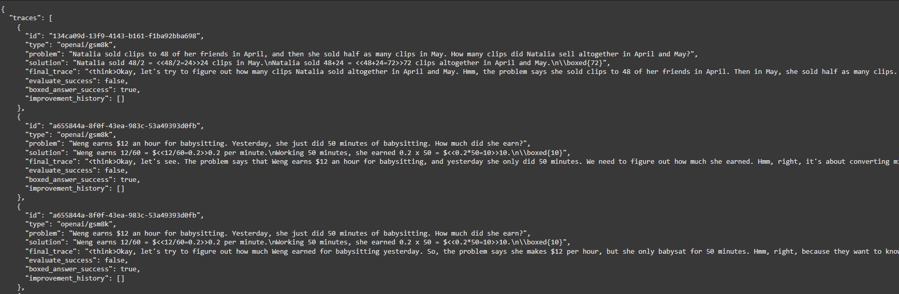

Synthetic data generation has become a cornerstone of advancing AI applications, and [CAMEL-AI](https://www.camel-ai.org/) takes it to the next level.

In this guide, we will look into leveraging CAMEL-AI’s data distillation pipeline to generate high-quality mathematical reasoning datasets. CAMEL-AI can produce datasets that not only include the final solutions to math problems but also the underlying, detailed thought processes (Long Chain-of-Thought data).

This technical guide will walk you through the entire process, from setting up the environment to uploading your distilled datasets on [Hugging Face](https://huggingface.co/).

## Overview


CAMEL's data distillation pipeline turns raw Hugging Face datasets into detailed reasoning traces using DeepSeek R1, ready for public sharing.

The pipeline described in this guide consists of several key components:

- **CAMEL Framework:** A powerful multi-agent framework that supports synthetic data generation and role-playing scenarios for advanced AI applications.
- **Data Distillation Pipeline:** A systematic process for extracting and refining high-quality reasoning datasets from models such as [DeepSeek R1](https://api-docs.deepseek.com/news/news250120).
- **Hugging Face Integration:** A streamlined method to upload and share your generated datasets on Hugging Face.

The end result is three comprehensive datasets, including:

- [**AMC AIME STaR Dataset**](https://huggingface.co/datasets/camel-ai/amc_aime_star)**:** Featuring 4K advanced mathematical problems with iterative improvement histories.
- [**AMC AIME Distilled Dataset:**](https://huggingface.co/datasets/camel-ai/amc_aime_distilled) Also 4K advanced problems with clear step-by-step solutions.
- [**GSM8K Distilled Dataset:**](https://huggingface.co/datasets/camel-ai/gsm8k_distilled) 7K high-quality grade school math word problems with detailed reasoning.

This guide uses the GSM8K dataset as an example for data preparation, distillation, and eventual upload.

Before you begin, install the necessary packages. The camel-ai package is installed directly from the GitHub repository along with some additional dependencies:

```
pip install "git+https://github.com/camel-ai/camel.git@4210cb0849f3f13d6a46fefeb9e2c3e791c158cb#egg=camel-ai"
pip install datasets
pip install rouge
```

## 2. Setting Up API Keys

To interact with DeepSeek R1 (and alternate model providers), you must set up API keys. This ensures that your requests are authenticated and that the models can return detailed thought processes.

```
from getpass import getpass
import os

# Set the SILICONFLOW_API_KEY or DEEPSEEK_API_KEY for data distillation.
SILICONFLOW_API_KEY = getpass('Enter your SILICONFLOW_API_KEY: ')
os.environ["SILICONFLOW_API_KEY"] = SILICONFLOW_API_KEY

DEEPSEEK_API_KEY = getpass('Enter your DEEPSEEK_API_KEY: ')
os.environ["DEEPSEEK_API_KEY"] = DEEPSEEK_API_KEY

# To enable DeepSeek R1 to include detailed thought processes in its responses,
# set the following environment variable.
os.environ["GET_REASONING_CONTENT"] = "True"
```

‍

> **Note:** You may also use other model providers like [Fireworks](https://fireworks.ai/models/fireworks/deepseek-r1) or [Together AI](https://www.together.ai/models/deepseek-r1) if desired.

## 3. Downloading and Preparing the GSM8K Dataset

The GSM8K dataset, which contains questions and answers, is downloaded from Hugging Face. In this example, we select a subset of problems (10 items) and convert the format to one compatible with CAMEL’s data distillation pipeline. The process includes a small transformation to the solution text to highlight the final answer using LaTeX formatting.

```
import json
from pathlib import Path
import uuid
from datasets import load_dataset

# Set the number of problems to download from GSM8K in Hugging Face
NUMBER_OF_PROBLEMS = 10

def download_gsm8k_dataset():
    try:
        # Load the dataset using the datasets library
        dataset = load_dataset("openai/gsm8k", "main")

        # Get the items from the train split
        data = dataset['train'].select(range(NUMBER_OF_PROBLEMS))

        # Convert to the desired format
        formatted_data = []
        for item in data:
            # Extract the final answer from the solution
            solution = item['answer']
            if solution:
                import re
                # GSM8K solutions typically end with "#### number"
                match = re.search(r'####\s*(\d+)', solution)
                if match:
                    number = match.group(1)
                    # Replace the "#### number" with "\boxed{number}"
                    solution = re.sub(r'####\s*\d+', f'\\\\boxed{{{number}}}', solution)

            formatted_item = {
                "id": str(uuid.uuid4()),  # GSM8K doesn't provide IDs
                "problem": item['question'],
                "type": "openai/gsm8k",  # Source identifier
                "solution": solution,    # Modified solution with LaTeX formatting
            }
            formatted_data.append(formatted_item)

        # Save to a file
        output_file = "downloaded_gsm8k_10.json"
        with open(output_file, "w") as f:
            json.dump(formatted_data, f, indent=2)

        print(f"Successfully downloaded and saved GSM8K dataset to {output_file}")
    except Exception as e:
        print(f"Error downloading GSM8K dataset: {e}")

if __name__ == "__main__":
    download_gsm8k_dataset()
```

‍

This script downloads a subset of GSM8K, transforms the solution to replace markers with LaTeX formatting (using \boxed{}), and saves the formatted data in JSON format.

## 4. Distilling Mathematical Reasoning Data with CAMEL’s STaRPipeline

Now, we’ll run the CAMEL-AI pipeline to generate distilled mathematical reasoning data, including detailed thought processes. The process involves:

- **Configuring Models:** Using two DeepSeek R1 model endpoints (one from [Siliconflow](https://siliconflow.cn/) and one directly from DeepSeek Cloud) for redundancy.
- **Initializing Agents:** Setting up a reasoning agent that generates the detailed answer and (optionally) an evaluation agent.
- **Executing the Pipeline:** Running the pipeline to process the problems and output the generated data.

### **4.1. Import Required Libraries and Initialize the Environment**

```
import nest_asyncio
nest_asyncio.apply()

import json
import os
import time

from camel.agents import ChatAgent
from camel.datagen import STaRPipeline
from camel.models import ModelFactory
from camel.types import ModelPlatformType, ModelType
```

‍

### **4.2. Setting Up the Reasoning Models**

We set up two reasoning models for redundancy. If one endpoint fails, the other can take over seamlessly.

```
# Set DeepSeek R1 served by Siliconflow as reason model 1
reason_model_1 = ModelFactory.create(
    model_platform=ModelPlatformType.OPENAI_COMPATIBLE_MODEL,
    model_type="deepseek-ai/DeepSeek-R1",
    api_key=os.environ["SILICONFLOW_API_KEY"],
    url="https://api.siliconflow.cn/v1",
    model_config_dict={"max_tokens": 4096},  # Configure max_tokens carefully
)

# Set DeepSeek R1 served by DeepSeek Cloud as reason model 2
reason_model_2 = ModelFactory.create(
    model_platform=ModelPlatformType.DEEPSEEK,
    model_type=ModelType.DEEPSEEK_REASONER,
)
```

‍

### **4.3. Running the STaRPipeline**

With the models ready, we load our problems from the JSON file and initialize the STaRPipeline for data generation. The pipeline processes the problems, generating detailed reasoning data for each.

```
start_time = time.time()
problems_path = "downloaded_gsm8k_10.json"
output_path = "generated_data.json"

# Load problems from JSON file
with open(problems_path, 'r') as f:
    problems = json.load(f)

# Initialize system messages for agents
reason_agent_system_message = (
    "Answer my question and give your final answer within \\boxed{}."
)
evaluate_agent_system_message = (
    "You are a highly critical teacher who evaluates the student's answers with a meticulous and demanding approach."
)

# Set up the reason agent with both models
reason_agent = ChatAgent(
    system_message=reason_agent_system_message,
    model=[reason_model_1, reason_model_2],
)

# Optionally, you can set up an evaluation agent and reward model.
# (These are commented out but can be enabled if needed.)
# evaluate_agent = ChatAgent(
#     system_message=evaluate_agent_system_message
# )
#
# from camel.models import NemotronRewardModel
# reward_model = NemotronRewardModel(
#     model_type=ModelType.NVIDIA_NEMOTRON_340B_REWARD,
#     url="https://integrate.api.nvidia.com/v1",
#     api_key=os.environ.get("NVIDIA_API_KEY"),
# )
# score_threshold = {"correctness": 1.0, "clarity": 0.0, "completeness": 0.0}

# Create and run the pipeline
pipeline = STaRPipeline(
    reason_agent=reason_agent,
    problems=problems,  # Directly pass the list of problems
    output_path=output_path,
    max_iterations=0,
    batch_size=100,  # Adjust batch size if needed
    # evaluate_agent=evaluate_agent,  # Optional evaluation
    # score_threshold=score_threshold,  # Optional scoring
    # reward_model=reward_model,  # Optional reward model
)

print("Start generation! May take some time, please wait..")

results = pipeline.generate(rationalization=False)

end_time = time.time()
execution_time = end_time - start_time

print(f"\nProcessed {len(results)} problems")
print(f"Results saved to: {output_path}")
print(f"Total execution time: {execution_time:.2f} seconds")
```

‍

After execution, the generated reasoning data is saved in your output path (here it is generated_data.json). You can inspect the results by loading the file:

```
with open('generated_data.json', 'r') as f:
    data = json.load(f)
    print(json.dumps(data, indent=2))
```

‍

It will look like the sample shown below.



‍

## 5. Uploading the Distilled Data to Hugging Face

Once the distilled data is ready, sharing it with the community is straightforward using Hugging Face. The following steps outline how to convert your data into the appropriate format, create a dataset card, and upload the records.

### **5.1. Define the Upload Pipeline**

This script defines functions to:

- **Load and Parse** the generated JSON output.
- **Create a Dataset Card** with metadata.
- **Convert Data into Record Objects**.
- **Upload the Data** to your Hugging Face repository.

```
from camel.datahubs.huggingface import HuggingFaceDatasetManager
from camel.datahubs.models import Record  # Represent a single record in the dataset
from datetime import datetime  # Handle date and time operations
import json

def load_star_output(file_path):
    """Load and parse the star output JSON file."""
    with open(file_path, 'r') as f:
        data = json.load(f)
    return data['traces']

def upload_to_huggingface(transformed_data, username, dataset_name=None):
    """
    Uploads transformed data to the Hugging Face dataset platform.

    Args:
        transformed_data (list): List of dictionaries containing the transformed data.
        username (str): Your Hugging Face username.
        dataset_name (str, optional): Custom dataset name.

    Returns:
        str: URL of the uploaded dataset.
    """
    manager = HuggingFaceDatasetManager()
    dataset_name = generate_or_validate_dataset_name(username, dataset_name)
    dataset_url = create_dataset(manager, dataset_name)
    create_dataset_card(manager, dataset_name, username)
    records = create_records(transformed_data)
    add_records_to_dataset(manager, dataset_name, records)
    return dataset_url

def generate_or_validate_dataset_name(username, dataset_name):
    """Generates a default dataset name or validates a user-provided one."""
    if dataset_name is None:
        current_date = datetime.now().strftime("%Y%m%d")
        dataset_name = f"star_traces_{current_date}"
    return f"{username}/{dataset_name}"

def create_dataset(manager, dataset_name):
    """Creates a new dataset on Hugging Face and returns the dataset URL."""
    dataset_url = manager.create_dataset(dataset_name)
    return dataset_url

def create_dataset_card(manager, dataset_name, username):
    """Creates a dataset card with metadata."""
    manager.create_dataset_card(
        dataset_name=dataset_name,
        description=(
            "A dataset containing mathematical problem-solving traces with step-by-step solutions "
            "and improvement history. Each record includes a mathematical problem, its final solution, "
            "and the iterative improvement process."
        ),
        license="mit",
        tags=["math", "problem-solving", "step-by-step", "traces"],
        authors=[username],
        language=["en"],
        task_categories=["text-generation"],
        content=(
            "This dataset contains mathematical problem-solving traces generated using the CAMEL framework. "
            "Each entry includes:\n\n"
            "- A mathematical problem statement\n"
            "- A detailed step-by-step solution\n"
        )
    )

def create_records(transformed_data):
    """Converts transformed data into a list of Record objects."""
    records = []
    for trace in transformed_data:
        record = Record(
            source_type=trace['type'],
            problem=trace['problem'],
            solution=trace['final_trace'],
        )
        records.append(record)
    return records

def add_records_to_dataset(manager, dataset_name, records):
    """Adds a list of Record objects to the dataset."""
    manager.add_records(dataset_name, records)
```

‍

### **5.2. Configure Hugging Face Credentials and Upload**

Finally, set your Hugging Face access token and username, load your generated data, and upload the dataset.

```
from getpass import getpass
import os

# Get HuggingFace token and username
HUGGING_FACE_TOKEN = getpass('Enter your HUGGING_FACE_TOKEN: ')
os.environ["HUGGING_FACE_TOKEN"] = HUGGING_FACE_TOKEN
username = input("Enter your HuggingFace username: ")
dataset_name = input("Enter your dataset name:")

import os
current_dir = os.getcwd()
star_output_path = os.path.join(current_dir, './generated_data.json')
traces = load_star_output(star_output_path)

# Upload the data to Hugging Face
dataset_url = upload_to_huggingface(traces, username, dataset_name)
print(f"\nDataset uploaded successfully!")
print(f"You can view your dataset at: {dataset_url}")
```

‍  
After running the script, you should see output similar to:

> > > Dataset uploaded successfully!

Once uploaded, you can view your dataset directly on your Hugging Face profile. And just like that, you’re done! 🎉

## Key Takeaways and Resources

This guide has walked you through setting up a complete pipeline for distilling mathematical reasoning data using CAMEL-AI and DeepSeek R1. By combining data extraction, synthetic generation, and Hugging Face integration, you can build and share high-quality datasets that capture not only the final answers but the intricate reasoning behind them.

### **Highlights**

- **High-Quality Synthetic Data Generation:** CAMEL-AI’s pipeline distills mathematical reasoning data with detailed step-by-step explanations, perfect for synthetic data generation.
- **Public Datasets:** Includes datasets such as AMC AIME STaR, AMC AIME Distilled, and GSM8K Distilled, offering a wide variety of problems and reasoning paths.
- **Hugging Face Integration:** Effortlessly share and access datasets on Hugging Face for collaborative research and development.
- **Customizable & Scalable:** Supports parallel processing, customizable agents, and optional reward models to efficiently generate large-scale data.

For further information, troubleshooting, or community support, join our [Discord](https://discord.com/invite/CNcNpquyDc) channel and engage with other enthusiasts and developers dedicated to finding the scaling law of agents.

**Explore the Full Cookbook**

For the complete guide and additional examples, check out the CAMEL-AI Cookbook:

[Distill Math Reasoning Data from DeepSeek R1 with CAMEL](https://colab.research.google.com/drive/1BnV4iyWlXdizzpRQPYjmwIt70oVKziBw?usp=sharing#scrollTo=xyK95yTFYku_)

Happy coding!

### 🐫 Thanks from everyone at CAMEL-AI

Hello there, passionate AI enthusiasts! 🌟 We are 🐫 CAMEL-AI.org, a global coalition of students, researchers, and engineers dedicated to advancing the frontier of AI and fostering a harmonious relationship between agents and humans.

🙌 Join Us: If you believe in a world where AI and humanity coexist and thrive, then you’re in the right place. Your support can make a significant difference. Let’s build the AI society of tomorrow, together!

- Find all our updates on [X](https://twitter.com/CamelAIOrg).
- Make sure to star our [GitHub](https://github.com/camel-ai) repositories.
- Join our [Discord,](https://discord.gg/nCpraan3sS) [WeChat](https://ghli.org/camel/wechat.png) or [Slack](https://join.slack.com/t/camel-ai/shared_invite/zt-2icssxnkj-YHwFVhoZHMYpIG~ZU86WVw) community.
- You can contact us by email: camel.ai.team@gmail.com
- Dive deeper and explore our projects on <https://www.camel-ai.org/>

!

‍

‍
