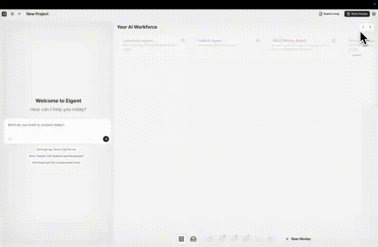
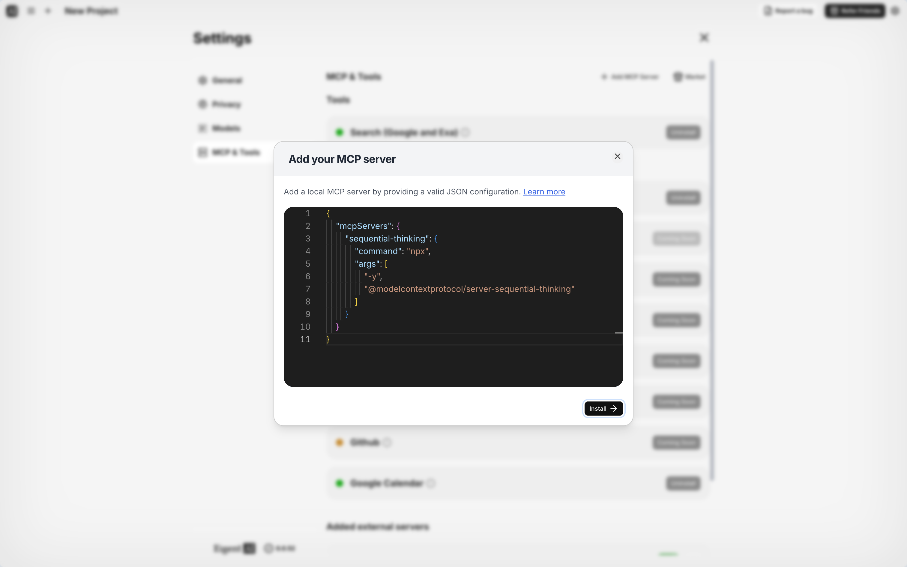
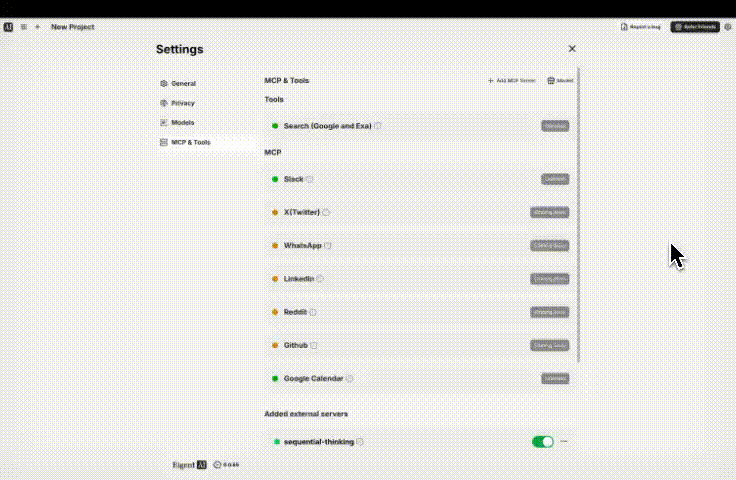
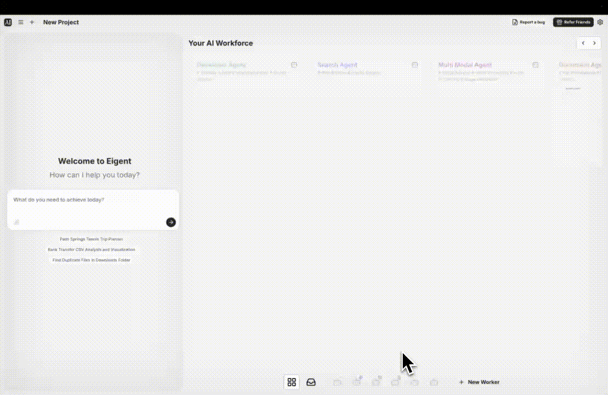
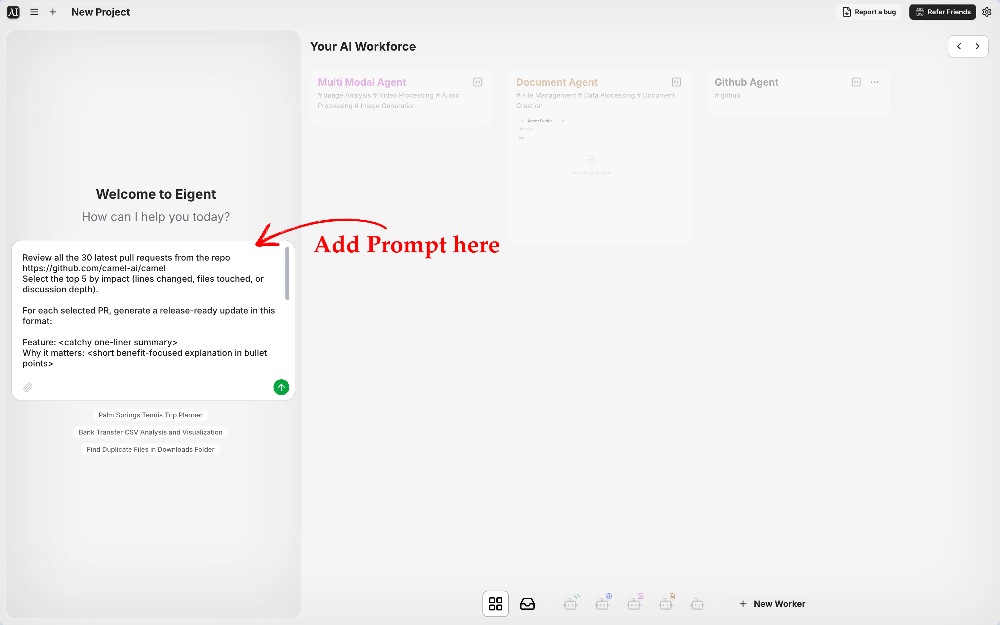
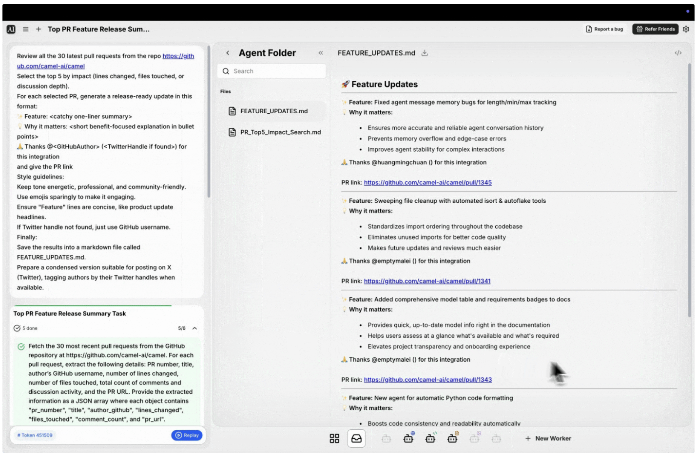

In open source projects, time is precious. Maintainers juggle bug fixes, feature requests, community support, and documentation, all while trying to keep code secure and releases organized. One repetitive but crucial task is **reviewing pull requests and preparing release updates**. It’s necessary, but it eats up hours that could be spent innovating.

What if automation could handle the grunt work for you? That’s where Eigent step in.

[**Eigent**](https://www.eigent.ai/) is the world’s first **Multi-agent Workforce** desktop application, empowering you to build, manage, and deploy a custom AI workforce that can turn your most complex workflows into automated tasks.. It’s a **modular, multi-agent system** that can break down complex tasks and handle them through specialized agents working in coordination.

Eigent’s **multi-agent coordination platform** boosts productivity by turning your workflows into automated tasks. Built on the open-source CAMEL framework, it brings parallel execution, customization, and privacy to your AI automation.

**What can Eigent do for you?** For first-time readers, consider Eigent as a flexible agentic assistant. You can create different “workers” (AI agents) with domain-specific skills (e.g. coding, documentation, DevOps) and have them collaborate on tasks. Some examples of technical workflows Eigent can simplify include:

- **GitHub automation with AI agents:** Reviewing code changes, summarizing pull requests, triaging issues.
- **Release note generation:** Automatically compiling highlights of what’s new in each release.
- **Documentation and code analysis:** Extracting key points from docs or codebases, suggesting improvements.
- **Open-source workflows:** Keeping track of project activity, generating reports for contributors, etc.

In this guide, we’ll show you **how to configure a custom GitHub MCP server inside Eigent** and set up an agent workflow that:

1. **Fetches new pull requests from a repo**
2. **Extracts and analyzes PR data**
3. **Formats the highlights into release-ready notes**
4. **Generates a short social post (e.g. for Twitter/X)**

Let’s dive into the step-by-step guide!

### **Step 1: Open Eigent and Navigate to _MCP & Tools_ Settings**



Navigate to _MCP & Tools_ in Eigent Settings

Once you have Eigent running, begin by opening the **Settings** panel. In the Settings, find and click on the **“MCP & Tools”** section. This is where you can configure external tools and servers for your AI agents. We’ll use this area to add a new custom MCP server for GitHub tasks.

_Eigent’s Settings interface. Navigate to the_ **_MCP & Tools_** _tab to configure external AI tools and servers._ In the _MCP & Tools_ tab, you’ll see a list of available tools and any configured MCP servers. By default, Eigent might include some basic tools (e.g. web search, code execution). To add our own, look for an **“Add MCP Server”** button (usually a **+** or a labeled button) and click it. This will open a dialog where you can input a JSON configuration for the new server.

### **Step 2: Add a Custom MCP Server via JSON Configuration**



Add a custom MCP server by pasting the JSON configuration

Eigent allows advanced users to add custom agent servers by providing a JSON config. In the **Add MCP Server** dialog that opened, you’ll see a text area to paste JSON. We’re going to add a **sequential-thinking** MCP server – this is a general-purpose AI reasoning engine that can coordinate tasks (perfect for breaking down complex prompts). We will also tie it into GitHub by providing the GitHub integration toolset and our credentials.

_Adding a new MCP server via JSON configuration. Paste in the JSON definition for the_ **_sequential-thinking_** _server._ The JSON defines how Eigent should launch the external agent server. For our use case, we’ll use Node’s npx to run the **Sequential Thinking** server package, and include the official GitHub MCP tool. Below is the JSON structure to use (as provided by Eigent’s docs and examples):

```
"mcpServers": {
  "sequential-thinking": {
    "command": "npx",
    "args": ["-y", "@modelcontextprotocol/server-sequential-thinking"]
  }
}
```

### **Step 3: Configure the GitHub MCP Server Settings (Include Your PAT)**



**Add a custom MCP server by pasting the JSON configuration**

Before finalizing the MCP server setup, include your **GitHub Personal Access Token (PAT)** in the configuration. This token will allow the agent to authenticate with the GitHub API and fetch repository data. You should generate a PAT from your GitHub account (with at least read access to repos; for public repos a classic token with default public scopes is sufficient). In the JSON, we’ll add an environment variable for the token and specify the GitHub toolset.

_Configuring the GitHub MCP server by adding environment variables. Provide your_ **_GitHub PAT_** _in the JSON config so the agent can access the GitHub API._ To integrate the GitHub tools, modify the JSON as follows:

- Add the GitHub MCP server container to the arguments.
- Set the environment variable for your token.

For example, you can extend the ”args” array to include the GitHub server image and use the ”env” field for the token:

```
"mcpServers": {
  "sequential-thinking": {
    "command": "npx",
    "args": [
      "-y", "@modelcontextprotocol/server-sequential-thinking",
      "ghcr.io/github/github-mcp-server"
    ],
    "env": {
      "GITHUB_PERSONAL_ACCESS_TOKEN": "ghp_yourGitHubTokenHere"
    }
  }
}
```

‍

In this configuration, we pass the official **GitHub MCP server** (hosted at [ghcr.io/github/github-mcp-server](http://ghcr.io/github/github-mcp-server) as an argument to the sequential thinking agent. The sequential agent will spin up the GitHub toolset internally. We also set GITHUB*PERSONAL_ACCESS_TOKEN in the environment so the agent can authenticate to GitHub. *(Make sure to replace\* \*\**"ghp*yourGitHubTokenHere”**\* *with your actual PAT.)* Once the JSON is ready, click **Install** or **Add\*\* to save the MCP server. Eigent will download and initialize the server in the background. After a moment, you should see the new server listed in your MCP tools, indicating a successful installation.

### **Step 4: Add a GitHub-Focused Worker (Agent) Using the New MCP Server**



Create a new Worker and assign the GitHub MCP server

Now that the MCP server is configured, we need to create a Worker that uses this server. In Eigent, a “Worker” is essentially an AI agent persona that can carry out tasks using a specified toolset or MCP server. Navigate back to the main **Workforce** or **Agents** screen (often the home screen showing your AI workers). Look for an **“Add Worker”** or **“+”** button to create a new agent.

When the **Add Worker** dialog appears, enter a name and description for your new agent. For example, name it **“GitHub MCP”** and describe it as “Helps around GitHub Tasks”. Most importantly, assign the **Agent Tool** to the MCP server we just added (it might appear in a dropdown as “sequential-thinking” or whatever name you gave it). This ensures your new worker will utilize the GitHub-enabled sequential thinking agent.

_Creating a new Worker agent for GitHub tasks. Give it a name (e.g. "GitHub PR Reviewer") and select the_ **_GitHub MCP_** _server as the agent’s tool._ After filling in the details and selecting the correct MCP server, save the worker. You should now see a new agent in your AI workforce list. This agent is essentially your **GitHub automation assistant**, equipped with the ability to reason through tasks and interact with GitHub data.

### **Step 5: Prompt the Agent to Summarize Pull Requests**



Enter your prompt in Eigent to summarize GitHub pull requests

With the GitHub-enabled agent up and running, it’s time to put it to work. Open a chat or command interface with your new worker (in Eigent, clicking the worker might open a chat panel where you can give it instructions). We’ll provide a task prompt asking the agent to review pull requests from a repository and summarize them.

As an example, try a detailed prompt like this one:

Review all the 30 latest pull requests from the repo <https://github.com/camel-ai/camel>. Select the top 5 by impact (lines changed, files touched, or discussion depth). For each selected PR, generate a release-ready update in this format: ✨ Feature: <catchy one-liner summary>  💡 Why it matters: <short bullet-point explanation>  🙏 Thanks @<GitHubAuthor>...

_Entering a prompt for the GitHub agent to review recent PRs and produce summaries. This complex instruction asks the AI to fetch the latest 30 PRs, pick the most impactful ones, and format a brief release note for each._ In the chat, paste or type in the prompt (as shown above) and hit send. This instructs the agent to automate a common open-source workflow: analyzing recent pull requests in the **camel-ai/camel** repo and preparing a synopsis of important changes. You can customize the repository URL or criteria as needed – for instance, use your own project’s repo link. The key is that our agent now has the tools (via MCP) to fetch GitHub data and the reasoning ability to summarize it.

‍

### **Step 6: Watch Eigent Automatically Break Down the Task and Fetch Data**



View AI-generated release notes from GitHub pull requests

Once you send the prompt, **Eigent’s multi-agent engine kicks in**. The request is fairly complex, but Eigent will handle it by dividing the work into manageable subtasks. Behind the scenes, the Sequential Thinking MCP server interprets the instruction and decides on a plan. It may do something like:

1. Fetch the list of the latest 30 PRs from the specified repository (using the GitHub MCP tool).
2. Analyze each PR’s metadata (lines changed, files, comments) to determine “impact”.
3. Pick the top 5 PRs based on the criteria.
4. For each of those PRs, compose a summary in the requested format (✨ Feature, 💡 Why it matters, 🙏 Thanks...).
5. Possibly also prepare a condensed version for X (Twitter) if requested, or any additional subtasks inferred.

Eigent actually **displays the subtask breakdown** in the interface, so you can see the agent’s thought process. It might list steps it’s taking, which makes it transparent and debug-friendly. For example, the agent may explicitly show a step to retrieve PR data and then a step to filter them by impact. This showcases Eigent’s dynamic task planning: _“Eigent dynamically breaks down tasks and activates multiple agents to work in parallel, automating complex tasks much faster than traditional single-agent workflows”_ .

_The GitHub agent (powered by the_ [_MCP server_](https://github.com/github/github-mcp-server)_) fetching repository data. Here the agent executed a subtask to retrieve PR details via the GitHub API, returning JSON data almost instantly._ In our case, the first subtask is to call GitHub and get details of the latest 30 PRs. The agent, using the GitHub MCP, does this in seconds and obtains a JSON array of PR info (IDs, titles, authors, lines changed, etc.). Next, the agent evaluates which PRs have the largest impact. Another subtask might involve sorting or filtering the list by those metrics. Once the top 5 PRs are identified, the agent generates the summary for each.

Finally, the agent produces the **output**: a neatly formatted set of release-ready updates for the top 5 PRs. The result is typically presented in the chat as Markdown text (since we asked for a release update format). Each update might look like:

✨ **Feature:** Added comprehensive model table and requirements badges to docs

💡 **Why it matters:**

- Provides quick, up-to-date model info right in the documentation
- Helps users assess at a glance what's available and what's required
- Elevates project transparency and onboarding experience

🙏 Thanks @wendongfan for this integration

PR link: <https://github.com/camel-ai/camel/pull/1343>

_(The above are illustrative examples.)_ You would see five such entries corresponding to the top PRs. The agent might also provide a shorter “X-posting” version (e.g. a tweet-worthy one-liner) if that was part of the prompt. The outcome is that you have, in a few moments, a draft of changelog/release notes highlights, complete with acknowledgments to contributors.

## **Empowering OSS Workflows with Agentic Automation**

In this tutorial, we configured Eigent to automate an open-source maintenance task—summarizing GitHub pull requests—using an AI agent. We introduced a custom [**GitHub MCP server**](https://github.com/github/github-mcp-server) into Eigent, created a dedicated worker, and successfully generated release note snippets from live repository data. The process demonstrates the power of **agentic automation for OSS contributors**: instead of manually combing through PRs, maintainers can rely on AI agents to do the heavy lifting. By leveraging Eigent’s **MCP integration** and multi-agent coordination, even complex workflows (like triaging dozens of PRs) can be handled efficiently by AI, freeing you to focus on higher-level decisions.

Eigent makes it approachable for both developers and non-developers to harness multi-agent AI. With a few simple steps, you can **configure MCP for open-source workflows** and let your personalized AI workforce assist you. This was just one example—**Eigent** can be tailored to many scenarios, from writing summaries and managing issues to testing code or updating documentation. As the platform evolves, the possibilities for GitHub automation with AI agents will only grow.

Give Eigent a try in your own projects, and enjoy the productivity boost of having an AI-powered team on your side! The future of open-source collaboration might just be a mix of human passion and tireless AI assistants working together. 🚀

**Happy automating!**
