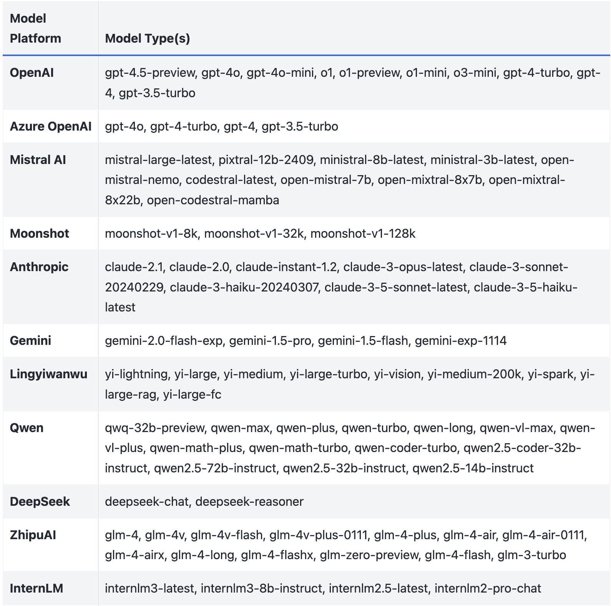

**TLDR:** CAMEL-AI enables flexible integration of various AI models, acting as the brain of intelligent agents. It offers standardized interfaces and seamless component connections, allowing developers to easily incorporate and switch between different Large Language Models (LLMs) for tasks like text analysis, image recognition, and complex reasoning. This versatility empowers the creation of adaptable AI applications that can leverage the right model for each specific task.

### ‍ **Table of Content:**

1. **Introduction**
2. **Supported Model Platforms**
3. **Model Calling Template**
4. **How to Connect to Open Source LLMs**
5. **Conclusion**

### **🤝 Introduction**

The model is the brain of the intelligent agent or multi agent systems, responsible for processing all input and output data. By calling different models, the agent can execute operations such as text analysis, image recognition, or complex reasoning or maybe for multi agent systems like agent orchestrations. according to task requirements. CAMEL-AI offers a range of standard and customizable interfaces, as well as seamless integrations with various components, to facilitate the development of applications with Large Language Models (LLMs). In this blog, we will introduce models currently supported by CAMEL-AI and the working principles and interaction methods with models.

All the codes are also available on [**colab notebook**](https://colab.research.google.com/drive/1k6uO4Le36baQVcnX0Vt96K72NO4kuIPQ?usp=sharing)**.**

### ⚡️Supported Model Platforms

CAMEL-AI supports multiple models, as detailed in the table below, and continues to integrate new ones:

‍

You can check the [full list here:](https://docs.camel-ai.org/key_modules/models.html)

‍



Model Platforms supported by CAMEL-AI

### 💫 Model Calling Template

Here is the example code to use a chosen model. To utilize a different model, you can simply change three parameters the define your model to be used: `model_platform, model_type, model_config_dict.`

```
from camel.models import ModelFactory
from camel.types import ModelPlatformType, ModelType
from camel.configs import ChatGPTConfig
from camel.messages import BaseMessage
from camel.agents import ChatAgent

# Define the model, here in this case we use gpt-4o-mini
model = ModelFactory.create(
    model_platform=ModelPlatformType.OPENAI,
    model_type=ModelType.GPT_4O_MINI,
    model_config_dict=ChatGPTConfig().as_dict,
)

# Define an assitant message
system_msg = BaseMessage.make_assistant_message(
        role_name="Assistant",
        content="You are a helpful assistant.",
)

# Initialize the agent
ChatAgent(system_msg, model=model)
```

### 🤩 How to Connect to Open Source LLMs

In the current landscape, for those seeking highly stable content generation, OpenAI’s gpt-4o-mini, gpt-4o are often recommended. However, the field is rich with many other outstanding open-source models that also yield commendable results. CAMEL-AI can support developers to delve into integrating these open-source large language models (LLMs) to achieve project outputs based on unique input ideas.

While proprietary models like gpt-4o-mini and gpt-4o have set high standards for content generation, open-source alternatives offer viable solutions for experimentation and practical use. These models, supported by active communities and continuous improvements, provide flexibility and cost-effectiveness for developers and researchers.

We will walk you through the process of:

1. **Selecting an Open Source LLM**: Understand the strengths and capabilities of various models available in the open-source community.
2. **Setting Up the Environment**: Learn how to set up your development environment to integrate these models. This includes installing necessary libraries, configuring runtime environments, and ensuring compatibility with your project requirements.
3. **Model Integration**: Step-by-step guidance on integrating your chosen LLM into your development workflow. We will cover API configurations to maximize model performance for tasks.

While CAMEL-AI implements some of models in-house, others are integrated through third-party providers. This hybrid approach enables CAMEL to provide a comprehensive and flexible toolkit for building with LLMs.

#### 1. Use Open-Source Models as Backends (ex. using Ollama to set Llama 3 locally)

1. Download [Ollama](https://ollama.com/download).

2. After setting up Ollama, pull the Llama3 model by typing the following command into the terminal:

```
ollama pull llama3
```

‍

3. Create a `ModelFile` similar the one below in your project directory:

```
 FROM llama3

 # Set parameters
 PARAMETER temperature 0.8
 PARAMETER stop Result

 # Sets a custom system message to specify the behavior of the chat assistant
 # Leaving it blank for now.

 SYSTEM """ """
```

‍

4. Create a script to get the base model (llama3) and create a custom model using the 'ModelFile' above. Save this as a 'sh' file:

```
#!/bin/zsh

# variables
model_name="llama3"
custom_model_name="camel-llama3"

#get the base model
ollama pull $model_name

#create the model file
ollama create $custom_model_name -f ./Llama3ModelFile
```

‍

5.Navigate to the directory where the script and are located and run the script. Enjoy your Llama3 model, enhanced by CAMEL's excellent agents:

```
from camel.agents import ChatAgent
from camel.messages import BaseMessage
from camel.models import ModelFactory
from camel.types import ModelPlatformType

ollama_model = ModelFactory.create(
    model_platform=ModelPlatformType.OLLAMA,
    model_type="llama3",
    url="http://localhost:11434/v1",
    model_config_dict={"temperature": 0.4},
)

assistant_sys_msg = BaseMessage.make_assistant_message(
    role_name="Assistant",
    content="You are a helpful assistant.",
)
agent = ChatAgent(assistant_sys_msg, model=ollama_model, token_limit=4096)

user_msg = BaseMessage.make_user_message(
    role_name="User", content="Say hi to CAMEL"
)
assistant_response = agent.step(user_msg)
print(assistant_response.msg.content)
```

#### 2. Use Open-Source Models as Backends (ex. using vLLM to set Phi-3 locally)

[Install vLLM first.](https://docs.vllm.ai/en/latest/getting_started/installation.html)

After setting up vLLM, start an OpenAI compatible server for example by

```
python -m vllm.entrypoints.openai.api_server --model microsoft/Phi-3-mini-4k-instruct --api-key vllm --dtype bfloat16
```

‍  
Create and run following script (more details please refer to this [example](https://github.com/camel-ai/camel/blob/master/examples/models/vllm_model_example.py)):

```
from camel.agents import ChatAgent
from camel.messages import BaseMessage
from camel.models import ModelFactory
from camel.types import ModelPlatformType

vllm_model = ModelFactory.create(
    model_platform=ModelPlatformType.VLLM,
    model_type="microsoft/Phi-3-mini-4k-instruct",
    url="http://localhost:8000/v1",
    model_config_dict={"temperature": 0.0},
    api_key="vllm",
)

assistant_sys_msg = BaseMessage.make_assistant_message(
    role_name="Assistant",
    content="You are a helpful assistant.",
)
agent = ChatAgent(assistant_sys_msg, model=vllm_model, token_limit=4096)

user_msg = BaseMessage.make_user_message(
    role_name="User",
    content="Say hi to CAMEL AI",
)
assistant_response = agent.step(user_msg)
print(assistant_response.msg.content)
```

### 💻 **Conclusion**

In conclusion, CAMEL-AI empowers developers to explore and integrate these diverse models, unlocking new possibilities for innovative AI applications. The world of large language models offers a rich tapestry of options beyond just the well-known proprietary solutions. By guiding users through model selection, environment setup, and integration, CAMEL-AI bridges the gap between cutting-edge AI research and practical implementation. Its hybrid approach, combining in-house implementations with third-party integrations, offers unparalleled flexibility and comprehensive support for LLM-based development.

Don't just watch this transformation that is happening from the sidelines. Dive into the CAMEL documentation, experiment with different models, and be part of shaping the future of AI. The era of truly flexible and powerful AI is here - are you ready to make your mark?

### 🐫 Thanks from everyone at CAMEL-AI

Hello there, passionate AI enthusiasts! 🌟 We are 🐫 CAMEL-AI.org, a global coalition of students, researchers, and engineers dedicated to advancing the frontier of AI and fostering a harmonious relationship between agents and humans.

📘 Our Mission: To harness the potential of AI agents in crafting a brighter and more inclusive future for all. Every contribution we receive helps push the boundaries of what’s possible in the AI realm.

🙌 Join Us: If you believe in a world where AI and humanity coexist and thrive, then you’re in the right place. Your support can make a significant difference. Let’s build the AI society of tomorrow, together!

- Find all our updates on [X](https://twitter.com/CamelAIOrg).
- Make sure to star our [GitHub](https://github.com/camel-ai) repositories.
- Join our [Discord,](https://discord.gg/nCpraan3sS) [WeChat](https://ghli.org/camel/wechat.png) or [Slack,](https://join.slack.com/t/camel-ai/shared_invite/zt-2icssxnkj-YHwFVhoZHMYpIG~ZU86WVw) community.
- You can contact us by email: camel.ai.team@gmail.com
- Dive deeper and explore our projects on <https://www.camel-ai.org/>

‍

‍

‍
