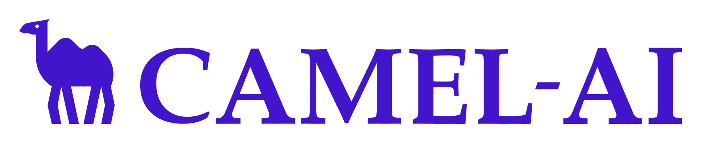

#### **What is Retrieval-Augmented Generation (RAG)?**

Retrieval-Augmented Generation (RAG) is an advanced approach critical for multi-agent systems in that combines retrieval-based and generation-based methods to enhance the performance of language models.

In a RAG model, there are two main components:

1. **Retriever**: This component is responsible for retrieving relevant information from a large database or knowledge base. The retriever uses a query or prompt to search for relevant documents, passages, or sentences that match the input.
2. **Generator**: This component is a language model that generates text based on the input query and the retrieved information. The generator uses the retrieved information to produce a coherent and fluent response.The RAG architecture is designed to improve the accuracy and relevance of generated text by leveraging the strengths of both retrieval-based and generation-based approaches. The retriever provides the generator with relevant context and information, which helps to inform and guide the generation process.

An agent with RAG owns enhanced accuracy, up-to-date knowledge, and improved generalization.

- **Customized RAG** is domain-specific and manually fine-tuned, ideal for specialized applications.
- **Auto RAG** is a general-purpose, automated system that dynamically retrieves and generates responses, suitable for broader, less specialized use cases.

In this tutorial we will cover how to use customized RAG and auto RAG with CAMEL framework.

4 main parts included:

- Customized RAG

- Auto RAG

- Single Agent with Auto RAG

- Role-playing with Auto RAG

#### **CAMEL agents with Retrieval-Augmented Generation (RAG)**

##### **How to use RAG within CAMEL?**

Let’s first load the CAMEL paper from [https://arxiv.org/pdf/2303.17760.pdf](https://colab.research.google.com/corgiredirector?site=https%3A%2F%2Farxiv.org%2Fpdf%2F2303.17760.pdf). This will be our local example data.

```
import os
import requests
```

```
os.makedirs('local_data', exist_ok=True)
url = "https://arxiv.org/pdf/2303.17760.pdf"
response = requests.get(url)
with open('local_data/camel paper.pdf', 'wb') as file:
     file.write(response.content)
```

##### **Customized RAG**

In this section we will set our customized RAG pipeline, we will take `VectorRetriever` as an example. Set embedding model, we will use `OpenAIEmbedding` as the embedding model, so we need to set the `OPENAI_API_KEY` in below.

```
from getpass import getpass
# Prompt for the OpenAI API key securely
openai_api_key = getpass('Enter your API key: ')
os.environ["OPENAI_API_KEY"] = openai_api_key
```

Import and set the embedding instance:

```
from camel.embeddings import OpenAIEmbedding
from camel.types import EmbeddingModelType

embedding_instance = OpenAIEmbedding(model_type=EmbeddingModelType.TEXT_EMBEDDING_3_LARGE)
```

Import and set the vector storage instance to enable **agent-based modeling** (go to <https://milvus.io/> to obtain Mulvus URL and Token):

```
from camel.storages import QdrantStorage

storage_instance = QdrantStorage(
    vector_dim=embedding_instance.get_output_dim(),
    path="local_data",
    collection_name="camel_paper",
)
```

Import and set the retriever instance:

```
from camel.retrievers import VectorRetriever
vector_retriever = VectorRetriever(embedding_model=embedding_instance)
```

We use integrated `Unstructured Module` to splite the content into small chunks, and the content will be splited automacitlly with its `chunk_by_title` function. The max character for each chunk is 500 characters, which is a suitable length for `OpenAIEmbedding`. All the text in the chunks will be embed and stored to the vector storage instance, that will take some time.

```
vector_retriever.process(
    content="local_data/camel_paper.pdf",
)
```

Now we can retrieve information from the vector storage by giving a query. By default it will give you back the text content from top 1 chunk with highest Cosine similarity score, and the similarity score should be higher than 0.75 to ensure the retrieved content is relevant to the query. You can also change the `top_k` value and `similarity_threshold` value with your needs.

The returned string list includes:

- similarity score
- content path
- metadata
- text

```
retrieved_info = vector_retriever.query(
    query="To address the challenges of achieving autonomous cooperation, we propose a novel communicative agent framework named role-playing .",
    top_k=1
)
print(retrieved_info)
```

Let’s try an irrelevant query:

```
retrieved_info_irrevelant = vector_retriever.query(
    query="Compared with dumpling and rice, which should I take for dinner?",
    top_k=1,
)

print(retrieved_info_irrevelant)
```

##### **Auto RAG**

In this section we will run the `AutoRetriever` with default settings which helps to automate agent orchestration easy. It uses `OpenAIEmbedding` as default embedding model and `Milvus` as default vector storage.

What you need to do is:

- Set content input paths, which can be local paths or remote urls
- Set remote url and api key for Milvus
- Give a query

The Auto RAG pipeline would create collections for given content input paths. The collection name will be set automaticlly based on the content input path name. If the collection exists, it will do the retrieve directly.

```
from camel.retrievers import AutoRetriever
from camel.types import StorageType

auto_retriever = AutoRetriever(
        vector_storage_local_path="local_data2/",
        storage_type=StorageType.QDRANT,
        embedding_model=embedding_instance)

retrieved_info = auto_retriever.run_vector_retriever(
    query="If I'm interest in contributing to the CAMEL projec, what should I do?",
    contents=[
        "local_data/camel_paper.pdf",  # example local path
        "https://github.com/camel-ai/camel/wiki/Contributing-Guidlines",  # example remote url
    ],
    top_k=1,
    return_detailed_info=True,
    similarity_threshold=0.5
)

print(retrieved_info)
```

#### **Single Agent with Auto RAG**

In this section we will show how to combine the `AutoRetriever` with one `ChatAgent`.

Let’s set an agent function, in this function we can get the response by providing a query to this agent.

```
from camel.agents import ChatAgent
from camel.messages import BaseMessage
from camel.types import RoleType
from camel.retrievers import AutoRetriever
from camel.types import StorageType

def single_agent(query: str) ->str :
    # Set agent role
    assistant_sys_msg = BaseMessage(
        role_name="Assistant",
        role_type=RoleType.ASSISTANT,
        meta_dict=None,
        content="""You are a helpful assistant to answer question,
         I will give you the Original Query and Retrieved Context,
        answer the Original Query based on the Retrieved Context,
        if you can't answer the question just say I don't know.""",
    )

    # Add auto retriever
    auto_retriever = AutoRetriever(
            vector_storage_local_path="local_data2/",
            storage_type=StorageType.QDRANT,
            embedding_model=embedding_instance)

    retrieved_info = auto_retriever.run_vector_retriever(
        query=query,
        contents=[
            "local_data/camel_paper.pdf",  # example local path
            "https://github.com/camel-ai/camel/wiki/Contributing-Guidlines",  # example remote url
        ],
        top_k=1,
        return_detailed_info=False,
        similarity_threshold=0.5
    )

    # Pass the retrieved infomation to agent
    user_msg = BaseMessage.make_user_message(role_name="User", content=str(retrieved_info))
    agent = ChatAgent(assistant_sys_msg)

    # Get response
    assistant_response = agent.step(user_msg)
    return assistant_response.msg.content

print(single_agent("If I'm interest in contributing to the CAMEL projec, what should I do?"))
```

Enjoy playing with it using different queries!

#### Role-playing with Auto RAG

In this section we will show how to combine the `RETRIEVAL_FUNCS` with `RolePlaying` by applying `Function Calling`.

```
from typing import List
from colorama import Fore

from camel.agents.chat_agent import FunctionCallingRecord
from camel.configs import ChatGPTConfig
from camel.toolkits import (
    MATH_FUNCS,
    RETRIEVAL_FUNCS,
)
from camel.societies import RolePlaying
from camel.types import ModelType, ModelPlatformType
from camel.utils import print_text_animated
from camel.models import ModelFactory

def role_playing_with_rag(
    task_prompt,
    model_platform=ModelPlatformType.OPENAI,
    model_type=ModelType.GPT_4O_MINI,
    chat_turn_limit=5,
) -> None:
    task_prompt = task_prompt

    user_model_config = ChatGPTConfig(temperature=0.0)

    function_list = [
        *MATH_FUNCS,
        *RETRIEVAL_FUNCS,
    ]
    assistant_model_config = ChatGPTConfig(
        tools=function_list,
        temperature=0.0,
    )

    role_play_session = RolePlaying(
        assistant_role_name="Searcher",
        user_role_name="Professor",
        assistant_agent_kwargs=dict(
            model=ModelFactory.create(
                model_platform=model_platform,
                model_type=model_type,
                model_config_dict=assistant_model_config.as_dict(),
            ),
            tools=function_list,
        ),
        user_agent_kwargs=dict(
            model=ModelFactory.create(
                model_platform=model_platform,
                model_type=model_type,
                model_config_dict=user_model_config.as_dict(),
            ),
        ),
        task_prompt=task_prompt,
        with_task_specify=False,
    )

    print(
        Fore.GREEN
        + f"AI Assistant sys message:\n{role_play_session.assistant_sys_msg}\n"
    )
    print(
        Fore.BLUE + f"AI User sys message:\n{role_play_session.user_sys_msg}\n"
    )

    print(Fore.YELLOW + f"Original task prompt:\n{task_prompt}\n")
    print(
        Fore.CYAN
        + "Specified task prompt:"
        + f"\n{role_play_session.specified_task_prompt}\n"
    )
    print(Fore.RED + f"Final task prompt:\n{role_play_session.task_prompt}\n")

    n = 0
    input_msg = role_play_session.init_chat()
    while n < chat_turn_limit:
        n += 1
        assistant_response, user_response = role_play_session.step(input_msg)

        if assistant_response.terminated:
            print(
                Fore.GREEN
                + (
                    "AI Assistant terminated. Reason: "
                    f"{assistant_response.info['termination_reasons']}."
                )
            )
            break
        if user_response.terminated:
            print(
                Fore.GREEN
                + (
                    "AI User terminated. "
                    f"Reason: {user_response.info['termination_reasons']}."
                )
            )
            break

        # Print output from the user
        print_text_animated(
            Fore.BLUE + f"AI User:\n\n{user_response.msg.content}\n"
        )

        # Print output from the assistant, including any function
        # execution information
        print_text_animated(Fore.GREEN + "AI Assistant:")
        tool_calls: List[FunctionCallingRecord] = [
            FunctionCallingRecord(**call.as_dict())
            for call in assistant_response.info['tool_calls']
        ]
        for func_record in tool_calls:
            print_text_animated(f"{func_record}")
        print_text_animated(f"{assistant_response.msg.content}\n")

        if "CAMEL_TASK_DONE" in user_response.msg.content:
            break

        input_msg = assistant_response.msg
```

More tutorials for CAMEL will come out soon and you will find out what CAMEL can do may be beyond what you would expect.

#### **🐫Thanks from everyone at CAMEL-AI**

Hello there, passionate AI enthusiasts! 🌟 We are 🐫 CAMEL-AI.org, a global coalition of students, researchers, and engineers dedicated to advancing the frontier of AI and fostering a harmonious relationship between agents and humans.

**📘 Our Mission:** To harness the potential of AI agents in crafting a brighter and more inclusive future for all. Every contribution we receive helps push the boundaries of what’s possible in the AI realm.

**🙌 Join Us:** If you believe in a world where AI and humanity coexist and thrive, then you’re in the right place. Your support can make a significant difference. Let’s build the AI society of tomorrow, together!

- Find all our updates on [X](https://twitter.com/CamelAIOrg).
- Make sure to star our [GitHub](https://github.com/camel-ai) repositories.
- Join our [Discord,](https://discord.gg/nCpraan3sS) [WeChat](https://ghli.org/camel/wechat.png) or [Slack,](https://join.slack.com/t/camel-ai/shared_invite/zt-2icssxnkj-YHwFVhoZHMYpIG~ZU86WVw)community.
- You can contact us by email: camel.ai.team@gmail.com
- Dive deeper and explore our projects on <https://www.camel-ai.org/>
