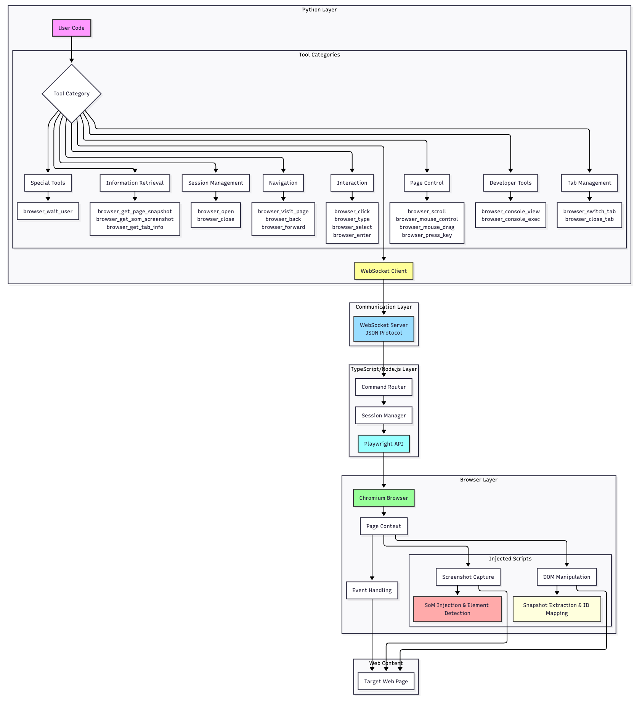
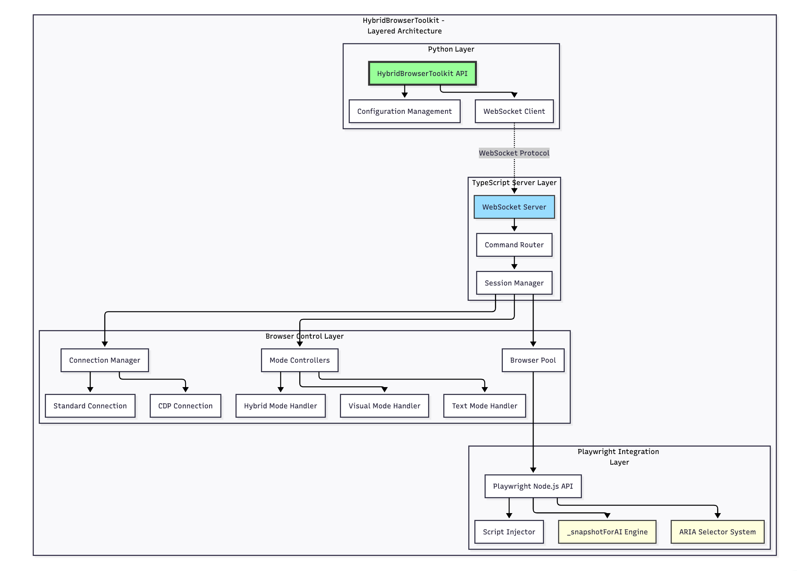
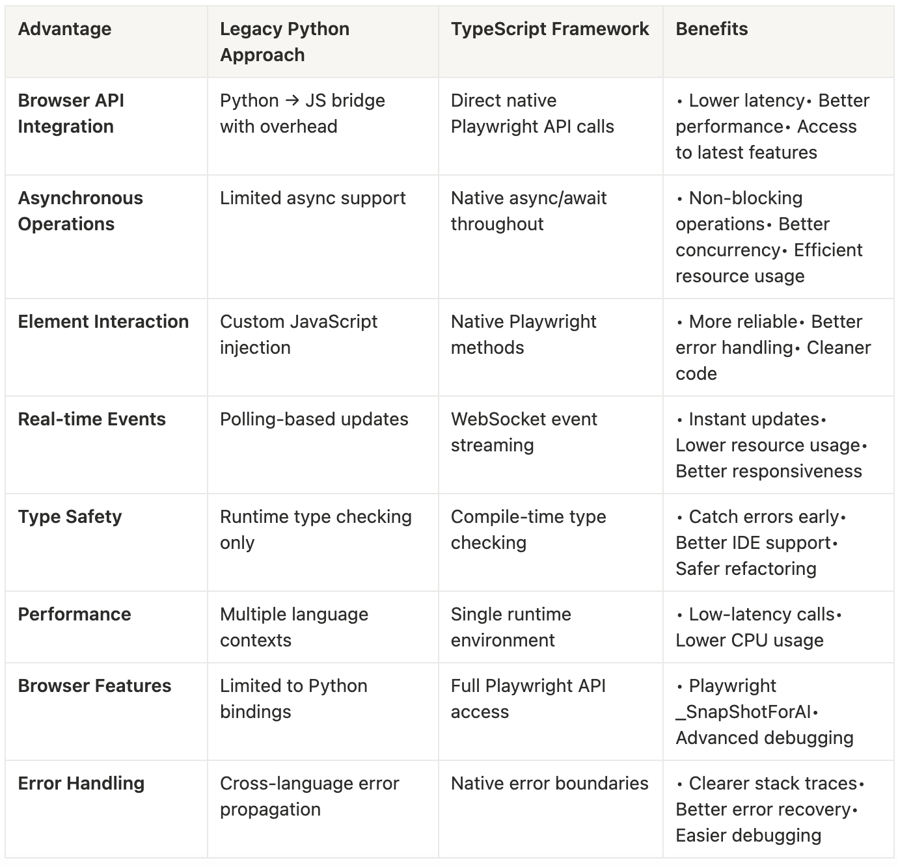
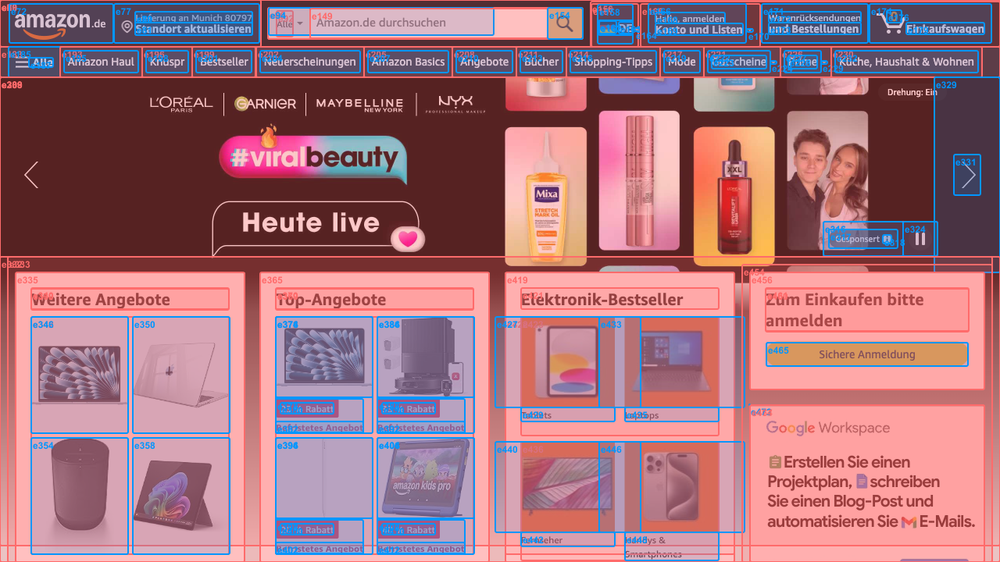
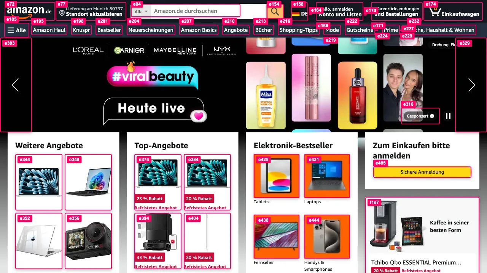
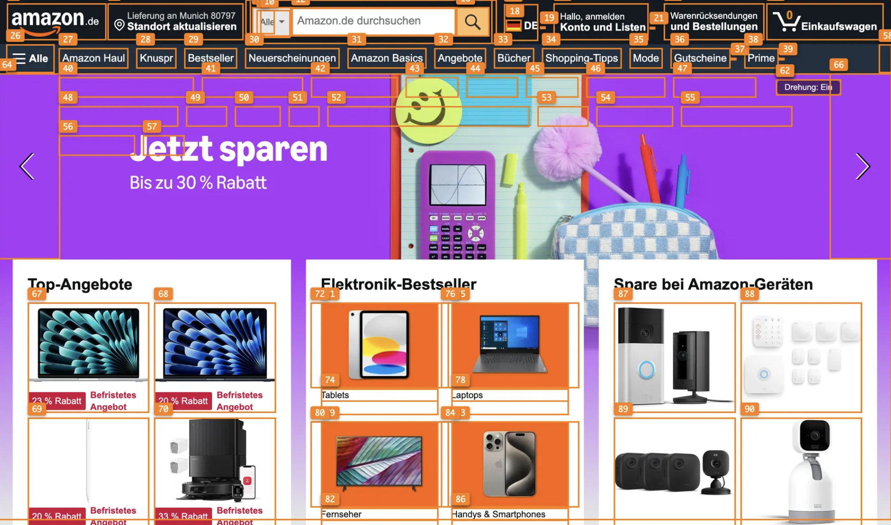
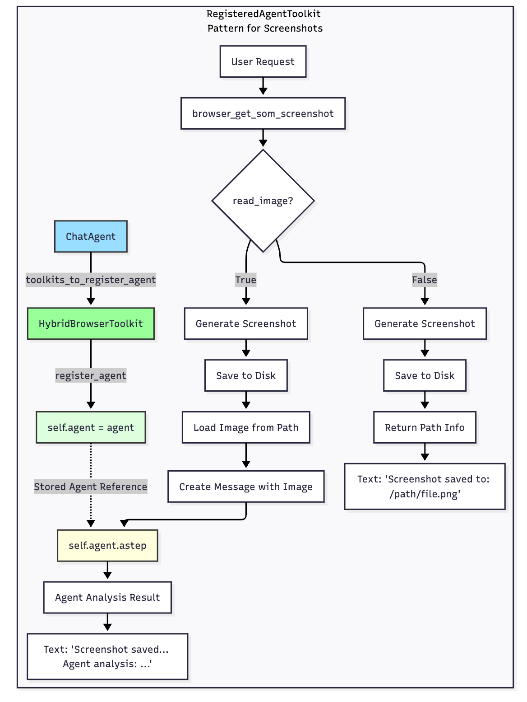
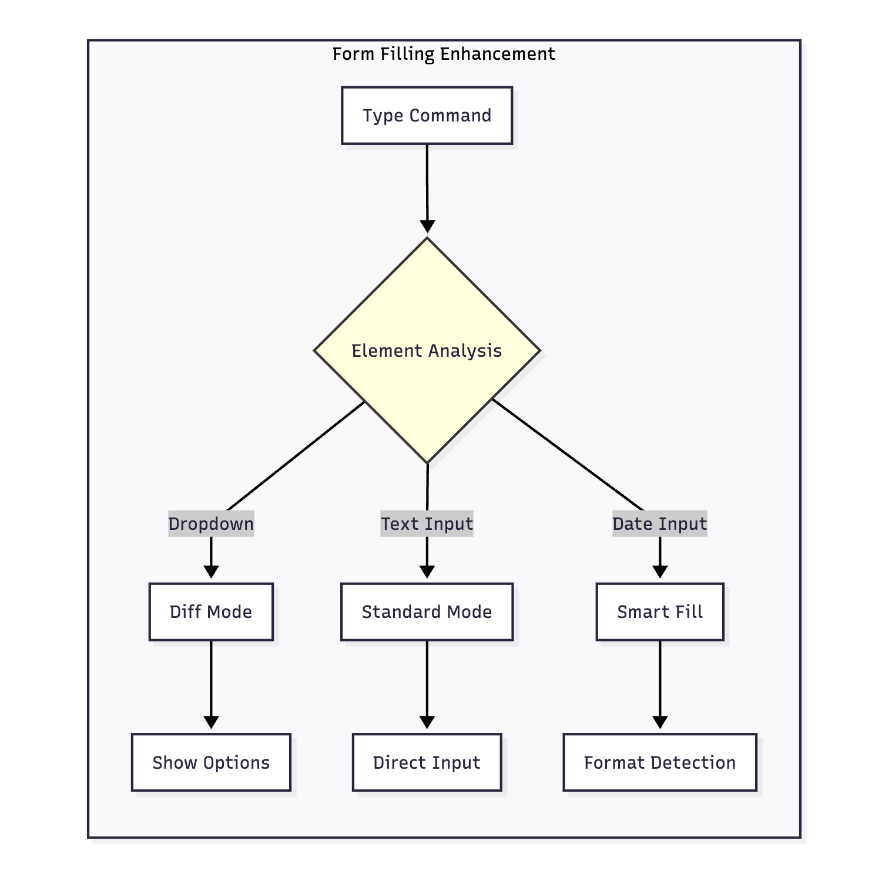

During the development of the CAMEL AI framework, we have been using browser automation tools to enable AI Agents to complete complex web tasks. The initial implementation was pure Python, based on Playwright Python bindings. However, as use cases increased, we gradually discovered some unavoidable pain points.

The first issue was unstable snapshot quality. AI Agents need to understand web content to make correct decisions, and at that time we could only traverse the DOM tree and extract element information using JavaScript scripts ourselves. This process was not only error-prone but also frequently missed important interactive elements.

The second pain point was the contradiction between cost and speed. When page content was complex, we needed to provide AI with visualized screenshots to help understand the layout, but the cost of image tokens was several times that of text, and processing speed was much slower. While pure text snapshots were cheap and accurate, they were prone to errors when encountering complex visual layouts. We needed a mechanism that could intelligently switch between the two.

The third issue was the reliability of form filling. Real-world web forms come in all shapes and sizes: some input boxes are hidden in multiple layers of nesting, some dropdown menus are dynamically loaded, and some date pickers only show the actual input box after clicking. Relying purely on Playwright’s basic APIs made it difficult to handle these edge cases.

So we decided to rethink this problem from an architectural level.

### We decided to refactor to TypeScript, but why?

CAMEL is a pure Python framework, and introducing Node.js would increase dependency complexity. However, after in-depth research, we found this was almost an inevitable choice.

Playwright is essentially developed in TypeScript, and the Node.js version is a “first-class citizen”. Many advanced features are implemented first in Node.js and then ported to Python bindings. For example, the `_snapshotForAI()` API we mentioned earlier can generate AI-optimized DOM snapshots, automatically handling ARIA attributes, element hierarchies, interactivity judgments, and other complex logic. If using pure Python, we would need to write over a thousand lines of JavaScript code ourselves to implement these features, and it would be difficult to guarantee quality.

More importantly, browsers themselves run in a JavaScript environment. When we need to perform advanced operations within a page—such as detecting whether elements are occluded or dynamically injecting visual markers—executing directly in the browser’s JavaScript context is much more efficient than controlling indirectly from the Python side through the CDP protocol.

So the final architecture is as follows:

**TypeScript layer handles browser interaction**: Manages all logic related to Playwright and DOM operations, directly calling native APIs for optimal performance.

**Python layer handles AI orchestration**: Manages LLM calls, Agent decision-making, and task flow control, which is Python ecosystem’s strength.

The two communicate asynchronously through WebSocket, without blocking each other. The Python side initiates a browser operation request, the TypeScript side executes and returns the result, and the entire process is transparent to the user.

### Multi-Modal Output: Finding Balance Between Cost and Accuracy

After having stable snapshot generation capabilities, we began thinking about the next question: when should we use text, and when should we use images?

In actual use, we found that pure text snapshots are sufficient in most cases. For example, filling out a login form, the AI only needs to know “here is a username input box ref=e123, a password input box ref=e124, and a submit button ref=e125” to complete the task accurately. Text tokens are cheap, processing is fast, and information is very precise.

But there are also scenarios where pure text loses critical information. For example, a complex dashboard with dozens of buttons and charts might have a text snapshot of thousands of lines, making it difficult for AI to understand which button is in which area. Or a visual design task like “move the blue button to the upper right corner” simply cannot be completed without a screenshot.

So after decoupling all operational actions into primitive tools, we also provide `browser_get_page_snapshot` and `browser_get_som_screenshot` as optional actions to the agent, allowing the agent to freely switch between these two modes.

### Snapshot Optimization: Making AI See More Precisely

Even with`_snapshotForAI()`, we found there was still room for optimization in the generated snapshots.

#### Problem 1: Interference from Decorative Elements

Playwright snapshots include all ARIA-accessible elements, including many purely decorative icons, dividers, and decorative text. For example, a navigation bar might have 50 elements, but only 5 links are actually clickable, the rest are decorative. This noise distracts the AI’s attention and increases reasoning costs.

Our approach was to add intelligent filtering logic on the Node.js side. By parsing the DOM hierarchy relationships through `snapshot-parser.ts`, we identify the true “parent elements”. For example, if a button contains nested icons and text, we only keep the outermost button element and filter out the decorative child elements inside. This filtering is implemented through `filterClickableByHierarchy()`, with rules including: if a link tag contains an img, remove the img and keep only the link; if a button contains generic elements, remove the generic and keep the button.

#### Problem 2: Meaningless Off-Screen Elements

Web pages are usually very long, and users can currently only see a small portion (viewport). But snapshots by default include all elements of the entire page, including parts that require scrolling to see. This is noise for AI—it shouldn’t try to click a button that hasn’t been scrolled to yet.

We added a `viewportLimit` parameter. When enabled, only elements within the current viewport are returned. This filtering is done on the browser side, calling the `isInViewport()` function to check whether the element’s `getBoundingClientRect()` is within the visible area. This way, the snapshot the AI sees is more focused, and decision quality is higher.

#### Problem 3: Misleading from Element Occlusion

This is a more subtle problem. Some elements exist in the DOM tree but are blocked by other elements, so users can’t see or click them. If we include these elements in the snapshot, the AI might try to click and then fail.

In SoM screenshot mode, we implemented occlusion detection. Through the `checkElementVisibilityByCoords()` function, for each element’s center point we call `document.elementsFromPoint(x, y)`, a native browser API that returns all elements at that coordinate point, sorted by z-index from high to low. If our target element is not at the top layer, it means it’s occluded. We draw dashed boxes (instead of solid lines) for such elements, or filter them out directly.

These optimizations all benefit from the TypeScript architecture. `document.elementsFromPoint()` is implemented in native browser C++, with extremely high performance. If on the Python side, we could only get coordinate data and then use inefficient algorithms to judge ourselves, which would be both slow and inaccurate.

### SoM Screenshot: Why Inject in Browser Rather Than Post-Process?

SoM screenshots present an interesting design challenge. We need to mark all interactive elements in screenshots, drawing a box and number for each element.

The most intuitive approach is: take a screenshot first, then use Python’s PIL library to draw boxes on the image. The pure Python version did exactly this. But we found this solution has several problems:

**Poor visual quality**. PIL is CPU software rendering, and the drawn lines have jagged edges.

**Cross-platform inconsistency**. PIL depends on system font libraries, and the font paths are different on Windows, macOS, and Linux, often resulting in “cannot find arial.ttf” errors, ultimately having to use ugly default fonts.

**Most importantly**, when connecting to an existing browser in CDP mode, for screens with different resolutions, the zoom ratio needs to be adjusted to accurately map element coordinates to the correct positions on the image, which is very cumbersome.

**Large data transmission**. The Python version needs to first execute a JavaScript script to collect all element information, including coordinates, attributes, metadata, etc., then serialize this data into JSON and send it back to Python. For a page with huge amount of elements, this JSON might contain many redundant fields (such as disabled, checked, expanded, etc., which SoM doesn’t need at all).

The TypeScript version’s approach is: **directly inject DOM elements as markers in the browser, then take a screenshot**.

The specific process is as follows: execute JavaScript in the browser context through `page.evaluate()`, create an `overlay` div covering the entire page, with z-index set to the highest value. Then for each element that needs to be marked, create a `label` div, set borders, background colors, and text, and position it correctly using CSS. Call `requestAnimationFrame()` to wait for browser rendering to complete, then take a screenshot. After the screenshot is complete, call `page.evaluate()` again to delete this overlay.

The benefits of this approach are:

**Visual perfection**. Markers are drawn by the browser rendering engine, with GPU acceleration, anti-aliasing, and perfect font rendering. We can use CSS to implement rounded corners (`border-radius`), shadows (`box-shadow`), and transparency (`opacity`), resulting in very professional visual effects.

**Cross-platform consistency**. The browser guarantees rendering consistency, with the same effect regardless of which operating system it runs on.

**Small data transmission**. We only need to pass in element refs and coordinates, the browser internally completes marker drawing, then returns a simple result object.

**Intelligent label positioning**. We implemented the `findLabelPosition()` function, which tries multiple positions (above, below, left, right, diagonal of the element), checks for overlap with existing labels, and automatically selects the optimal position. This is very simple to implement on the browser side because we can directly manipulate DOM element positions. If using PIL on the Python side, we would need to maintain a complex coordinate recording system, which is very inefficient.

Another detail: during visibility detection, we mark completely occluded elements as `hidden` status and skip drawing labels directly; partially visible elements are marked as `partial`, with dashed boxes and semi-transparent labels. This allows AI to distinguish which elements are truly interactive.

‍

**_Our Previous SOM screenshot:_**

**_Our Current SOM screenshot:_**

**_Other popular open source SOM screenshot:_**

‍

‍

‍

### Tool Registration Mechanism: Avoiding Context Explosion

‍

Early versions had a hidden performance issue: SoM screenshots were saved in the agent’s context. If the Agent needed to take multiple screenshots (such as browsing multiple pages), context usage would grow rapidly.

Our solution is to require the agent to write instructions as prompts when calling the `browser_get_som_screenshot` tool, allowing the agent to leave corresponding descriptions in the context, while the image itself does not occupy the agent’s context.

This optimization requires coordination with CAMEL’s Agent registration mechanism. Through the `RegisteredAgentToolkit` base class, we allow the Toolkit to access the Agent instance that registered it. Specifically, when `browser_get_som_screenshot` is called, if a registered Agent is detected, the Agent’s `astep()` method is automatically called, passing a Message object containing the image path. The Agent internally uses PIL to load the image and passes it to the multimodal LLM for analysis.

This design achieves clear separation of responsibilities: the Toolkit is responsible for generating screenshots, and the Agent is responsible for analysis and understanding. The connection between them is only through the lightweight interface of file paths.

### Form Filling Optimization: Dealing with Real-World Complexity

Real-world web forms are much more complex than imagined. We encountered various strange scenarios during testing and gradually optimized to the current solution.

#### Batch Processing of Multiple Input Boxes

The simplest optimization: allow filling multiple input boxes in one command. When calling `browser_type()`, pass a dictionary `{ref1: text1, ref2: text2}` to complete it all at once. This avoids multiple round trips containing snapshot changes and reduces the risk of page state changes.

#### Intelligent Dropdown Menu Detection

Some input boxes are actually disguised dropdown menus. For example, a search box will pop up a suggestion list when you type. Our `browser_type()` implementation has a `shouldCheckDiff` logic: if the input box type might trigger a dropdown menu (role includes combobox, searchbox, etc.), we capture a snapshot before and after input, then calculate the diff to extract newly appeared option elements. This diff result is returned to the Agent, so the Agent knows “there are now these options to choose from”.

#### Snapshot Difference for Dynamic Content

This function is implemented in `getSnapshotDiff()`. The principle is to compare two snapshot texts and find newly added elements of specific types (such as option, menuitem). We use regular expressions to match `[ref=...]`, record all refs in the first snapshot, then find newly appeared refs in the second snapshot. This way the AI can see “after clicking this input box, 5 options appeared”.

#### Special Handling for Read-Only Elements

Date pickers are usually a read-only input box that pops up a calendar component after clicking. Our `performType()` function first checks the element’s `readonly` attribute and `type` (date, datetime-local, time, etc.). If it’s this type of element, click it first, wait 500ms, then look for the actual input box in newly appeared elements (matched by placeholder).

#### Nested Input Box Search

Some buttons, after clicking, don’t directly replace the original position but appear in nested child elements. Our strategy is: if `fill()` fails on a certain ref, search for `input`, `textarea`, `[contenteditable]`, etc. in its child elements and try to fill. This search uses Playwright’s `locator()` API, which supports complex CSS selectors.

#### Error Recovery Mechanism

All this complex logic is wrapped in try-catch blocks. If a step fails, we record detailed error information (including the element’s tagName, id, className, placeholder, and other debugging information), but don’t throw an exception directly; instead, we try the next strategy. Only when all strategies fail do we return a descriptive error message to the Agent.

These optimizations were accumulated gradually in actual use. Each time we encountered a form that the Agent couldn’t handle, we analyzed which link had the problem and then made targeted improvements.

### Future Plans

1. **Improved Page Snapshots**

A high-quality snapshot is fundamental to the efficiency of browser-use agents. An ideal snapshot should maintain a high signal-to-noise ratio and low redundancy, preserving meaningful information while filtering out noise.

Current implementations still include numerous empty or generic elements, and the filtering of off-viewport elements remains imprecise. In some cases, invisible or irrelevant nodes are still captured, leading to unnecessary data and potential confusion for the model.

Future work will focus on optimizing snapshot extraction to ensure that only semantically relevant and visually significant elements are retained. This includes accurate viewport filtering, hierarchical aggregation of non-interactive elements, and enhancing semantic representation for key UI components. The goal is to create a snapshot format that is compact yet information-dense, improving model understanding and token efficiency.

**2. Support for Purely Visual Model Evaluation Environment**‍

Recently, several model providers have introduced purely visual, coordinate-based “computer-use” models, such as Gemini 2.5 Computer Use, which interact with GUIs directly through pixel-level clicks, similar to human users. Under this paradigm, performing computer-use tasks no longer requires complex engineering layers to expose element-level interaction APIs, which significantly simplifies the implementation of GUI interaction for model developers.

To support this new paradigm, we can provide a simulation and evaluation environment where model-predicted click coordinates can be validated against ground-truth element positions derived from snapshots. This framework would enable accuracy assessment and reinforcement learning for purely visual GUI agents. Such an environment could serve as foundational infrastructure for training and benchmarking vision-based computer-use models, reducing engineering overhead for model developers.

**3. Reliable Long-Term Memory Paradigm**

Browser-use is a specific form of GUI interaction where an agent operates within a web environment through sequential actions and feedback. As the action sequence grows, the accumulation of intermediate feedback poses challenges: exceeding context length limits, reducing efficiency of historical retrieval, and increasing the risk of information loss.

This issue is even more pronounced for purely visual models, as visual context lacks structured semantics and cannot be easily indexed or summarized. Building a robust long-term memory paradigm is therefore essential.

Future efforts will explore mechanisms for efficient retrieval and compression of historical states and feedback, combining semantic summarization, hierarchical caching, and adaptive context reconstruction. The ultimate goal is to enable agents to maintain awareness and continuity over extended sequences, preserving both behavioral traceability and task coherence.

‍

# Thanks to the Community

All of the above refactors are task-motivated. Through extensive testing and collaboration with community members, we gradually developed and implemented these ideas together. Since browser use is a highly engineering-oriented part of Agent era, it can only be continuously improved through rich and diverse testing. We would like to express our gratitude to everyone in the community for their contributions. 🌟🐫
