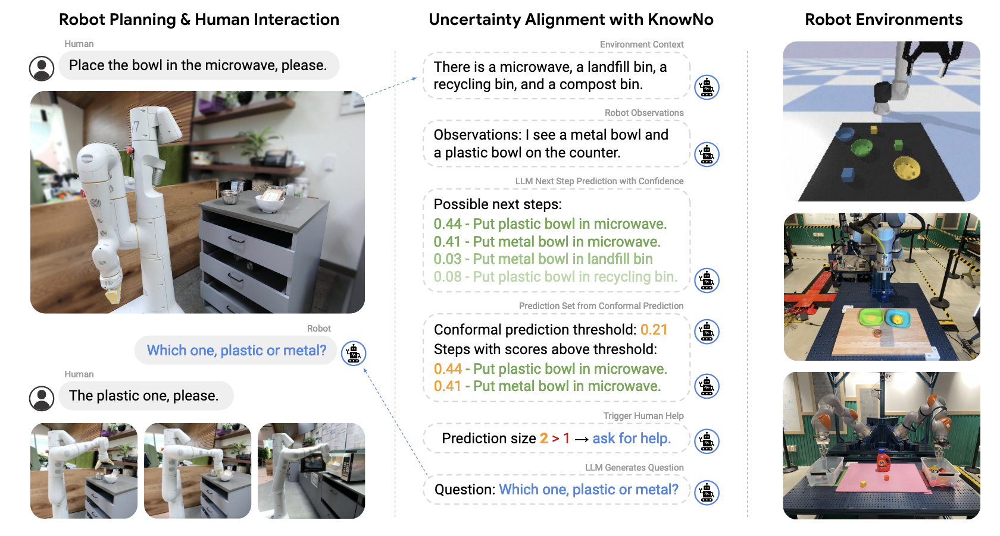
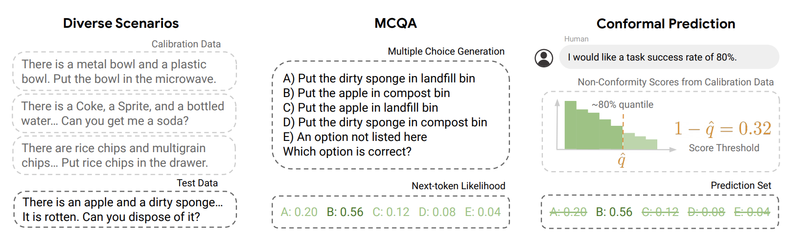
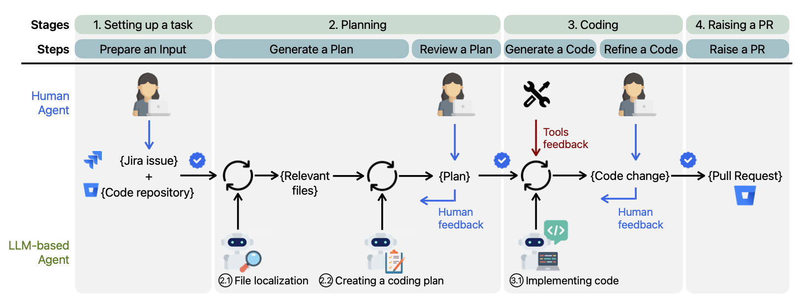
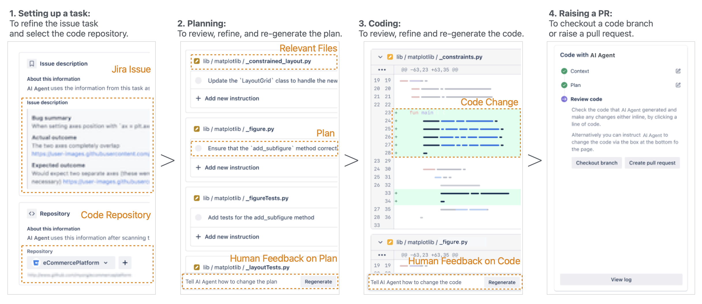
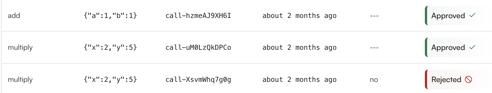
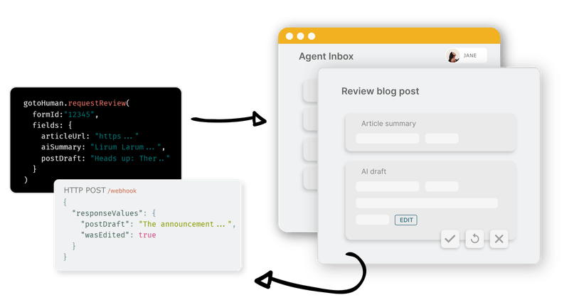
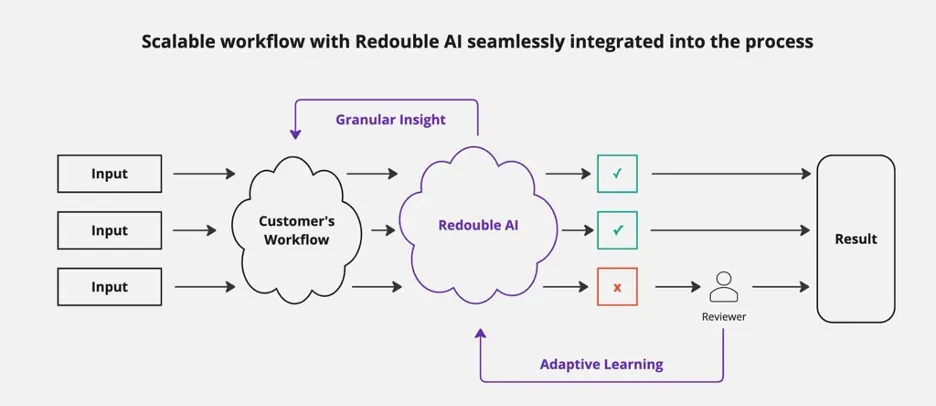
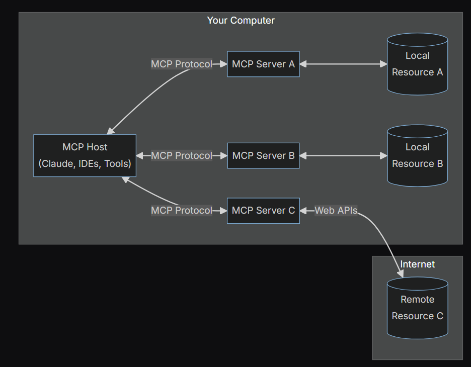
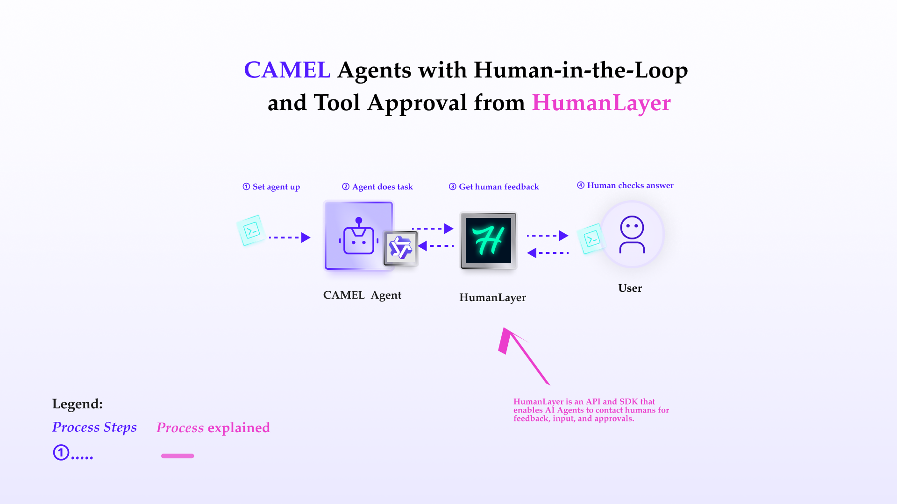

#### **Authors:** [**Xiaotian Jin**](https://github.com/mugglejinx)**,** [**Zekun Guo**](https://github.com/drzekunguo)**,** [**Puzhen Zhang**](https://github.com/nitpicker55555)**,** [**Shuo Lu**](https://github.com/shuolucs)**,** [**Weisi Dai**](https://github.com/ VC7100)**,** [**Nujibieke**](https://github.com/nuerjibieke)**,** [**Lanping Guo**](https://github.com/CharliGuo)**,** [**Wendong Fan**](https://github.com/Wendong-Fan)**,** [**Guohao Li**](https://github.com/lightaime)

‍

## **AI agents / Human-in-the-loop background**

The rapid advancement of deep learning, foudnation models and Large Language Models (LLMs) has propelled AI agents from specialized tools to autonomous multi-agent systems capable of handling complex, multi-step tasks. These agents demonstrate remarkable capabilities in natural language understanding, decision-making, and self-refinement. However, challenges such as hallucinated results, unreliable predictions, and lack of oversight limit their trustworthiness, particularly in high-stakes domains like robotics, software development, and decision automation.

To enhance AI reliability, researchers have developed Human-in-the-Loop (HITL) frameworks, which integrate human expertise at key decision points to improve efficiency, accuracy, and accountability. HITL systems strike a balance between automation and human judgment, ensuring that AI escalates uncertain or critical decisions to experts while efficiently handling routine tasks autonomously. Conformal prediction, iterative feedback loops, and interactive validation are among the core techniques that empower HITL frameworks to minimize errors and increase adaptability in dynamic environments.

This review explores the latest advancements in HITL techniques for multi-agent LLM systems/orchestrations, focusing on both research innovations and industrial applications. We examine state-of-the-art frameworks that implement human oversight mechanisms, as well as real-world deployments where HITL solutions enhance AI-driven workflows in robotics [[1],](https://arxiv.org/abs/2307.01928v2) software engineering [[2]](https://arxiv.org/pdf/2411.12924), and autonomous agents. By analyzing these developments, We highlight how frameworks with human oversight mechanisms improve outcomes in domains like autonomous robotics, LLM-powered developer tools, and multi-agent collaboration platforms

## Human-In-The-Loop in Research Literature

#### [KnowNO Framework](https://robot-help.github.io)

In dynamic and unfamiliar environments, autonomous agents and robotic systems powered by large language models (LLMs) often face a common problem: making overly confident yet incorrect predictions. A team of researchers from Princeton University and Google DeepMind addressed this issue by introducing the [KnowNo](https://arxiv.org/abs/2307.01928v2) framework [[1]](https://arxiv.org/abs/2307.01928v2). This system helps robots recognize when they’re uncertain and allows them to ask for help from humans when necessary, using a concept called conformal prediction (CP).

###### **How Does KnowNo Work?**

The KnowNo framework integrates large language models (LLMs) and conformal prediction techniques in a structured pipeline. Here’s how it operates step by step:



KnowNo framework integrates LLM predictions and conformal prediction to trigger human queries when confidence is low.

1. **Generating Candidate Plans:** The process begins with an LLM creating a list of possible action plans. These are presented as a multiple-choice question (MCQ) format, including an “E” option for "none of the above." To come up with these options, the LLM considers:
   - The robot’s observations (e.g., what it “sees” or detects in the environment).
   - The task instructions provided by the user.
   - Examples of how similar problems were solved before.By combining these inputs, the LLM builds a rich context and generates a list of possible actions.
2. **Assessing Uncertainty and Narrowing Down Choices:** Using conformal prediction, the system evaluates the confidence level for each candidate plan. The goal is to identify a set of plausible actions while filtering out those deemed too uncertain. If the system narrows down to a single, high-confidence option, it proceeds to execute it. Otherwise, it knows it’s unsure and triggers the next step.
3. **Seeking Human Help:** When the robot’s prediction isn’t confident enough, it asks a human for assistance. This ensures that even in ambiguous scenarios, the robot can rely on human expertise to move forward.
4. **Executing the Plan:** Once the robot has a clear next step—whether determined autonomously or with human input—it executes the action.



Combining multiple-choice generation with conformal prediction enables calibrated decision-making under uncertainty.Type image caption here (optional)

‍**Key Insights from KnowNo:**

- **Smart Use of Uncertainty**: The framework transforms robot planning into a question‐answering format in which the LLM generates plans and CP techniques determine which ones are reliable. By explicitly handling uncertainty, the system can decide when it is safe to act independently and when to involve humans.
- **Handling Complex Tasks**: KnowNo doesn’t stop at single decisions. For multi-step tasks, it aligns uncertainty across the entire sequence. This involves recalibrating predictions step by step to ensure consistency and minimize human intervention while maintaining accuracy.

In terms of the experiment, in scenarios such as simulated tabletop rearrangement, multi-step tabletop rearrangement on hardware, and hardware-based mobile robotic arm kitchen tasks, comparisons were made with baseline methods like Simple Set and Ensemble Set. The results demonstrate that **KnowNo** consistently achieves the target task success rate. Under varying error rate settings, it achieves higher success rates with less human assistance and shows adaptability to different LLMs.

**Experiment Highlights:**

The researchers tested KnowNo in various scenarios, including:

- Simulated tabletop object rearrangement.
- Physical robots performing multi-step object manipulation.
- A mobile robotic arm operating in a kitchen setting.

Compared to baseline methods like Simple Set and Ensemble Set, KnowNo stood out by:

- Achieving target success rates even in challenging conditions.
- Reducing the need for human help without compromising task performance.
- Adapting well to different LLMs and task complexities.

**Some Thoughts and Suggestions:**

While KnowNo is an impressive step forward, a few areas could be improved:

- **Handling Human Error**: The system assumes humans always provide accurate help, which may not hold true in real-world scenarios. Introducing a model to simulate or account for human mistakes could make the framework more robust.
- **Efficiency Concerns**: Generating and calibrating prediction sets for complex, multi-step tasks can be computationally expensive. Exploring more efficient calibration methods, such as hierarchical or incremental strategies, could significantly reduce the runtime costs.

#### [The HULA framework: Bridging Automation and Human Expertise in Software Development](https://arxiv.org/abs/2411.12924)

The [HULA](https://arxiv.org/pdf/2411.12924) (Human-in-the-loop LLM-based Agents) framework[[2]](https://arxiv.org/pdf/2411.12924), proposed by researcher from Monash University and The University of Melbourne, enables software engineers to guide intelligent agents in software development tasks. By balancing automation with human expertise, HULA incorporates human feedback at every stage, improving the quality and efficiency of software development. The authors also showcase the integrations of the HULA framework into Atlassian JIRA.



HULA framework combines human oversight with LLM agents for software engineering across planning, coding, and PR workflows.

The HULA framework consists of three main agents that collaborate to enhance the software development process:

1. **AI Planner Agent**: This agent identifies files related to the issue and formulates a coding plan.
2. **AI Coding Agent**: Based on the coding plan, this agent generates code changes that address the specified problem.
3. **Human Agent**: This role is fulfilled by software engineers who provide feedback on the performance of the AI agents and collaborate throughout the process.

The workflow of the HULA framework can be broken down into several key stages:



HULA Workflow

- **Setting up a Task**: The software engineer selects a task and links it to the relevant code repository. Each task is accompanied by descriptive information that outlines its requirements.
- **Planning**: The AI Planner Agent uses the task description to understand the work and its context. It identifies relevant files for the task, which the software engineer can review, edit, and confirm. After identifying the files, the AI Planner creates a coding plan to modify them and resolve the issue. The Human Agent then reviews this plan, provides additional instructions, and may regenerate it if needed. The Human Agent can also modify the list of relevant files and adjust the change plan. After several iterations, the Human Agent confirms the plan, allowing the process to proceed to the next stage.
- **Coding**: Once the software engineer approves the coding plan, the AI Coding Agent generates code changes for each file. The Human Agent reviews these changes and can provide further instructions if they don't meet expectations, prompting the AI Coding Agent to regenerate them. The AI agent also uses additional tools to optimize the code. This iterative process continues until the code passes validation or reaches the maximum number of attempts.
- **Raising a Pull Request**: Once the Human Agent agrees with the code changes, the generated code modifications are submitted as a pull request for review by other developers or processed as appropriate.

The team evaluate the HULA framework in three stages to measure its effectiveness:

**(1) An offline evaluation** of HULA without human feedback to fully **automate** the process using SWE-Bench and internal dataset of JIRA issues. It is also known as a **pre-deployment** evaluation to ensure the HULA framework achieves an acceptable performance before deployment.

**(2) An online evaluation** of HULA augmented by human feedback using **real-world** JIRA issues. This is conducted in the actual development practice with 45 software engineers at Atlassian, it provides further insights into HULA’s performance from **actual usage conditions**.

**(3) An investigation** of the practitioners' perceptions on the benefits and challenges of using HULA. The team conducted an online survey, which included of 8 questions focusing on HULA's performance and 3 questions about user feedback.

In the **offline evaluation**, the performance of HULA for SWE-Bench is **comparable to SWE-agent Claude**, which ranks 6th on the SEW-Bench leaderboard. However, the authors found HULA achieves a **lower accuracy on the JIRA dataset** compared to the SWE-Bench dataset. This suboptimal performance could be due to the increased diversity of input, both in programming languages and repositories.

For the SWE-Bench dataset, issues typically had **detailed descriptions with key information**, like module names or code snippets. However, real-world JIRA issues usually consist of **informal knowledge transfer**, like meetings or chats, instead of detailed documentation in the internal dataset. Therefore, in the **online evaluation** with Human Agent,  **8% of the JIRA issues had successfully merged HULA-assisted PRs** containing the HULA-generated code into the code repositories.

By comparing the offline and online evaluations, we conclude that the **detail of input can highly affect the performance of LLM-based software development agents**. However, practitioners highly agree when they can engage in the process by reviewing and enriching the issue descriptions. Furthermore, in the investigation, most participants agreed that the coding plan was accurate and the generated code was easy to read and modify, which helped **reduce their initial development time and effort**. Also, a few participants acknowledged that **HULA’s workflow could promote good documentation**, but it requires more effort to provide detailed issue descriptions.

## Current Human-in-the-loop solutions

#### [HumanLayer](https://www.humanlayer.dev)

HumanLayer is a YC-backed company in F24 batch raised $500K in its pre-seed round. They are working on providing an API and SDK that integrates human decision-making with AI agent workflow. With HumanLayer, AI agent is able to request human approval at any step in its execution, as the product handles routing of requests or messages to the designated group through their preferred channel. It is framework agnostic and can be easily integrated into any agent frameworks that has tool-calling functions.

HumanLayer is designed to revolutionize the future of AI by empowering the next generation of Autonomous Agents. These agents are no longer reliant on human initiation; instead, they operate independently in what we call the “outer loop,” actively working toward their goals by utilizing a variety of tools and functions. Communication between humans and agents is now agent-initiated, occurring only when a critical function requires human approval or feedback. This shift unlocks a new level of efficiency and autonomy, allowing AI to evolve in ways that were once unimaginable.

Key features：

1. **Approval Workflows**: Rapidly launch the SDK to ensure human oversight for critical function calls. Denied messages will be fed back to agent context window, allowing agents to learn and conduct automatic approval/deny based on past human interactions. What elements can be controlled by a human in this workflow:
   1. Creation of approval request
   2. Pausing AI workflow until reaching decision outcome
   3. Execution of pre-defined tasks for rejection cases



HumanLayer cloud for receiving approvals

1. HumanLayer cloud for receiving approvals
2. For this part of functionality, HumanLayer backend is responsible for handling of approval requests and routing to target groups for decision outcome.
3. **Humans as Tools**: Integrate multiple human contact channels into agent's toolchain for AI agent to review human feedback **(not approval)**.What elements can be controlled by a human in this workflow:
   1. Creation of approval request
   2. Pausing AI workflow until reaching decision outcome
   3. Passing the response back to the LLM
4. HumanLayer SDK handles message routing and collecting response/input from human.
5. **Custom Responses and Escalation**: Pre-fill response prompts for seamless human-machine interaction and coordinated approvals across multiple teams and individuals
6. Users can define structured response options to guide or format human inputs.

HumanLayer currently supports these channels of communication in dashboard settings: Slacks, email, SMS, WhatsApp. Users are able to configure advanced options such as direction integration with react applications or composite channels with custom rules.

#### [GotoHuman](https://www.gotohuman.com)



Image Source: [gotohuman](https://www.gotohuman.com/)

GotoHuman is a human-in-the-loop solution designed to integrate human oversight into AI-driven workflows, ensuring accurate and context-aware decision-making.

Some of the features are:

- **Custom Review Forms:** Quickly create tailored forms to display content or capture human input, allowing your team to review AI-generated content, approve workflow steps, or provide necessary input.
- **Human Review Requests:** Utilize Python or TypeScript SDKs, or directly call the API, to request human reviews when AI-generated content or workflow steps require approval.
- **Human Decision Awaiting:** Review requests are automatically shared with your team in an authenticated environment. Short-lived public links can also be activated for external reviewers.
- **Response Reception:** Upon completion of a review, results are sent to your custom webhook, allowing your workflow to proceed seamlessly.

gotoHuman is designed to work with any AI framework, library, or model, providing flexibility in integration.  It offers SDKs for Python and TypeScript. By integrating gotoHuman, teams can maintain human supervision within AI workflows, enhancing safety, compliance, and precision.

#### [Redouble AI](https://www.redouble.ai)



Image Source: [Redouble AI](https://www.redouble.ai)

Redouble AI is a young, YC-backed company that raised $500K in September 2024. Publicly available information about the company is limited. Currently, there are no published papers, open-source code, or user feedback accessible.

Redouble AI is the solution to scale human-in-the-loop for AI workflows in regulated industries.

1. Dynamically learns from your unique domain-specific human feedback data.
2. Provides recommendations on whether to send the output of your LLM pipeline to a human for review.
3. Monitor the insights from your human reviewers at scale while also flagging suspicious reviews to ensure consistent final outputs.
4. Integrate easily with your existing pipeline with just a couple of simple API calls.

‍

#### [Model Context Protocol (MCP)](https://modelcontextprotocol.io/introduction)



Image Source : [modelcontextprotocol.io](https://modelcontextprotocol.io/introduction)

MCP (Model Context Protocol) is an open standard proposed by Anthropic, designed to provide a unified interface for AI assistants to interact with external systems (such as files, APIs, and databases), similar to how USB-C serves as a universal standard in hardware.

It addresses the challenges of integrating AI models with heterogeneous data sources and tools, improving response accuracy and relevance through a standardized communication mechanism.

In a human-in-the-loop setup, an AI agent can leverage MCP servers as integration tools within platforms like Slack to send notifications and seek human guidance before executing critical actions. For example, if the agent detects a potential scheduling conflict in an automated calendar update, it can use the Slack MCP server to send a message asking a human operator for suggestions or explicit approval before proceeding.

**MCP’s implementation involves in:**

- By deploying MCP servers (such actions), AI can directly invoke external functions without repeatedly writing adapter code.
- **Supports bidirectional communication**: AI can access data as well as respond to tool-triggered actions.

**Why we need MCP? Because we have the following industry challenges:**

- **Data Silos**: AI models are constrained by fragmented data sources, making cross-system collaboration difficult.
- **Inefficient Development**: Different systems require custom integrations (e.g., API variations, authentication methods), leading to redundant code and high maintenance costs.
- **Security Risks**: Separate security protocols for each platform complicate access management.

**To address these challenges, MCP provides:**

- **Unified Interface**: Standardized tool invocation processes reduce the technical barriers for developers. Providing a universal specification supporting mainstream programming languages (such as Python and TypeScript), enabling developers to quickly build MCP clients or servers. For example, Claude’s desktop application includes built-in MCP support for "plug-and-play" functionality.
- **Long-Term Compatibility**: Abstracting the protocol layer minimizes maintenance burden due to system API changes.
- **Bidirectional data interaction**: AI can read/write external systems (e.g., database queries, file editing) via MCP. Some use cases are: Enterprise tools (Slack, Google Drive), development environments (Git, VS Code extensions), etc.
- **A tool ecosystem:**
  - **Anthropic provides SDKs and open-source libraries** (e.g., `@mcp-foundation/*`) to accelerate enterprise system integration.
  - **Extensibility**: Supports custom feature extensions to accommodate private deployments.

**By using MCP, we can achieve:**

- **Cost Reduction**: Cuts over 60% of custom integration development time.
- **Enhanced Security**: Centralized access management reduces data leakage risks.
- **Ecosystem Collaboration**: Drives AI evolution from "closed inference" to "open system agents," laying the foundation for AGI deployment.

## CAMEL with Human-In-The-Loop



CAMEL-AI integrates HumanLayer to allow agents to consult users and get approval for critical tasks.

[**CAMEL-AI**](https://github.com/camel-ai/camel) is an open-source community dedicated to finding the scaling laws of agents. CAMEL framework implements and supports various types of agents, tasks, prompts, models, and simulated environments.

The **Human-In-The-Loop** features in CAMEL facilitates collaborative interactions between AI agents and human participants. It is designed to simulate dynamic exchanges where AI agents take on specific roles (e.g., AI Assistant and AI User) to complete tasks, while a human acts as a critic or supervisor to guide the process. This framework is ideal for tasks requiring creativity, problem-solving, or iterative refinement.

In current version of CAMEL, it supports two important ability:

**1. Human-In-The-Loop**: The ability for agent to consult human during the execution of the task (by using HumanToolkit)

This ability provides agents the ability to consult human, the basic use case is like a chatbot:

```
from camel.toolkits import HumanToolkit
human_toolkit = HumanToolkit()
agent = ChatAgent(
    system_message="You are a helpful assistant.",
    model=model,
    tools=[*human_toolkit.get_tools()],
)
response = agent.step(
    "Test me on the capital of some country, and comment on my answer."
)
```

‍`‍`The basic examples turns our agent into a interactive chatbot. The true power of **Human-in-loop** shows when make use of multiple agents (**Workforce** module in Camel).  
‍

For example, this use cases shows how to use agents to help design a travel plan, and ask user for the feedback to modify the plan.  
‍

```
# ignoring imports...
human_toolkit = HumanToolkit()
search_toolkit = SearchToolkit()

task = Task(
    content="Make a travel plan for a 2-day trip to Paris. Let user decide the final schedule in the end.",
    id="0",
)

# This agent research and design the travel plan.
activity_research_agent = ChatAgent(
    system_message="""
    You are a travel planner. You are given a task to make a travel plan for a 2-day trip to Paris.
    You need to research the activities and attractions in Paris and provide a travel plan.
    You should make a list of activities and attractions for each day.
    """,
    model=openai_model,
    tools=[*search_toolkit.get_tools()]
)

# This agent reviews the plan, and consults user for feedback!
review_agent = ChatAgent(
    system_message="""
    You are a reviewer. You are given a travel plan and a budget.
    You need to review the travel plan and budget and provide a review.
    You should make comments and ask user to adjust the travel plan and budget.
    You should ask user to give suggestions for the travel plan and budget.
    """,
    model=openai_model,
    tools=[*human_toolkit.get_tools()]
)

workforce.add_single_agent_worker(
    "An agent that can do web searches",
    worker=activity_research_agent,
).add_single_agent_worker(
    "A reviewer",
    worker=review_agent,
)

task = workforce.process_task(task)
print(task.result)
```

‍

**`2. Human approval  
‍`**`The ability for agent ask approval to execute some tasks. The following example demonstrates how to define two tools for agents to execute, one is normal, the other one is more sensitive, which requires user approval.`

For more details, you can check with the CAMEL cookbook [here](https://docs.camel-ai.org/cookbooks/advanced_features/agents_with_human_in_loop_and_tool_approval.html).

This post presents a comprehensive overview of recent developments in human-in-the-loop (HITL) approaches for multi-agent frameworks, highlighting their significance in enhancing AI decision-making by integrating human expertise. It covers a variety of methodologies that address different AI challenges, particularly in uncertainty management, software development, AI workflow oversight, and autonomous agents.

Specifically, we reviewed the [KnowNo](https://arxiv.org/abs/2307.01928v2) framework, a conformal prediction-based system for robotic planning that enables LLMs to assess uncertainty and request human intervention when necessary, reducing reliance on incorrect high-confidence predictions. We then examined the HULA framework, a human-in-the-loop LLM agent designed to assist in software development, particularly in issue tracking and code generation, by iteratively refining AI-generated outputs with human feedback. Additionally, we discussed HumanLayer, GotoHuman, and Redouble AI, which provide solutions for integrating human oversight into AI workflows, ensuring that AI agents consult humans for approvals or corrections before executing critical actions. Another key development is the Model Context Protocol (MCP) by Anthropic, which establishes a standardized interface for AI models to seamlessly interact with external data sources, addressing interoperability challenges in AI-driven workflows.

The CAMEL framework, an open-source multi-agent framework, has integrated human-in-the-loop decision-making and human approval processes for AI agents, enhancing the adaptability and accountability of multi-agent systems. This approach shifts AI systems away from static, rule-based automation toward adaptive, self-correcting agents that engage humans strategically to improve decision-making.

## **Reference**

1. Ren, A. Z., Dixit, A., Bodrova, A., Singh, S., Tu, S., Brown, N., Xu, P., Takayama, L., Xia, F., Varley, J., Xu, Z., Sadigh, D., Zeng, A., & Majumdar, A. (2023). Robots That Ask For Help: Uncertainty Alignment for Large Language Model Planners. _arXiv preprint arXiv:2307.01928v2_. Retrieved from <https://arxiv.org/abs/2307.01928v2>

2. Takerngsaksiri, W., Pasuksmit, J., Thongtanunam, P., Tantithamthavorn, C., Zhang, R., Jiang, F., Li, J., Cook, E., Chen, K., & Wu, M. (2024). Human-In-the-Loop Software Development Agents. _arXiv preprint arXiv:2411.12924_. Retrieved from [https://arxiv.org/pdf/2411.12924Í](https://arxiv.org/pdf/2411.12924)

3. HumanLayer: [https://www.humanlayer.dev](https://www.humanlayer.dev/)

4. Gotohuman: <https://www.gotohuman.com/>

5. Redouble AI: <https://www.ycombinator.com/companies/redouble-ai>

6. Model Context Protocol (MCP): <https://www.anthropic.com/news/model-context-protocol>, <https://x.com/alexalbert__/status/1861079762506252723>

7. CAMEL: critic of Human in the loop: <https://github.com/camel-ai/camel/blob/master/examples/ai_society/role_playing_with_human.py>

8. Camel human-in-loop cookbook: <https://docs.camel-ai.org/cookbooks/advanced_features/agents_with_human_in_loop_and_tool_approval.html>

‍

##### **That's everything:**

**‍**Got questions about 🐫 CAMEL-AI? Join us on [Discord](https://discord.camel-ai.org)! Whether you want to share feedback, explore the latest in multi-agent systems, get support, or connect with others on exciting projects, we’d love to have you in the community! 🤝

Check out some of our other work:

1.  🐫 Creating Your First CAMEL Agent [free Colab](https://docs.camel-ai.org/cookbooks/create_your_first_agent.html).

2.   Graph RAG Cookbook [free Colab](https://colab.research.google.com/drive/1uZKQSuu0qW6ukkuSv9TukLB9bVaS1H0U?usp=sharing).

3.  🧑‍⚖️ Create A Hackathon Judge Committee with Workforce [free Colab.](https://colab.research.google.com/drive/18ajYUMfwDx3WyrjHow3EvUMpKQDcrLtr?usp=sharing)

4.  🔥 3 ways to ingest data from websites with Firecrawl & CAMEL [free colab](https://colab.research.google.com/drive/1lOmM3VmgR1hLwDKdeLGFve_75RFW0R9I?usp=sharing).

5.  🦥 Agentic SFT Data Generation with CAMEL and Mistral Models, Fine-Tuned with Unsloth [free Colab](https://colab.research.google.com/drive/1lYgArBw7ARVPSpdwgKLYnp_NEXiNDOd-?usp=sharingg).

Thanks from everyone at 🐫 CAMEL-AI!

‍
