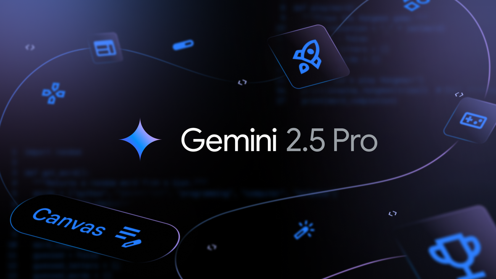
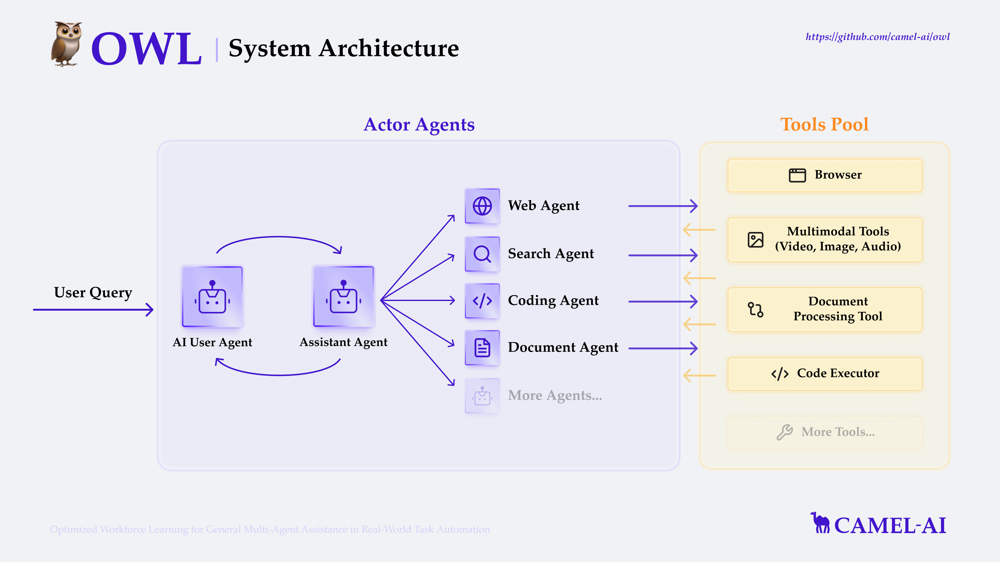
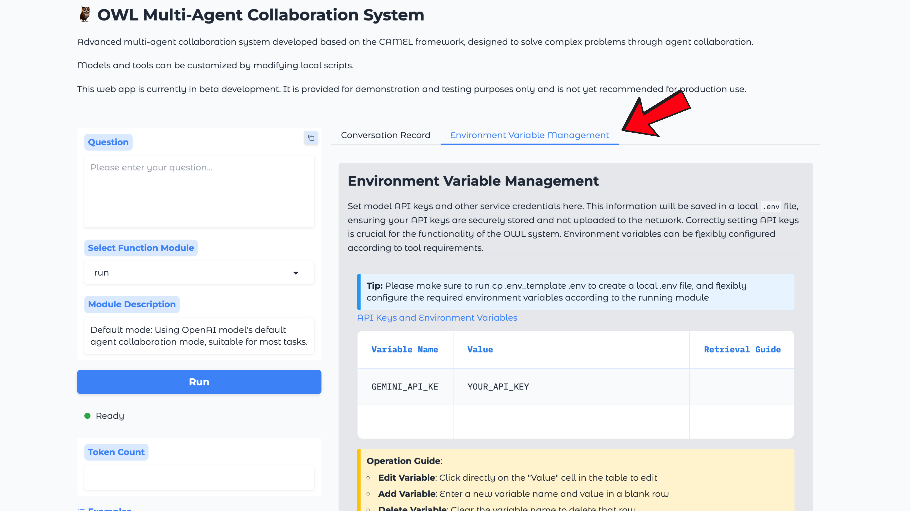
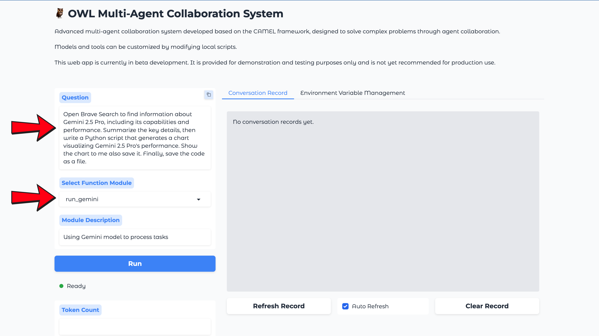

In a world where every click, query, and dataset can be transformed into actionable insights, AI is no longer just a tool, it’s a collaborative partner.

Before we talk about specific technologies or tools, let’s step back and look at how automation is quietly transforming how we work with information. In the past, making sense of a new topic or turning raw data into meaningful insight meant rolling up your sleeves: searching, collecting, coding, and piecing everything together, one step at a time.

But now, imagine describing your goal in plain language, something like, “help me research this new model and visualize how it stacks up” and watching a behind-the-scenes orchestra handle the rest. The process shifts from micromanaging every technical detail to having a system that reads, reasons, explores, summarizes, and builds for you, often with just a single prompt.

This guide is an invitation to rethink how you approach analysis and creativity. It’s less about tools and more about a new mindset: moving from tedious, manual steps to a workflow where automation is not just efficient, but almost conversational. What if you could focus all your attention on the questions you want answered, and let your systems take care of the how?

## Spotlight: Why Gemini 2.5 Pro for Agentic Automation?



So, what does this new era of “describe your goal, let the system build it” actually look like in practice?

In this tutorial, we’ll explore exactly that, starting with a model at the forefront of AI innovation, then walking through how to combine it with powerful agentic automation to unlock new kinds of workflows.

We’re spotlighting Gemini 2.5 Pro, Google’s most intelligent large language model yet. This isn’t just a new version with bigger numbers; it represents a leap in how AI can reason, synthesize, and create. Gemini 2.5 Pro is what Google calls a “thinking model.”

Why did we choose Gemini 2.5 Pro for this demonstration? There are a few key reasons:

- **Exceptional Reasoning:** Gemini 2.5 Pro excels at advanced benchmarks in math, coding, and science, often outperforming even the latest competitors (see the [Google announcement blog](https://blog.google/technology/google-deepmind/gemini-model-thinking-updates-march-2025/) for full benchmark tables).
- **Long Context, Multimodality:** With a 1 million token context window (2 million coming soon), it can understand and reason across massive documents, codebases, and even mixed media.
- **Agentic Abilities:** The model isn’t just about answering questions—it’s built to be a core part of an automated workflow, reasoning through chains of steps, generating and improving code, and iteratively refining outputs.

## Meet the Orchestrator: CAMEL-AI’s OWL System

If Gemini 2.5 Pro is the brain powering intelligent reasoning, OWL is the nervous system making sure every part of your workflow moves in harmony.

**OWL (Optimized Workforce Learning)** is an open-source, multi-agent collaboration framework built by the CAMEL-AI community, designed to automate complex tasks by letting specialized agents work together, much like a real-world project team. Instead of assigning every step to a single monolithic model, OWL decomposes big goals into coordinated sub-tasks, each handled by an agent with its own toolkit, skills, and decision logic.

### What Makes OWL Special?



_OWL System Architecture: Actor agents coordinate task decomposition and execution using a pool of advanced tools._

- **Dynamic Collaboration:** OWL isn’t a rigid script; it uses dynamic agent roles and dual-role collaboration (planners, web agents, coding agents, document agents, and more), so tasks are flexibly broken down, planned, and executed—often in real time.
- **Online Search:** Supports real-time info retrieval via multiple search engines (Google, DuckDuckGo, Wikipedia, and more).
- **Multimodal Processing:** Handles video, images, audio, and text data—whether on the web or locally.
- **Browser Automation:** Utilizes Playwright to simulate rich browser actions: scrolling, clicking, form input, downloads, and complex navigation.
- **Document Parsing:** Extracts, parses, and converts Word, Excel, PDF, and PowerPoint files into usable text or markdown.
- **Code Execution:** Writes and runs Python code in an isolated environment—useful for everything from analysis to automation.
- **Built-in Toolkits:** Dozens of built-in “mini-apps” (toolkits) let agents tap into advanced features: from scholarly search (ArxivToolkit, SemanticScholarToolkit), data analysis (NetworkXToolkit, SymPyToolkit), media generation (DalleToolkit, VideoAnalysisToolkit), to business workflows (LinkedInToolkit, NotionToolkit, RedditToolkit), and more.
- **Model Context Protocol (MCP):** A universal protocol layer that standardizes how agents interact with LLMs and tools, making integration easy.
- **Adaptive Decision-Making:** Leveraging techniques like Partially Observable Markov Decision Processes (POMDPs), OWL adapts on the fly—changing course as new information appears or web content shifts.
- **Top-tier Benchmarking:** Since its open-source launch, OWL has scored #1 among open-source frameworks in GAIA benchmark tests (69.70 avg.), setting a new bar for real-world AI automation.

In short, OWL takes the strengths of agent-based thinking collaboration, specialization, adaptability and puts them in your hands, orchestrating everything from research to reasoning to code execution, all triggered by your initial query.

You can explore more or contribute to the project at [github.com/camel-ai/owl](http://github.com/camel-ai/owl).

## Step-by-Step Tutorial: Automating Data Analysis with Gemini 2.5 Pro and OWL

Ready to see all of this in action? Let’s walk through the process of launching OWL, connecting it with Gemini 2.5 Pro, and building an end-to-end workflow—from setup to your first autonomous research + visualization task.

### **Step 1: Clone the OWL Repository**

Start by pulling the latest version of OWL onto your local system

```
git clone https://github.com/camel-ai/owl.git
cd owl
```

This gives you access to the complete OWL agent framework, toolkits, and the ready-to-use web application.

### Step 2: Set Up Your Python Environment and Install Dependencies

OWL supports several installation options depending on your workflow preference and environment. Here’s a quick overview—pick the one that best fits your setup:

**Option 1: Using uv (Recommended)**

```
# Install uv if you don't have it
pip install uv

# Create a virtual environment and install dependencies
uv venv .venv --python=3.10
source .venv/bin/activate      # For macOS/Linux
.venv\Scripts\activate         # For Windows

# Install OWL (and CAMEL) with all dependencies
uv pip install -e .
```

**Option 2: Using venv and pip**

```
# Create a virtual environment
python3.10 -m venv .venv
source .venv/bin/activate      # For macOS/Linux
.venv\Scripts\activate         # For Windows

# Install dependencies
pip install -r requirements.txt --use-pep517
```

**Option 3: Using conda**

```
conda create -n owl python=3.10
conda activate owl

# Install as a package (recommended)
pip install -e .

# Or, install from requirements.txt
pip install -r requirements.txt --use-pep517
```

‍`‍`**Option 4: Using Docker**

You can also run OWL via a ready-to-use Docker image for a hassle-free, isolated setup.

See detailed Docker instructions in the [official OWL README](https://github.com/camel-ai/owl#option-4-using-docker).

For more details and troubleshooting tips on each method, see the official OWL README.

Choose whichever method matches your environment, virtual envs are great for most local workflows, while conda and Docker are perfect for advanced or cross-platform setups.

### **Step 3: Launch the OWL Web Application**

OWL comes with a friendly web interface that makes setting up and running agentic workflows simple—even if you’re not a command-line power user.

Start the Gradio-powered web app with:

```
python owl/webapp.py
```

You should see a message confirming the local server is running, typically at <http://127.0.0.1:7860>.

### **Step 3: Configure Environment Variables for Gemini 2.5 Pro**



Before you can use Gemini 2.5 Pro, you’ll need to add your API key so OWL can access the model.

1. Open the **Environment Variable Management** tab in the web UI.
2. Add your `GEMINI_API_KEY` in the field provided.
3. Save your changes. (Keys are stored locally and never uploaded to the network.)

### **Step 4: Enter Your Automation Task**



With setup done, you can now tell OWL what you want to accomplish.

- In the **Question** box, enter your prompt. For this demo:

```
Open Brave Search to find information about Gemini 2.5 Pro, including its capabilities and performance. Summarize the key details, then write a Python script that generates a chart visualizing Gemini 2.5 Pro's performance. Show the chart to me also save it. Finally, save the code as a file.
```

- Next, under **Select Function Module**, switch to `run_gemini` so OWL knows to use Gemini 2.5 Pro for all reasoning and code generation.

### **Step 5: Run and Watch OWL in Action**

Hit **Run**. OWL and Gemini 2.5 Pro will now:

- Search the web for up-to-date info on Gemini 2.5 Pro.
- Parse and summarize key capabilities, benchmarks, and highlights.
- Autonomously generate a Python script to visualize the benchmark data.
- Execute the code, display the chart, and save both the script and output image for you—all without further intervention.

Watch the **processing** bar in the UI as agents collaborate and toolkits are called in sequence.

### **Step 6: Review and Download Results**

When the task completes, you’ll see:

- A summary of Gemini 2.5 Pro’s performance.
- A downloadable Python script (`generate_gemini_chart.py`).
- The generated performance chart image (`gemini_2.5_pro_performance.png`).
- Links to re-run or modify your workflow as needed.

## Wrapping Up: Why This Combo Stands Out

Putting Gemini 2.5 Pro together with CAMEL-AI OWL is more than just a technical integration. It’s a new way to work with data, automate creative tasks, and build intelligent workflows, without all the manual juggling.

Gemini 2.5 Pro brings deep reasoning and state-of-the-art performance, while OWL makes the process flexible and practical, giving you access to a huge library of toolkits for all sorts of use cases.

If you’re the kind of builder or researcher who likes to experiment, you’ll appreciate just how much you can extend OWL. With support for the Model Context Protocol (MCP), you can hook your agents into a growing ecosystem of tools and APIs—making your automations smarter and even more connected.

And you don’t have to just take our word for it. The [OWL community use cases](https://github.com/camel-ai/owl/tree/main/community_usecase) are a goldmine for inspiration, with real-world examples showing how people are using agent workflows for everything from research reviews to advanced data pipelines.

Want to go further? Here are some great next reads and resources:

- [How to Connect Your CAMEL-AI Agent to External Tools via MCP](https://www.camel-ai.org/blogs/camel-ai-agent-mcp-integration)
- [How to Use MCP with the OWL Framework: A Quickstart Guide](https://www.camel-ai.org/blogs/owl-mcp-toolkit-practice)
- [CAMEL-AI on GitHub](https://github.com/camel-ai/camel)
- [Gemini 2.5 Pro from Google DeepMind](https://deepmind.google/models/gemini/pro/)

All in all, this is just the beginning. Whether you’re looking to automate research, build agentic workflows, or just see what’s possible when you bring the latest language models and toolkits together, the combination of CAMEL-AI OWL and Gemini 2.5 Pro is definitely worth a try.

If you end up building something cool or have ideas to share, jump into the community. That’s where the real fun (and innovation) starts.
