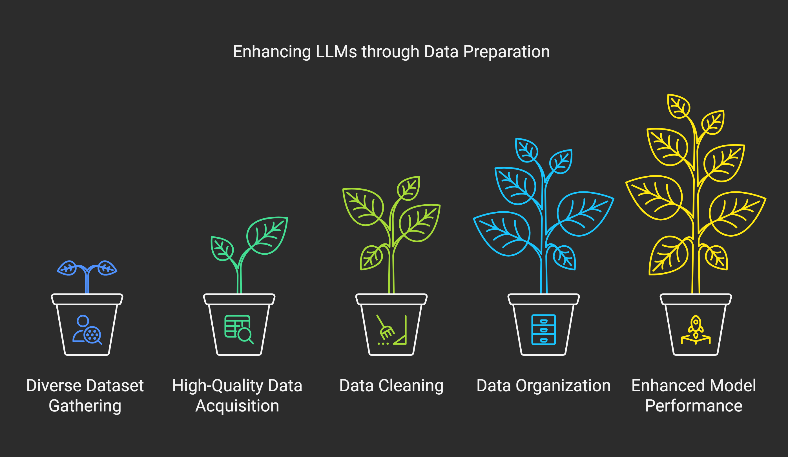
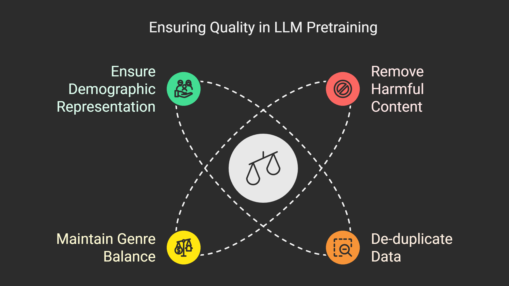

### How Data Fuels LLM Pretraining

‍

Data serves as the lifeblood of Large Language Model (LLM) pretraining, determining the extent of the model’s language understanding and its ability to generalize across tasks. The **quality, diversity, and scale** of the data directly influence the model’s performance. By processing billions of words from varied sources, LLMs learn to recognize patterns, interpret nuances, and adapt to different linguistic contexts. Without rich and diverse data, the model’s capabilities are inherently limited, as it would struggle to generalize beyond the patterns seen during training. (_For instance, a lack of diversity in data can lead to overfitting, where the model excels in specific contexts but performs poorly in others._)

### Exploring Data Types for LLM Pretraining

‍

LLMs primarily rely on unstructured textual data, such as books, articles, and online content. These sources offer a wide range of language styles and topics, making them ideal for building general-purpose models. Web scraping is a common method to collect such data, often pulling from websites, blogs, forums, and other user-generated content. While **structured data** such as tables or spreadsheets is less commonly used due to its lack of linguistic richness, some specific use cases may incorporate structured data when it’s highly relevant to a particular domain (e.g., medical records, scientific datasets). These are typically less abundant in comparison to unstructured text data.

### Effective Data Collection and Preparation for LLMs

Enhancing LLM performance through diverse data gathering, cleaning, and organization workflows.

‍

The data collection process begins with clear objectives. For general-purpose LLMs, the goal is to gather diverse and representative text data that covers a wide range of topics and styles. Web scraping from multiple sources ensures that this data is varied and can reflect different contexts, linguistic features, and domains. The raw data often contains **noise, irrelevant information, or repeated content**, which must be filtered out to maintain quality.

CAMEL-AI offers convenient integrations with popular extraction and data ingestion tools like [**MinerU**](https://github.com/camel-ai/camel/blob/master/camel/toolkits/mineru_toolkit.py), [**UIO**](https://docs.camel-ai.org/_modules/camel/loaders/unstructured_io.html), [**Jina Reader**](https://github.com/camel-ai/camel/blob/master/camel/loaders/jina_url_reader.py), and [**Apify**](https://github.com/camel-ai/camel/blob/master/camel/loaders/apify_reader.py). These tools help streamline the data collection process, reducing manual effort and enhancing data quality.

While **bad sources** can be discarded using heuristics (e.g., filtering out overly repetitive or obviously irrelevant text), **irrelevant information** is more challenging to remove on a large scale. A common approach involves monitoring the **loss plot** during training: when a sharp spike occurs, it often indicates problematic data. At this point, the dataset is revisited, and specific data points (e.g., content from subreddits like “[https://www.reddit.com/r/mmmmmmmmm/”](https://www.reddit.com/r/mmmmmmmmm/%E2%80%9D)) are removed, as they confuse the model and degrade its learning. In the case of the subreddit mentioned, the repetitive content (e.g., dozens of “m’s” in a row) conflicts with the model’s learned pattern of language, leading to inefficiencies in training.

**Key steps include:**

- **Define Clear Objectives:** Establish what topics and styles are needed.
- **Utilize Diverse Sources:** Collect data from websites, blogs, forums, and social media.
- **Filter Out Noise:** Remove irrelevant, repetitive, or low-quality content.  
  ‍

When using platforms like CAMEL-AI, data preparation becomes straightforward. CAMEL's integrated [**Retrievers**](https://docs.camel-ai.org/key_modules/retrievers.html) and [**Memory Management**](https://docs.camel-ai.org/key_modules/memory.html) techniques and tools allow developers to easily filter out noise, irrelevant information, and repetitive content to maintain dataset quality.

### **Data Preprocessing and Tokenization Techniques**

Once the data is cleaned, it undergoes **preprocessing**, which primarily involves **tokenization**. Tokenization is the process of breaking down text into smaller, manageable units (tokens), such as words or subwords. These tokens are initially represented as one-hot encoded vectors, where every entry is 0, except for one which is 1. The position of the 1 in the vector corresponds to a specific token, allowing us to map the textual representation of a token to its vector representation.

Once the tokens are ready, they are passed through the model, where embedding representations are learned during the training process. These embeddings capture the semantic properties of tokens, but this occurs only after the initial tokenization and vectorization process.

Common techniques for tokenization include [**WordPiece**](https://towardsdatascience.com/wordpiece-subword-based-tokenization-algorithm-1fbd14394ed7/) or [**Byte-Pair Encoding (BPE)**](https://towardsdatascience.com/byte-pair-encoding-subword-based-tokenization-algorithm-77828a70bee0/), which break down words into smaller, more granular subword units to handle rare or unseen words more effectively.

In the CAMEL-AI ecosystem, you can efficiently experiment with various tokenization and embedding techniques detailed in the [**Embeddings Module**](https://docs.camel-ai.org/key_modules/embeddings.html) documentation.

### **Ensuring Quality Control and Dataset Balance in LLM Pretraining**

Key practices for maintaining balance and quality in LLM pretraining datasets.

To ensure the model performs well across a variety of tasks, dataset **quality control** measures are essential. These include removing harmful or nonsensical text (such as hate speech, misinformation, or irrelevant content), ensuring diverse linguistic features, and de-duplicating content. Balancing the dataset is crucial to ensure that it’s not overrepresented by any single type of text.

**Quality Control Tips:  
‍**

- **Remove Harmful Content:** Filter out hate speech, misinformation, and irrelevant text.
- **De-duplicate Data:** Ensure each piece of content is unique.
- **Maintain Genre Balance:** Combine informal social media posts with formal academic articles.
- **Ensure Demographic Representation:** Actively include content from underrepresented groups to prevent bias.

Data is at the heart of training large language models, shaping how they learn, adapt, and perform across different tasks. A well-curated dataset—rich in quality, diversity, and balance—can make all the difference in achieving a powerful and reliable model.

If this article helped you, let us know! Your feedback means a lot and helps us create even better content.

We’re also kicking off a **Data Generation Blog Series**, where we’ll explore more about topics like data collection, Post-Training, Pretraining Data, CoT Reasoning Data Generation and much more. Stay tuned for what’s coming next.

### **That's everything:**

**‍**Got questions about 🐫 CAMEL-AI? Join us on [Discord](https://discord.camel-ai.org)! Whether you want to share feedback, explore the latest in multi-agent systems, get support, or connect with others on exciting projects, we’d love to have you in the community! 🤝

Check out some of our other work:

1.  🐫 Creating Your First CAMEL Agent [free Colab](https://docs.camel-ai.org/cookbooks/create_your_first_agent.html).

2.   Graph RAG Cookbook [free Colab](https://colab.research.google.com/drive/1uZKQSuu0qW6ukkuSv9TukLB9bVaS1H0U?usp=sharing).

3.  🧑‍⚖️ Create A Hackathon Judge Committee with Workforce [free Colab.](https://colab.research.google.com/drive/18ajYUMfwDx3WyrjHow3EvUMpKQDcrLtr?usp=sharing)

4.  🔥 3 ways to ingest data from websites with Firecrawl & CAMEL [free colab](https://colab.research.google.com/drive/1lOmM3VmgR1hLwDKdeLGFve_75RFW0R9I?usp=sharing).

5.  🦥 Agentic SFT Data Generation with CAMEL and Mistral Models, Fine-Tuned with Unsloth [free Colab](https://colab.research.google.com/drive/1lYgArBw7ARVPSpdwgKLYnp_NEXiNDOd-?usp=sharingg).

If you found this helpful, give us a ⭐ on [GitHub](https://github.com/camel-ai/camel), Thanks from everyone at 🐫 CAMEL-AI!
