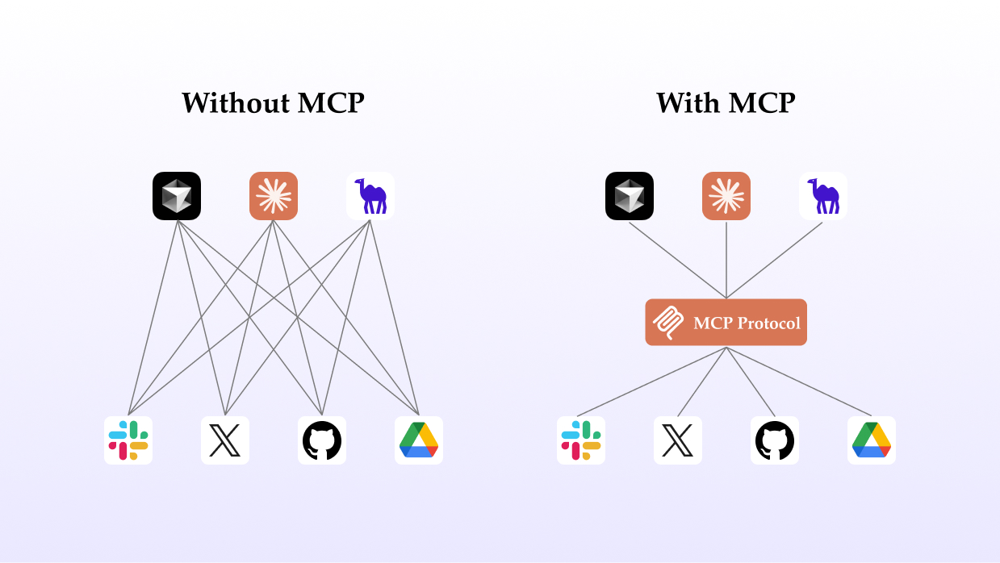
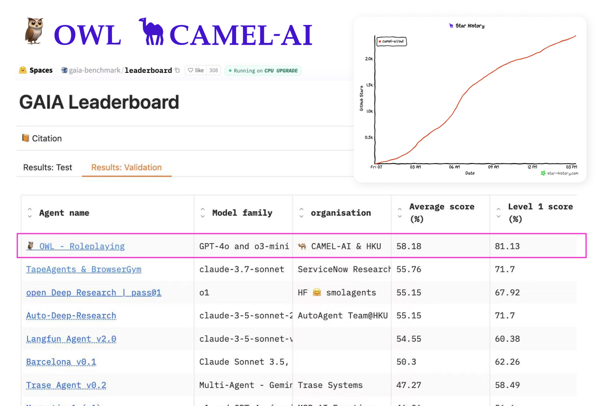
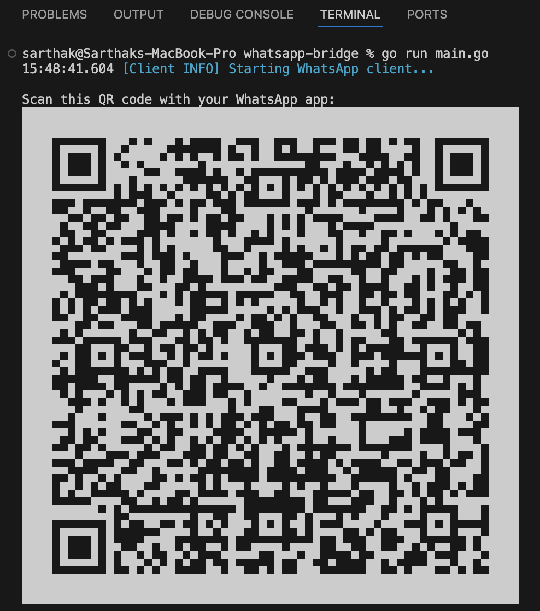

Imagine having a personal AI assistant on WhatsApp that can answer questions, automate tasks, or fetch information for you in real time. In this blog, we’ll walk through how to build a **WhatsApp automation agent** using **OWL** (Optimized Workforce Learning), an open-source multi-agent framework from CAMEL-AI, and a custom WhatsApp **MCP server**.

We’ll cover what the Model Context Protocol (MCP) is, how OWL’s **CAMEL agents** work together, and how to connect everything so your AI agent can send and examine WhatsApp messages autonomously.

In the sections below, we’ll break down each step to get the system running, from installing the WhatsApp MCP integration to launching the OWL agent. By the end, you’ll have a friendly AI roleplaying agent in your WhatsApp, and a deeper understanding of how **MCP servers**, **MCP clients**, and **MCP hosts** work together to bridge AI with the real world use-cases.

‍

## What Is the Model Context Protocol (MCP)?



Without vs. With MCP

Before diving into the demo, let’s briefly introduce [**Model Context Protocol (MCP)**](https://modelcontextprotocol.io/introduction) and some key terms. Model Context Protocol is a protocol that standardizes how an LLMs connects to external tools and services (we can think of it as a common language for AI agents to talk to other apps). It’s designed to be simple and universal, so you can plug in various “capabilities” (like messaging apps, databases, web browsers, etc.) without writing custom integration code for each one.

In MCP’s architecture, we commonly talk about **MCP hosts**, **MCP clients**, and **MCP servers**:

- **MCP Server:** A small program or service that exposes some functionality via the MCP interface. Think of this as an adapter for a specific tool or context. For example, a _WhatsApp MCP server_ lets an LLMs send and receive WhatsApp messages by handling all the WhatsApp-specific details behind the scenes. There can be MCP servers for all sorts of things (email, spreadsheets, web search – you name it). Each MCP server runs independently and waits for requests from a client. Checkout [MCPhub](https://mcp.camel-ai.org/) to see the directory for MCP Servers.  
  ‍
- **MCP Client:** The component that acts as a bridge on the AI side. The client maintains a connection to an MCP server and sends it requests or commands. In practice, an MCP client is usually part of your AI application that knows how to communicate using the MCP protocol. You can imagine it as a _plugin_ that the AI agent uses whenever it needs to interact with that external service.  
  ‍
- **MCP Host:** The host is the main LLM application or environment that “hosts” the intelligence and orchestrates everything. In our case, the OWL framework (running our agents) is the MCP host. The host can manage multiple MCP clients at once – one for each server integration. The host decides when to invoke an external tool via an MCP client, and it routes the responses back into the AI agents’ context. Essentially, the MCP host is the brains of the operation, coordinating between the AI’s reasoning and the various MCP servers (tools) it has access to.

To put it simply, if our AI agent were a person making a phone call to get information, the **MCP host** is the person themselves, the **MCP client** is the phone they use (one phone line per service), and the **MCP server** is the friend on the other end who has the information or can perform an action. This clear separation makes it easy to add new “friends” (tools) for the AI to call upon.

## **The OWL Framework and CAMEL-AI Agents**



‍ **OWL** (Optimized Workforce Learning) is CAMEL-AI’s powerful framework for building multi-agent systems. Unlike a single AI agent, OWL enables multiple AI agents to collaborate, each with defined roles or specialties. This approach is inspired by the CAMEL framework, where typically a “user” agent and an “assistant” agent converse to solve problems or complete tasks in a more robust way than a single agent alone. In practical terms, OWL provides a structured environment where agents can share information, make real-time decisions, and use external tools through MCP integrations.

Key features of OWL that make our WhatsApp automation possible include:

- **Role-Playing Agents:** You can assign roles to different agents (for example, one agent simulates the end-user asking questions, and another is the AI expert providing answers). In our WhatsApp scenario, we effectively have an AI assistant agent that will take on the role of answering incoming WhatsApp messages. This CAMEL-style role-play allows the system to interpret user queries and generate helpful responses in a conversational loop.
- **Real-Time Interaction:** OWL agents operate in real time, meaning the assistant agent can respond to new messages as they arrive. The framework handles the turn-taking and context management, so the conversation with your WhatsApp AI feels fluid and coherent. The agent remembers context from previous messages in the chat, just like a human would in an ongoing conversation.
- **Tool/Service Integration via MCP:** Most importantly for us, OWL natively supports integrating external services through Model context Protocol. The OWL environment acts as the MCP host that can connect to various MCP servers. This means our agent can do things like send a WhatsApp message, query a database, or call an API as part of its reasoning process, all using a unified interface. By plugging in the WhatsApp MCP server, we’re essentially giving our OWL agent a new superpower – the ability to communicate over WhatsApp as if it were just another part of its brain.

In summary, OWL will be the _brain_ running our AI agents (the assistant), and MCP will be the _nervous system_ that connects that brain to the outside world (WhatsApp, in this case). Next, let’s focus on our specific use case and what we’re about to set up.

## **Setting Up the WhatsApp MCP Server Demo**

Before we begin, make sure you have the following **prerequisites** in place on your system:

- **Go (Golang)** – required to build and run the WhatsApp bridge component (which connects to WhatsApp Web). Ensure that Go is installed and your **$GOPATH** is configured.
- **Python 3.10+** – for running the OWL framework and the WhatsApp MCP server code.
- **An OpenAI API key or LLM setup** – (optional, but recommended) OWL by default can use GPT-4o for the AI agent’s brain. If you want your assistant to be powered by OpenAI, set up your **OPENAI_API_KEY** as an environment variable. _(OWL can also work with_ [_other models too_](https://docs.camel-ai.org/key_modules/models.html)_, but for simplicity we assume an OpenAI ChatGPT model here.)_

With those ready, let’s proceed with the installation and setup:

**1. Clone the necessary code repositories.** First, grab the OWL framework code and the WhatsApp MCP server code from GitHub. Open a terminal and run:

```
# Clone the OWL framework (includes CAMEL agents and community use-cases)
git clone https://github.com/camel-ai/owl.git

# Clone the WhatsApp MCP server integration code
git clone https://github.com/lharries/whatsapp-mcp.git
```

‍

This will download the OWL project (which contains the multi-agent framework and our demo script) and the community WhatsApp MCP server project (which contains the bridge and server needed for WhatsApp integration). The OWL repo also includes the WhatsApp MCP example as a community use-case, you can find additional documentation in the **community_usecase/Whatsapp-MCP** folder of the OWL repo. (The README there is essentially a technical manual for what we’re doing here.)

**2. Build and run the WhatsApp Bridge (Go).** Next, we’ll set up the WhatsApp bridge which connects to the WhatsApp network. In a terminal, navigate into the WhatsApp MCP Server project’s bridge directory and run the Go program:

```
cd WhatsApp_MCP_Server/whatsapp-bridge

# (Optional) Tidy up and download any Go module dependencies
go mod download

# Run the bridge (this will compile and execute the Go code)
go run main.go
```

‍

After a moment, the bridge service will start and prompt you with a QR code in the terminal (or console output).



‍

**Open WhatsApp on your phone**, go to the linked devices section, and scan this QR code (just as you would for WhatsApp Web). This will authorize the bridge to connect to your WhatsApp account. Once scanned, the terminal should show a message that the connection is successful (e.g. “WhatsApp connection established” or similar).

Leave this bridge program running – it needs to stay open to maintain the WhatsApp connection. _Tip: you might want to run it in a separate terminal or in the background since it will continuously output logs of WhatsApp events._

**3. Configure the MCP server integration for WhatsApp.** Now we’ll create a config file to let OWL know about the WhatsApp MCP server. This config file will instruct the OWL MCP host how to launch and connect to the WhatsApp server. It’s a simple JSON file that lists our Model Context Protocol servers (in this case, just one server named **"whatsapp"**).

Create a file (for example, **mcp_config_whatsapp.json**) with the following content:

```
{
  "mcpServers": {
    "whatsapp": {
      "command": "<PATH_TO_UVICORN_EXECUTABLE>",
      "args": [
        "<PATH_TO_WHATSAPP_MCP_SERVER_MAIN.py>",
        "--connect_serial_host",
        "--only_one"
      ]
    }
  }
}
```

‍

**4. Launch the OWL WhatsApp agent demo.** We’re ready to fire up our AI agent! Open a new terminal (keeping the Go bridge running in its own terminal) and run the OWL demo script for WhatsApp:

```
# Assuming you are in the root directory of the cloned OWL repository

cd owl

# Run the WhatsApp MCP use-case app
python community_usecase/Whatsapp-MCP/app.py
```

```
import asyncio
import sys
from pathlib import Path
from typing import List

from dotenv import load_dotenv

from camel.models import ModelFactory
from camel.toolkits import FunctionTool
from camel.types import ModelPlatformType, ModelType
from camel.logger import set_log_level
from camel.toolkits import MCPToolkit,SearchToolkit

from owl.utils.enhanced_role_playing import OwlRolePlaying, arun_society

load_dotenv()

set_log_level(level="DEBUG")

async def construct_society(
    question: str,
    tools: List[FunctionTool],
) -> OwlRolePlaying:
    r"""build a multi-agent OwlRolePlaying instance.

    Args:
        question (str): The question to ask.
        tools (List[FunctionTool]): The MCP tools to use.
    """
    models = {
        "user": ModelFactory.create(
            model_platform=ModelPlatformType.OPENAI,
            model_type=ModelType.GPT_4O,
            model_config_dict={"temperature": 0},
        ),
        "assistant": ModelFactory.create(
            model_platform=ModelPlatformType.OPENAI,
            model_type=ModelType.GPT_4O,
            model_config_dict={"temperature": 0},
        ),
    }

    user_agent_kwargs = {"model": models["user"]}
    assistant_agent_kwargs = {
        "model": models["assistant"],
        "tools": tools,
    }

    task_kwargs = {
        "task_prompt": question,
        "with_task_specify": False,
    }

    society = OwlRolePlaying(
        **task_kwargs,
        user_role_name="user",
        user_agent_kwargs=user_agent_kwargs,
        assistant_role_name="assistant",
        assistant_agent_kwargs=assistant_agent_kwargs,
    )
    return society

async def main():
    config_path = Path(__file__).parent / "mcp_servers_config.json"
    mcp_toolkit = MCPToolkit(config_path=str(config_path))

    try:
        print("Attempting to connect to MCP servers...")
        await mcp_toolkit.connect()

        # Default task
        default_task = (
            "Read the unread messages from {contact name} on whatsapp and reply to his query"
        )

        # Override default task if command line argument is provided
        task = sys.argv[1] if len(sys.argv) > 1 else default_task
        # Connect to all MCP toolkits
        tools = [*mcp_toolkit.get_tools(),SearchToolkit().search_duckduckgo,]
        society = await construct_society(task, tools)
        answer, chat_history, token_count = await arun_society(society)
        print(f"\033[94mAnswer: {answer}\033[0m")

    except Exception as e:
        print(f"An error occurred during connection: {e}")

    finally:
        # Make sure to disconnect safely after all operations are completed.
        try:
            await mcp_toolkit.disconnect()
        except Exception:
            print("Disconnect failed")

if __name__ == "__main__":
    asyncio.run(main())
```

When this script runs, it will initialize the OWL environment, load the MCP config file you created (via the **--config** argument), and automatically launch the WhatsApp MCP server using that config. You should see Uvicorn starting up the FastAPI server (the Python MCP server) in the console. OWL will establish a connection to the WhatsApp MCP server as an MCP client.

After initialization, the script will likely indicate that the agent is up and running and waiting for messages.

Now it’s showtime: **open your WhatsApp and send a message** to the same WhatsApp account that you linked in the bridge (for example, if you linked your own number, just message yourself from another phone, or have a friend message you). When a message comes in, you should see the OWL agent’s logs showing that it received a message via the MCP server.

The AI assistant will process the message and formulate a reply (if you have asked it to do so like in this use case). Within a few seconds, you should see a reply appear in WhatsApp, sent from your AI agent! 🎉

The exact behavior will depend on how the agent is configured in the OWL script – by default, it may use a general-purpose AI assistant persona (similar to ChatGPT) to respond helpfully to any input. You now have a two-way connection: messages from WhatsApp go into OWL’s AI brain, and messages from the AI brain come out through WhatsApp. Your WhatsApp has effectively become a conversational interface for a powerful AI agent.

‍

## **Tips, Tricks, and Troubleshooting**

Setting up the WhatsApp integration involves multiple pieces, so here are a few common tips in case you run into issues:

- **Re-scan the QR Code if needed:** The WhatsApp bridge’s QR code login might expire if not scanned in time. If you didn’t scan quickly enough or if the connection fails initially, just stop the bridge (**Ctrl+C**) and run **go run main.go** again to get a fresh QR code. Once connected, the session usually stays active for a while, but if you restart the bridge later, you may need to scan again.  
  ‍
- **Keep the bridge running:** It sounds obvious, but remember that if you close the bridge program, your WhatsApp connection is lost. The MCP server will then fail to send/receive messages. Always start the bridge first, then the OWL Python script.  
  ‍
- **Check your paths in the config:** If the OWL script isn’t launching the MCP server, double-check that the **command** and **args** in your JSON config are correct. A common mistake is a wrong file path to **main.py** or a typo in the file name. Also ensure the JSON itself is valid (no trailing commas, correct braces, etc)  
  ‍
- **Mismatched Python environment:** Make sure you run the OWL script with the same Python environment where you installed Uvicorn and any other required packages. If you see an import error or “command not found” for uvicorn in the OWL logs, it could be due to running in a different environment. You might need to adjust the **command** in JSON to the full path of uvicorn or install uvicorn in the environment that runs OWL.  
  ‍
- **AI model not responding or errors in agent:** If your setup is correct but the agent isn’t responding, check the OWL agent logs for any errors. You might see messages about missing API keys or model issues. Ensure your OpenAI API key (or whichever model backend OWL is configured for) is properly set. You can usually configure the model or API key in OWL’s settings or via environment variables (for OpenAI, **OPENAI_API_KEY** environment variable is used).  
  ‍
- **WhatsApp message delays:** On rare occasions, there might be a slight delay for messages to go through, especially on first connection. This usually resolves on its own. The bridge logs are useful to see if messages are being received/sent in real time.  
  ‍

Congratulations! You’ve built a WhatsApp automation flow that combines the power of CAMEL-AI’s OWL multi-agent framework with the flexibility of the Model Context Protocol. This demo showcased how an MCP host (OWL) can leverage an MCP server (WhatsApp integration) via an MCP client to seamlessly extend an AI’s reach into a popular messaging platform.

The real beauty of this setup is how general it is. With minimal changes, the same pattern can connect AI agents to other applications. The OWL framework allows your CAMEL agents to use all these tools in concert, enabling complex workflows and task automation that go well beyond simple chat responses.

Feel free to explore and modify the solution:

- The official GitHub repository for this community use-case is available at [**camel-ai/owl – Whatsapp-MCP community use case**](https://github.com/camel-ai/owl/tree/main/community_usecase/Whatsapp-MCP), which contains the code and documentation we based this guide on. Check it out for more technical details, updates, or to contribute improvements.  
  ‍
- If you are curious about the MCP protocol in depth or want to build your own MCP server for a new tool we have launched [MCPHub](https://mcp.camel-ai.org/), visit the it’s a great resource to see other example servers.  
  ‍
- CAMEL-AI’s community is active and welcoming. If you encounter issues or have creative ideas, consider joining the discussion (on their [Discord](https://discord.com/invite/CNcNpquyDc) or [forums](https://www.reddit.com/r/CamelAI/)) to share your experience and learn from others building with OWL and MCP.

We hope this tutorial empowers you to create your own AI integrations. The combination of OWL and MCP is opening up a new world of **agent-based automation**.

Today it’s WhatsApp; tomorrow, who knows maybe your OWL agent will be managing IoT devices, trading stocks, or booking flights, all through the same elegant protocol.

Happy hacking, and enjoy conversing with your new WhatsApp AI friend! 🚀

‍

#### **🐫Thanks from everyone at CAMEL-AI**

Hello there, passionate AI enthusiasts! 🌟 We are 🐫 CAMEL-AI.org, a global coalition of students, researchers, and engineers dedicated to advancing the frontier of AI and fostering a harmonious relationship between agents and humans.

**📘 Our Mission:** To harness the potential of AI agents in crafting a brighter and more inclusive future for all. Every contribution we receive helps push the boundaries of what’s possible in the AI realm.

**🙌 Join Us:** If you believe in a world where AI and humanity coexist and thrive, then you’re in the right place. Your support can make a significant difference. Let’s build the AI society of tomorrow, together!

- Find all our updates on [X](https://twitter.com/CamelAIOrg).
- Make sure to star our [GitHub](https://github.com/camel-ai) repositories.
- Join our  [Discord,](https://discord.gg/nCpraan3sS) [WeChat](https://ghli.org/camel/wechat.png), [Reddit](https://www.reddit.com/r/CamelAI/) or [Slack](https://join.slack.com/t/camel-ai/shared_invite/zt-2icssxnkj-YHwFVhoZHMYpIG~ZU86WVw)

- You can contact us by email: camel.ai.team@gmail.com
- Dive deeper and explore our projects on <https://www.camel-ai.org/>

‍

‍
