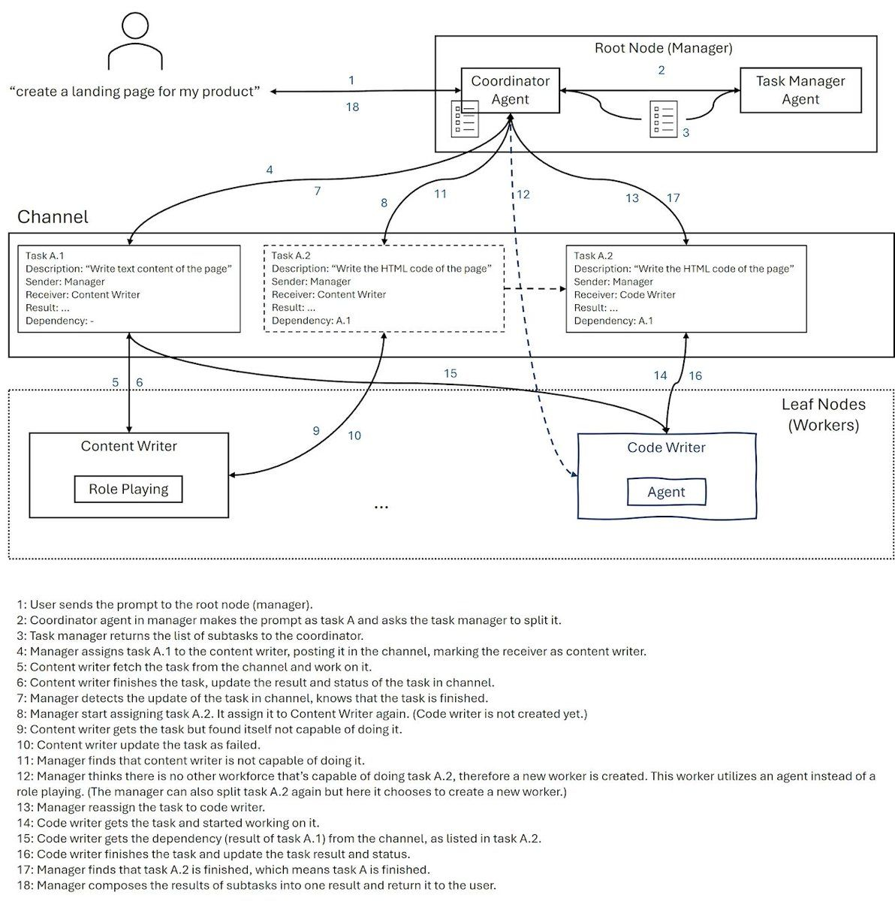
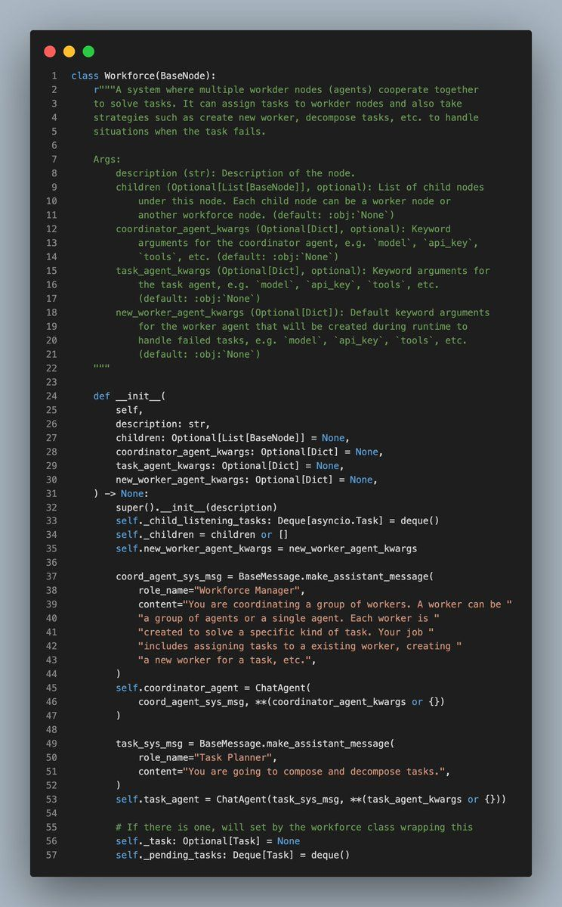
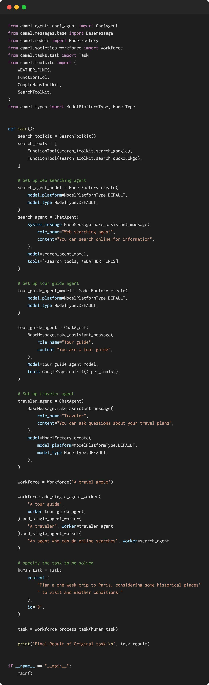
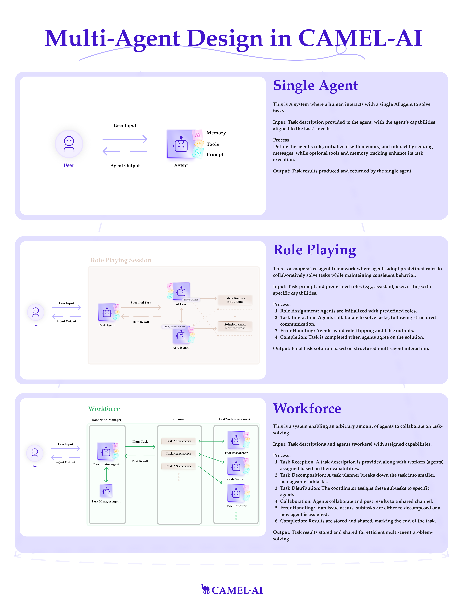

### 🔍 What is Workforce?

- Workforce is a multi-agent collaboration system where multiple AI agents work together to solve complex tasks. Built as part of the CAMEL framework, Workforce is optimized for hierarchical task automation, enabling efficient delegation and coordination among LLM-powered agents.

- Workforce follows a hierarchical architecture.

- A workforce follows a hierarchical multi-agent architecture can consist of multiple worker nodes, and each of the worker nodes will contain one agent or multiple agents as the worker. The worker nodes are managed by a coordinator agent inside the workforce, and the coordinator agent will assign tasks to the worker nodes according to the description of the worker nodes, along with their tool sets. ⚒️ Alongside the coordinator agent,  the task planner agent plays a key role in the system. It is responsible for task decomposition and recomposition, allowing the team of agents to approach complex problems methodically—step-by-step. This enables structured, agent-based workflows that are modular and scalable.

👇 Below is an example illustrating how the Workforce collaborates to plan a trip to Paris and execute code using agents with different tools.

### 🤖 Why Choose Workforce?

People might wonder: _“How does a Multi-Agent Workforce differ from traditional workflows?”_ The answer lies in the dynamic problem-solving capabilities of Multi-Agent systems. Unlike static workflows, workforce adapts in real time. When a complex task is assigned to a group of agents, even if one part of the task fails, workforce automatically breaks the problem down, spins up new agents, and iterates until the task is fully resolved.

See the example: <https://lnkd.in/e47PfS-G>Thanks to our contributors 🤝 [WHALEEYE](https://github.com/WHALEEYE) & [yiyiyi0817](https://github.com/yiyiyi0817) for this significant update.

Explore more here: <https://lnkd.in/e-SgWjte>Find out more about Workforce in our docs: <https://lnkd.in/eHjXFM_A>

### 🐫 Thanks from everyone at CAMEL-AI

Hello there, passionate AI enthusiasts! 🌟 We are 🐫 CAMEL-AI.org, a global coalition of students, researchers, and engineers dedicated to advancing the frontier of AI and fostering a harmonious relationship between agents and humans.

📘 Our Mission: To harness the potential of AI agents in crafting a brighter and more inclusive future for all. Every contribution we receive helps push the boundaries of what’s possible in the AI realm.

🙌 Join Us: If you believe in a world where AI and humanity coexist and thrive, then you’re in the right place. Your support can make a significant difference. Let’s build the AI society of tomorrow, together!

- Find all our updates on [X](https://twitter.com/CamelAIOrg).
- Make sure to star our [GitHub](https://github.com/camel-ai) repositories.
- Join our [Discord,](https://discord.gg/nCpraan3sS) [WeChat](https://ghli.org/camel/wechat.png) or [Slack,](https://join.slack.com/t/camel-ai/shared_invite/zt-2icssxnkj-YHwFVhoZHMYpIG~ZU86WVw) community.
- You can contact us by email: camel.ai.team@gmail.com
- Dive deeper and explore our projects on <https://www.camel-ai.org/>

‍
