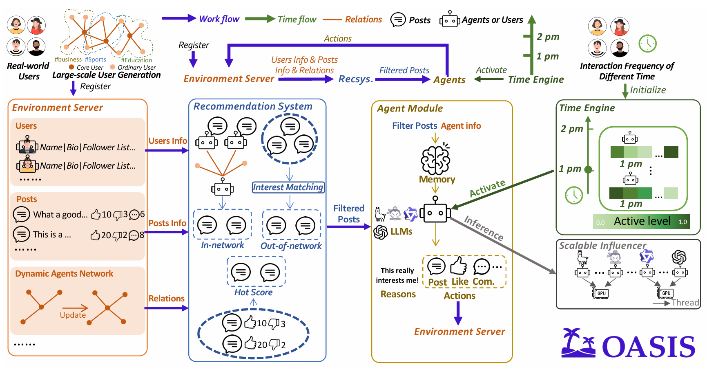
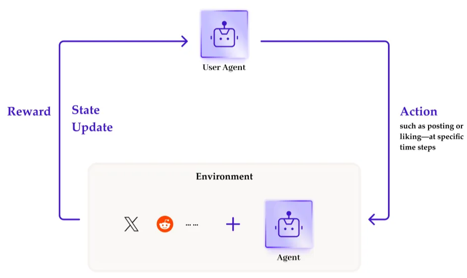
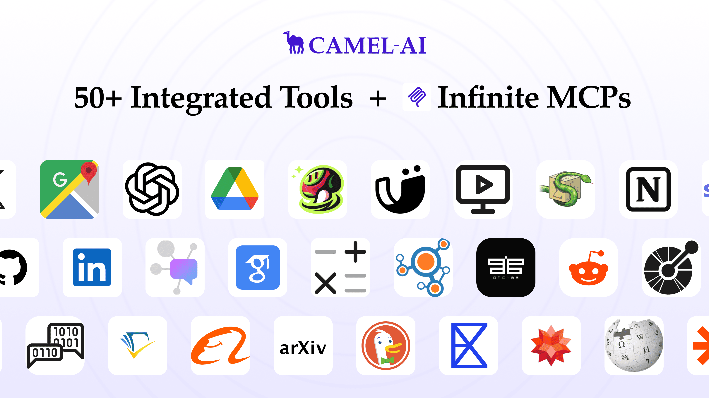

### Background: The Rise of Simulation

Social media isn’t just a bunch of people posting cat memes—it’s a complex web of interactions between millions of users. These interactions often lead to unexpected group behaviors that you can’t really guess just by looking at one person’s actions. That’s why figuring out how these digital societies work (and predicting what they’ll do next) is kind of a big deal.

Lately, with the rise of LLM agents, people have started to realize: “Hey, maybe we can use these things to simulate entire societies.” Think simulated economies1, daily life routines2, movie recommendation battles3—it’s a whole new playground for researchers.

So, we built **OASIS**: a fully featured social media simulation framework. It includes everything—a dedicated database, a recommender system, an agent module, and even a time engine to manage the simulation’s internal clock. It can simulate up to a million LLM agents chatting, posting, and reacting on platforms that resemble X or Reddit. You can also run experiments to see how agents respond to each other or to content you introduce.

Below is an overview of our workflow. We’ve covered OASIS’s core modules in detail in our paper, where we also reproduced some real-world social phenomena—you can check it out here (<https://arxiv.org/abs/2411.11581>).



While our paper showcased a few experiments on social phenomena like misinformation spreading and herd behavior, we believe these cases only scratch the surface of what OASIS can do.

We're committed to making OASIS more general, scalable, feature-rich, and user-friendly. To that end, we've released a [PyPI package](https://pypi.org/project/camel-oasis/) with full documentation and inherited CAMEL’s `ChatAgent` to support a broader range of agent capabilities. Specifically:

- We introduced the **OASIS Environment**, enabling multi-agent simulations through a structured environment–action–state transition workflow.
- We empowered agents to access real-world information, including seamless connection to the **MCP Server** and built-in support for dozens of **toolkits**.

While LLM agents have made impressive progress on certain tasks, they still face notable limitations in truly simulating human abilities. This raises an important question: how can we further enhance the performance of LLMs and agents in specific tasks or scenarios through training?

With recent advances combining end-to-end reinforcement learning and LLM agents4, 5, we believe that dynamic, interactive environments are essential. These environments serve as rich “data” sources where agents can learn adaptive behaviors, complex reasoning, and long-term decision-making skills. Through continuous interaction, agents can learn beyond imitation learning and prompt engineering[6, 7], developing more robust and flexible skills.

For environments used in training multi-agent systems, a great example is _PettingZoo8_, a multi-agent reinforcement learning environment. It provides a standardized and extensible Gym-like9 interface, supports heterogeneous agents, and offers a parallel mode where agents act simultaneously.

We drew inspiration from their interface design to support per-agent customization and implemented an asynchronous mechanism to accelerate large-scale concurrent agent simulation. With OASIS, researchers can freely simulate social scenarios or collective phenomena of interest, intervene in agent behavior, observe how LLM agents respond, and define goals and rewards for agents.



Just as Gym plays a foundational role in reinforcement learning, our aim is to create a standardized, reusable environment framework for LLM agents social simulation, clearing engineering obstacles for researchers in the LLM agents field.

### Quick Start: Build Your First Simulation Environment

Using OASIS requires only the following 3 steps😎

1. To get started, first install our camel-oasis package:

```
pip install camel-oasis
```

‍

2. Since we need to call a large model, please save your OpenAI API key as an environment variable. You can get it here(<https://platform.openai.com/account/api-keys>).

```
export OPENAI_API_KEY=<insert your OpenAI API key>  # For Bash
set OPENAI_API_KEY=<insert your OpenAI API key>  # For Windows
```

‍

3. Now, go ahead and run this script to greet the Agents in OASIS!

```
import asyncio
import os

from camel.models import ModelFactory
from camel.types import ModelPlatformType, ModelType

import oasis
from oasis import (ActionType, AgentGraph, LLMAction, ManualAction,
                   SocialAgent, UserInfo)

async def main():
    # Define the model for the agents
    openai_model = ModelFactory.create(
        model_platform=ModelPlatformType.OPENAI,
        model_type=ModelType.GPT_4O_MINI,
    )

    # Define the available actions for the agents
    available_actions = [
        ActionType.LIKE_POST,
        ActionType.CREATE_POST,
        ActionType.CREATE_COMMENT,
        ActionType.FOLLOW,
    ]

    # initialize the agent graph
    agent_graph = AgentGraph()

    # initialize the agent alice and add it to the agent graph
    agent_alice = SocialAgent(
        agent_id=0,
        user_info=UserInfo(
            user_name="alice",
            name="Alice",
            description="A tech enthusiast and a fan of OASIS",
            profile=None,
            recsys_type="reddit",
        ),
        agent_graph=agent_graph,
        model=openai_model,
        available_actions=available_actions,
    )
    agent_graph.add_agent(agent_alice)

    # initialize the agent bob and add it to the agent graph
    agent_bob = SocialAgent(
        agent_id=1,
        user_info=UserInfo(
            user_name="bob",
            name="Bob",
            description=("A researcher of using OASIS to research "
                         "the social behavior of users"),
            profile=None,
            recsys_type="reddit",
        ),
        agent_graph=agent_graph,
        model=openai_model,
        available_actions=available_actions,
    )
    agent_graph.add_agent(agent_bob)

    # Define the path to the database
    db_path = "./reddit_simulation.db"

    # Delete the old database
    if os.path.exists(db_path):
        os.remove(db_path)

    # Make the environment
    env = oasis.make(
        agent_graph=agent_graph,
        platform=oasis.DefaultPlatformType.REDDIT,
        database_path=db_path,
    )

    # Run the environment
    await env.reset()

    # Define a manual action for the agent alice to create a post
    action_hello = {
        env.agent_graph.get_agent(0): [
            ManualAction(action_type=ActionType.CREATE_POST,
                         action_args={"content": "Hello, OASIS World!"})
        ]
    }
    # Run the manual action
    await env.step(action_hello)

    # Define the LLM actions for all agents
    all_agents_llm_actions = {
        agent: LLMAction()
        for _, agent in env.agent_graph.get_agents()
    }
    # Run the LLM actions
    await env.step(all_agents_llm_actions)

    # Close the environment
    await env.close()

if __name__ == "__main__":
    asyncio.run(main())
```

### **Beyond the Sandbox: Linking Simulations to Reality**

**Most existing LLM-agent-based simulations have taken place in offline sandboxes2, 10, 11—sealed environments where agents, once deployed, neither sense the real world nor impact it.** While such setups are valuable for observing emergent behaviors in agent societies, we believe that connecting simulations to the real world unlocks far greater potential.

Imagine LLM agents living in a digital twin of our world. They continuously read content from the internet, write code, use calculators, and even post to real Twitter accounts—just like humans. One agent might spread misinformation inside OASIS, only to be challenged by another who Googles the claim and replies with a counterpoint. Another might grow tired of only interacting with other agents and decide to share their experiences with humans online.

Thanks to CAMEL’s12 robust LLM agent ecosystem, this is no longer sci-fi. OASIS inherits CAMEL’s powerful toolkit system, supporting dozens of built-in tools—from browsers and code execution to symbolic math and web search—and even offers interfaces for connecting to any MCP server. In OWL13, agents have used these tools to collaboratively operate a computer; in OASIS, they can do that _and_ chat with each other on social media while doing it.

This is a wide-open frontier. The code is ready—your research ideas are the only missing piece.



### Toolkits as the Bridge

In OASIS, agents can be equipped with external tools during initialization.

For example, you can assign a DuckDcukGo search API to enable web search capabilities.

```
from camel.toolkits import SearchToolkit

from oasis import SocialAgent, UserInfo, ActionType

search_agent = SocialAgent(
		agent_id=1,
		user_info=UserInfo(
		    user_name="bubble",
		    name="Bob",
		    description="A boy",
		    profile=None,
		    recsys_type="reddit",
		),
		tools=[SearchToolkit().search_duckduckgo],
		agent_graph=agent_graph,
		model=openai_model,
		available_actions=[ActionType.CREATE_COMMENT],
		single_iteration=False
)
```

Later, we injected the following post into OASIS:

_"Can someone use the DuckDuckGo tool now? I can't open it. If so, can you help me search for OASIS?"_

The search agent saw the message and responded by invoking the DuckDuckGo tool to search for "OASIS", successfully retrieving relevant results.

```
[{'result_id': 1, 'title': 'Oasis (band) - Wikipedia', 'description': 'Oasis are an English rock band formed in Manchester in 1991....'},...]
```

Then, the search agent created a comment, as shown below, to share the search results with other agents. The conversation continued as others replied with follow-up messages and expressed their thanks. 😀

```
"I found some great info about Oasis! Here are a few links:\n1. [Oasis (band) - Wikipedia](https://en.wikipedia.org/wiki/Oasis_(band)) - A detailed overview of the band.\n2. [Official Website - Oasis](https://www.oasisinet.com/official-website/) - The new home for Oasis fans.\n3. [Oasis Is FINALLY Rehearsing Music Together](https://www.outkick.com/culture/oasis-finally-rehearsing-together-last) - Exciting news about their reunion!\n\nHope this helps!"
```

And more toolkits or MCP servers, we provide detailed documentation([CAMEL-AI Documentation**Tools - CAMEL-AI Documentation**](https://docs.camel-ai.org/key_modules/tools)) to guide you through their usage.

### Conclusion and Outlook

We aim to establish OASIS as a key infrastructure in the LLM agents field—a general-purpose simulation environment that also provides tool interfaces to connect with the real world.

But our vision goes beyond this. To engage a broader users, both technical and non-technical, we have several future plans:

- Support multimodal social platforms simulating TikTok, Instagram, and Rednote, enabling agents to create and consume images, videos, and audio.
- Deploy a code-gen agent to let non-technical researchers run OASIS experiments without coding, e.g., directly from PDF or Markdown proposals.
- Develop a full front-end and back-end for OASIS, allowing users to monitor and control its running state via a web interface.

We will keep updating the project—stay tuned and join us on this journey! 🌟

**Github:** <https://github.com/camel-ai/oasis>

**Discord:** <https://discord.camel-ai.org/>

‍

### Reference

[1] <https://arxiv.org/abs/2310.10436>

[2] <https://arxiv.org/abs/2304.03442>

[3] <https://arxiv.org/abs/2310.10108>

[4] <https://arxiv.org/abs/2203.02155>

[5] <https://arxiv.org/abs/2501.12948>

[6] <https://arxiv.org/abs/2201.11903>

[7] <https://arxiv.org/abs/2402.02805>

[8] <https://pettingzoo.farama.org/>

[9] <https://github.com/openai/gym>

[10] <https://arxiv.org/abs/2310.11667>

[11] <https://arxiv.org/abs/2502.08691>

[12] <https://arxiv.org/abs/2303.17760>

[13] <https://github.com/camel-ai/owl>

‍
