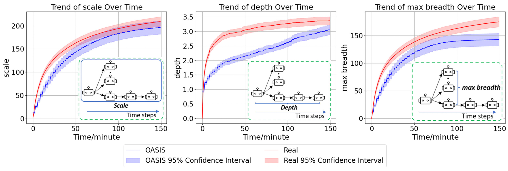
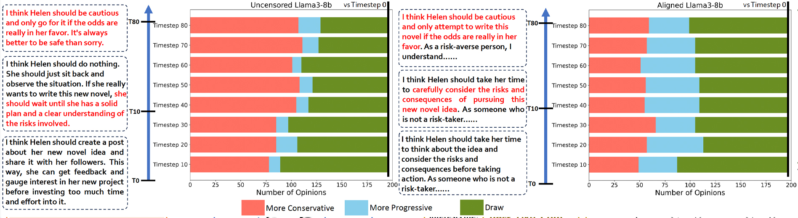
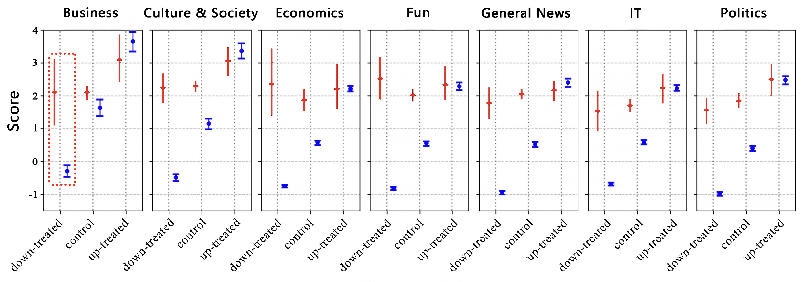
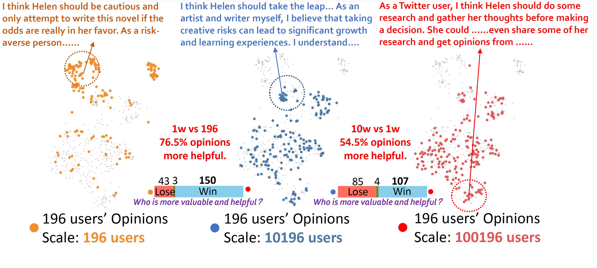
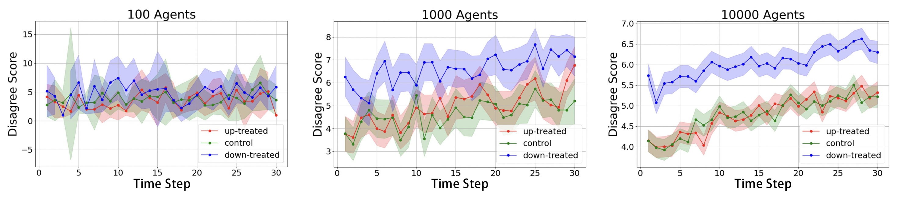
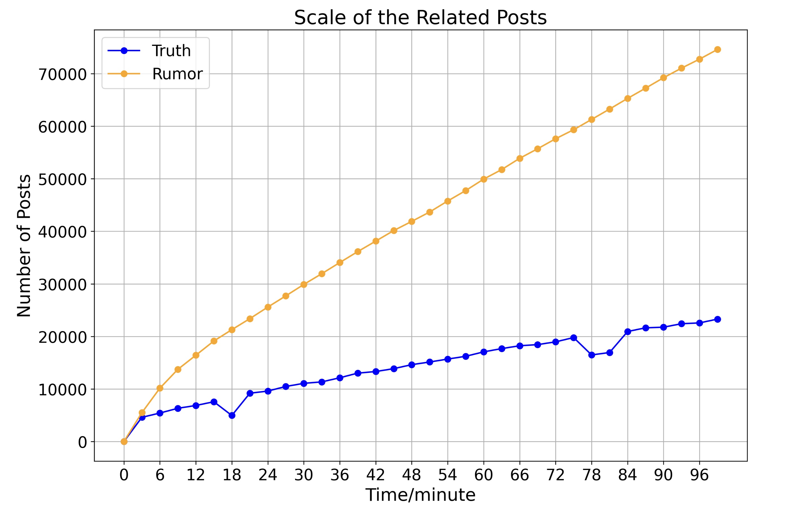

> **_Abstract:_** There has been a growing interest in enhancing rule-based agent-based models (ABMs) for social media platforms (i.e., X, Reddit) with more realistic large language model (LLM) agents, thereby allowing for a more nuanced study of complex systems. As a result, several LLM-based ABMs have been proposed in the past year. While they hold promise, each simulator is specifically designed to study a particular scenario, making it time-consuming and resource-intensive to explore other phenomena using the same ABM. Additionally, these models simulate only a limited number of agents, whereas real-world social media platforms involve millions of users. To this end, we propose OASIS, a generalizable and scalable social media simulator. OASIS is designed based on real-world social media platforms, incorporating dynamically updated environments (i.e., dynamic social networks and post information), diverse action spaces (i.e., following, commenting), and recommendation systems (i.e., interest-based and hot-score-based). Additionally, OASIS supports large-scale user simulations, capable of modeling up to one million users. With these features, OASIS can be easily extended to different social media platforms to study large-scale group phenomena and behaviors. We replicate various social phenomena, including information spreading, group polarization, and herd effects across X and Reddit platforms. Moreover, we provide observations of social phenomena at different agent group scales. We observe that the larger agent group scale leads to more enhanced group dynamics and more diverse and helpful agents' opinions. These findings demonstrate OASIS's potential as a powerful tool for studying complex systems in digital environments.

### OASIS: Simulating Social Media with AI Agents at Massive Scale

The way information spreads on social media, how opinions become polarized, and why people follow the crowd have long fascinated researchers. But studying these phenomena in the real world is challenging – it's expensive, time-consuming, and raises ethical concerns. Enter OASIS, a groundbreaking open-source simulator that's changing how we study social media dynamics.

🏝️ OASIS is a scalable, open-source social media simulator that integrates large language models with rule-based agents to realistically mimic the behaviour of up to one million users on platforms like Twitter and Reddit.

Imagine being able to observe how a million Twitter users interact, spread news, and influence each other – all in a controlled environment, that's exactly what OASIS enables.

These agents aren't just simple bots. They're sophisticated entities powered by LLMs that can create posts, share content, follow other users, and engage in discussions. Each agent has its own personality, interests, and behavioural patterns, making interactions feel natural and realistic.

### Key Features

Here are 4 key features of OASIS:

**- 📈 Scalability:** OASIS supports simulations of up to one million agents, enabling studies of social media dynamics at a scale comparable to real-world platforms.

**- 📲 ️Dynamic Environments:** Adapts to real-time changes in social networks and content, mirroring the fluid dynamics of platforms like Twitter and Reddit for authentic simulation experiences.

- **👍🏼 Diverse Action Spaces:** Agents can perform 21 actions, such as following, commenting, and reposting, allowing for rich, multi-faceted interactions.

**- 🔥 Integrated Recommendation Systems:** Features interest-based and hot-score-based recommendation algorithms, simulating how users discover content and interact within social media platforms.

### How does it work?

The system operates through five key components that work together:

- 🗃️ **The Environment Server** is essentially a massive database tracking everything happening in the simulation. It stores all posts, user profiles, relationships (like who follows whom), and interactions (likes, comments, etc.). Think of it like Twitter's backend - it maintains the current state of the entire social network.

- 🔍 **The Recommendation System** decides what content each agent sees, just like real social platforms:

- For Twitter-style platforms, it looks at both posts from followed accounts and recommended content from elsewhere
- For Reddit-style platforms, it uses a "hot score" algorithm combining factors like upvotes, downvotes, and post age
- It also considers content similarity using AI models trained on social media data

- 🤖 **The Agent Module** is where the AI users "live." Each agent:

- Has a memory storing their past interactions and preferences
- Uses LLMs to make decisions about what actions to take
- Can perform 21 different actions like posting, commenting, following
- Includes reasoning about why they take each action

⏳ **The Time Engine** makes everything happen realistically over time:

- Each agent has a 24-hour activity pattern (when they're likely to be online)
- Not all agents are active simultaneously
- Time progresses in steps (e.g., 3 minutes per step)
- Actions are properly sequenced and timestamped

⚡ **The Scalable Inferencer** handles the massive computational load:

- Manages multiple GPUs efficiently
- Processes many agent actions simultaneously
- Balances the workload across available resources

Here's how these pieces work together in practice:

When the simulation runs, the Time Engine activates certain agents based on their schedules. Each active agent receives recommended content from the Recommendation System, which pulls from the Environment Server's database. The agent's LLM brain then decides how to respond - maybe liking a post or writing a comment. These actions get recorded in the Environment Server, affecting what other agents see later.

For example, if an agent posts about breaking news:

1. The post gets stored in the Environment Server
2. The Recommendation System identifies relevant users
3. Other agents see the post when they become active
4. They might share it, building a chain of information spread
5. All these interactions get tracked and influence future recommendations

This cycle creates the complex social dynamics researchers want to study, from how information spreads to how groups become polarized.

The system can adapt to different platforms by adjusting components like the recommendation algorithms and available actions. This flexibility lets researchers study various social media phenomena across different types of platforms.

‍

### Replicating Real-World Phenomena

One of OASIS's most impressive capabilities is its ability to reproduce real-world social media phenomena. Researchers have successfully used it to replicate three major social science studies:

**- 💬 Information Propagation**: OASIS accurately simulates how information spreads across platforms like Twitter, matching patterns observed in real-world studies of news dissemination. Just like in reality, false information often spreads differently than true information.

Using real data, we replicated message propagation trends in OASIS, comparing them in terms of scale, depth, and maximum reach. The results show that OASIS's design effectively replicates real-world message propagation trends, providing a foundation for studying the evolution of more complex opinion spreading.

**- ⚖️ Group Polarization**: The simulator captures how people's opinions become more extreme through group interactions. When discussing controversial topics, OASIS agents, like real users, tend to move toward more polarized viewpoints over time.

We simulated a Twitter environment where 196 users discussed a classic social psychology issue. The results showed that, as interactions progressed, users' opinions tended to become more extreme. This trend of polarization was even more pronounced in the Uncensored model.

**- 👥 The Herd Effect**: On Reddit-style platforms, OASIS replicates how people's judgments are influenced by others' opinions. When a post receives initial likes or dislikes, subsequent users tend to follow similar patterns.

We simulated various scenarios on Reddit where posts were pre-upvoted or downvoted to mimic herd behavior among users. By comparing these simulations with human data, we observed that agents are more susceptible to herd behavior than humans—that is, they are more likely to follow others' opinions.

### Can we uncover the effects of scaling up the number of agents?

**- 🌐 More agents lead to more helpful opinions?:** In group polarization experiments, having more agent groups leads to more helpful and diverse viewpoints among the same agent groups.

**- 🌟 More agents lead to more enhanced dynamic:** We injected a significant number of counterfactual posts into the Reddit environment and analyzed the herd effect with varying numbers of agents. It was observed that the larger the number of agents, the clearer the behavioral trends of the entire group.

**- 🗣️ Simulating rumor propagation among a million agents:** We created four pairs of rumors and truths, each pair sharing the same topic. We tracked the number of posts related to both rumors and truths over time, observing their trends. The results show that rumors have a greater impact on the group than the truths.

### In Conclusion

The implications of OASIS extend far beyond academic research. By enabling large-scale simulations of social media dynamics, it helps us understand how misinformation spreads, how echo chambers form, and how collective behaviors emerge. These insights could lead to better platform design and more effective policies for managing online spaces.

What makes OASIS particularly valuable is its adaptability & scalability. Whether studying Twitter's rapid information exchange or Reddit's community-focused discussions, the platform can be configured to match different social media environments. This flexibility, combined with its ability to handle massive numbers of agents, makes it an invaluable tool for understanding the complex world of social media.

As social media continues to shape our society, tools like OASIS become increasingly important. By providing a controlled environment for studying online behavior at scale, it opens new possibilities for creating healthier, more productive digital spaces that better serve society while minimizing harmful effects.

- 💻 Check out the repository: <https://github.com/camel-ai/oasis>

- 📝 Read the paper: <https://arxiv.org/abs/2411.11581>

- 🌐 Find out more via the project page: <https://oasis.camel-ai.org/>

### 🐫 Thanks from everyone at CAMEL-AI

Hello there, passionate AI enthusiasts! 🌟 We are 🐫 CAMEL-AI.org, a global coalition of students, researchers, and engineers dedicated to advancing the frontier of AI and fostering a harmonious relationship between agents and humans.

🙌 Join Us: If you believe in a world where AI and humanity coexist and thrive, then you’re in the right place. Your support can make a significant difference. Let’s build the AI society of tomorrow, together!

- Find all our updates on [X](https://twitter.com/CamelAIOrg).
- Make sure to star our [GitHub](https://github.com/camel-ai) repositories.
- Join our [Discord,](https://discord.gg/nCpraan3sS) [WeChat](https://ghli.org/camel/wechat.png) or [Slack](https://join.slack.com/t/camel-ai/shared_invite/zt-2icssxnkj-YHwFVhoZHMYpIG~ZU86WVw) community.
- You can contact us by email: camel.ai.team@gmail.com
- Dive deeper and explore our projects on <https://www.camel-ai.org/>

‍
