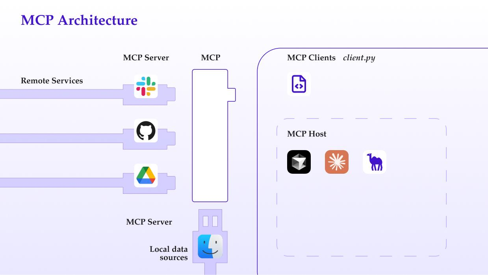
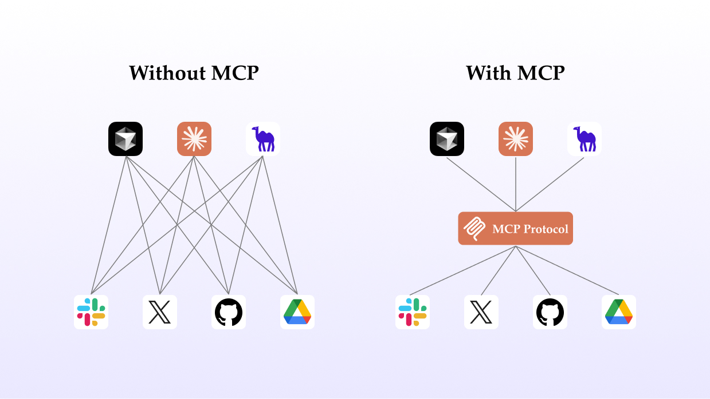
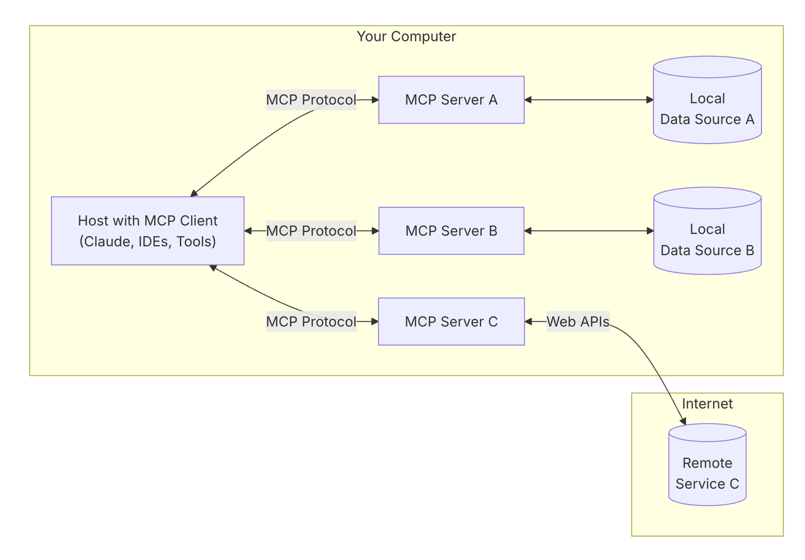
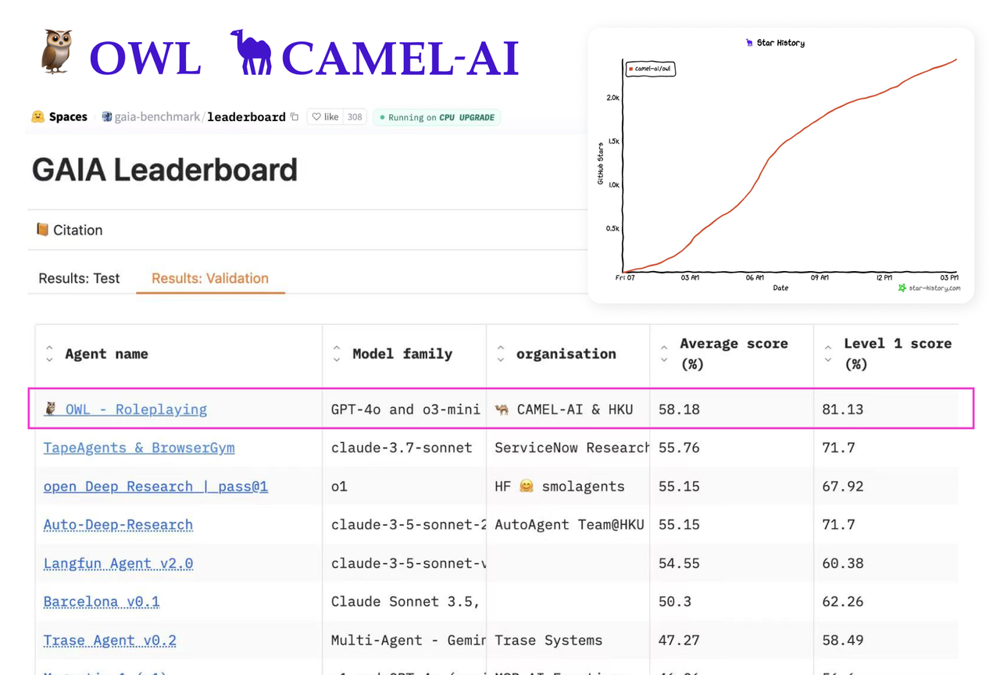
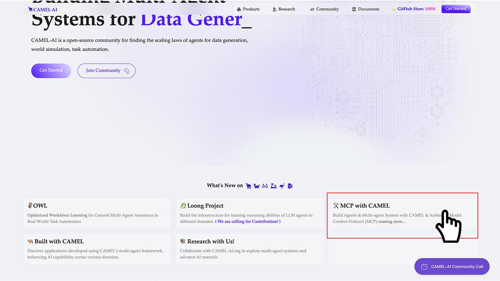
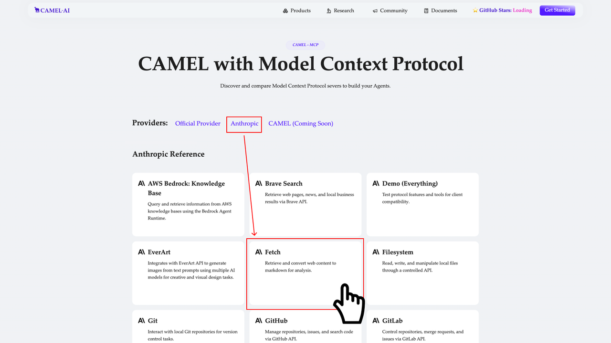
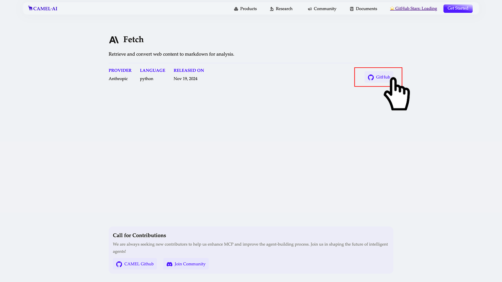
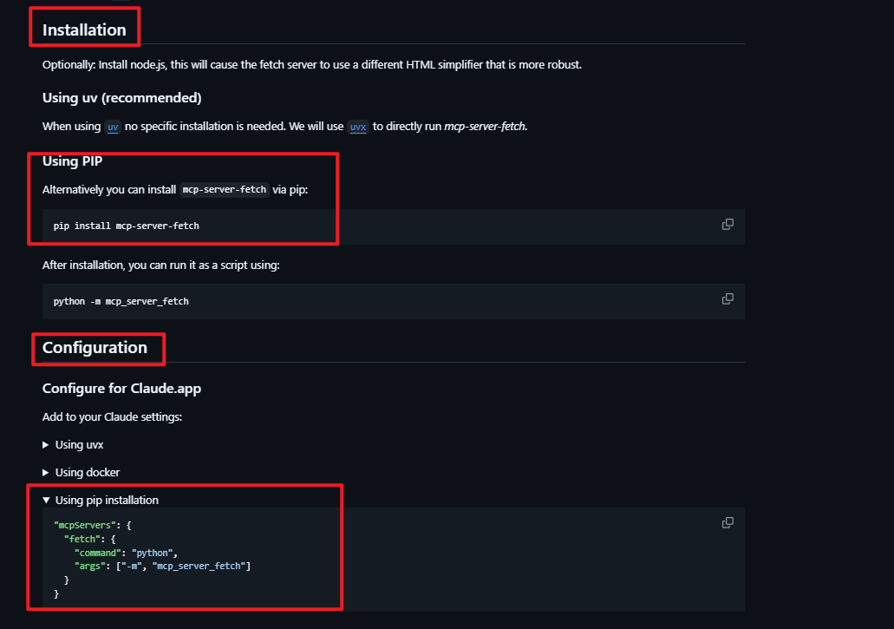

**OWL (Optimized Workforce Learning)** is an open-source multi-agent collaboration framework developed by the CAMEL-AI community, designed to automate complex tasks through dynamic agent interactions. Its core concept mimics human collaboration patterns by breaking down tasks into executable sub-steps, which are then completed through division of labor among agents with different roles. Since its open-source release in March 2025, OWL has ranked first among open-source frameworks in the GAIA benchmark test with an average score of 58.18, becoming a new standard in the field of AI task automation.

**MCP (Model Context Protocol)**, as the "USB interface" of the AI field, has gradually become a universal solution for addressing AI information silos, and its ecosystem is growing daily. OWL also supports using the MCP protocol to call MCPServers within its ecosystem, achieving more standardized and efficient tool invocation.

This article aims to introduce how to use MCP (Model Context Protocol) more efficiently to call external tools and data within the OWL framework.

### What is MCP all about

MCP originated from an article published by Anthropic on November 25, 2024: [Introducing the Model Context Protocol](https://www.anthropic.com/news/model-context-protocol).

MCP (Model Context Protocol) defines how applications and AI models exchange contextual information. This allows developers to **connect various data sources, tools, and functions to AI models** (an intermediate protocol layer) in a consistent manner, just as USB-C allows different devices to connect through the same interface. MCP's goal is to create a universal standard that makes the development and integration of AI applications simpler and more unified.

Referencing some excellent concept visualizations to help understand:



Visualization of MCP as an intermediate layer between LLMs and tools

‍

As shown, MCP can be used in a more standardized way to flexibly call different tools for LLMs. A simpler visualization is shown below. Based on this image, you should find it easier to understand the concept of MCP as an "intermediate protocol layer".



Seamless Agent Integration

So why create an "interface" like MCP? It's because Anthropic wanted to make the process of connecting data to models more intelligent and unified. Anthropic designed MCP based on this pain point, allowing LLMs to easily access data or call tools, making it convenient for developers to build agents and complex workflows on top of LLMs. More specifically, MCP's advantages include:

**Ecosystem** - MCP provides many ready-made plugins that your AI can use directly.

**Uniformity** - Not limited to specific AI models, any model supporting MCP can be flexibly switched.

**Data Security** - Your sensitive data stays on your own computer without needing to upload everything (because MCPServer can design interfaces to determine which data to transmit).

### MCP Architecture and Basic Principles

#### Basic Architecture

Let's briefly introduce MCP's basic architecture. MCP follows a client-server architecture where a host application (Host) can connect to multiple servers. Referencing the official documentation diagram:



MCP's Basic architecture

- **MCP Host:** Programs like Claude Desktop, IDEs, or AI tools that want to access data through MCP.
- **MCP Client:** Protocol client that maintains a 1:1 connection with the server.
- **MCP Server:** Lightweight programs, each server exposing specific functionality through standardized MCP.
- **Local Data Sources:** Computer files, databases, and services that the MCP server can securely access.
- **Remote Services:** External systems accessible through the internet (e.g., via APIs) that MCP servers can connect to.

This architectural design enables AI tools and applications to access various data sources securely and in a standardized manner, whether local or remote, thereby enhancing their functionality and context awareness. Let's understand how these components work together through a practical scenario:

Suppose you're asking through Claude Desktop (Host): "What documents do I have on my desktop?"

1. **Host:** Claude Desktop acts as the Host, responsible for receiving your question and interacting with the Claude model.
2. **Client:** When the Claude model decides it needs to access your file system, the MCPClient built into the Host is activated. This Client is responsible for establishing a connection with the appropriate MCPServer.
3. **Server:** In this example, the file system MCPServer is called. It's responsible for performing the actual file scanning operation, accessing your desktop directory, and returning the list of documents found.

**The entire process flows like this:**  
Your question → Claude Desktop (Host) → Claude model → needs file information → MCP Client connection → file system MCPServer → executes operation → returns results → Claude generates answer → displayed on Claude Desktop.

This architectural design allows Claude to flexibly call various tools and data sources in different scenarios, while developers only need to focus on developing the corresponding MCPServer without worrying about the implementation details of the Host and Client.

For architectural design, the official documentation provides detailed concept explanations and analyses, which can be accessed via the following link:

<https://modelcontextprotocol.io/docs/concepts/architecture>

### OWL Framework Architecture Overview

OWL (Optimized Workforce Learning) is an open-source multi-agent collaboration framework developed by the CAMEL-AI community, designed to automate complex tasks through dynamic agent interactions. Its core concept mimics human collaboration patterns by breaking down tasks into executable sub-steps and completing them through specialized agents with different roles. Since its open-source release in March 2025, OWL has ranked first among open-source frameworks in the GAIA benchmark tests with an average score of 58.18, establishing itself as a new standard in the field of AI task automation.



### Core Features

1. **Dynamic Collaboration Engine:**
   - Agent Role Mechanism:
     Adopts a dual-role collaboration framework, including planning agents and web agents. Planning agents are responsible for task decomposition and strategy formulation, while execution agents complete specific operations through tool calls.- Real-time Decision Optimization:
     Based on Partially Observable Markov Decision Processes (POMDP), dynamically adjusts execution paths to respond to changes in web content.
2. **Multi-model Processing Capabilities:**
   - Cross-modal Intergration:
     Supports image classification, speech recognition, video key frame extraction, and can parse Word, Excel, PDF, PPT, and other files while preserving their original structure.- Browser Automation:
     Supports image classification, speech recognition, video key frame extraction, and can parse Word, Excel, PDF, PPT, and other files while preserving their original structure.
3. **Tool Chain Ecosystem**
   - Core Toolkit:
     Includes WebToolkit (web interaction) and CodeExecutionToolkit (Python sandbox), suitable for data scraping and automated testing.- Academic Research Toolkit:
     Provides ArxivToolkit (paper retrieval) and SemanticScholarToolkit (semantic analysis), supporting literature reviews and research trend analysis.- Data Analysis Toolkit:
     Integrates NetworkXToolkit (graph analysis) and SymPyToolkit (symbolic computation) for social network modeling and mathematical modeling.- Production Toolkit:
     Includes ExcelToolkit (spreadsheet processing) and NotionToolkit (knowledge management), serving report generation and enterprise knowledge base construction.

### CAMEL-AI Framework Introduction

[CAMEL-AI](https://github.com/camel-ai/camel) is an open-source multi-agent framework designed for building intelligent agent interaction systems based on large language models (LLMs). The core idea of this framework is to enable efficient, flexible collaboration between agents through role-playing and structured dialogue mechanisms. Whether in complex task environments or scenarios where multiple agents are solving problems together, CAMEL provides powerful support.

#### Core Features

1. **Multi-agent System Support**
   - Role-Playing Framework:
     By introducing a role-playing mechanism, agents can collaborate according to different roles and task requirements. This approach not only improves interaction efficiency between agents but also enables each agent to make optimized decisions based on its capabilities and task positioning.- Workflow System:
     CAMEL provides a powerful workflow management system supporting multiple agents jointly solving complex tasks. This not only improves collaboration efficiency but also ensures reasonable division of labor among agents in different tasks.- Advanced Collaboration Features:
     In more complex scenarios, CAMEL can handle advanced collaboration needs, including multi-party interest coordination and dynamic information adjustment, enabling the system to self-optimize in complex environments.
2. **Comprehensive Tool Integration**
   - Model Platform Support:
     The CAMEL framework supports integration with over 20 mainstream language model platforms, such as OpenAI's GPT series, Llama3, Ollama, etc. This provides developers with more choices and ensures the system can select appropriate models for processing based on task requirements.- External Tool Integration:
     Besides built-in model platforms, CAMEL also allows integration with other external tools such as search engines, GitHub, Google Maps, etc., enabling the framework to span multiple domains and meet needs in different application scenarios.- Customization Features:
     The framework has built-in customization for memory and prompting components, allowing developers to customize agent working methods and interaction strategies based on specific application scenarios. These customization features provide more flexibility for agent autonomous learning and task processing

The emergence of the CAMEL framework provides a very powerful tool for multi-agent system development. Whether in multi-agent collaboration or complex task solving, it provides efficient, flexible support. At the same time, the framework's design principles also give it good evolvability and scalability, making it very suitable for large-scale, long-running application scenarios. As technology continues to develop, CAMEL will continue to play an important role in the field of agent collaboration, promoting deeper applications of large language models.

### MCP Application Cases in the OWL Framework

#### DEMO Demostration

"I want an academic report about Andrew Ng, including his research directions, published papers (at least 3), affiliated institutions, etc., then organize the report in Markdown format and save it to my desktop."

#### Program Startup and Operation

Configure the dependencies required for the owl library (refer to [https://github.com/camel-ai/owl](https://github.com/camel-ai/owl's) Installation)

**Install MCPServer**

1. MCP file system server (requires Node.js and NPM to be installed first)
2. Install MCP Server

```
npx -y @smithery/cli install @wonderwhy-er/desktop-commander --client claude
npx @wonderwhy-er/desktop-commander setup
```

‍

Fill in the configuration file location owl/mcp_servers_config.json:

```
{
    "desktop-commander": {
      "command": "npx",
      "args": [
        "-y",
        "@wonderwhy-er/desktop-commander"
      ]
    }
}
```

‍

**MCP playwright server**

Install MCP server

```
npm install -g @executeautomation/playwright-mcp-server
npx playwright install-deps
```

‍

**Fill in the configuration file**

```
{
  "mcpServers": {
    "playwright": {
      "command": "npx",
      "args": ["-y", "@executeautomation/playwright-mcp-server"]
    }
  }
}
```

‍

MCP fetch server (optional, better retrieval effect)

**Install MCP server**

```
pip install mcp-server-fetch
```

**Fill in the configuration file**

```
"mcpServers": {
    "fetch": {
        "command": "python",
        "args": ["-m", "mcp_server_fetch"]
    }
}
```

‍

**Complete configuration file as follows:**

```
{
  "mcpServers": {
    "desktop-commander": {
      "command": "npx",
      "args": [
        "-y",
        "@wonderwhy-er/desktop-commander"
      ]
    },
    "playwright": {
      "command": "npx",
      "args": ["-y", "@executeautomation/playwright-mcp-server"]
    }
  }
}
```

‍

**Run the run_mcp.py script**

```
python owl/run_mcp.py
```

‍

### Key Code Examples and Explanations

##### MCP Client Initialization and Connection

**Related source code:**

```
config_path = Path(
    __file__
).parent / "mcp_servers_config.json"
mcp_toolkit = MCPToolkit(config_path=str(config_path))
await mcp_toolkit.connect()
```

In this code, we first define the path to the configuration file, then initialize the connection through MCPToolkit, and then establish a connection with the toolkit using the asynchronous connect method.

**Code key points:**

**1. Load configuration path:**

Here, **Path(\_\_file\_\_).parent** is used to get the directory where the curreent script is located and concatenate it with the configuration file name. The benifit of doing this is that it makes path management more flexible and cross-platfrom, avoiding hardcoded path issues.

2. **Create tool manager:**

```
mcp_toolkit = MCPToolkit(config_path=str(config_path))
```

**MCPToolkit** is a class used to manage all toolkits. By passing in the configuration path, we provide the tool manager with a configuration file, telling it how to load and connect to remote services.

**3. Establish connection:**

```
await mcp_toolkit.connect()
```

This line uses **await** to wait for the asynchronous connection to be established. **connect()** is an asynchronous method used to connect to the specified toolkit. This approach avoids synchronous I/O blocking, ensuring program efficiency.

#### Request and Result Processing Flow

**Related source code:**

```
question = (
    "I'd like a academic report about Andrew Ng, including his research "
    "direction, published papers (At least 3), institutions, etc."
    "Then organize the report in Markdown format and save it to my desktop"
)
tools = [*mcp_toolkit.get_tools()]
society = await construct_society(question, tools)
answer, chat_history, token_count = await run_society(society)
print(f"\033[94mAnswer: {answer}\033[0m")
```

‍

Next, the code shows the complete flow from request construction to result processing, covering question input, tool acquisition, agent environment building, task execution, and final result output.

**Code key points:**

**1. Construct request parameters:**

```
question = (
    "I'd like a academic report about Andrew Ng, including his research "
    "direction, published papers (At least 3), institutions, etc."
    "Then organize the report in Markdown format and save it to my desktop"
)
```

‍

Here, a clear question string is defined, specifying the content, format, and saving requirements of the report. This structured string helps the system clarify task requirements, ensuring the accuracy of subsequent steps.

2. **Get toolkit**

```
tools = [*mcp_toolkit.get_tools()]
```

‍  
In the connection context, we obtain all available tools through **mcp_tooklit.get_tools()** and store them in the tools list. These tools will be used during the task execution phase to help agents complete tasks

3. **Construct multi-agent environment:**

```
society = await construct_society(question, tools)
```

‍ **construct_society** is an asynchronous function that returns an environment (**OwlRolePlaying**) containing multiple agents. Key steps here include:

- Using **ModelFactory.create** to create model instances for user and assistant roles
- Assigning toolkits to assistant roles, allowing them to perform actual tool operations during the task.

**4. Run agent dialogue:**

```
answer, chat_history, token_count = await run_society(society)
```

‍

**run_society** triggers the dialogue between agents, who will interact based on the question and toolkit, ultimately returning an answer, chat history, and token count. This step is the core of the entire request processing, showing how to get the final answer through multi-agent collaboration.

5. **Output result:**

```
print(f"\033[94mAnswer: {answer}\033[0m")
```

Finally, we use ANSI color codes to output the answer, highlighting it in blue for easy user identification. This output method makes terminal display more intuitive, enhancing user experience. This part of the code shows the full process from user question input to tool selection, agent dialogue construction, and result output. Through these steps, we can understand how each link works together to complete the task.

### More MCP Tool Retrieval and Usage Solutions

CAMEL-AI MCP tool integration platform: <https://www.camel-ai.org/mcp>, on our platform, you can find various plugins supported by MCP. In this tutorial, we only used three of the tools. Next, we will introduce how to use the Fetch tool as an example to demonstrate how to integrate a plugin into our environment.



Go to CAMEL-AI.org and find "MCP with CAMEL"

Next, we will introduce how to use **Fetch** tool as an example to demonstrate how to integrate a plugin into our environment.

‍



Navigate to Anthropic MCP and find "Fetch"

‍

**Access the tool page:** After entering the MCP platform, click on the **Fetch** tool to enter the next page. On this page, you can see some usage examples and other MCP toolkits realted to **Fetch.**

**View GitHub repository:** On the page, we will find the GitHub repository link for the tool, click to enter the repository's **README** page. This page will provide detailed instructions on how to use the tool and the configuration steps.

‍



Visiting the GitHub Repository

**Installation and configuration:** According to the tutorial in the README file, two steps are typically required:

- Installation: You can install the Fetch tool using the **pip install** command.
- Configuration: After installation, you need to find the **"mcpServers":{}** section in our **owl/mcp_servers\_ config.json** configuration is complete, the plugin will be automatically loaded and used in the environment.



Install the **Fetch MCP Server** using pip

Through this configuration and integration, you can easily integrate new tools into your MCP environment for automated calling, enhancing the system's functionality and efficiency.

## References and Links

##### Referenced links:

<https://modelcontextprotocol.io/introduction>

<https://www.camel-ai.org/mcp>

##### MCP Server tools:

[https://github.com/executeautomation/mcp-playwright](#)

<https://github.com/wonderwhy-er/ClaudeComputerCommander>

<https://github.com/modelcontextprotocol/servers/tree/HEAD/src/fetch>

##### Code repository and demo download address:

<https://github.com/camel-ai/owl>

<https://github.com/camel-ai/owl/owl/run_mcp.py>
