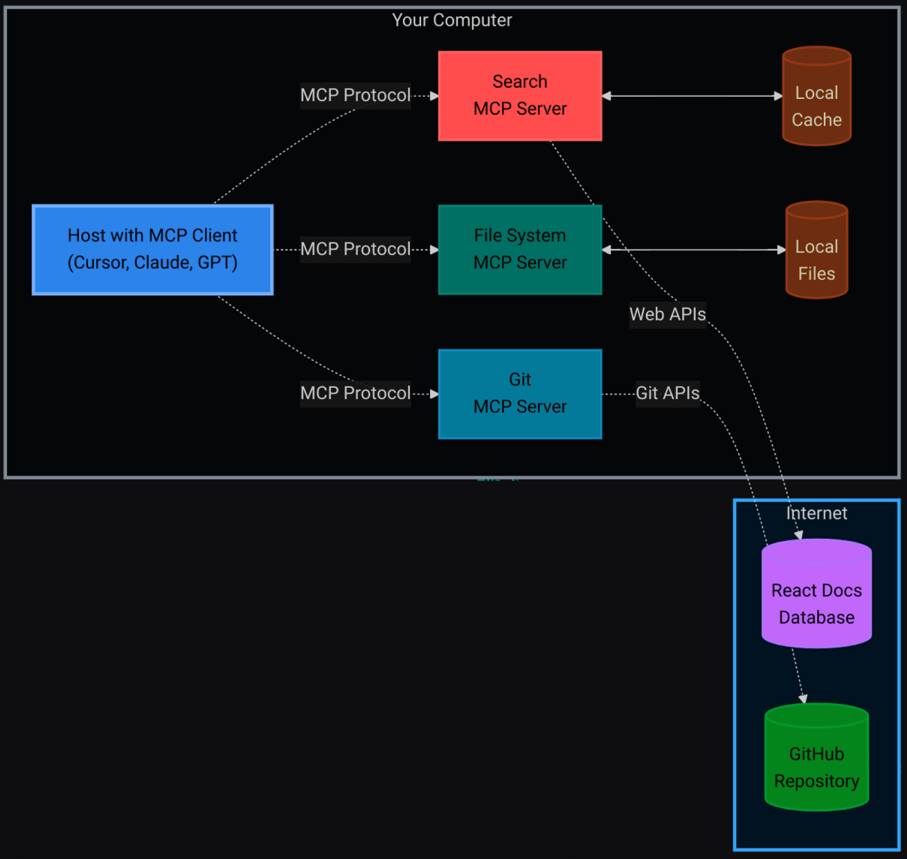
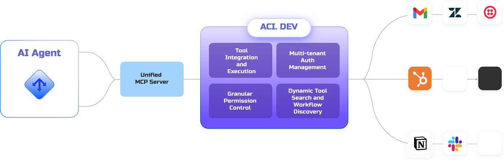
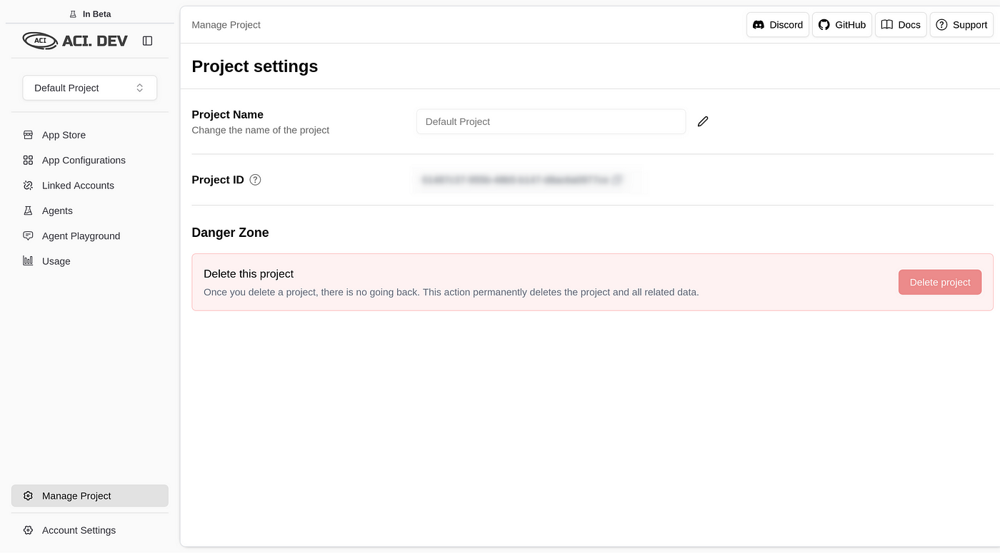
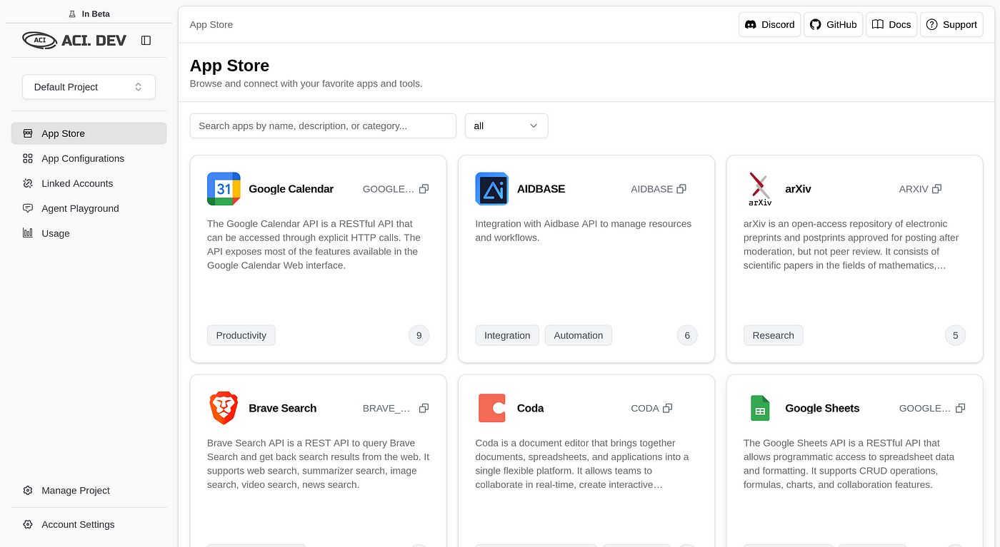
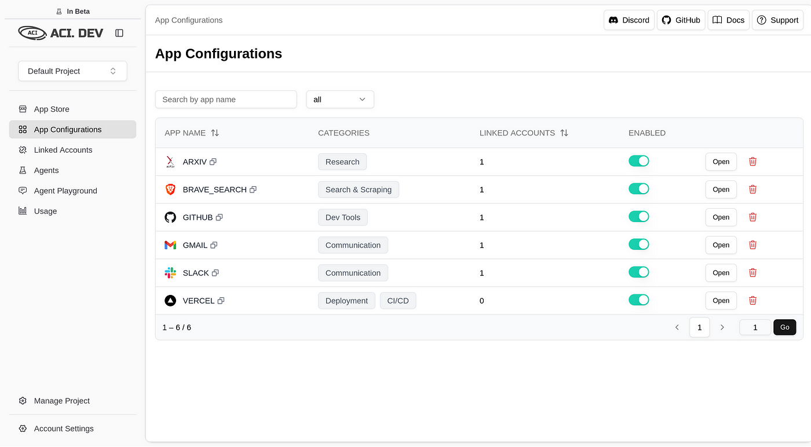

**LLMs** have been in the AI landscape for some time now and so are the **tools** powering them.

On their own, **LLMs** can _crank out essays_, _spark creative ideas_, or _break down tricky concepts_ which in itself is pretty impressive.

**But let’s be real**: without the ability to connect to the world around them, they’re just _fancy word machines_. What turns them into real problem-solvers, capable of grabbing fresh data or tackling tasks , is **tooling**.

# Traditional Tooling

**Tooling** is essentially a **_set of directions that tells an LLM how to kick off a specific action when you ask for it_**.

Imagine it as handing your AI a bunch of tasks to do, it wasn’t built for, like _pulling in the latest info_ or _automating a process_. The catch? Historically, tooling has been a **walled garden**. Every provider think **OpenAI**, **Cursor**, or **others**, has their own implementation of tooling, which creates a _mismatch of setups that don’t play nice together_. It’s a hassle for users and vendors alike.

# MCP: The better tooling

Which is what **MCP** solves. **MCP** is like a universal connector, a straightforward protocol that lets any LLM, agent, or editor hook up with tools from any source.

It’s built on a **client-server setup**: the **client** (your LLM or agent) talks to the **server** (where the tools live). When you need something _beyond the LLM’s cutoff knowledge_, like up-to-date docs, it doesn’t flounder. It pings the **MCP server**, grabs the right function’s details, runs it, and delivers the answer in plain English.



MCP Architecture

**Here’s a practical example-**

1. Imagine _you’re working in Cursor_ (**the client**) and need to implement a function using the latest React hooks from the React 18 documentation.
2. You **request**, “Please provide a useEffect setup for the current version.”

The challenge? The _LLM powering Cursor_ has a **knowledge cutoff**, so it’s limited to, say, React 17 and unaware of recent updates.

With **MCP**, this isn’t an issue. It _connects to a search MCP server_, retrieves the latest React documentation, and delivers the precise useEffect syntax _directly from the source_.

It’s like equipping your AI with a _seamless connection to the most up-to-date resources_, ensuring **accuracy without any detours**.

MCP’s a game-changer, no question. But it’s not perfect. It often locks tools to single apps, requires hands-on setup for each one, and can’t pick the best tool for the job on its own. That’s where we at [**ACI.dev**](http://aci.dev/) **step** in — to smooth out those rough edges and push things further.

## Why ACI.dev Takes MCP to the Next Level

**MCP** lays a strong groundwork, but it’s got some gaps. Let’s break down where it stumbles and how **ACI.dev** steps up to fix it.

**With standard MCP:**

- **One server, one app.** You’re stuck running separate servers for each tool — like one for GitHub, another for Gmail — which gets messy fast.
- **Setup takes effort.** Every tool needs its own configuration, and dealing with OAuth for a bunch of them is a headache for a normal or enterprise user
- **No smart tool picks.** MCP can’t figure out the right tool for a task — you’ve got to spell it all out ahead of time in the prompt to let the LLM know what tool to use and execute.

With these headaches in mind, **ACI.dev** and built something better. Our platform ties AI to third-party software through tool-calling APIs, making _integration and automation a breeze._

It does this by introducing two ways to access MCP servers

1. the **Apps MCP Server** and the
2. **Unified MCP Server** to give your AI a cleaner way to tap into tools and data.

**_This setup gives you access to 600+ MCP servers in the palm of your hand and make it easy for you to access any tool via both these methods_**



ACI.dev infra

# How ACI.dev Levels Up MCP

1. **All Your Apps, One Server — AC**I **Apps MCP Server** lets you set up tools like GitHub, Vercel, Cloudflare, and Gmail in one spot. It’s a single hub for your AI’s toolkit, keeping things simple.
2. **Tools That Find Themselves -** Forget predefining every tool. Unified MCP Server uses functions like `ACI_SEARCH_FUNCTION` and `ACI_EXECUTE_FUNCTION` to let your AI hunt down and run the perfect tool for the job.
3. **Smarter Context Handling — MCP** can bog down your LLM by stuffing its context with tools you don’t need. **ACI.dev** keeps it lean, l*oading only what’s necessary,* when it’s necessary, so your LLM has enough memory for actual token prediction.
4. **Smooth Cross-App Flows —** ACI.dev makes it linking apps seamless without jumping between servers.
5. **Easy Setup, and Authentication-** Configuring tools individually can be time-consuming, but ACI simplifies the process by _centralizing everything_. Manage accounts, API keys, and settings in one hub. Just add apps from the **ACI App Store**, enable them in Project Settings, and link them with a single `linked-account-owner-id`. Done

# Tutorial: Configuring an MCP Server with CAMEL AI and ACI for a Demo Project

Alright, we’ve covered how MCP and **ACI.dev** make LLMs way more than just word generators.  
Now, let’s get our hands dirty with a practical demo using **CAMEL AI,** a slick framework for building AI agents that can tap into **MCP servers**. We’re going to set up a **CAMEL AI agent** with ACI’s MCP server to create a GitHub repo and drop a file in it.

This tutorial shows you how to wire up CAMEL AI with ACI to use a create a project: creating a GitHub repository called `my-ski-demo` with a `README.md` that lists top US skiing spots. Let’s dive in.

## Step 1: Signing Up and Setting Up Your ACI.dev Project

First things first, head to [ACI.dev](https://platform.aci.dev/) and sign up if you don’t have an account. Once you’re in, create a new project or pick one you’ve already got. This is your control hub for managing apps and snagging your API key.



## Step 2: Adding Apps in the ACI App Store

- Zip over to the [ACI App Store](https://platform.aci.dev/apps).
- Search for the **GitHub** app, hit “Add,” and follow the prompts to link your GitHub account. During the OAuth flow, you’ll set a `linked-account-owner-id` (usually your email or a unique ID from ACI). Jot this down—you’ll need it later.
- For this demo, GitHub is our star player. Want to level up? You can add **Brave Search** or **arXiv** apps for extra firepower, but they’re optional here.



## Step 3: Enabling Apps and Grabbing Your API Key

- Go to [Project Settings](https://platform.aci.dev/project-setting) and check the “Allowed Apps” section. Make sure **GitHub** is toggled on. If it’s not, flip that switch.
- Copy your API key from this page and keep it safe. It’s the golden ticket for connecting CAMEL AI to ACI’s MCP server.



## Step 4: Setting Up Your Local Environment

Now, let’s get your machine ready to run the CAMEL AI agent. Here’s the setup:

- **Install Dependencies**: You’ll need Python (3.8 or later) installed. Then, fire up your terminal and install the required packages:

```
pip install camel-ai python-dotenv rich uv
```

- The **uv** package is key for running thhe **uvx** command that powers the MCP server.
- Create a .env file: In your project folder, create a file named **.env** with these variables:

```
GOOGLE_API_KEY="your_google_api_key_here"
ACI_API_KEY="your_aci_api_key_here"
LINKED_ACCOUNT_OWNER_ID="your_linked_account_owner_id_here"
```

- Replace **your_google\_ api\_ key\_ here** with your Google API key for the Gemini model (get it from Google’s API console).
- Replace **your_aci\_ api\_ key\_ here** with the API key from ACI.dev’s Project Settings.
- Replace **your_linked_accout\_ owner\_ id\_ here** with the ID from the GitHub app setup.
- **Set Up the Scripts**: We’ll use two Python scripts — one to configure the MCP server and another to run the CAMEL AI agent. Save these in your project folder.

Here's the **config.py** script to set up the MCP server connection:

```
import os
import json
from dotenv import load_dotenv

def create_config():
    """Create MCP config with proper environment variable substitution"""
    load_dotenv() # load variables from the env
    aci_api_key = os.getenv("ACI_API_KEY")

    if not aci_api_key:
        raise ValueError("ACI_API_KEY environment variable is required")
    linked_account_owner_id = os.getenv("LINKED_ACCOUNT_OWNER_ID")
    if not linked_account_owner_id:
        raise ValueError("LINKED_ACCOUNT_OWNER_ID environment variable is required")
    config = {
        "mcpServers": {
            "aci_apps": {
                "command": "uvx",
                "args": [
                    "aci-mcp",
                    "apps-server",
                    "--apps=GITHUB",
                    "--linked-account-owner-id",
                    linked_account_owner_id,
                ],
                "env": {"ACI_API_KEY": aci_api_key},
            }
        }
    }
    with open("config.json", "w") as f:
        json.dump(config, f, indent=2)
    print("✓ Config created successfully with API key")
    return config

if __name__ == "__main__":
    create_config()
```

And here’s the main.py script to run the CAMEL AI agent:

```
#!/usr/bin/env python3
import asyncio
import os
from dotenv import load_dotenv
from rich import print as rprint
from camel.agents import ChatAgent
from camel.messages import BaseMessage
from camel.models import ModelFactory
from camel.toolkits import MCPToolkit
from camel.types import ModelPlatformType

load_dotenv()

async def main():
    try:
        from create_config import create_config # creates config.json
        rprint("[green]CAMEL AI Agent with MCP Toolkit[/green]")
        # Create config for MCP server
        create_config()
        # Connect to MCP server
        rprint("Connecting to MCP server...")
        mcp_toolkit = MCPToolkit(config_path="config.json")

        await mcp_toolkit.connect()
        tools = mcp_toolkit.get_tools() # connects and loads the tools in server
        rprint(f"Connected successfully. Found [cyan]{len(tools)}[/cyan] tools available")


        # Set up Gemini model
        model = ModelFactory.create(
            model_platform=ModelPlatformType.GEMINI, # you can use other models here too
            model_type="gemini-2.5-pro-preview-05-06",
            api_key=os.getenv("GOOGLE_API_KEY"),
            model_config_dict={"temperature": 0.7, "max_tokens": 4000},
        )
        system_message = BaseMessage.make_assistant_message(
            role_name="Assistant",
            content="You are a helpful assistant with access to GitHub tools via ACI's MCP server.",
        )

        # Create CAMEL agent
        agent = ChatAgent(
            system_message=system_message,
            model=model, # encapsulate your model tools and memory here
            tools=tools,
            memory=None
        )
        rprint("[green]Agent ready[/green]")

        # Get user query
        user_query = input("\\\\nEnter your query: ")
        user_message = BaseMessage.make_user_message(role_name="User", content=user_query)
        rprint("\\\\n[yellow]Processing...[/yellow]")
        response = await agent.astep(user_message) # ask agent the question ( async )

        # Show response
        if response and hasattr(response, "msgs") and response.msgs:
            rprint(f"\\\\nFound [cyan]{len(response.msgs)}[/cyan] messages:")
            for i, msg in enumerate(response.msgs):
                rprint(f"Message {i+1}: {msg.content}")
        elif response:
            rprint(f"Response content: {response}")
        else:
            rprint("[red]No response received[/red]")

        # Disconnect from MCP
        await mcp_toolkit.disconnect()
        rprint("\\\\n[green]Done[/green]")
    except Exception as e:
        rprint(f"[red]Error: {e}[/red]")
        import traceback
        rprint(f"[dim]{traceback.format_exc()}[/dim]")

if __name__ == "__main__":
    asyncio.run(main())
```

## Step 5: Running the Demo Task

With everything set up, let’s fire up the CAMEL AI agent and give it a job.

- **Run the Script**: In your terminal, navigate to your project folder and run:

```
python main.py
```

- This generates the **config.json** file, connects to the MCP server, and starts the agent. You’ll see a prompt asking for your query.
- ‍**Enter the Query**: Type this into the prompt:

```
Create a new GitHub repository named 'my-ski-demo' with the description 'A demo repository for top US skiing locations' and push a README.md file with the content: '# Epic Ski Destinations\\\\nBest spots: Aspen, Vail, Park City.'
```

- The agent will use the GitHub tool via the MCP server to create the repo and add the **README.md file.**

## Step 6: Checking the Results

Once the agent finishes, head to your GitHub account

- Look for a new repository called **my-ski-demo** with the description “A demo repository for top US skiing locations.”
- Open the repo and verify that **README.md** exists with the content:

```
# Epic Ski Destinations Best spots: Aspen, Vail, Park City.
```

‍

## Step 7: Troubleshooting and Tips

- **No Repo Created?** Double-check that your GitHub app is linked in ACI.dev and that your `.env` file has the correct `ACI_API_KEY` and `LINKED_ACCOUNT_OWNER_ID`.
- **Event Loop Errors?** If you hit a “RuntimeError: Event loop is already running,” try adding `import nest_asyncio; nest_asyncio.apply()` at the top of `main.py` to handle async conflicts.
- **More Tools?** The config supports Brave Search and arXiv, too. Want to fetch ski resort data? Tweak the query to use Brave Search, like: “Search for recent articles on top US ski resorts and summarize them.”

That’s it! You’ve got a **CAMEL AI agent** hooked up to **ACI’s MCP** server, ready to tackle tasks easily. Want to push it further? Try _adding more apps or tweaking the query for bigger projects._

# **Conclusion**

The world of AI agents and tooling is buzzing with potential, and MCP is a solid step toward making LLMs more than just clever chatbots.

As new ideas and implementations pop up in the agentic space, it’s worth staying curious and watching for what’s next. The future’s wide open, and tools like these are just the start.

**Happy coding!**

[ACI.dev](http://aci.dev/) and its [docs](https://www.aci.dev/docs/introduction/overview)  
Docs — [CAMEL AI](https://docs.camel-ai.org/)  
CAMEL AI — <https://www.camel-ai.org/>  
MCP Python SDK — [Here](https://github.com/modelcontextprotocol/python-sdk)  
[MCP Anthropic Docs](https://docs.anthropic.com/en/docs/agents-and-tools/mcp)

‍
