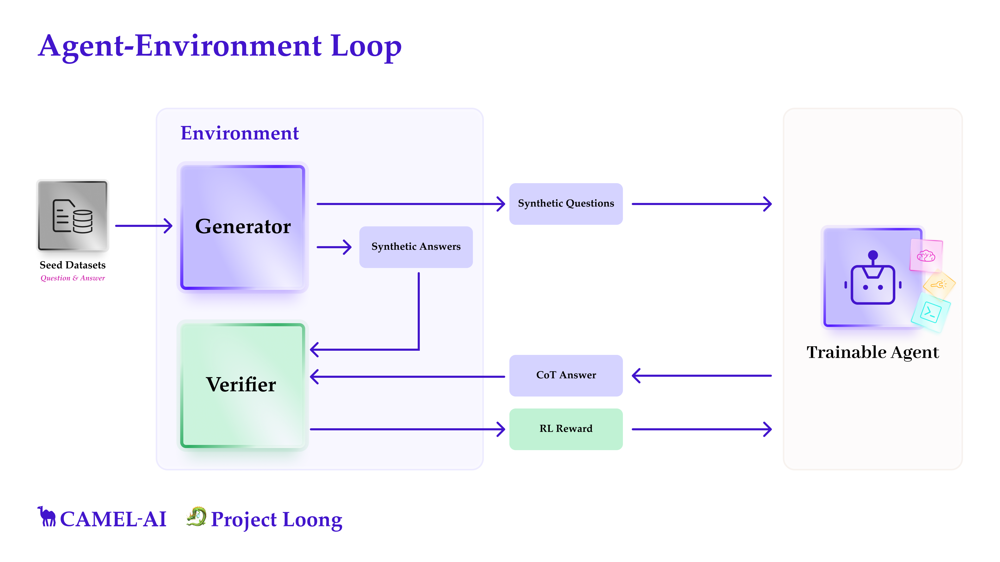

Recent Large Reasoning Models such as DeepSeek-R1 have demonstrated that general reasoning capabilities of LLMs greatly improve when base models undergo post-training with Reinforcement Learning (RL) with a verifiable reward. Mathematics and programming have particularly benefited from this approach, as these domains can be verified quite easily—allowing accurate interpretation of LLM responses and effective comparison to the ground truth on a semantic level. This idea that ease of verification is crucial to improving domain-specific capabilities has become widely accepted in the research community.

Another critical prerequisite which is often overlooked is the abundance of **high-quality datasets**, featuring questions paired with verified correct answers in the domains of Math and Coding. These curated datasets provided the necessary signal for models to learn to construct coherent **Chains-of-Thought** (CoTs) leading reliably to correct answers.

However, many other domains also require reliable reasoning—such as logic, graph theory, physics, and finance. These domains lack comparable datasets, and human-supervised data production at scale is prohibitively expensive. Without abundant correct answers to learn from, models cannot easily acquire domain-specific reasoning patterns. This raises a crucial question:  *Can similar reasoning performance be achieved in domains beyond math and programming?*In this blog, we introduce Project **Loong** - focusing on scaling up **synthetic data generation** with **verifiers** for a **broad range** of domains. We believe that **synthetic data generation** is essential—not only for addressing gaps in data-scarce domains, but also for enhancing reasoning capabilities in areas like math and programming by expanding dataset availability.

‍

## **Closing the Verification Gap in Synthetic Data for RL**

Naturally, a natural gap exists between synthetic questions and their answers, as the correctness of synthetic answers isn't inherently guaranteed. To close this gap entirely, one would need human supervision which is prohibitively expensive. We try to close this gap as much as possible without involving a human in the loop.

To do this, we developed a multi-agent system that generates synthetic questions and corresponding answers from a **seed dataset**. These synthetic questions are then posed to the agent we want to train, and we employ various domain-specific verifiers to compare the agent's responses against the synthetic answers to check for semantic equivalence.

One of our main ideas is grounded in a simple hypothesis: an LLM equipped with a code interpreter can solve questions significantly more reliably compared to one relying solely on its own chain-of-thought reasoning in natural language.

This makes intuitive sense, as many fields beyond computer science—such as physics, neurophysiology, economics, and computational biology—frequently rely on code-based solutions to solve problems in their own domain.

‍

## The Loong Environment

Since we are mostly interested in doing RL, we have structured all components into a unified Gym-like **environment**, providing a clear interface for RL experimentation.



Our environments compromises three main components:

#### **Seed Dataset**

We begin by manually collecting domain-specific datasets consisting of questions and ground truth answers. Each question in the seed dataset is ensured to be solvable using code. If available, we also record the code that leads to the ground truth. The purpose of the seed dataset is not to be a large -scale dataset to use directly for training, but as a means to bootstrap the synthetic data generation process by _seeding_ the generative process of the LLM.

##### Dataset Overview

The repository currently includes a total of **3,551 questions** spanning **8 diverse domains** (and growing):

- **Advanced Math:** 1,615 questions
- **Advanced Physics:** 434 questions
- **Computational Biology:** 304 questions
- **Finance:** 320 questions
- **Graph & Discrete Math:** 179 questions
- **Logic:** 110 questions
- **Mathematical Programming:** 68 questions
- **Security & Safety:** 521 questions

‍**‍**

#### **Synthetic Data Generator**

Our Synthetic Data Generator can be seen as a blackbox, that is seeded by a seed dataset, and generates an arbitrary number of synthetic questions and synthetic answers to those questions based on the seed dataset. The environment makes no further assumptions about the inner workings of the generator. This means that any algorithm can be used under the hood for creating synthetic data. We currently support few-shot prompting over the seed data, as well as a mutli-agent system, where we use [self-instruct](https://arxiv.org/abs/2212.10560), [evol-instruct](https://arxiv.org/abs/2304.12244) or [other data generation pipelines](https://github.com/camel-ai/camel/tree/master/camel/datagen) for generating questions and a solver agent for the synthetic answers.

It is important to stress, that we do not expect these synthetic answers to always be correct. While we assume that we will obtain more correct solutions than with a naive CoT due to the code execution providing accurate computations, we are well aware that a lot of synthetic answers will still be wrong.

However, this is not a problem since we don’t learn from this _raw synthetic data_. We will further filter it in the next step and only learn from this filtered synthetic data.

#### **Verifier**

While the Synthetic Data Generator produces ample synthetic data, it's essential to filter out incorrect solutions before using them for training. To do this effectively, we validate synthetic answers using two independent approaches:

- Deriving one solution directly through the Synthetic Data Generator’s code execution.
- Independently generating another solution via natural-language Chain-of-Thought (CoT) reasoning.

If these independent solutions agree, it's highly likely that the answer is correct. Although rare, there's still a possibility of false positives (both approaches incorrectly agreeing). However, given the fundamentally different methods involved, we believe this will not occur often enough to be detrimental to model training.

Each environment also includes a **verifier** that semantically compares the LLM response with the synthetic answer, ensuring they are effectively equivalent. This verification step is crucial for accurately filtering semantic equivalences, significantly reducing false negatives (cases where semantically correct answers would otherwise be wrongly rejected).

The CoT-generating agent is the model we ultimately aim to train. During RL training, this agent receives positive rewards only when its final CoT-generated answer is semantically confirmed by the verifier to match the synthetic answer, thus ensuring it learns exclusively from likely-correct synthetic data.

#### A code snippet to get started with the Loong Environment

The code snippet below shows a simplified version of how to use the Loong environment. Implementation details that are not conducive to improving the understanding on a cursory level have been omitted. For a detailed explanation on how to use the single step environment, please refer to this [cookbook](https://github.com/camel-ai/loong/blob/main/cookbooks/env_with_generator.ipynb).

```
from camel.environments import SingleStepEnv
from camel.datasets import FewShotGenerator, StaticDataset
from camel.verifiers import PythonVerifier
from camel.agents import ChatAgent
from datasets import load_dataset

# Load and initialize a seed dataset
dataset = load_dataset("camel-ai/loong", split="graph_discrete_math")
seed_dataset = StaticDataset(dataset)

# Set up the verifier
verifier = PythonVerifier(required_packages=["numpy", "networkx"])

# Define a model backend to use for the generator
model = ...

# Set up synthetic data generation
generator = FewShotGenerator(seed_dataset=seed_dataset, verifier=verifier, model=model)

# Initialize the Loong environment
env = SingleStepEnv(generator, verifier)

# Define the agent that shall interact with the environment
agent = ChatAgent()

# Example environment interaction
obs = await env.reset()
agent_response = agent.step(obs.question)  # a step for the agent
next_obs, reward, done, info = await env.step(agent_response)
```

## Contribute to Project Loong 🐉

Researchers and developers can use the Loong environment to generate synthetic data across a variety of domains. We have already collected seed datasets for a few domains, including Mathematics, Graph Theory, Mathematical Programming and Logic. The seed data, as well as cookbooks can be found on [Github](https://github.com/camel-ai/loong). Additionally, we encourage you to collect your own seed datasets and leverage Loong to generate synthetic data for your domain.We have have unified and uploaded all the seed dataset we collected to HuggingFace:

Additionally, we encourage you to collect your own seed datasets and leverage Loong to generate synthetic data for your domain.

We are currently working on using the environment that we built to do post-training on top of LLMs of different sizes to see whether we can see an improvement in the general as well as domain-specific reasoning capabilities. We are still experimenting with different reward setups, focusing mainly on _accuracy rewards_, following the approach of DeepSeek. More details, as well as our results will be released in our upcoming preprint paper.

At CAMEL, we believe that environments are a vital component for improving domain-specific agent reasoning. If a problem can be framed clearly within an environment, agents have the potential to master it autonomously.

With Loong, we aim to address a key challenge in synthetic data generation: **ensuring data quality through verifiability**. Our goal with Loong is to make it easier to build reliable reasoning datasets in domains where curated data is scarce.

**We invite researchers and developers to contribute seed datasets, verifiers, and ideas to help improve and extend our project. _Ready to join? Click the_** [**_link_**](https://www.camel-ai.org/collaboration-questionnaire) **_or paste it into your browser to apply now._**

[](https://www.camel-ai.org/collaboration-questionnaire)

‍
