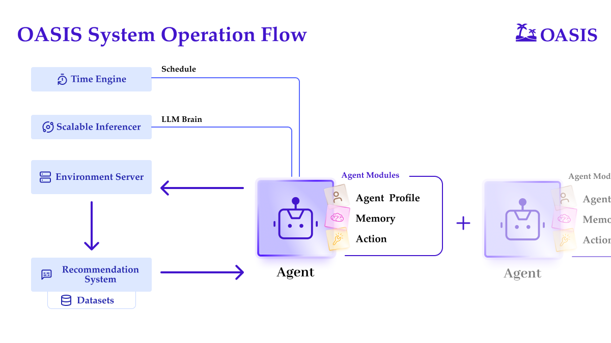
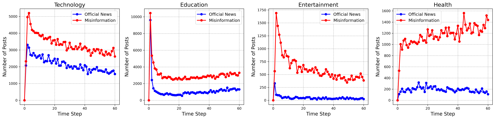
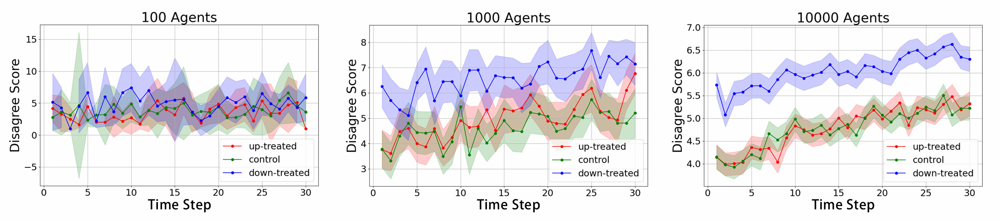
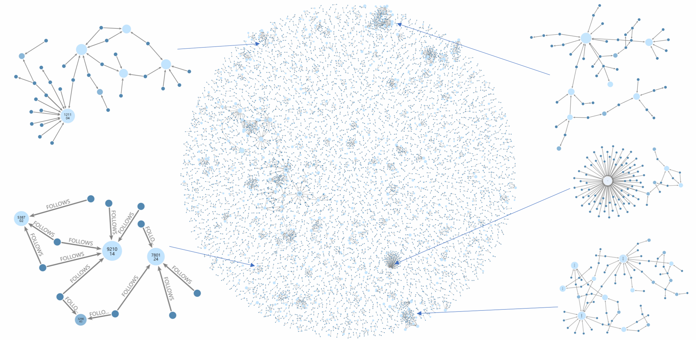
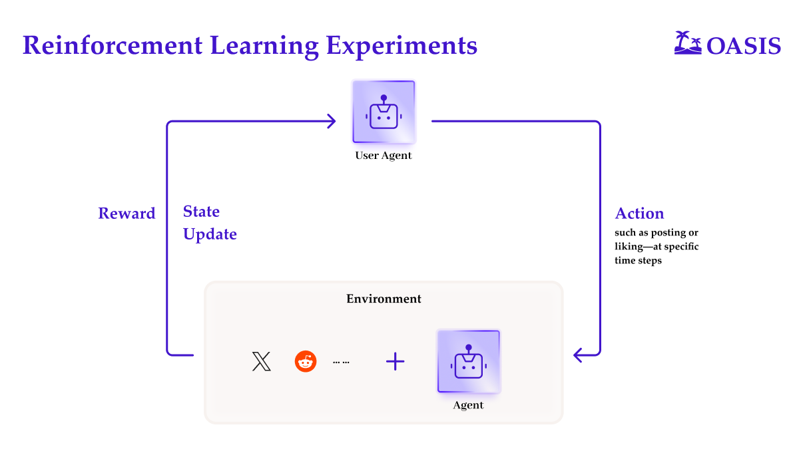

# Automation or Simulation?

Currently, the bulk of research and development in AI agent systems is focused on automating workflows—extending beyond traditional process automation and coding to include the intelligent management of various user interfaces.

In programming automation, Devin fully automates code generation, Cursor streamlines semi-automated workflows, and Windsurf integrates copilot assistance with autonomous decision-making; simultaneously, general task AI agents like OpenAI’s Operators, Claude Desktop, and Manus are advancing computer and browser operations, while open-source projects such as OWL and CRAB exemplify collaborative automation.

While most attention is currently focused on automation, agent-based simulations remain under-explored due to limited interest from researchers and developers.

However, we believe simulations can be applied across a wide range of scenarios—such as marketing campaign modeling, disease spread analysis, and user behavior prediction. Among these, agent-based simulations hold the greatest potential to drive revolutionary products and reshape entire markets.

On the path to AGI, OpenAI proposed that the final stage, known as Level 5, involves AI agents capable of functioning as an entire organization. This would be a massive multi-agent system with high-fidelity simulation.

For this, simulations with agents hold the key to the next breakthrough but are still in their infancy and not mature enough to be useful in real-world systems. To achieve this transformation, we are still missing the key component—realistic environments. In this blog, we introduce 🏝️ OASIS, an open-source simulated social environment with millions of large language model agents to realistically mimic the behaviour of millions of users on platforms like Twitter and Reddit.

# 🏝️ OASIS - **Open Agent Social Interaction Simulations with One Million Agents**

Imagine being able to observe how a million Twitter users interact, spread news, and influence each other – all in a controlled environment, that's exactly what OASIS enables.

These agents aren't just simple bots. They're sophisticated entities powered by LLMs that can create posts, share content, follow other users, and engage in discussions. Each agent has its own personality, interests, and behavioural patterns, making interactions feel natural and realistic.

### **Key Features**

Here are 4 key features of OASIS:

- **Scalability:** OASIS supports simulations of up to one million agents, enabling studies of social media dynamics at a scale comparable to real-world platforms.
- **Dynamic Environments:** Adapts to real-time changes in social networks and content, mirroring the fluid dynamics of platforms like Twitter and Reddit for authentic simulation experiences.
- **Diverse Action Spaces:** Agents can perform 21 actions, such as following, commenting, and reposting, allowing for rich, multi-faceted interactions.
- **Integrated Recommendation Systems:** Features interest-based and hot-score-based recommendation algorithms, simulating how users discover content and interact within social media platforms.

OASIS system operation flow showing how AI agents integrate time, inference, environment, and recommendation components

‍

The system operates through five key components that work together:

🗃️ **Environment Server**

A massive database that tracks everything in the simulation. It stores posts, user profiles, relationships (e.g., who follows whom), and interactions (likes, comments, etc.). Think of it as Twitter’s backend, maintaining the current state of the social network.

🔍 **Recommendation System**

Decides what content each agent sees, much like on real social platforms:

- For Twitter-like platforms, it shows posts from followed accounts and recommended content.
- For Reddit-like platforms, it uses a “hot score” algorithm that factors in upvotes, downvotes, and post age.
- It also uses AI models trained on social media data to assess content similarity.

🤖 **Agent Module**

This is where the AI users "live." Each agent:

- Stores past interactions and preferences.
- Uses LLMs to decide what actions to take.
- Can perform 23 actions such as posting, commenting, or following.
- Reasons about why they take each action.

⚡ **Scalable Inferencer**

Handles the heavy computational load by:

- Efficiently managing multiple GPUs.
- Processing many agent actions simultaneously.
- Balancing the workload across available resources.

⏳ **Time Engine**

Ensures events occur in a realistic sequence:

- Each agent has a 24-hour activity pattern (their online hours).
- Actions are properly sequenced and timestamped.

#### Here's how these pieces work together in practice:

When the simulation runs, the Time Engine activates certain agents based on their schedules. Each active agent receives recommended content from the Recommendation System, which pulls from the Environment Server's database. The agent's LLM brain then decides how to respond - maybe liking a post or writing a comment. These actions get recorded in the Environment Server, affecting what other agents see later.

For example, if an agent posts about breaking news:

1. The post gets stored in the Environment Server
2. The Recommendation System prepares content for each user individually
3. Agents see the post when they become active
4. They might share it, building a chain of information spread
5. All these interactions get tracked and influence future recommendations

This cycle creates the complex social dynamics researchers want to study, from how information spreads to how groups become polarized.

The system can adapt to different platforms by adjusting components like the recommendation algorithms and available actions. This flexibility lets researchers study various social media phenomena across different types of platforms.

#### **Replicating Real-World Phenomena**

One of OASIS's most impressive capabilities is its ability to reproduce real-world social media phenomena. Researchers have successfully used it to replicate three major social science studies:

- **👥 The Herd Effect**: On Reddit-style platforms, OASIS replicates how people's judgments are influenced by others' opinions. When a post receives initial likes or dislikes, subsequent users tend to follow similar patterns.

We simulated various scenarios on Reddit where posts were pre-upvoted or pre-downvoted to mimic herd behavior among users. By comparing these simulations with human data, we observed that agents are more susceptible to herd behavior than humans—that is, they are more likely to follow others' opinions.

AI agents display distinct herd-behavior patterns compared to humans across different news domains.

‍

- **Rumor vs. Truth**: OASIS simulates how misinformation and official news spread online. By analyzing over 730,000 posts, we tracked which ones were more influenced by each type of news.

We found that misinformation consistently appeared in more posts than official news. Early on, both spread quickly as users reacted to new topics. But over time, official news lost traction faster, while misinformation remained active for longer. This suggests that false information tends to linger and keep circulating, even as other topics fade.

‍

Misinformation outlasts official news in multiple domains within the OASIS AI agent simulation.

‍

### **Can we uncover the effects of scaling up the number of agents?**

**- More agents lead to more enhanced dynamic:**

We injected a significant number of counterfactual posts into the Reddit environment and analyzed the herd effect with varying numbers of agents. It was observed that the larger the number of agents, the clearer the behavioral trends of the entire group.

Disagreement trends among AI agents vary by population size and treatment condition.

‍

**- 🌟 Network dynamic of one million agents:**

As OASIS runs, we track how users form new follow relationships. These connections don’t spread evenly—they cluster. Some users form tightly connected hubs, while others stay more isolated. This pattern suggests that misinformation and news spread within distinct communities rather than reaching everyone equally.

Community clusters and follow connections in a one-million-agent OASIS network.

‍

#### RL for More Realistic OASIS Environment

OASIS RL setup illustrating how AI agents learn via action, state feedback, and rewards.

In the future, we can further unleash OASIS’s potential through reinforcement learning.

For example, by collecting and integrating diverse social media activity data into the system, we can reward LLM Agents for imitating human behavior, gradually training them to act more human-like.

Furthermore, if we treat OASIS and its LLM Agents as a unified environment, we can design reinforcement learning experiments in which specific User Agents perform actions—such as posting or liking—at designated time steps, with the responses from other LLM Agents serving as observations. By carefully crafting the reward function, we can train these User Agents to achieve specific objectives—such as executing marketing strategies within the simulated environment.

# Matrix: Social Media Simulation Product Built with OASIS

In the Matrix universe created by OASIS, we have built a social media environment similar to X (Twitter), featuring a real-time trending topics feed and precisely simulated user-agent attention and actions.

In Matrix, we are aiming to create a realistic world simulator where you can run repeated simulations as A/B tests for your marketing captions, allowing marketers to test different angles and strategies. For product managers, Matrix can also be used during new product or service development to gather feedback from users, investors, and technical teams. You can even discuss Mars colonization plans with an Elon Musk mindset, have Silicon Valley engineers critique your technical ideas, more use cases are waiting to be discovered.

Want to take a glance at the future potential of multi-agent systems? Have fun!

<https://matrix.eigent.ai/>

‍

‍

# In Conclusion

OASIS excels in adaptability and scalability, capable of modeling everything from Twitter’s rapid-fire interactions to Reddit’s community-driven discussions. It can simulate diverse digital environments with massive agent populations.

Although fully replicating social media remains a complex challenge, OASIS provides a controlled space to explore and experiment with these dynamics and understand the limitations. Push the boundaries, test different matrix configurations—and most importantly, enjoy the process!

We're just getting started — if you're excited about building better agent environments, we’d love your ideas and contributions to help shape the future of OASIS.

‍***Ready to join? Click the*** [**_link_**](https://www.camel-ai.org/collaboration-questionnaire) **_or paste it into your browser to apply now._**

- 💻 Check out the repository: <https://github.com/camel-ai/oasis>
- 📝 Read the paper: <https://arxiv.org/abs/2411.11581>
- 🌐 Find out more via the project page: <https://oasis.camel-ai.org/>

‍

### 🐫 Thanks from everyone at CAMEL-AI

Hello there, passionate AI enthusiasts! 🌟 We are 🐫 CAMEL-AI.org, a global coalition of students, researchers, and engineers dedicated to advancing the frontier of AI and fostering a harmonious relationship between agents and humans.

📘 Our Mission: To harness the potential of AI agents in crafting a brighter and more inclusive future for all. Every contribution we receive helps push the boundaries of what’s possible in the AI realm.

🙌 Join Us: If you believe in a world where AI and humanity coexist and thrive, then you’re in the right place. Your support can make a significant difference. Let’s build the AI society of tomorrow, together!

- Find all our updates on [X](https://twitter.com/CamelAIOrg).
- Make sure to star our [GitHub](https://github.com/camel-ai) repositories.
- Join our [Discord,](https://discord.gg/nCpraan3sS) [WeChat](https://ghli.org/camel/wechat.png) or [Slack,](https://join.slack.com/t/camel-ai/shared_invite/zt-2icssxnkj-YHwFVhoZHMYpIG~ZU86WVw) community.
- You can contact us by email: camel.ai.team@gmail.com
- Dive deeper and explore our projects on <https://www.camel-ai.org/>

‍
