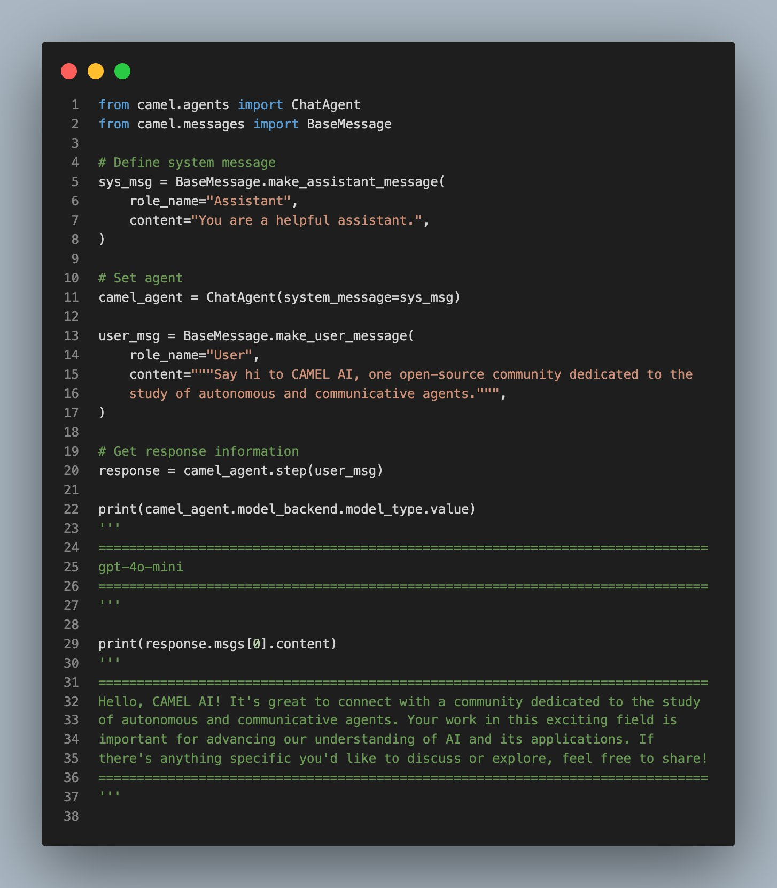
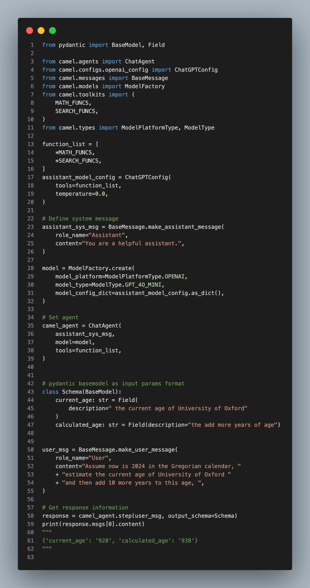
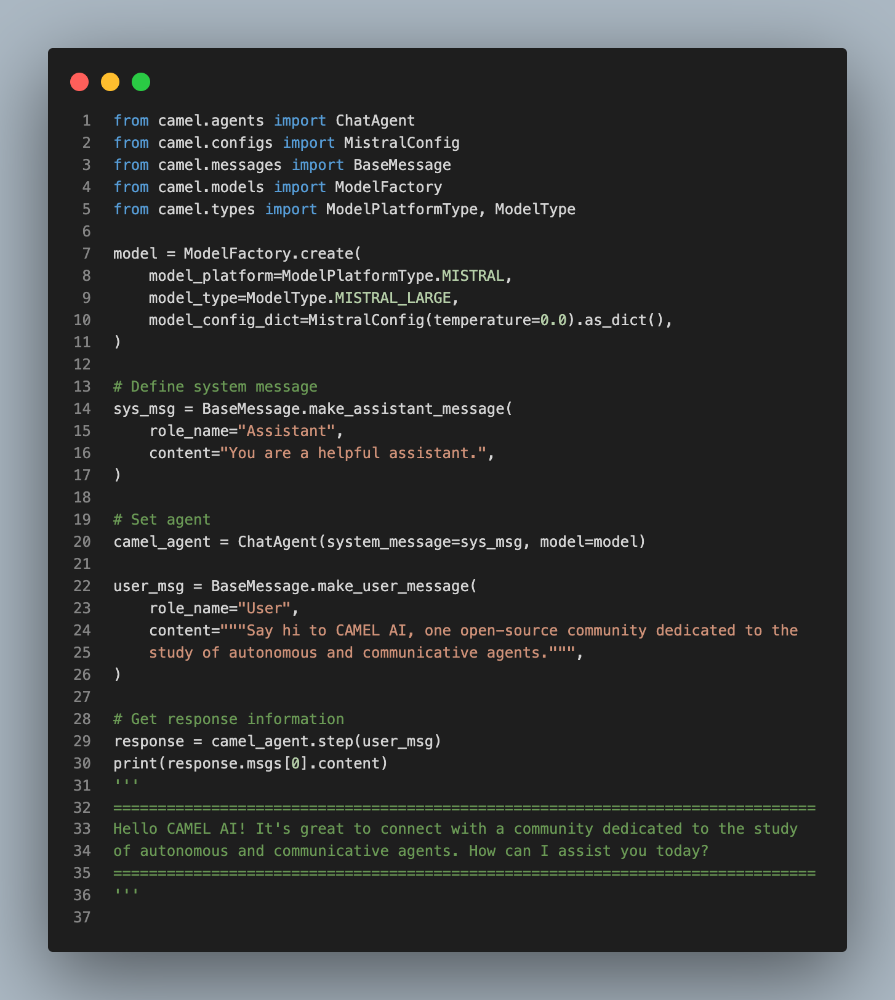
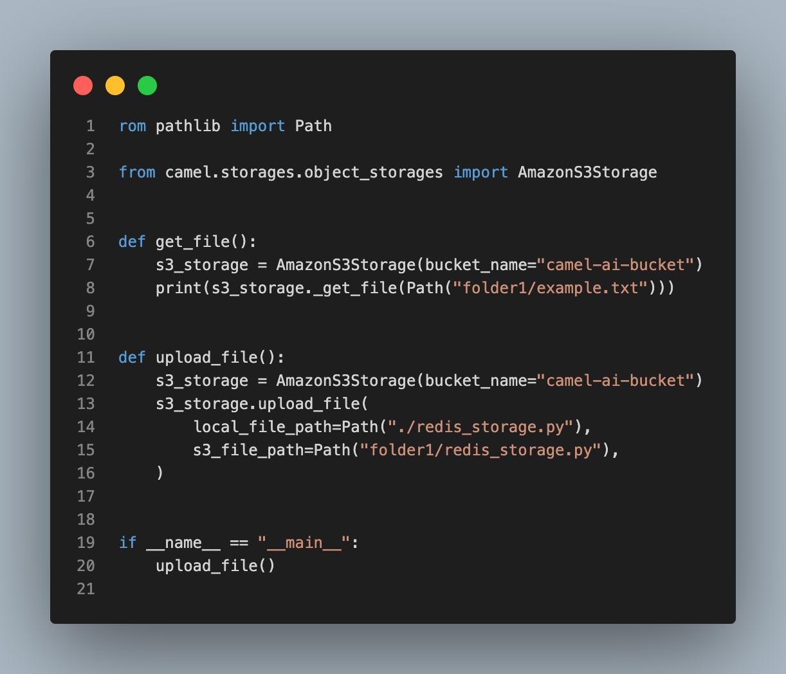
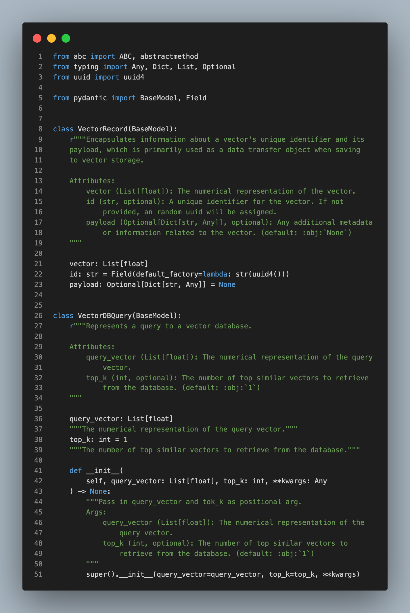

> Hello everyone! We're thrilled to announce some fantastic updates that significantly enhance our frameworks functionality, check out the details below!

## ✨Model updates:

- Integrated OpenAI's GPT-4o mini: By doing so, we’re providing superior cost-efficiency with high performance in various tasks such as reasoning, coding, and math. Thanks to our contributor [zechengzh](https://github.com/zechengz) for this effort. 🤝 [Explore more here.](https://github.com/camel-ai/camel/pull/749)

- ‍**Structure response using a function call:** We enhance the framework's ability to generate structured responses via function calls. This ensures outputs are in a predictable format like JSON, improving integration and reliability. Thanks to our contributor [raywhoelse](https://github.com/raywhoelse) for this enhancement. 🤝 [Explore more here.](https://github.com/camel-ai/camel/pull/778)

- **Integrated Mistral AI Models:** Now you can run state-art LLMs and embedding models from Mistral AI natively by using CAMEL. Thanks to our contributor [Wendong-Fan](https://github.com/Wendong-Fan) for this contribution. 🤝 [Explore more here.](https://github.com/camel-ai/camel/pull/754)

## [📦](https://emojipedia.org/package) Storage updates:

- **Added object storage support:** This allows for seamless interaction with various object storage services such as AWS S3, Azure Blob Storage, and Google Cloud Storage. Operations such as uploading, downloading, and verifying object existence are now simplified and secure. Thanks to our contributor [WHALEEYE](https://github.com/WHALEEYE) for making this happen. 🤝 [Explore more here.](https://github.com/camel-ai/camel/pull/761)

‍

## 💡Other updates:

- **Integrated Pydantic:** By doing so, we ensure data consistency and correctness in CAMEL’s key modules, enhancing robustness and reliability. Thanks to our contributors [onemquan](https://github.com/onemquan) for working on this. [Explore more here.](https://github.com/camel-ai/camel/pull/746)

### 🐫 Thanks from everyone at CAMEL-AI

Hello there, passionate AI enthusiasts! 🌟 We are 🐫 CAMEL-AI.org, a global coalition of students, researchers, and engineers dedicated to advancing the frontier of AI and fostering a harmonious relationship between agents and humans.

📘 Our Mission: To harness the potential of AI agents in crafting a brighter and more inclusive future for all. Every contribution we receive helps push the boundaries of what’s possible in the AI realm.

🙌 Join Us: If you believe in a world where AI and humanity coexist and thrive, then you’re in the right place. Your support can make a significant difference. Let’s build the AI society of tomorrow, together!

- Find all our updates on [X](https://twitter.com/CamelAIOrg).
- Make sure to star our [GitHub](https://github.com/camel-ai) repositories.
- Join our [Discord,](https://discord.gg/nCpraan3sS) [WeChat](https://ghli.org/camel/wechat.png) or [Slack,](https://join.slack.com/t/camel-ai/shared_invite/zt-2icssxnkj-YHwFVhoZHMYpIG~ZU86WVw) community.
- You can contact us by email: camel.ai.team@gmail.com
- Dive deeper and explore our projects on <https://www.camel-ai.org/>
