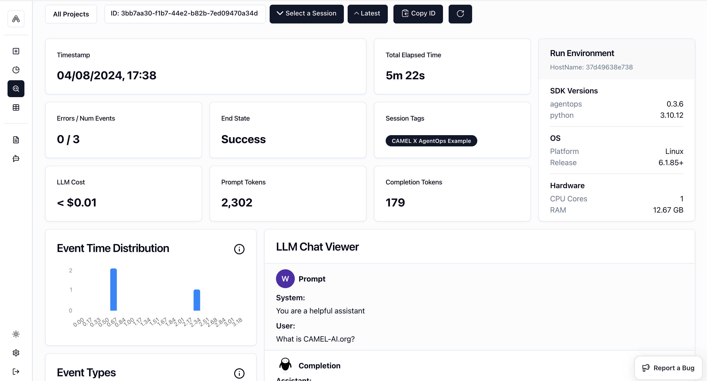
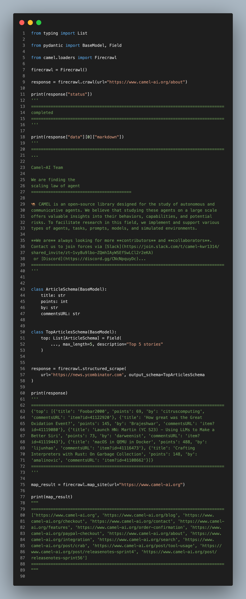
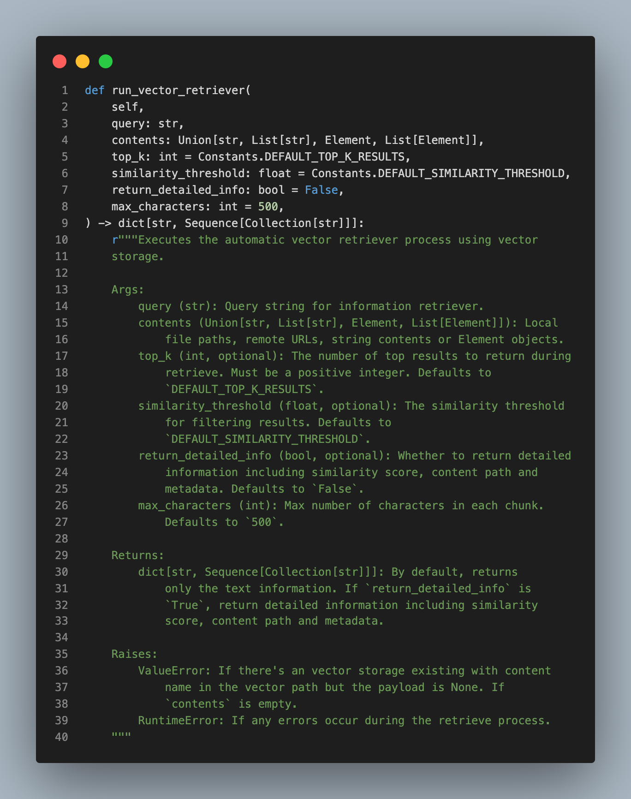

**TL;DR:** We’ve rolled out updates to enhance agent observability, streamline web scraping, and improve memory management.

### 🤖 Agent updates

**- Added support for AgentOps:** By supporting AgentOps, we're enhancing observability, improving agents running process tracking. This tool records LLM calls, tracks toolkit usage, and offers valuable insights for better agent management. Thanks to our contributor [Wendong-Fan](https://github.com/Wendong-Fan) for this effort. 🤝 Explore more [here](https://github.com/camel-ai/camel/pull/794).

### 🛠️ Tool updates

- **Integrated Firecrawl:** By doing so, we're enabling developers to perform efficient web scraping and crawling tasks, turning website data into markdown ready for use with LLMs. Thanks to our contributor [Wendong-Fan](https://github.com/Wendong-Fan) for working on this. 🤝 Explore more [here.](https://github.com/camel-ai/camel/pull/781)

### 🧠 Memory update:

**- Enhanced the record memory functionality:** This improvement simplifies code operation and prevents duplicate entries by managing message recordings efficiently. Thanks to our contributor [raywhoelse](https://github.com/raywhoelse) for this valuable update. 🤝 Explore more [here](https://github.com/camel-ai/camel/pull/788).

### 💡Other updates:

**- Enhanced the Retrieval Module to support string inputs:** By doing so, we enhance the module's versatility, allowing it to process and query content directly from strings in addition to local file paths and URLs. Thanks to our contributor [Wendong-Fan](https://github.com/Wendong-Fan) for implementing this feature. 🤝 Explore more [here](https://github.com/camel-ai/camel/pull/817).

### 🐫 Thanks from everyone at CAMEL-AI

Hello there, passionate AI enthusiasts! 🌟 We are 🐫 CAMEL-AI.org, a global coalition of students, researchers, and engineers dedicated to advancing the frontier of AI and fostering a harmonious relationship between agents and humans.

📘 Our Mission: To harness the potential of AI agents in crafting a brighter and more inclusive future for all. Every contribution we receive helps push the boundaries of what’s possible in the AI realm.

🙌 Join Us: If you believe in a world where AI and humanity coexist and thrive, then you’re in the right place. Your support can make a significant difference. Let’s build the AI society of tomorrow, together!

- Find all our updates on [X](https://twitter.com/CamelAIOrg).
- Make sure to star our [GitHub](https://github.com/camel-ai) repositories.
- Join our [Discord,](https://discord.gg/nCpraan3sS) [WeChat](https://ghli.org/camel/wechat.png) or [Slack,](https://join.slack.com/t/camel-ai/shared_invite/zt-2icssxnkj-YHwFVhoZHMYpIG~ZU86WVw) community.
- You can contact us by email: camel.ai.team@gmail.com
- Dive deeper and explore our projects on <https://www.camel-ai.org/>

‍
