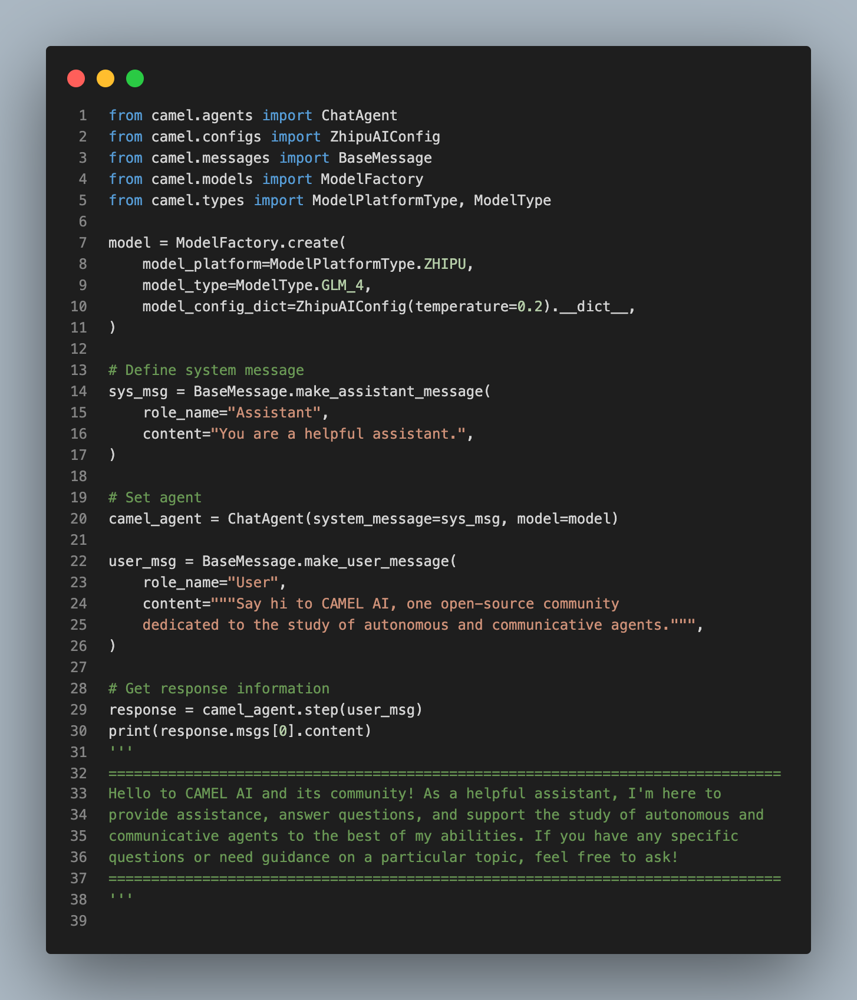
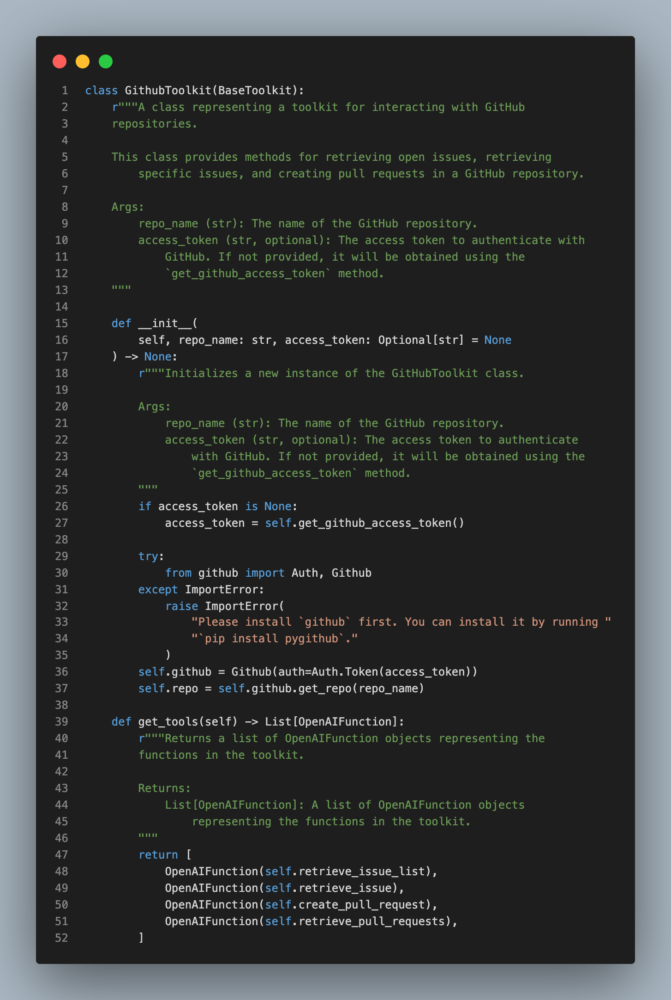
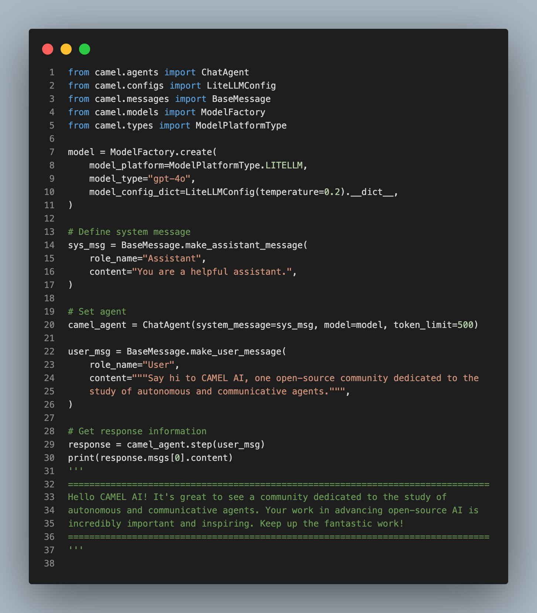
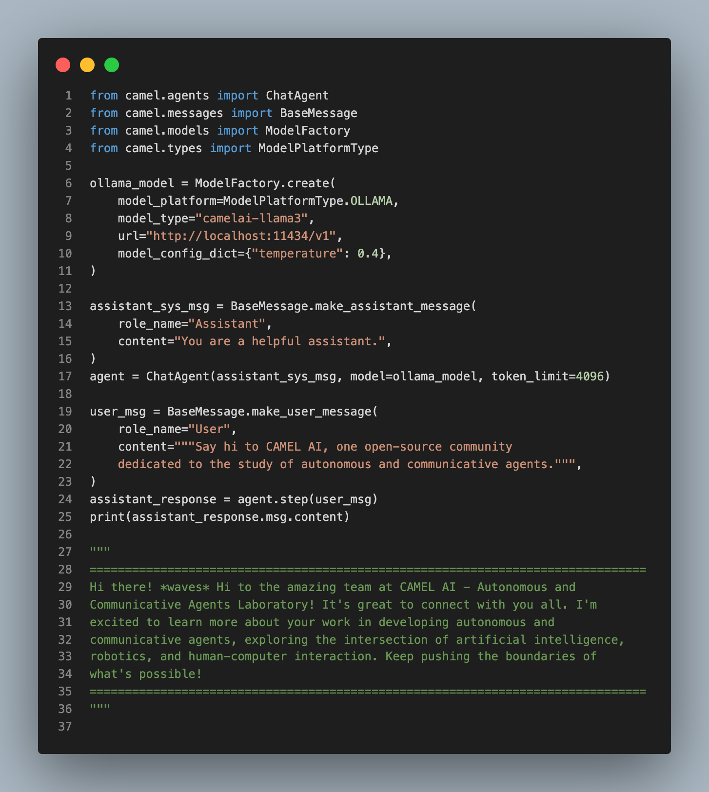

Hey everyone! We're thrilled to share some exciting updates this week, including new integrations, enhanced features, and important improvements. From adding support for various AI models to integrating new toolkits and libraries, we've made significant strides in expanding our framework's capabilities. Check out the highlights below!

‍

### 🔮 **Modality updates:**

- 🔮 **Video Description Feature:** We've just integrated a video description feature into the 🐫 CAMEL framework! See the example below where an agent can get Figma's latest demo about Figma Slides and generate a social media post highlighting the main features and moments mentioned. Just use the prompt: Create a compelling social media post based on the key highlights of this video. Thanks to [raywhoelse](https://github.com/raywhoelse) for working on this. Explore more [here](https://github.com/camel-ai/camel/pull/585).

- 🔮 **Integration of VLM Embedding Model:** We've integrated the VLM Embedding Model into the CAMEL framework, enhancing our ability to generate rich and detailed embeddings from both text and image inputs. Thanks to [FUYICC](https://github.com/FUYICC) for making this happen. Explore more [here.](https://github.com/camel-ai/camel/pull/446)

### 🛠 **Tool updates:**

- 🛠 **Add Zhipu AI Models:** We’ve just integrated Zhipu AI’s models into the CAMEL framework, enabling developers to leverage multilingual models like glm-3-turbo, glm-4, and glm-4v. Big thanks to our contributor [fengju0213](https://github.com/fengju0213) for this integration! Explore more [here](https://github.com/camel-ai/camel/pull/600).

- 🛠 **GithubToolkit Integration:** We've integrated the GithubToolkit into the CAMEL framework! Now, you can automate the retrieval and summarization of pull requests, making project tracking and reporting seamless. Perfect for creating weekly summaries and enhancing collaboration. Kudos to our contributor [rsrbk](https://github.com/rsrbk) for this valuable addition. Explore more [here](https://github.com/camel-ai/camel/pull/582).

- 🛠 **Add Support for LiteLLM Library:** We’ve integrated the LiteLLM library into the CAMEL framework! LiteLLM provides a unified interface to interact with over 100 large language model providers, allowing our agents to leverage a diverse array of LLMs. Thanks to [ZackYule](https://github.com/ZackYule) for this incredible work! Explore more [here](https://github.com/camel-ai/camel/pull/596).

- 🛠 **Integrate Ollama Model:** We've integrated Ollama into the CAMEL framework! Ollama allows users to run large language models locally. It supports models like Llama 3, Phi 3, Mistral, and Gemma. Big thanks to [Wendong-Fan](https://github.com/Wendong-Fan) for this addition! Explore more [here](https://github.com/camel-ai/camel/pull/606).

### 💡 **Others:**

- 💡 **Support API Key for OpenAPI Functions:** We've enhanced the API functionality to support API keys, improving security and access control. Thanks to [yiyiyi0817](https://github.com/yiyiyi0817)for this**,** explore more [here](https://github.com/camel-ai/camel/pull/609).
- 💡 **Contribution Guideline Update:** We’ve updated our contribution guidelines to make it easier for new contributors to get started. Thanks to [Wendong-Fan](https://github.com/Wendong-Fan)for this,explore more [here](https://github.com/camel-ai/camel/pull/602).
- 💡 **Type Hint and Docstring Enhancement:** We've made small enhancements to type hints and docstrings, improving code clarity and maintainability. Thanks to [Wendong-Fan](https://github.com/Wendong-Fan)for this,explore more [here](https://github.com/camel-ai/camel/pull/599).

### 🐫 Thanks from everyone at CAMEL-AI

Hello there, passionate AI enthusiasts! 🌟 We are 🐫 CAMEL-AI.org, a global coalition of students, researchers, and engineers dedicated to advancing the frontier of AI and fostering a harmonious relationship between agents and humans.

**📘 Our Mission:** To harness the potential of AI agents in crafting a brighter and more inclusive future for all. Every contribution we receive helps push the boundaries of what’s possible in the AI realm.

**🙌 Join Us:** If you believe in a world where AI and humanity coexist and thrive, then you’re in the right place. Your support can make a significant difference. Let’s build the AI society of tomorrow, together!

- Find all our updates on [X](https://twitter.com/CamelAIOrg).
- Make sure to star our [GitHub](https://github.com/camel-ai) repositories.
- Join our [Discord,](https://discord.gg/nCpraan3sS) [WeChat](https://ghli.org/camel/wechat.png) or [Slack](https://join.slack.com/t/camel-ai/shared_invite/zt-2icssxnkj-YHwFVhoZHMYpIG~ZU86WVw) community.
- You can contact us by email: camel.ai.team@gmail.com
- Dive deeper and explore our projects on <https://www.camel-ai.org/>

‍
