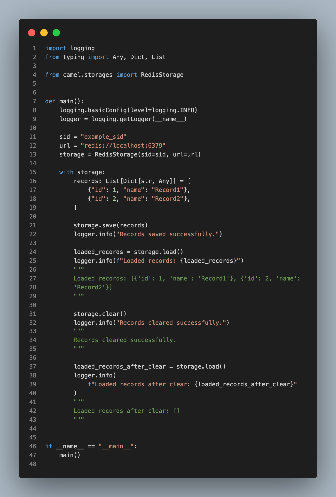
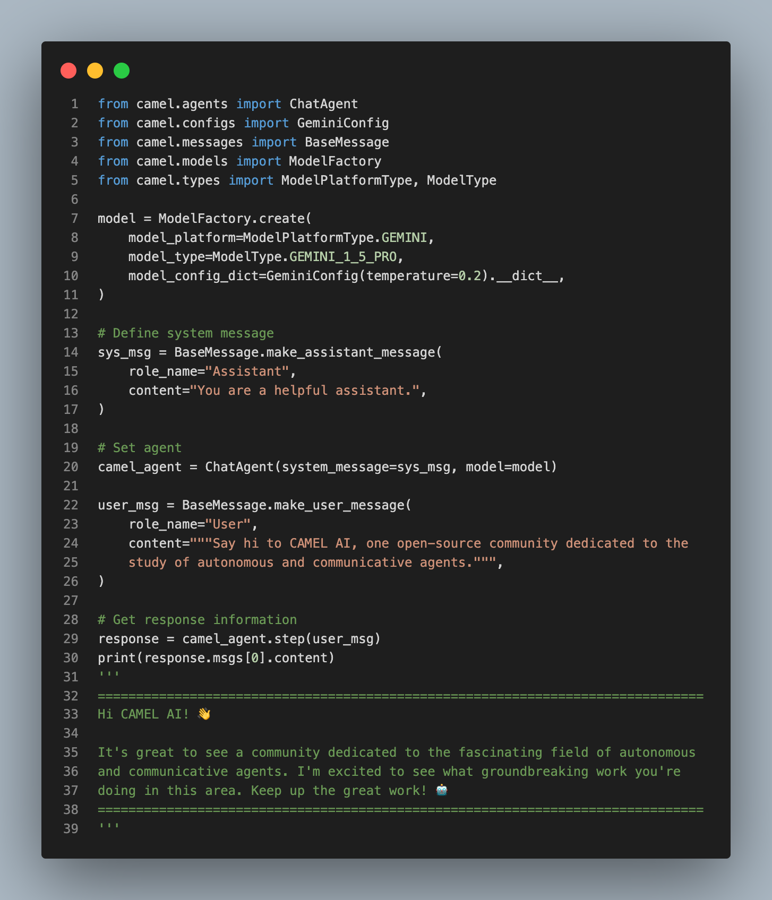
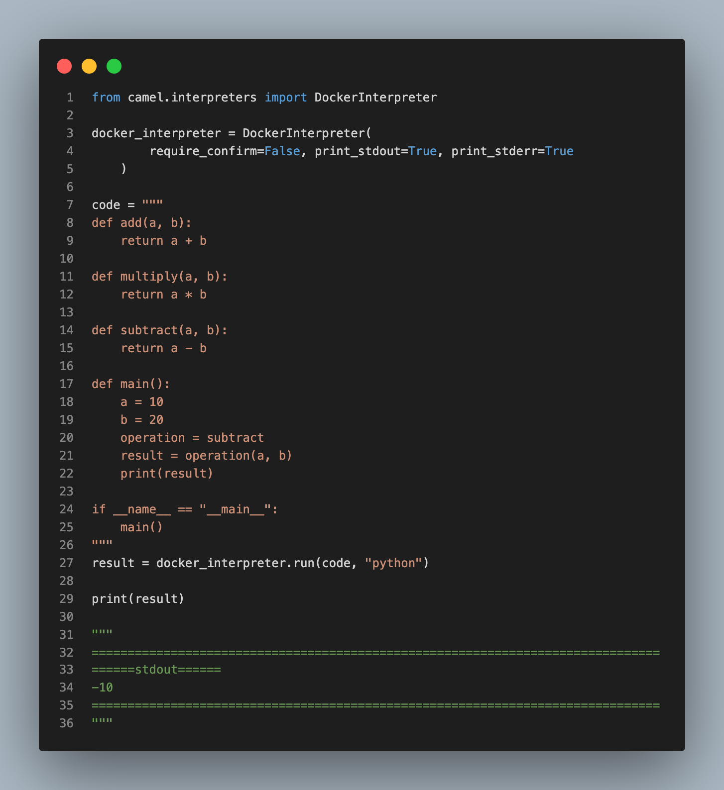
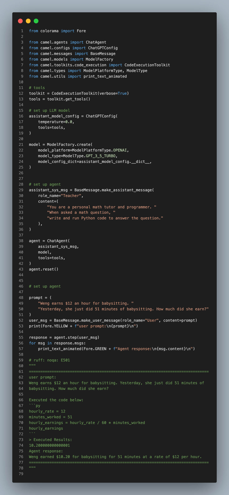
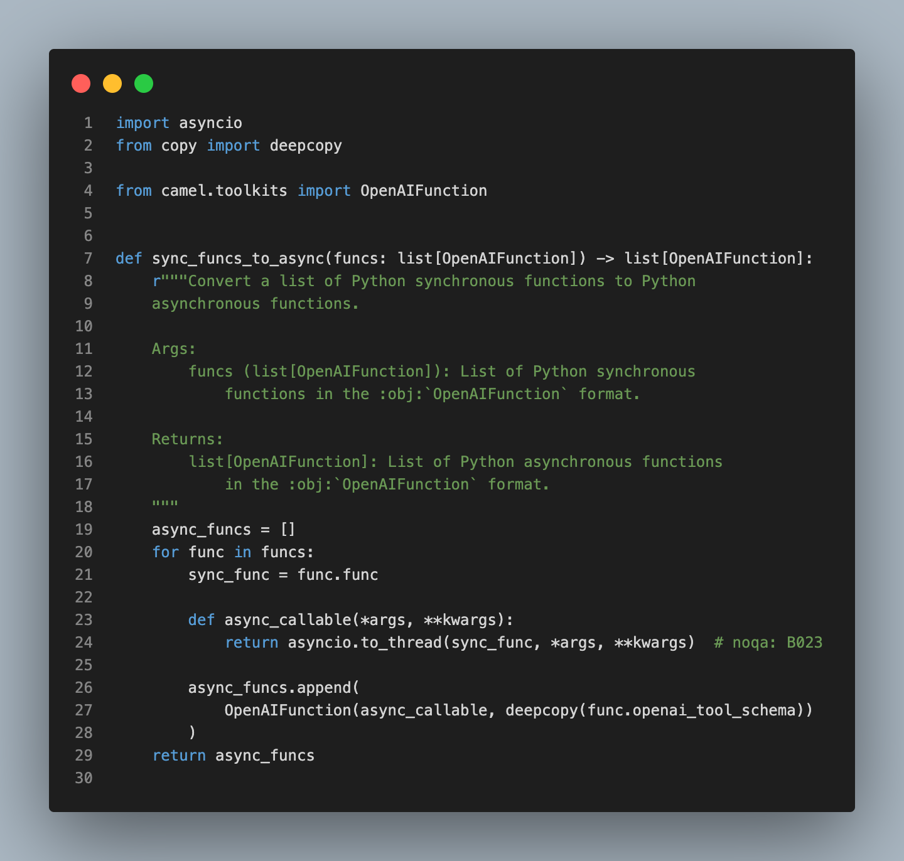
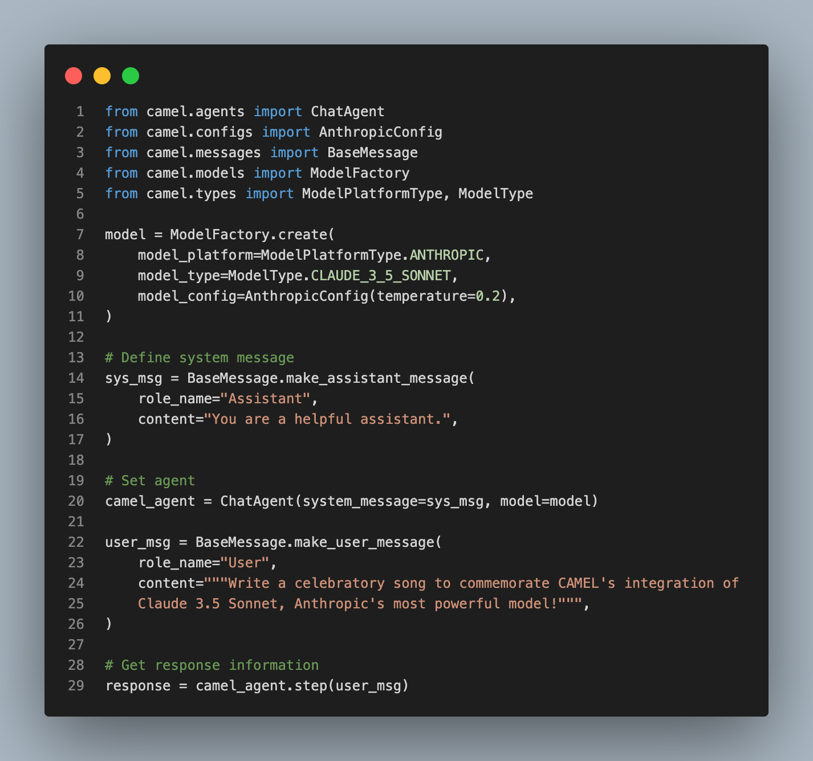
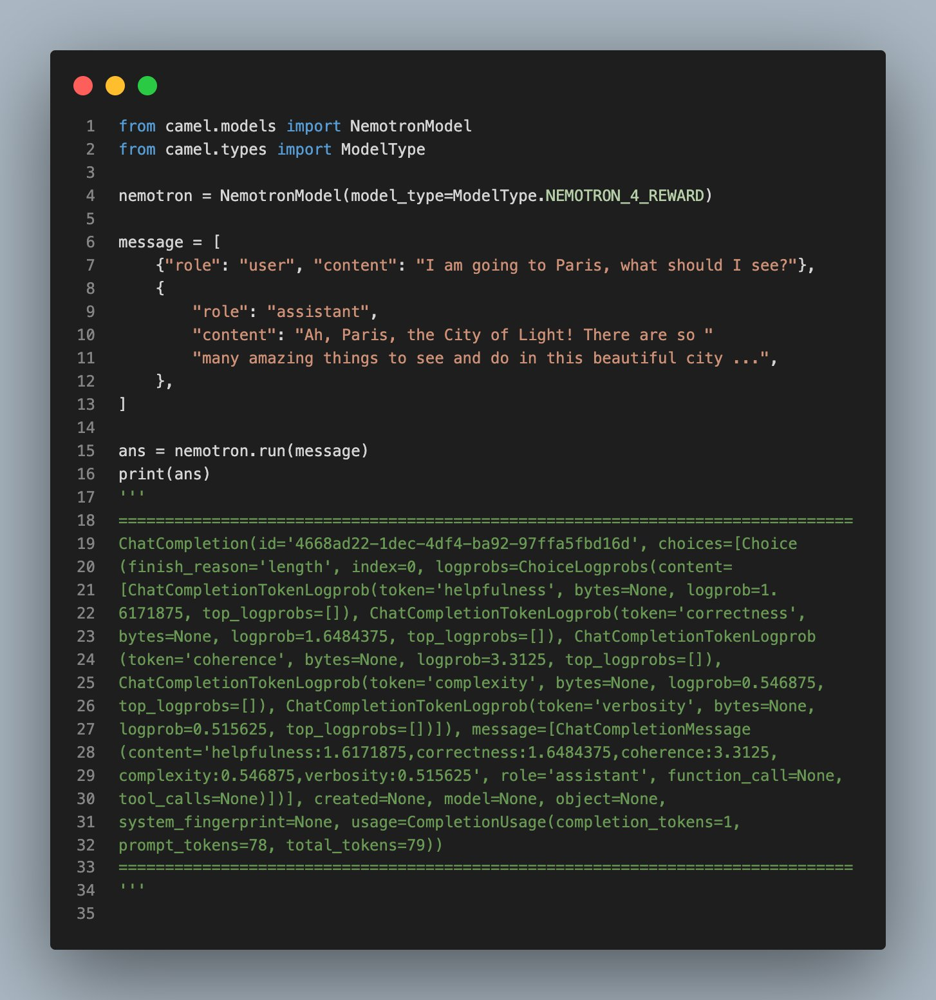
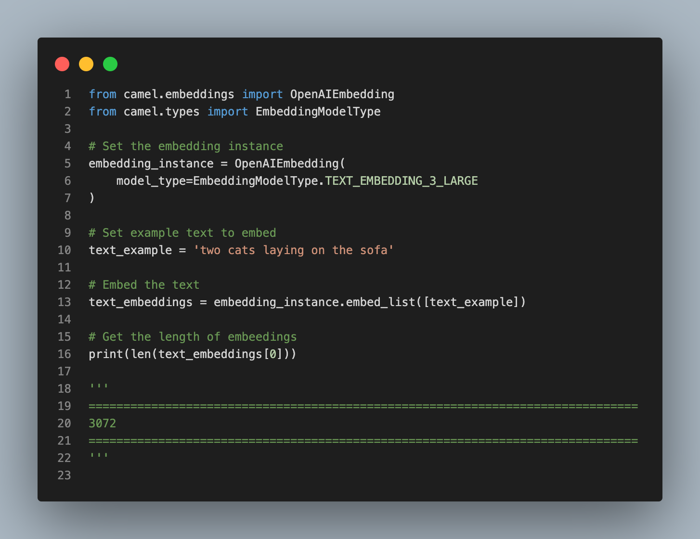
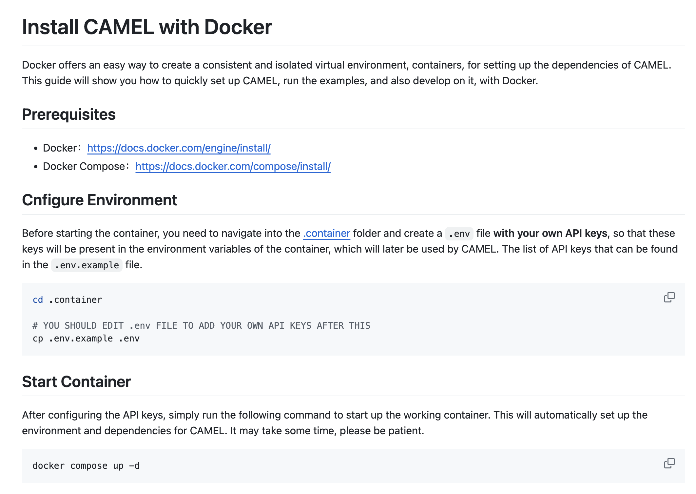

Hey everyone! We're thrilled to share this week's updates, bringing in new integrations and features to enhance our framework's capabilities in multi-modal data processing, code execution, and more. Here's a quick rundown of the latest additions:

### 🛠 **Tool updates:**

- 🛠 **Build a Discord Bot with RAG:** A Discord bot powered by CAMEL's 🐫 agent and RAG pipeline is now available, providing responses based on user knowledge bases in Discord channels. Thanks to [willshang76](https://github.com/willshang76) for this improvement.  🤝 [Explore more here.](https://github.com/camel-ai/camel/pull/660)

‍**‍**‍

- 🛠 **Redis cache storage:** We've integrated Redis cache storage, enhancing data management and persistence with high-performance, scalable technology. Thanks to [koch3092](https://github.com/koch3092) for this improvement. 🤝 [Explore more here.](https://github.com/camel-ai/camel/pull/671)

- 🛠 **Gemini 1.5:** We’ve integrated Gemini 1.5 into the CAMEL 🐫 framework, boosting our long-context understanding and multi-modal data processing for text, images, and videos. Big thanks to [Asher-hss](https://github.com/Asher-hss) for this significant enhancement. 🤝 [Explore more here.](https://github.com/camel-ai/camel/pull/647)

- 🛠 **Add Docker Support for Code Execution:** We've enabled code execution in Docker, ensuring isolated and secure environments for running scripts in multiple languages. Thanks to [WHALEEYE](https://github.com/WHALEEYE) for this update. 🤝 [Explore more here.](https://github.com/camel-ai/camel/pull/683)

- 🛠 **Code Interpreter:** Code Interpreter is now a tool within our framework, enabling dynamic code execution for agents. Thanks to [onemquan](https://github.com/onemquan) for this feature. 🤝 [Explore more here.](https://github.com/camel-ai/camel/pull/685)

- 🛠 **Sync to Async Conversion Utility:** The new sync_funcs_to_async utility converts synchronous functions to asynchronous, ensuring smooth, concurrent operations. Thanks to [zechengz](https://github.com/zechengz) for making this possible. 🤝 [Explore more here.](https://github.com/camel-ai/camel/pull/690)

- 🛠 **Claude 3.5 Sonnet:** We’ve integrated Anthropic AI's Claude 3.5 Sonnet model, excelling in reasoning, coding, and visual tasks. Thanks to [Wendong-Fan](https://github.com/Wendong-Fan) for this fantastic update. 🤝 [Explore more here.](https://github.com/camel-ai/camel/pull/669)

- 🛠 **Nemontron API Integration:** We've integrated Nemotron-4 340B Reward Model from Nvidia, Nemotron-4 340B Reward Model is a state-of-the-art multidimensional Reward Model. The model takes a text prompt as input – and returns a list of floating point numbers that are associated with the five attributes in the HelpSteer2 dataset, Nemotron-4 340B Reward can align with human preferences for a given prompt and is therefore able to replace a large amount of human annotations. Thanks to [Wendong-Fan](https://github.com/Wendong-Fan) for this implementation. 🤝 [Explore more here.](https://github.com/camel-ai/camel/pull/659)

### 💡 **Other updates:**

- 💡 **OpenAI Text Embeddings:** We’ve updated text embedding functionality to align with OpenAI's latest models, enhancing capabilities with text-embedding-3. Thanks to zechengzh for this great work. 🤝 [Explore more here.](https://github.com/camel-ai/camel/pull/627)

- 💡 **Docker Compose Support:** Docker support is now available for installing the CAMEL 🐫 framework, providing a consistent and isolated environment for easy setup and development. Thanks to [koch3092](https://github.com/koch3092) for this contribution. 🤝 [Explore more here.](https://github.com/camel-ai/camel/blob/master/.container/README.md)

### 🐫 Thanks from everyone at CAMEL-AI

Hello there, passionate AI enthusiasts! 🌟 We are 🐫 CAMEL-AI.org, a global coalition of students, researchers, and engineers dedicated to advancing the frontier of AI and fostering a harmonious relationship between agents and humans.

**📘 Our Mission:** To harness the potential of AI agents in crafting a brighter and more inclusive future for all. Every contribution we receive helps push the boundaries of what’s possible in the AI realm.

**🙌 Join Us:** If you believe in a world where AI and humanity coexist and thrive, then you’re in the right place. Your support can make a significant difference. Let’s build the AI society of tomorrow together!

- Find all our updates on [X](https://twitter.com/CamelAIOrg).
- Make sure to star our [GitHub](https://github.com/camel-ai) repositories.
- Join our [Discord,](https://discord.gg/nCpraan3sS) [WeChat](https://ghli.org/camel/wechat.png) or [Slack](https://join.slack.com/t/camel-ai/shared_invite/zt-2icssxnkj-YHwFVhoZHMYpIG~ZU86WVw) community.
- You can contact us by email: camel.ai.team@gmail.com
- Dive deeper and explore our projects on <https://www.camel-ai.org/>
