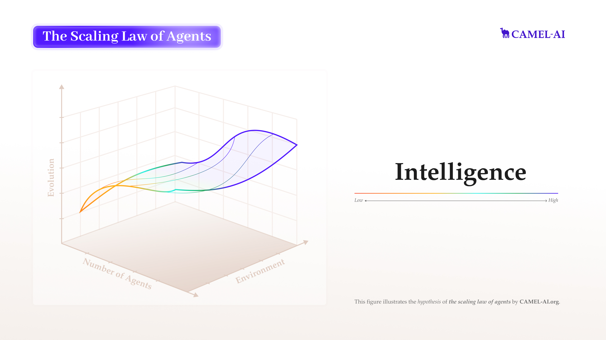
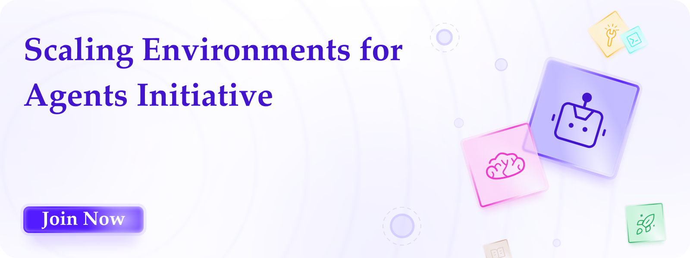

At [CAMEL-AI.org](http://camel-ai.org/), we are committed to pushing the boundaries of artificial intelligence through multi-agent systems. This blog post restates our mission, discusses current limitations and trends of AI agents, and outlines our initiative to build environments for the _data-driven_ future of AI agents.[**‍**](https://www.camel-ai.org/blogs/mission-at-camel-ai-org-finding-the-scaling-laws-of-agents)

## [**Mission: Finding the Scaling Laws of Agents**](https://www.camel-ai.org/blogs/mission-at-camel-ai-org-finding-the-scaling-laws-of-agents)

Hypothesized scaling law of AI agents by CAMEL-AI.org

Our mission has always been clear and unwavering: to uncover the scaling laws of AI agents and build the foundational infrastructure for multi-agent systems that can drive the future of artificial intelligence. From the beginning, we have been committed to exploring how AI agents scale in complexity, environments, and evolution.

#### **Dimensions of Scaling Laws of Agents**

We focus on three key dimensions:

1. **Number of Agents**: How do AI agents behave when scaled to large numbers? What emergent abilities arise from their interactions? We aim to study these phenomena and uncover patterns that reveal new capabilities as agent systems grow in scale.
2. **Environments**: How do we create environments designed to enable AI agents to learn complex reasoning, long-term decision-making, adaptive behavior, and allow agents to acquire new knowledge or skills through interaction? Our focus is on developing environments that simulate real-world complexity while providing reward signals that effectively drive agent learning and evolution.
3. **Evolution**: How can AI agents evolve through interactions within their environment? We are building reinforcement learning environments and memory systems for agents to create agents that can generalize across tasks, adapt to new challenges, and continuously improve through experience.

In this blog, we are focusing on the importance of scaling environments. Environments are not just containers for agent activity; they are essentially the missing data for agents that cannot be acquired simply by scraping the internet. Environments provide the dynamic, interactive contexts necessary for AI agents to learn adaptive behaviors and develop long-term decision-making capabilities.

## **The Rise of End-to-End Reinforcement Learning for LLM Agents**

The initial approach to making AI agents functional relied heavily on _prompt engineering_ by crafting specific instructions to guide LLM agents. This involved techniques like:

- **Role-Based Prompts**: Instructing agents to follow predefined roles or personas to simulate specific behavior.
- **Few-Shot Prompting**: Providing examples within prompts to teach agents how to use tools or perform complex reasoning.
- **Output Formatting**: Using tricks to ensure models generate structured outputs, such as JSON responses.

While these techniques are effective in prototyping agent systems, they come with significant limitations that hindered robustness, adaptability, and scalability. Prompt-based agents often fail when encountering complex or unforeseen scenarios. Their rigid behavior patterns make them ill-suited for tasks requiring dynamic decision-making. Prompts can unintentionally introduce biases or lead to hallucinated outputs, especially when interacting with tools or external components. Crafting effective prompts for increasingly complex tasks requires significant expertise, time, and trial-and-error, making it difficult to scale across diverse applications.

These challenges underscore the need for a paradigm shift—moving away from reliance on pure prompt engineering toward end-to-end reinforcement learning for LLM agents.

#### **From Prompt Engineering to End-to-End Autonomy**

End-to-end RL for LLM agents has been considered a promising direction for addressing the shortcomings of prompt engineering. These AI agents are trained holistically on tasks, rather than relying on manually crafted prompts for every scenario.

Recent advancements in RL for LLM agents have emerged from leading research labs and startups. Notable examples include OpenAI's [Operator](https://openai.com/index/introducing-operator/) and [Deep Research](https://openai.com/index/introducing-deep-research/), xAI's [Grok 3](https://x.ai/news/grok-3), and DeepSeek's [R1](https://arxiv.org/abs/2501.12948). OpenAI's Operator combines GPT-4o's vision capabilities with reinforcement learning, allowing it to interpret screenshots and interact with GUIs effectively and perform web-based tasks such as ordering groceries, booking reservations, and creating memes without requiring custom API integrations. OpenAI's Deep Research leverages reinforcement learning to autonomously navigate complex browsing and reasoning tasks across diverse domains. Trained with end-to-end reinforcement learning, it plans and executes multi-step trajectories, backtracking and adapting to real-time information as necessary. xAI's Grok 3 trained on the Colossus supercluster with ten times the computational power of previous models, Grok 3 (Think) was trained using reinforcement learning to refine its chain-of-thought reasoning. It refines its problem-solving strategies by thinking for seconds to minutes, correcting errors, exploring alternatives, and delivering accurate answers across various tasks, including mathematics, coding, and world knowledge. DeepSeek's R1 series models utilize RL to develop advanced reasoning capabilities. Initially, DeepSeek-R1-Zero demonstrated that complex reasoning behaviors, such as extended chain-of-thought and self-correction, could emerge purely through RL without supervised fine-tuning. Building upon this foundation, DeepSeek-R1 incorporates a small "cold-start" dataset alongside iterative RL and supervised fine-tuning to enhance output coherence and user-friendliness while maintaining state-of-the-art reasoning performance.

As the field continues to evolve, we foresee an increasing number of vertical agent startups incorporating reinforcement learning to train LLM agents to tackle specific industry challenges. For instance, a recent [post](https://x.com/srush_nlp/status/1902736199636205914) from the Cursor team, creators of an AI-powered code editor, indicates that Cursor AI is working on building RL models in real-world coding environments to automate coding.

‍

## **Environment is the Missing “Data” for AI Agents**

We are excited about the future of RL for LLM agents, as AI already matches human capabilities in many tasks. RL offers a promising path to achieving superhuman intelligence, and we may witness more "Lee Sedol moments," like AlphaGo’s historic victory, in the area of LLM agents across different domains. However, its full potential remains unrealized because the critical “data” for effective agent training is missing: realistic, standardized environments. While internet data may offer vast amounts of information, it lacks the interactive, adaptive, and diverse settings required for an agent to learn long-term decision-making through trial and error. AI Agents trained solely on static internet data struggle to understand temporal dynamics and complex cause-and-effect relationships in the real world.

Equally challenging is the design of robust reward functions. Without carefully crafted reward signals, it becomes difficult to train AI agents to exhibit desired behaviors. Developing dedicated verifiers to assess LLM responses can be instrumental in defining reward functions that ensure reward signals remain reliable and aligned with long-term objectives.

‍

At [CAMEL-AI.org](http://camel-ai.org/), we believe that overcoming the challenges of reinforcement learning for LLM agents requires a community-driven approach. Our open-source framework is designed to facilitate global collaboration among researchers and developers, enabling the creation of scalable environments and robust reward mechanisms. Thanks to our contributors, we already have the foundational building blocks in place, including [environments](https://github.com/camel-ai/camel/tree/master/camel/environments), [verifiers](https://github.com/camel-ai/camel/tree/master/camel/verifiers), [data generation pipelines](https://github.com/camel-ai/camel/tree/master/camel/datagen), and [toolkits](https://github.com/camel-ai/camel/tree/master/camel/toolkits) that are essential for further development.

Our goal is to build specialized environments for various domains, with applications such as synthetic data generation, task automation, and world simulation. We also aim to integrate reinforcement learning pipelines and introduce verification tools to ensure reliable reward signals for AI agents. Additionally, we welcome suggestions for new types of environments.

‍

> **Fill out this** [**form**](https://www.camel-ai.org/launchweek-environments) **and join us in shaping a future where reinforcement learning reaches its full potential**

Join CAMEL-AI’s Scaling Environments for AI Agents Initiative.

‍
