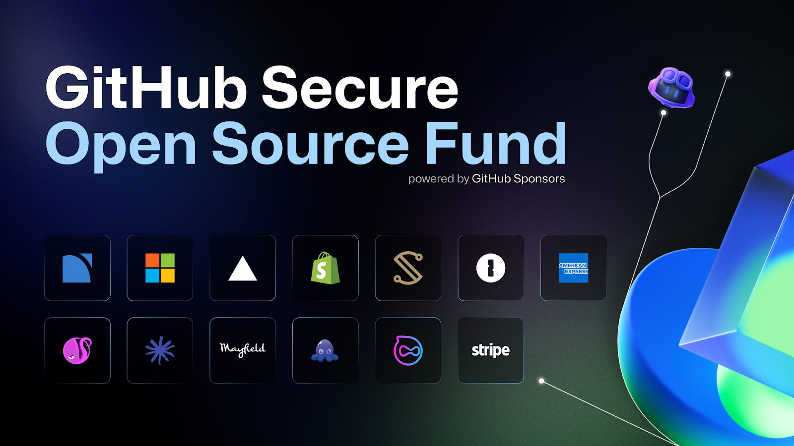
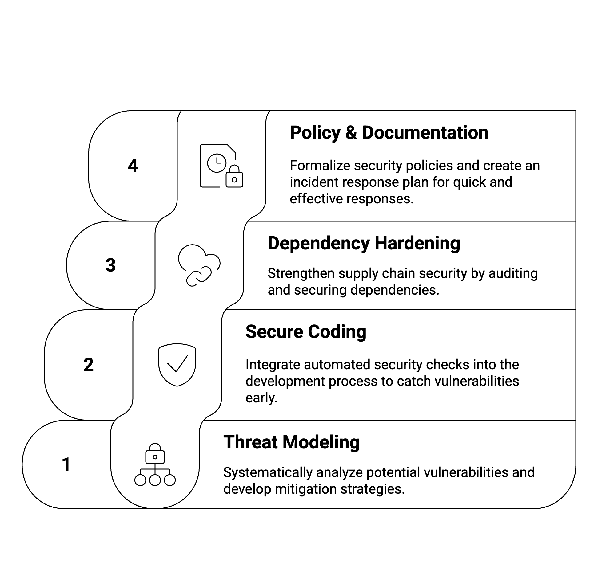
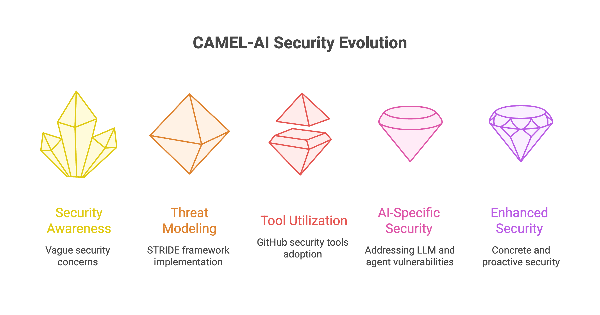

When the Apache Log4j zero-day (“Log4Shell”) broke in December 2021, the software world learned a hard lesson: a single under-resourced open-source library can send shockwaves through the entire software supply chain Modern applications often depend on **hundreds of open-source components**, many maintained by unpaid volunteers. Ensuring those components are secure is no longer optional – it’s critical for everyone’s security.

[\*GitHub’s Secure Open Source Fund program](https://resources.github.com/github-secure-open-source-fund/) sponsor in key open-source projects (71 in the first cohorts) to bolster software supply chain security at scale.\*

In response to the urgent need for open-source security, **GitHub launched the Secure Open Source (SOS) Fund in late 2024**. This program provides maintainers with funding and a focused three-week security sprint, offering hands-on education, expert mentorship, improved tooling, and a community of security-minded peers. The goal is clear – _link financial support to real security outcomes_ – so that widely-used projects get safer, reducing risks across the ecosystem.

### **Inside GitHub’s Secure Open Source Fund Program**

The Secure Open Source Fund has already run two sessions (cohorts), and the **results have been impressive**. **125 maintainers across** [**71 important open source projects**](https://github.blog/open-source/maintainers/securing-the-supply-chain-at-scale-starting-with-71-important-open-source-projects/) participated, including frameworks, libraries, and tools that millions rely on every day. With dedicated time and resources, these maintainers significantly improved their projects’ security posture. Early outcomes include:

- **Over 1,100 vulnerabilities fixed:** Projects used GitHub’s CodeQL code scanning to detect and remediate more than 1.1k code vulnerabilities, slashing potential risk .
- **Dozens of new threats disclosed:** Maintainers identified and issued **50+ new CVEs** (Common Vulnerabilities and Exposures) to alert downstream users to previously unknown security issues .
- **Secrets leaks prevented:** The cohorts **prevented 92 new secrets from leaking** (such as API keys or credentials) and detected & resolved 176 past secret exposures .
- **Security best practices adopted:** 80% of participating projects enabled at least three new GitHub security features (like dependency alerts, secret scanning, branch protection, etc.), rapidly raising the security baseline .
- **Long-term readiness:** 100% of maintainers left with actionable next steps for the coming year’s roadmap  – meaning security improvements will continue. Many also gained a deeper understanding of AI-assisted security techniques to prepare for future challenges in automation .

Equally important, the program fostered a _culture of security_ among maintainers. In cohort sessions, participants shared knowledge and even leveraged AI assistants like GitHub Copilot to streamline security tasks (from scanning code to developing fuzz tests) . By the end of the sprint, maintainers had built up security backlogs and concrete plans for ongoing improvements . This momentum benefits the **entire open-source ecosystem** – fixes shipped by these 71 projects are already protecting _millions of downstream builds each day_, and many participants are sharing their new security playbooks and incident response plans publicly for others to reuse . In short, GitHub’s initiative has turned a one-off sprint into a “flywheel” for broader security impact .

### **CAMEL-AI Among 71 Projects Securing Open Source**

One of the projects selected for this program is **CAMEL-AI**, an open-source framework for building multi-agent systems with large language models (LLMs). Being chosen as one of the “[71 important and fast-growing projects](https://github.blog/open-source/maintainers/securing-the-supply-chain-at-scale-starting-with-71-important-open-source-projects/)” underscores the significance of CAMEL-AI in the modern AI ecosystem . In fact, CAMEL-AI was grouped with other cutting-edge AI/ML tools – projects like **scikit-learn**, **OpenCV**, **AutoGPT’s GravitasML**, and **Ollama** – in the cohort focusing on AI frameworks and edge-LLM tooling . _These projects form the bedrock of today’s AI workflows_, collectively tallying tens of millions of installations and clones each month . They’re integrated into countless Jupyter notebooks, research pipelines, and applications. This means that a security flaw in an AI framework (imagine a malicious prompt injection or a poisoned model weight file) could cascade into **thousands of downstream apps overnight** – often without developers even realizing which component was compromised . Hardening projects like CAMEL-AI is therefore essential to protect the broader AI stack: as GitHub’s experts put it, if an LLM agent’s dependency gets hijacked, an attacker gains _“remote DevOps”_ powers over any systems using it . In other words, securing CAMEL-AI helps **shield everyone up the chain** who builds on top of it.

**CAMEL-AI’s inclusion** in the SOS Fund cohort meant our team received not only funding, but also direct support from GitHub’s security engineers and industry mentors. Over a three-week “security sprint,” we worked alongside maintainers of many other high-impact projects (spanning beyond AI to areas like web frameworks, DevOps tools, and core libraries). For context, the cohorts included popular front-end frameworks like **Next.js** and **Svelte**, critical infrastructure like **Node.js** and **Apache Log4j**, and even developer tools such as **Oh My Zsh** and **JUnit**, among many others  . Being in this diverse company of open-source projects allowed cross-sharing of best practices – what CAMEL-AI learned in AI security, we could exchange with maintainers in other domains, and vice versa.

‍

### **Strengthening CAMEL-AI: Security Improvements Implemented**

During the program, the CAMEL-AI team undertook a comprehensive effort to **bolster the security of the CAMEL-AI codebase and development workflow**. With guidance from the GitHub Security Lab and community experts, we focused on several key areas of improvement:

- **Threat Modeling & Risk Assessment:** We systematically **threat-modeled the CAMEL-AI framework** – scrutinizing how malicious actors might abuse or attack a multi-agent system. This meant examining everything from prompt injection vectors in agent communications to the security of our dependency chain. By mapping out potential failure points, we developed strategies to mitigate them (much like Ollama did by reviewing every moving part of their system) . This proactive analysis helps ensure that both obvious and subtle weaknesses are addressed before they can be exploited in the wild.
- **Secure Coding & Automated Checks:** We integrated GitHub’s advanced security tools into CAMEL-AI’s development process. Notably, we **enabled CodeQL code scanning on every pull request**, so that any new code is automatically checked for known vulnerability patterns . This turns what used to be a passive after-the-fact check into an active guardrail during development. In addition, we switched on secret scanning to prevent any sensitive credentials or keys from ever sneaking into the repository. These automated checks act like a “security agent” within our CI pipeline – continuously coaching and catching issues early .
- **Dependency & Supply Chain Hardening:** Another focus was tightening our supply chain security. We audited CAMEL-AI’s dependencies and build workflows to **remove or replace risky components**, following the example of projects that pruned unused dependencies and locked down their CI/CD tokens  . We also began crafting a **software bill of materials (SBOM)** for each release and exploring artifact signing. By attesting to our build artifacts (using tools like Sigstore) and controlling the release process, we give users confidence that CAMEL-AI releases are tamper-proof and authentic, making it much harder for attackers to insert themselves into our supply chain.
- **Policy, Documentation & Response Preparedness:** The program prompted us to formalize our security policies. We published a clear **`SECURITY.md`** with instructions for responsible disclosure, and created an **Incident Response Plan (IRP)** tailored to CAMEL-AI. This IRP defines how the team will triage and handle any reported vulnerability – who to involve, how to communicate, and how to fix and release patches on a tight timeline. By rehearsing this plan during the sprint, we are now prepared to react quickly and effectively if an issue arises. Additionally, our maintainers updated project documentation to emphasize security best practices, so new contributors understand that security is “something we actively do” and the standards we expect .

Each of these improvements directly enhances CAMEL-AI and its ecosystem. For example, CodeQL scans have already helped catch and fix some subtle issues that might have been overlooked. Tightened workflows and secret scanning mean that the risk of a secret leak or supply-chain attack through CAMEL-AI is dramatically lower. And with a solid vulnerability disclosure and response process in place, _our users can trust that CAMEL-AI will handle any future security issue responsibly and transparently_.

Importantly, these changes don’t just benefit CAMEL-AI in isolation – they benefit everyone who relies on CAMEL-AI as a building block. By shipping security fixes and defense-in-depth features now, CAMEL-AI is helping **protect downstream applications** (potentially numbering in the thousands) that leverage multi-agent capabilities. Our work during the SOS Fund sprint contributes to a safer foundation for AI agents: any developer using CAMEL-AI can build their AI systems with greater confidence that the framework itself won’t become an attack vector.

### How We’re Weaving Security into Our AI Agents

When we first dove into the GitHub Secure Open Source Fund (SOSF), it was more than just a checklist for us at CAMEL-AI. It truly shaped our mindset on security and got our hands dirty improving the CAMEL LLM agent framework. This chapter is the story of that journey, what we learned, what we changed, and where we’re headed next.**‍**

**Our Biggest Security Takeaways**

**‍**The SOSF program was filled with “aha!” moments, but three things really stuck with us and changed how we view our project.

1. **Thinking Like an Attacker (The Right Way!):** Honestly, threat modeling always seemed a bit abstract. But learning the STRIDE framework was a real game-changer. For the first time, we had a clear, systematic way to think about potential threats. It gave us a lens to examine our project and ask questions like, “Could someone tamper with this?” or “How could a user’s data be exposed?” It moved security from a vague concern to a concrete problem we could tackle.
2. **There’s a Tool for That!:** We were blown away by the arsenal of security tools GitHub provides. We knew about some of them, but we hadn’t grasped how powerful they could be together. From CodeQL automatically sniffing out vulnerabilities in our code to using Copilot to write safer code from the get-go, we realized we had a whole suite of helpers ready to go. It felt like getting a major security upgrade overnight.
3. **AI Has Its Own Security Puzzles:** Our biggest learning curve was understanding the unique security challenges that come with LLMs and multi-agent systems. It’s not just about traditional bugs. We’re now thinking deeply about things like prompt injection and how to secure the collaboration between different AI agents, which is a whole new frontier that’s incredibly relevant to CAMEL.

**From Learning to Doing: Our First Security Fixes ✅**

We didn’t want this to just be a theoretical exercise. We rolled up our sleeves and immediately put our learnings into practice.

1. **Our Own Security Guard**: The first thing we did was set up **CodeQL scanning**. It now runs automatically on our project, acting like a 24/7 security guard that checks our code for vulnerabilities. It’s already flagged a few issues that we were able to jump on and fix right away.
2. **Keeping a Human in the Loop**: We’ve always believed in human oversight, but we’ve now made it a core security feature. We beefed up our “human-in-the-loop” controls so that when an agent wants to perform a potentially risky action, a human gets the final say. It’s a simple but powerful safety net.
3. **Putting Our Policy in Writing**: We finally created an official `SECURITY.md` file in our repository. It might seem small, but it’s a huge step. It tells our community exactly how to report a security issue, making the whole process transparent and efficient for everyone.

‍

### What’s Next on Our Security Roadmap 🚀

We’re just getting started. Here’s a peek at what we’re focused on next to keep building a more secure framework.

- We’re creating a formal **threat model** for the whole CAMEL ecosystem. The goal is to create a go-to guide for anyone building with CAMEL, complete with best practices and our favorite security tools.
- We rely on other services, so we’re going to do a deep dive into their security, checking their code and making sure we trust our partners.
- The big one: **prompt injection**. We’re dedicating research time to figuring out the best ways to stop malicious prompts from hijacking our agents.

Security is a Team Sport 🤝We know we can’t do this alone. Security is a community effort, and we’re inviting everyone to get involved.We’ve already opened issues on GitHub to improve how our agents use tools securely, and we’d love for the community to jump in and contribute. Most importantly, if you see something, say something! We’re calling on our community to help us find vulnerabilities and to spark more conversations around LLM security.

### The Real Impact: A New Way of Thinking 💡

Looking back, the biggest change hasn’t been in our code, but in our heads. We now have a much deeper appreciation for the potential vulnerabilities in an AI agent framework. This has sparked a really exciting new idea: what if we could create **security guidelines not just for developers, but for the AI agents themselves?** Security is no longer just a human’s job. As agents become more autonomous, they need their own built-in principles for safe operation.We plan to share everything we’ve learned with our community—our successes, our challenges, and our new security docs. By being open, we hope to empower everyone to build safer, more trustworthy AI.

### **Join Us in Building a Safer AI Future**

Security isn’t a one-time sprint, it’s an ongoing commitment. At CAMEL-AI, we’ve taken big steps forward with the GitHub Secure Open Source Fund, but the real impact comes from our community: developers, researchers, and builders like you.

If you’re excited about multi-agent systems and want to help shape the security of the next wave of AI frameworks:

- ⭐ Star us on [GitHub](https://github.com/camel-ai/camel?utm_source=chatgpt.com) and explore our codebase
- 💬 Join our [Discord](https://discord.camel-ai.org) to collaborate with contributors worldwide
- 📝 Check out our [Docs](https://docs.camel-ai.org/get_started/introduction) for guides and tutorials
- 🐫 Follow us on [X (Twitter)](https://x.com/camel_ai_org?utm_source=chatgpt.com) for updates and announcements

Together, we can **make secure, reliable AI agents the default, not the exception.** 🚀
