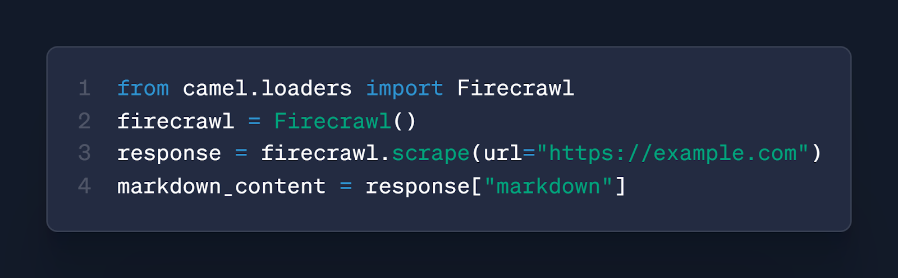
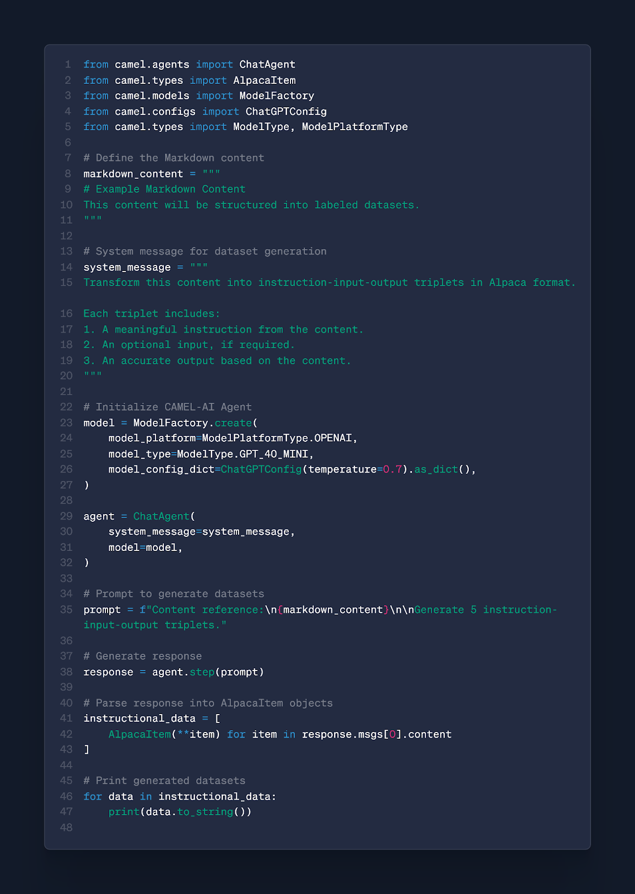
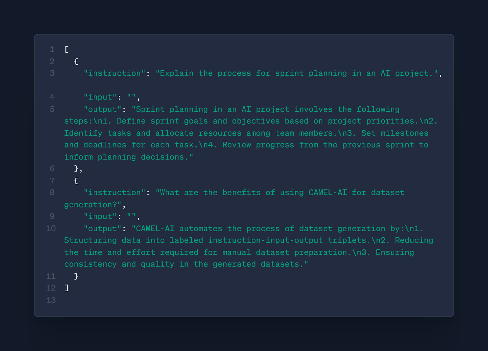
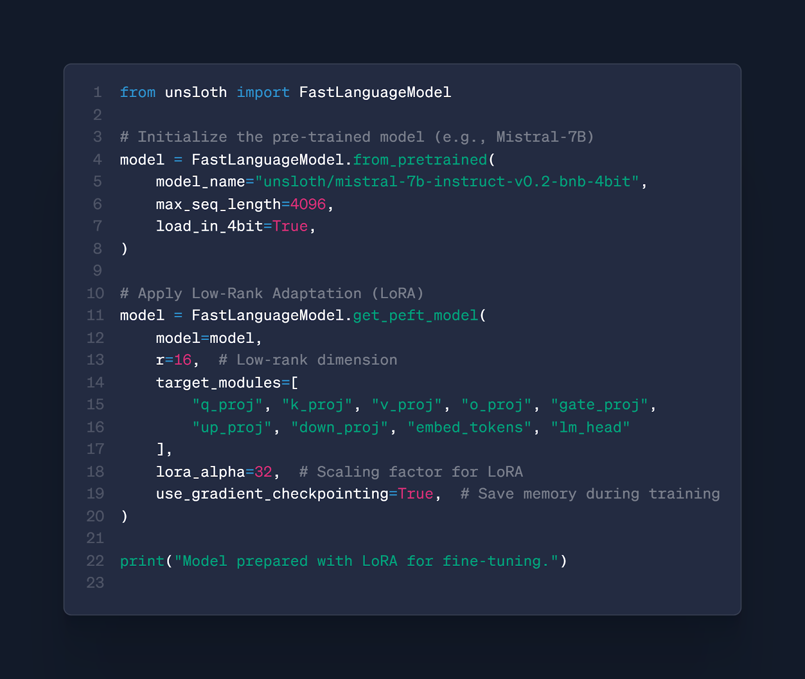
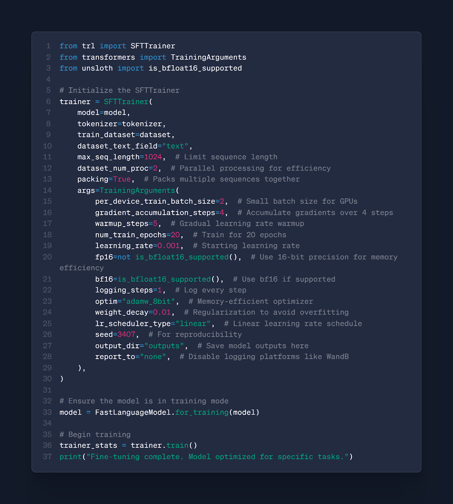
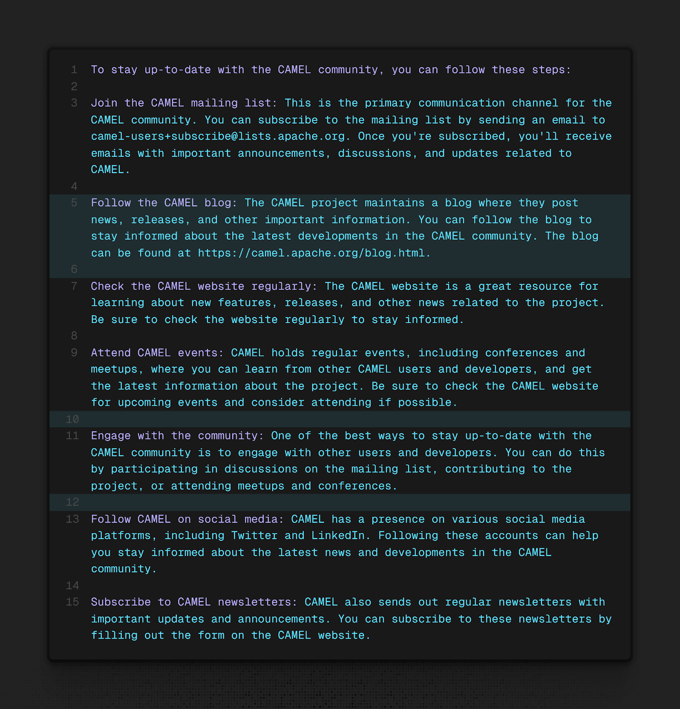
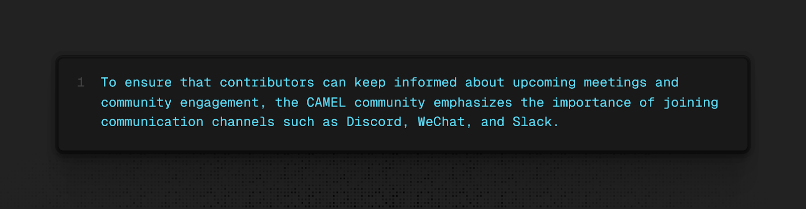

Creating custom AI models for specific tasks often feels challenging. The process includes steps like collecting datasets and optimizing model training workflows.

This guide introduces agentic supervised fine-tuning, which simplifies the complexities of AI workflows. By using tools such as CAMEL-AI for data generation and Unsloth for fine-tuning, the journey becomes less daunting and more efficient.

You will learn practical strategies to create high-quality datasets and streamline training workflows. With CAMEL-AI and Unsloth, you can achieve faster and more resource-effective model training.

This approach simplifies AI development, making the process efficient and more manageable.

We’ll explore:

- How to scrape data using **Firecrawl** and generate datasets with **CAMEL-AI**.
- Steps to optimize your model using **Unsloth**.
- Integration of tools to streamline your AI workflow.

‍  
**Essential Tools and Libraries for Agentic Supervised Fine-Tuning**

Starting with agentic supervised fine-tuning needs the right tools, libraries, and hardware. Here’s a list of what you’ll need:

### **Tools and Libraries**

- [**Python:**](https://www.python.org/) For scripting and implementation.
- [**CAMEL-AI Framework:**](https://docs.camel-ai.org/key_modules/models.html) To create labeled datasets.
- [**Unsloth:**](https://unsloth.ai/) For efficient fine-tuning.
- [**Firecrawl:**](https://www.firecrawl.dev/) To scrape and preprocess content into Markdown.

Fine-tuning AI models for specific tasks involves a sequence of well-structured steps. Here’s a streamlined approach to achieve this:

1. **Scrape Content:**Use [**Firecrawl**](https://www.firecrawl.dev/) to extract raw data from a website and convert it into a clean Markdown format.

2. **Generate Supervised Fine-Tuning Data:**Employ [**CAMEL-AI Agents**](https://www.camel-ai.org/) to convert Markdown into structured datasets in Alpaca format. These datasets contain instruction, input, and output pairs for fine-tuning.  
   ‍
3. **Prepare the Model for Fine-Tuning:**Adapt your model with LoRA (Low-Rank Adaptation) to reduce computational overhead. This step ensures that the model can effectively handle the labeled dataset.  
   ‍
4. **Fine-Tune the Model with Unsloth:**Optimize the training process with [**Unsloth**](https://unsloth.ai/), which accelerates and streamlines fine-tuning. The process leverages the labeled dataset to teach the model domain-specific knowledge.  
   ‍
5. **Inference and Validation:**After fine-tuning, interact with the model to evaluate its performance and ensure it responds accurately to the training context

‍

### **1. Scrape Content with Firecrawl**

Firecrawl, integrated with CAMEL-AI, is a powerful tool that crawls websites to scrape and structure data into clean Markdown format. By using Firecrawl, users can seamlessly extract and preprocess web content for AI workflows, saving time and ensuring data is organized for further use.  
For detailed guidance, refer to the [official documentation](https://docs.camel-ai.org/cookbooks/data_processing/ingest_data_from_websites_with_Firecrawl.html).

‍

**Why?**  
This step extracts raw data effectively from a website. This structured data can then be passed to an LLM for further training.

‍**How?** Firecrawl crawls websites, extracts the data, and converts it into a structured Markdown format, ready for LLM training.

Extract clean markdown from websites using Firecrawl for dataset preparation.

### **2. How to Create Labeled Datasets with CAMEL-AI for Fine-Tuning**

Transform the Markdown content into labeled datasets using CAMEL-AI Agents.

**Why?**   
Labeled datasets in Alpaca format ensure effective supervised fine-tuning. It structures data into instruction, input, and output triplets for better learning.

**How?  
‍**CAMEL-AI Agents convert raw Markdown into structured and meaningful examples. These examples include clear instructions, optional inputs, and detailed outputs.

Creating Labeled Datasets with CAMEL-AI for Fine-Tuning

#### **Example Generated Data:**

Example of labeled data in Alpaca format generated from markdown.

### **3. Efficient Model Preparation with LoRA for Fine-Tuning**

Adapt your pre-trained model with LoRA for efficient fine-tuning.

**Why?  
‍**LoRA focuses on training specific layers, reducing computational overhead. It adapts the pre-trained model to new data with minimal adjustments, making the process efficient.

**How?  
‍**We select specific layers (e.g., q_proj, k_proj) for LoRA. This step ensures we update only a subset of the model's weights, avoiding the need to fine-tune the entire model.

Adapt your base model using LoRA for efficient fine-tuning.

#### **Explanation**

1. r=16: Defines the dimensionality of the low-rank matrices.
2. target_modules: Specifies the layers where LoRA is applied (e.g., projection and embedding layers).
3. lora_alpha=32: Controls the weight scaling for LoRA updates.
4. use_gradient_checkpointing=True: Reduces memory usage during training by recomputing gradients as needed.  
   ‍

### **4. Fine-Tune the Model with Unsloth**

Adapt your pre-trained model using **Low-Rank Adaptation (LoRA)** for efficient fine-tuning.

#### **Key Hyperparameters**

- r=16
- target_modules=["q\_proj", "k\_proj", "v\_proj"]
- lora_alpha=32
- use_gradient_checkpointing=True

#### **How?**

Apply LoRA to your model:

Training configuration using SFTTrainer and LoRA with Unsloth for efficient LLM fine-tuning

#### **Explanation**

1. **Trainer Initialization**The SFTTrainer is initialized with the model, tokenizer, and prepared dataset.  
   ‍
2. **Fine-Tuning Parameters**some text
   - **Batch Size**: Small sizes for efficient GPU memory use.
   - **Gradient Accumulation**: Combines gradients across multiple steps to simulate larger batch sizes.
   - **Mixed Precision**: Uses FP16 or bf16 for faster training with lower memory consumption.
3. **Optimization**The adamw_8bit optimizer reduces memory usage, while weight decay prevents overfitting.  
   ‍
4. **Training**The model learns from the Alpaca-format labeled data, adapting to specific use cases.

### **5. How to Validate and Test Your Fine-Tuned LLM**

After completing the fine-tuning process, the next step is validating your model's performance.

**Demonstration of Results**

**Prompt:** "Explain how can I stay up to date with the CAMEL community."

- **Base Model Output:**

Base Model Output

- **Fine-Tuned Model Output:**

Fine-Tuned Model Output

‍

The base model generated a verbose and overly generalized response, whereas the fine-tuned model provided a clear and precise answer specific to the CAMEL community's communication practices. This demonstrates the improved contextual understanding and task-specific optimization achieved through fine-tuning.

**How to Approach It**

- Use the same prompts for inference with the base and fine-tuned models.
- Compare the outputs for accuracy, relevance, and conciseness.
- Refine datasets or training parameters iteratively if needed.
- Validation ensures the model meets task-specific requirements.

‍

Fine-tuning AI models becomes manageable with a structured approach:

- **Data Scraping with Firecrawl**: Extract raw data from websites and organize it into Markdown format for training.
- **Dataset Generation with CAMEL-AI**: Transform Markdown content into instruction-response datasets in Alpaca format, enabling meaningful fine-tuning.
- **Fine-Tuning with Unsloth**: Apply LoRA for efficient
- **Inference and Validation**: Compare model outputs before and after fine-tuning.some text
  - **Before Fine-Tuning**: Verbose, generalized responses.
  - **After Fine-Tuning**: Clear, precise answers aligned with specific tasks.

By integrating these tools, fine-tuning becomes an efficient, streamlined process that enhances model performance while saving time and resources.

‍

The more you experiment, the more you’ll uncover ways to adapt powerful models to your unique needs. To continue your learning, check out:

- [CAMEL-AI Documentation](https://docs.camel-ai.org/) for guidance on data generation.
- [Unsloth Tutorials](https://unsloth.ai/) to optimize fine-tuning workflows.
- [Cookbook](https://docs.camel-ai.org/cookbooks/data_generation/sft_data_generation_and_unsloth_finetuning_Qwen2_5_7B.html) featuring practical implementations and code examples.
