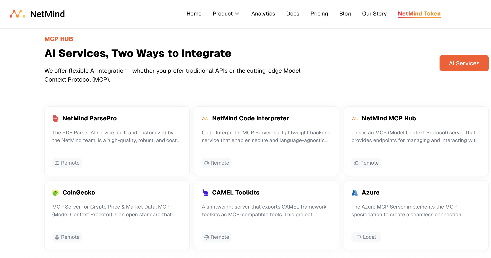
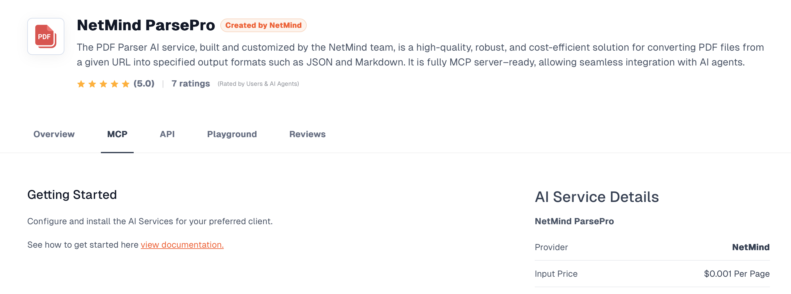
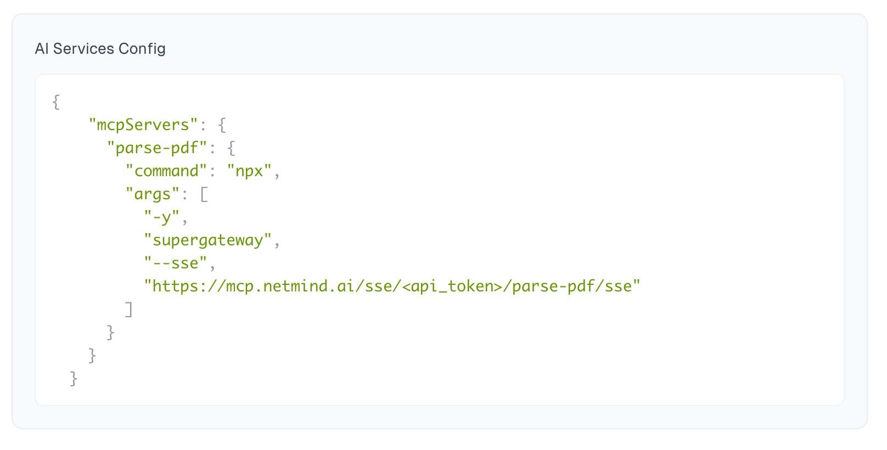
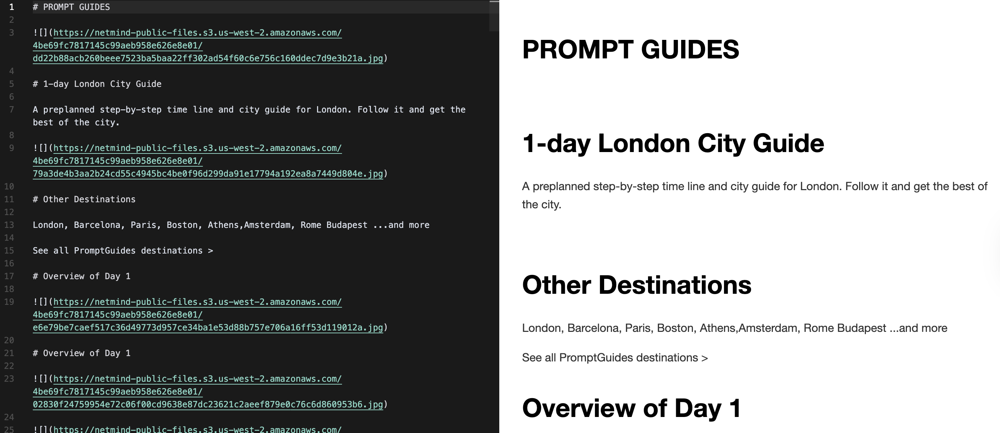

_Model Context Protocol (MCP)_ streams fresh data to an LLM on demand, and CAMEL-AI’s **MCP Hub** gives you a buffet of built-in servers. What if you find some interesting customized MCP server that you want to integrate into your CAMEL-AI agent? This post dives straight into that scenario, walking you through a minimalist, production-ready pattern for wiring **any** third-party MCP server into your CAMEL-AI agent.

### An Integration with External MCP Server: NetMind ParsePro

In this example, we are going to showcase a very useful MCP server — [NetMind ParsePro — a high-quality, robust, and cost-efficient PDF-to-JSON/Markdown converter.](https://www.netmind.ai/AIServices/parse-pdf?utm_source=blog&utm_medium=co-marketing&utm_campaign=camel) It is fully MCP server–ready, allowing seamless integration with AI agents, including our powerful CAMEL-AI agent.



Integrating an external MCP server into CAMEL-AI agent is as easy as any other MCP client: register it once, then call it from your prompts!

First, let's register and log in to our NetMind account and visit their MCP server page for NetMind ParsePro.



Here, they show how to use their MCP server with the config interface. We can find the following JSON configuration from this page. All you need to do is replacing `<api_token>` with your own NetMind API token, and save this configuration into a `.json`config file (we'll point our agent to this file later).



Your config file should look like this:

```
{
  "mcpServers": {
    "parse-pdf": {
      "command": "npx",
      "args": [
        "-y",
        "supergateway",
        "--sse",
        "https://mcp.netmind.ai/sse/<Your Token>/parse-pdf/sse"
      ]
    }
  }
}
```

Now, let's connect this MCP tool with our CAMEL Agent! Running the following code, the agent will find the proper MCP server from NetMind to finish the task of parsing a PDF into a Markdown file.

```
import asyncio
from camel.agents import ChatAgent
from camel.models import ModelFactory
from camel.toolkits.mcp_toolkit import MCPToolkit, MCPClient
from camel.types import ModelType, ModelPlatformType

async def run_time_example():
    # Initialize the MCPToolkit with your configuration file
    mcp_toolkit = MCPToolkit(config_path="config/mcp_config.json")
    # Connect to all configured MCP servers
    await mcp_toolkit.connect()

    # Create a model instance
    model = ModelFactory.create(
        model_type=ModelType.DEFAULT,
        model_platform=ModelPlatformType.DEFAULT,
    )

    camel_agent = ChatAgent(
        model=model,
        tools=[*mcp_toolkit.get_tools()],
    )
    response = await camel_agent.astep("Can you help me parse this pdf file into a Markdown file? PDF Link: http://tmpfiles.org/dl/4000646/test.pdf")
    print(response.msgs[0].content)
    print(response.info['tool_calls'])
    # Disconnect from all servers
    await mcp_toolkit.disconnect()

if __name__ == "__main__":
    asyncio.run(run_time_example())

'''
I've found parse_pdf in MCP tools. I'll use this tool to parse the pdf file...

{
  `format`: `markdown`,
  `source`: `http://tmpfiles.org/dl/4000646/test.pdf`
}
'''
```


In this example, we use this PDF showing a 1-day London City guide. It is rich in pictures and formats, and even contains a timeline. How does our agent performs with its MCP server? The following is a snippet of the Markdown file it wrote.



It successfully recovers all the details listed in the original PDF file and presents a clean and neat format in Markdown. Now, your CAMEL-AI agent is capable of parsing PDFs for you!

‍

There are **hundreds** of wonderful MCP servers in the wild — OCR, Coding, Image Generation, you name it. CAMEL's pluggable agent means you can mix-and-match the best tool for every sub-task without changing a single line of agent logic. You can also check this 60k+ Star project for inspiration: https://github.com/punkpeye/awesome-mcp-servers

**Key take-away:**

> _Treat MCP servers like micro-services for your LLM. Register once, prompt freely, and let the agent orchestrate!_

Now it’s your turn to:

Pick an MCP server your workflow craves.

Drop its JSON config into your repo.

Connect it with your own CAMEL-AI agent!

That’s it — you’ve unlocked a brand-new capability for your CAMEL-AI agent with near-zero friction.

In the meantime, since our collaboration with NetMind, our [CAMEL Toolkits](https://www.netmind.ai/AIServices/camel-toolkits) are also available at NetMind. Give it a try and leave your reviews on their platform!

### 🐫 Thanks from everyone at CAMEL-AI

Hello there, passionate AI enthusiasts! 🌟 We are 🐫 CAMEL-AI.org, a global coalition of students, researchers, and engineers dedicated to advancing the frontier of AI and fostering a harmonious relationship between agents and humans.

📘 Our Mission: To harness the potential of AI agents in crafting a brighter and more inclusive future for all. Every contribution we receive helps push the boundaries of what’s possible in the AI realm.

🙌 Join Us: If you believe in a world where AI and humanity coexist and thrive, then you’re in the right place. Your support can make a significant difference. Let’s build the AI society of tomorrow, together!

- Find all our updates on [X](https://twitter.com/CamelAIOrg).
- Make sure to star our [GitHub](https://github.com/camel-ai) repositories.
- Join our [Discord,](https://discord.gg/nCpraan3sS) [WeChat](https://ghli.org/camel/wechat.png) or [Slack,](https://join.slack.com/t/camel-ai/shared_invite/zt-2icssxnkj-YHwFVhoZHMYpIG~ZU86WVw) community.
- You can contact us by email: camel.ai.team@gmail.com
- Dive deeper and explore our projects on <https://www.camel-ai.org/>
