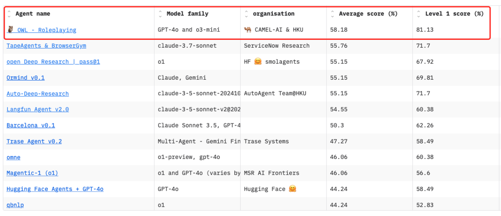
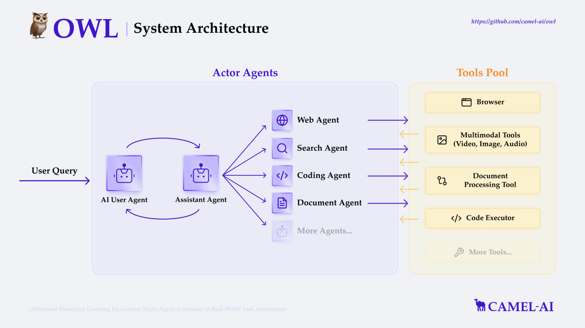
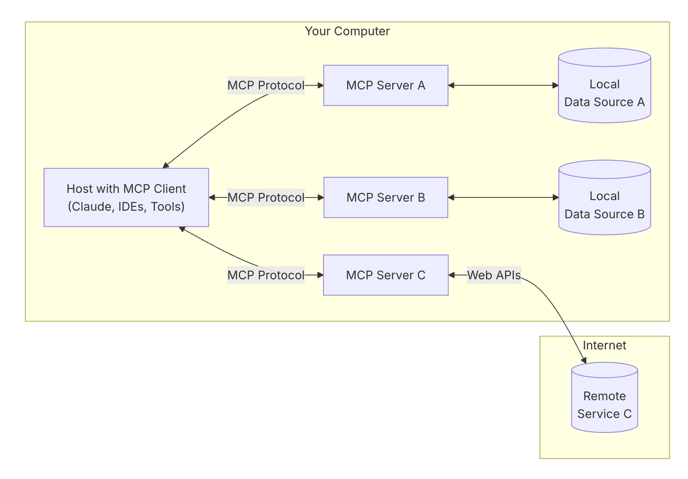
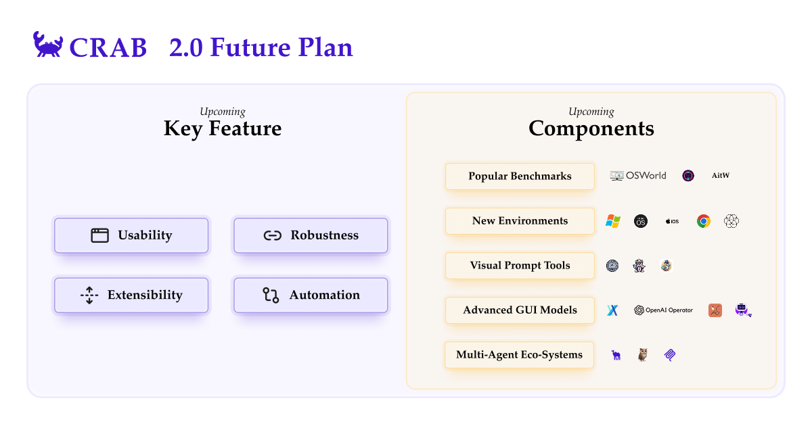
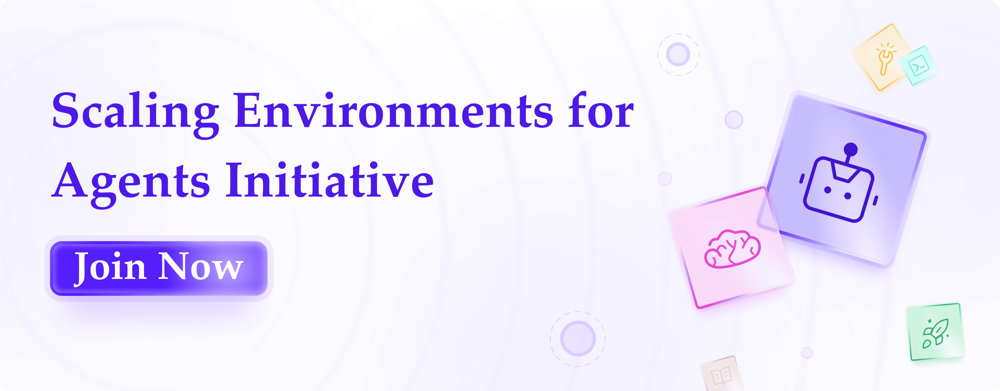

The field of autonomous agents is experiencing a renaissance. These AI systems—designed to reason, interact with tools, and complete complex tasks—are making rapid and tangible progress. From cutting-edge research frameworks to powerful platforms enabling agents to manage incredibly intricate workflows. These systems are no longer just promising demos, they’re beginning to reshape how we think about digital labor and automation.

A key enabler of this progress is the [Model Context Protocol (MCP)](https://modelcontextprotocol.io/introduction), introduced by **Anthropic**. MCP serves as a new standard for connecting AI assistants to the systems where data lives—including content repositories, business tools, and development environments. It has quickly gained traction, especially with Cursor and Windsurf's integration. OpenAI recently announced their support for Model Context Protocol in their agent SDK, marking a significant step for the ecosystem. We have also integrated it into the CAMEL framework to embrace the Model Context Protocol ecosystem.

Despite these advancements, agents still face a fundamental limitation: they **struggle with long-term decision-making and adaptation**. While they can execute well-scoped tasks, they falter on multi-step objectives that require learning, revising plans, or reacting to change. Current agents follow instructions but don’t truly evolve through experience.

This gap stems from the static nature of internet training data. Language models learn from passive text, not from interaction. To gain real autonomy, agents must operate and evolve within **environments**—digital or physical spaces where they can **perceive, act, and learn from experience**. Only through this feedback loop can agents begin to improve through trial and error.

To address this “last mile” challenge in agent automation, we introduce **OWL** and **CRAB**, two agent automations projects and Model Context Protocol integration that are designed specifically for interactive environments.

‍

## OWL: Optimized Workforce Learning

OWL (Optimized Workforce Learning), built on top of the CAMEL-AI Framework, is our recently released project for real-world task automation. OWL has shown promise in task automation, achieving an impressive average score of 58.18 on the GAIA benchmark—ranking #1 among open-source submissions.



Benchmark results showing OWL-Roleplaying leading AI agents on GAIA.

[](https://camel-ai.github.io/camel_asset/owl_gemini%202.5.mp4)

### How OWL Works

OWL is a multi-agent system for automating digital tasks through the use of a browser, terminal, code execution, function calls, and Model Context Protocol tools. The project has integrated:

- **Browser Automation**: Sophisticated browser interaction capabilities using the Playwright framework, allowing for scrolling, clicking, input handling, downloading, navigation, and more.
- **Online Search Capabilities**: Support for multiple search engines (including Google, DuckDuckGo, Baidu, Bocha, Wikipedia) enabling real-time information retrieval and knowledge acquisition.
- **Code Execution**: Ability to write and execute Python code using an interpreter, enabling programmatic solutions to complex problems.
- **Document Parsing**: Advanced extraction of content from various document formats (Word, Excel, PDF, PowerPoint), with conversion to text or Markdown format.
- **Multimodal Processing**: Robust handling of internet or local videos, images, and audio data through specialized toolkits (ImageAnalysisToolkit, VideoAnalysisToolkit, AudioAnalysisToolkit).
- **Extensive Toolkit Integration**: Access to a comprehensive set of built-in toolkits including ArxivToolkit, GitHubToolkit, GoogleMapsToolkit, and many more specialized tools built in the CAMEL framework.

The core of OWL’s functionality is built on the CAMEL framework’s RolePlaying module, which creates unique initial settings for different agents through predefined prompts. This system primarily utilizes two main agents:

1. **UserAgent**: Responsible for breaking down tasks and providing instructions
2. **AssistantAgent**: Executes instructions using various pre-configured tools or tool agents

This architecture enables OWL to handle complex workflows through dynamic agent interactions, making it particularly effective for task automation across diverse domains.

Furthermore, OWL employs a multi-agent system with context isolation for handling long-horizon tasks. Specialized sub-agents maintain isolated context windows for their domain (e.g., WebAgent keeps browser interaction history separate from main agent context).



OWL’s multi-agent architecture and tool integrations.

‍

### OWL with MCP Integration

MCP has emerged as the “USB interface” of the LLM field, becoming a universal solution for addressing AI information silos, with its ecosystem growing daily. OWL supports the Model Context Protocol to call MCP servers within its ecosystem, achieving more standardized and efficient tool invocation.



MCP Client-server architecture

#### Here’s a step-by-step guide to implementing MCP with OWL:

**1. Setting Up MCP Servers**

First, install the required MCP servers:

```
# Install MCP Playwright Server
npm install -g @executeautomation/playwright-mcp-server
npx playwright install-deps
```

‍

**2. Configure MCP Servers**

Create a configuration file named `mcp\_servers\_config.json` with the following structure:

```
{
  "mcpServers": {
    "playwright": {
      "command": "npx",
      "args": ["-y", "@executeautomation/playwright-mcp-server"]
    }
  }
}
```

‍

**3. Implementation in OWL**

Here’s how to integrate OWL with MCP in your code:

```
import asyncio
import sys

from camel.models import ModelFactory
from camel.toolkits import MCPToolkit
from camel.types import ModelPlatformType, ModelType
from camel.societies import RolePlaying
from camel.logger import set_log_level

from owl.utils.enhanced_role_playing import arun_society

set_log_level(level="DEBUG")

async def main():
    # Initialize MCP toolkit and connect
    mcp_toolkit = MCPToolkit(config_path="mcp_servers_config.json")

    try:
        await mcp_toolkit.connect()

        # Get task from command line or use default
        task = sys.argv[1] if len(sys.argv) > 1 else (
            "Using a web browser, search Google Scholar for Andrew Ng's academic profile. Create a comprehensive report that includes: (1) his main research directions in AI and machine learning, (2) at least five of his most influential published papers with citation counts, (3) his affiliated institutions throughout his career, and (4) a summary of his impact on the field."
        )

        # Setup model
        model = ModelFactory.create(
            model_platform=ModelPlatformType.OPENAI,
            model_type=ModelType.GPT_4O,
        )

        # Create and run society
        society = RolePlaying(
            task_prompt=task,
            user_role_name="user",
            user_agent_kwargs={"model": model},
            assistant_role_name="assistant",
            assistant_agent_kwargs={
                "model": model,
                "tools": mcp_toolkit.get_tools(),
            },
        )

        answer, chat_history, token_count = await arun_society(society)
        print(f"\033[94mAnswer: {answer}\033[0m")

    finally:
        try:
            await mcp_toolkit.disconnect()
        except Exception:
            print("Disconnect failed")

if __name__ == "__main__":
    asyncio.run(main())
```

‍

#### **Example Use Case**

Consider this task: “Using a web browser, search Google Scholar for Andrew Ng's academic profile. Create a comprehensive report that includes: (1) his main research directions in AI and machine learning, (2) at least five of his most influential published papers with citation counts, (3) his affiliated institutions throughout his career, and (4) a summary of his impact on the field.”

The OWL framework with MCP can handle this by:

1. Utilizing autonomous agents to decompose and tackle different aspects of the task
2. Leveraging the Playwright MCP Server to navigate academic websites and extract paper information
3. Coordinating the agents through OWL’s role-playing mechanisms to complete the task

‍

#### ‍**Benefits of OWL + MCP Integration**

1. **Standardized Tool Access**: MCP offers a unified interface for interacting with tools and data sources.
2. **Ecosystem Expansion**: New MCP servers can be seamlessly integrated to enhance OWL’s capabilities.
3. **Security**: MCP’s architecture safeguards sensitive data through its robust design.
4. **Flexibility**: Users can easily switch between any AI models that support the MCP standard.
5. **Efficiency**: Development time for complex multi-agent systems is significantly reduced.

‍

### OWL’s Future Directions

OWL’s development roadmap focuses on enhancing its capabilities in several key areas:

- **Expanding Tool Integration**: Incorporating more specialized toolkits to address domain-specific challenges
- **Improving Multi-Agent Coordination with RL**: Incorporating environmental feedback to train the multi-agent systems with reinforcement learning
- **Strengthening Reasoning Capabilities**: Developing more sophisticated planning and decision-making mechanisms
- **Broadening Environment Compatibility**: Ensuring seamless operation across different computing environments

The recent integration of MCPToolkit, FileWriteToolkit, and TerminalToolkit represents significant progress toward these goals, enhancing OWL agents with Model Context Protocol tool calling, file writing capabilities, and terminal command execution.

‍

## CRAB: Cross-environment Agent Benchmark

CRAB stands for **CR**oss-environment **A**gent **B**enchmark, is the first agent framework that supports cross-device task execution. This project aims to build a benchmark that enables agents/multi agent systems to perform tasks across multiple environments. For instance, within the CRAB framework, an agent can read a message on a smartphone and then operate a PC based on the message content.

[](https://crab.camel-ai.org/static/videos/demo3_calendar_to_vim.mp4)

## What Is an “Environment” in CRAB?

The term _environment_ is crucial in CRAB. In the example above, there are two environments: an Ubuntu PC and an Android smartphone. In fact, an environment can be any device, application, or even a more complex multi-device system—as long as it has a well-defined action space and observation space.

### Why Cross-Environment Matters

Cross-environment capability is a crucial consideration in our framework, enabling agents to interact simultaneously with multiple devices or applications. This involves coordinating across environments, leveraging information between them, and passing messages. Much like humans who naturally navigate diverse environments—each with different action/observation spaces and logic, to solve complex problems, this capability is vital. However, it stands in contrast to most existing agent benchmarks, which are typically limited to interactions within a single device or application.

CRAB introduces the first cross-environment agent benchmark, **CRAB Benchmark v0,** which includes 120 tasks spanning more than 20 applications on Ubuntu desktops and Android smartphones. We believe that scaling agent environments is a key step toward building capable and practical agents.

The cross-environment capability unlocks tremendous potential for real-world applications. One exciting possibility is applying CRAB to IoT scenarios—imagine controlling all your devices through a single intelligent agent assistant. In industries such as networking and cloud computing, managing a large number of heterogeneous devices is a constant challenge. Our cross-environment paradigm offers a promising path forward in these domains.



CRAB 2.0 roadmap for cross-environment AI agent capabilities.

### What’s Next: CRAB’s Updating Directions

We are actively improving CRAB and planning several key upgrades in the upcoming version:

- **Usability**: Simplifying configuration and improving code readability. Introducing MCP (Model Connector Protocol) for seamless integration with any model or framework.
- **Extensibility**: Adopting a modular design that makes it easy to add new environments or virtual device implementations. We’ll also introduce a plugin system to support easy customization of existing modules.
- **Robustness**: Our current VM implementations rely on QEMU/KVM and the Google Android Emulator, which are not very stable and Linux-dependent. We plan to switch to more stable and convenient alternatives like Docker.
- **Automation**: Reducing the amount of manual labor needed to conduct experiments.

We’ll be integrating more components into our [official GitHub repo](https://github.com/camel-ai/crab), including:

- **Popular Benchmarks**: OSWorld, WebArena, and more
- **New Environments**: Windows, macOS, iOS, web browsers, specific applications, OpenAI Gymnasium, etc.
- **Visual Prompt Tools**: OmniParser, Ferret-UI, Grounding DINO, etc.
- **Advanced GUI models**: OpenAI Operator, Claude Computer Using, etc.
- **Multi-Agent Systems**: Frameworks likeCAMEL and OWL, protocols like MCP

‍

## **OWL + CRAB: A Unified Agent Operating System**

The integration of **OWL** and **CRAB** creates a potent ecosystem for developing, testing, and scaling agents.

- **OWL** can execute complex, multi-step digital tasks using its sophisticated reasoning and toolkits within a defined environment.
- **CRAB** can provide and manage the diverse, interconnected environments (like PCs, smartphones, specific apps) where these tasks unfold, enabling agents/multi agent systemts operate across previously siloed systems.

#### **Complementary Capabilities**

**OWL** and **CRAB** complement each other in several important ways:

1. **Development and Evaluation**
   - OWL provides the framework for building sophisticated multi-agent systems.
   - CRAB offers standardized methods for evaluating their performance.
2. **Task Automation and Environment Adaptation**
   - OWL is good at automating complex tasks.
   - CRAB ensures these capabilities work consistently across different environments.
3. **Tool Integration and Benchmark Standardization**
   - OWL’s extensive toolkit integration is balanced by CRAB’s rigorous benchmarking approach.

#### **Data Generation Potential**

Combining these projects enables the generation of high-quality training data. Once established, the environments can be used to:

- **Create Diverse Scenarios**: Generate a wide range of task scenarios across different environments.
- **Capture Agent Interactions**: Record how agents navigate these scenarios, including both successful and unsuccessful approaches.
- **Develop Improvement Metrics**: Analyze interaction data to uncover patterns and strategies that correlate with better performance.
- **Train New Agent Models**: Use the synthetic data and identified success signatures to guide the training process through RLHF, targeted fine-tuning, and supervised learning.

This data generation capability creates a **virtuous cycle** where agent performance continuously improves through iterative testing and refinement.

## **The Critical Role of Environment in Agent Scaling**

CAMEL-AI has identified **environment** as one of the three key dimensions in the scaling laws of agents—alongside:

- the number of agents
- memory capabilities

This highlights how crucial **environment design** is to advancing agent technology.

#### **Why Environments Matter for Agent Scaling**

Environments provide the **context** in which agents operate and learn. They define:

- **The Action Space**: What agents can do and how they interact with the world
- **The Observation Space**: What information agents can perceive
- **The Reward Structure**: How agent behaviors are reinforced
- **The Task Complexity**: The range of challenges agents must overcome

As environments become more diverse and complex, they drive the development of more sophisticated agent capabilities. This creates a **scaling effect**—better environments lead to better agents, which in turn can handle more complex environments.

#### **Cross-Environment Challenges**

The ability to operate across different environments represents a significant leap in agent capabilities. It requires:

- **Abstraction Skills**: Understanding common principles that apply across environments
- **Adaptation Mechanisms**: Adjusting strategies based on environment-specific constraints
- **Transfer Learning**: Applying knowledge gained in one environment to another
- **Meta-Learning**: Learning how to learn in new environments quickly

CRAB’s focus on **cross-environment benchmarking** directly addresses these challenges, providing a structured way to measure and improve these critical capabilities.

#### **Environment-Driven Intelligence**

CAMEL-AI’s hypothesis on the **scaling laws of agents** emphasizes that **intelligence emerges from the interplay between agents and their environments**. This aligns with Marvin Minsky’s _Society of Mind_ concept—suggesting that intelligence is not monolithic, but emerges from diverse interactions. Environments serve as crucial testing grounds, stretching and refining agent capabilities. By developing increasingly complex environments, we drive the creation of more sophisticated agents—mirroring how **human intelligence** evolved through natural and social interactions.

#### **Future Directions in Environment Design**

As agent technology advances, environment design will likely focus on:

- **Increased Realism**: Mimicking real-world complexity
- **Dynamic Adaptation**: Evolving in response to agent capabilities
- **Multi-Agent Ecosystems**: Encouraging rich agent-to-agent interactions
- **Cross-Modal Integration**: Combining sensory and interaction modalities

The combination of OWL's advanced agent capabilities and CRAB's rigorous environment specifications offers an ideal platform for exploring these frontiers.

## **Conclusion**

The integration of **OWL**, **CRAB**, and **MCP** represents a significant step forward in solving the _“last mile”_ challenge of agent automation.

By creating environments where agents can learn from experience, operate across platforms, and leverage standardized tool interfaces, we’re building the foundation for truly autonomous systems. As these projects continue to evolve, they promise to unlock new possibilities for AI agents—from more effective task automation to cross-environment coordination and continuous improvement through interaction. **The future of agent technology lies not just in better models, but in better environments**—environments that allow those models to learn, adapt, and grow through experience.

‍**Join us** in exploring this frontier of AI research and development—where the boundaries between environments dissolve, and agents gain the power to navigate our complex digital world with increasing autonomy and effectiveness. **_Ready to join? Click the_** [**_link_**](https://www.camel-ai.org/collaboration-questionnaire) **_or paste it into your browser to apply now._**

The combination of OWL and CRAB provides an ideal platform for exploring these directions, with OWL's sophisticated agent capabilities complemented by CRAB's rigorous environment specifications.

**OWL GitHub:** <https://github.com/camel-ai/owl>

**CRAB GitHub:** <https://github.com/camel-ai/crab>

‍

[](https://www.camel-ai.org/collaboration-questionnaire)

Join CAMEL-AI’s Scaling Environments for AI Agents Initiative.
