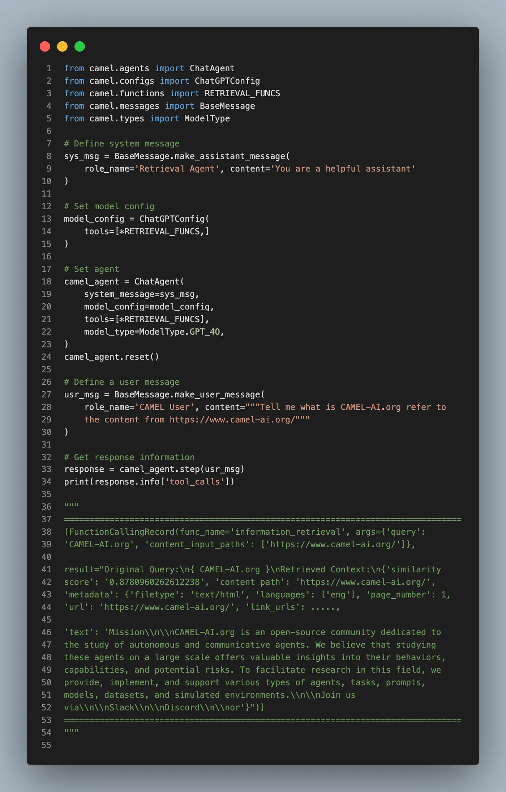

#### **Release Notes Summary:**

Hey everyone! We’re excited to share some major updates to our framework that enhance functionality and user experience. This release introduces new features, integrations, and crucial bug fixes. So, here’s what’s new!

#### **🛠 Tool updates:**

- **🛠 Improved auto retrieval pipeline:** We’ve just added citation for detailed metadata and `information\_retrieval` function calling to the 🐫 CAMEL-AI RAG pipeline! Now agent can make use of information_retrieval as a tool which improves the auto retrieval pipeline. Kudos to our contributor [Wendong-Fan](https://github.com/Wendong-Fan) for this update. 🤝 [Explore more here](https://github.com/camel-ai/camel/pull/537)

- 🚀 **Automatic API Calling with OpenAPI :** We’re excited to announce a groundbreaking feature enhancement for the 🐫 CAMEL project — automatic API calling for APIs that adhere to the OpenAPI Specification (OAS). This update broadens our integration capabilities, now supporting APIs like Klarna, Coursera, and Speak, making the CAMEL ecosystem more versatile than ever! Big thanks to our contributor [yiyiyi0817](https://github.com/yiyiyi0817) for making this happen. 🤝 [Explore more here](https://github.com/camel-ai/camel/pull/548)

#### **🐛Bug fixes:**

- 📝 **Code Quality and Compliance Update:** We’ve refined import statements, clarified `type-ignore` warnings, and fixed a bug in `Opensourceconfig` involving mutable dataclass initialization. Additionally, the `find_children` retriever class now complies with the Liskov Substitution Principle (LSP). Big thanks to our contributor [ocss884](https://github.com/ocss884) for making this happen. 🤝 [Explore more here](https://github.com/camel-ai/camel/pull/533)
- **🔄 Liskov Substitution Principle improvements**: We’ve updated the retriever module to follow the Liskov Substitution Principle (LSP) and switched utils functions to use GPT-3.5-TURBO . Slow real HTTP requests in `bm25_retriever` tests were optimized, and image capabilities for ChatAgent were enabled. Kudos to our contributor [Wendong-Fan](https://github.com/Wendong-Fan) for this update. 🤝 [Explore more here](https://github.com/camel-ai/camel/pull/532)

#### **💡Other updates:**

- **🔄 Config Refactor and Clean-Up**: We’ve removed `ChatGPTVisionConfig` and `GPT_4_TURBO_VISION`. This update also includes refactoring `configs.py` into a `configs/` folder. Thanks [zechengz](https://github.com/zechengz) for working on this. 🤝 [see more here.](https://github.com/camel-ai/camel/pull/539)

#### **🐫Thanks from everyone at CAMEL-AI**

Hello there, passionate AI enthusiasts! 🌟 We are 🐫 CAMEL-AI.org, a global coalition of students, researchers, and engineers dedicated to advancing the frontier of AI and fostering a harmonious relationship between agents and humans.📘 Our Mission: To harness the potential of AI agents in crafting a brighter and more inclusive future for all. Every contribution we receive helps push the boundaries of what’s possible in the AI realm.🙌 Join Us: If you believe in a world where AI and humanity coexist and thrive, then you’re in the right place. Your support can make a significant difference. Let’s build the AI society of tomorrow, together!

- Find all our updates on [X](https://twitter.com/CamelAIOrg).
- Make sure to star our [GitHub](https://github.com/camel-ai) repositories.
- Join our [Discord,](https://discord.gg/nCpraan3sS) [WeChat](https://ghli.org/camel/wechat.png) or [Slack](https://join.slack.com/t/camel-ai/shared_invite/zt-2icssxnkj-YHwFVhoZHMYpIG~ZU86WVw) community.
- You can contact us by email: camel.ai.team@gmail.com
- Dive deeper and explore our projects on <https://www.camel-ai.org/>

‍
