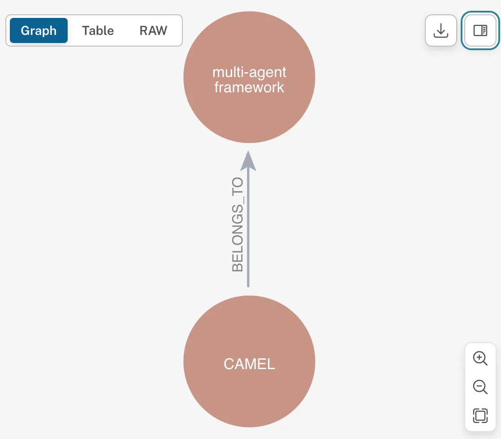
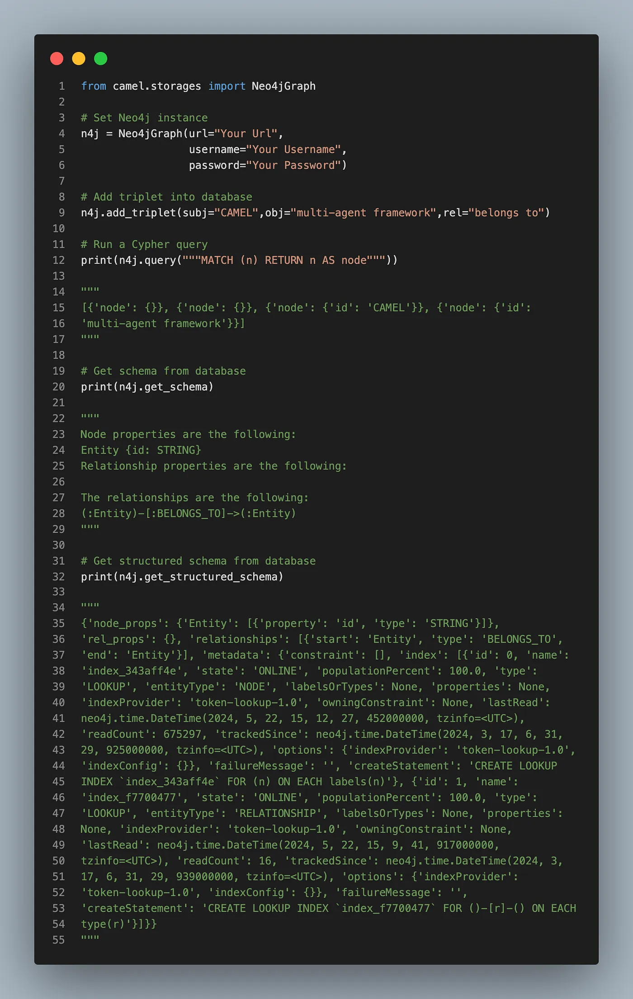
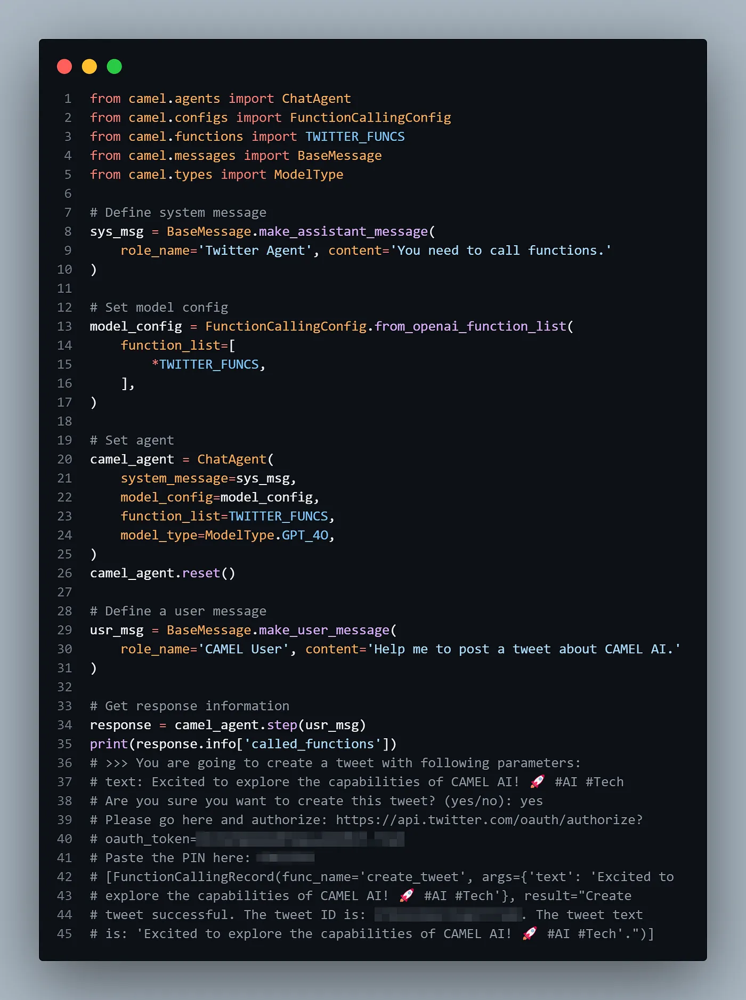

#### **Release Notes Summary:**

Hey everyone! We’re thrilled to share some exciting updates that enhance our framework’s functionality and user experience. This release includes new integrations for knowledge graph storage and social media interactions, alongside crucial bug fixes and model updates.

#### **🧠 Memory / RAG updates:**

- **🧠 Efficient Data Retrieval with Knowledge Graph Storage:** We’ve just rolled out a knowledge graph retriever for advanced RAG in the 🐫 CAMEL-AI framework, integrating neo4j for robust graph storage. This update makes managing and querying schemas super efficient! Big thanks to our contributor [Wendong-Fan](https://github.com/Wendong-Fan) for making this happen. 🤝 [Explore more here](https://github.com/camel-ai/camel/pull/449)

#### **🛠 Tool updates:**

- **🛠 Seamless Social Media Management with Twitter API Integration:** Exciting news! We’ve enabled X API function calls in the 🐫 CAMEL-AI framework. Now, you can create, delete tweets, and fetch user profile information directly through our system. This update makes social media interactions smoother than ever. Kudos to our contributor  
  [yiyiyi0817](https://github.com/yiyiyi0817) for this update. 🤝 [Explore more here](https://github.com/camel-ai/camel/pull/517)

#### **💡 Other updates:**

- **💡 Optimized codebase with Model Updates:** We’ve updated `ModelType` and removed legacy models to streamline our codebase and boost performance. This change is crucial for keeping our framework clean and efficient. If it fixes an open issue, please link to the issue here. Thanks to [lightaime](https://github.com/lightaime) for their contributions.

#### **🐫Thanks from everyone at CAMEL-AI**

Hello there, passionate AI enthusiasts! 🌟 We are 🐫 CAMEL-AI.org, a global coalition of students, researchers, and engineers dedicated to advancing the frontier of AI and fostering a harmonious relationship between agents and humans.

**📘 Our Mission:** To harness the potential of AI agents in crafting a brighter and more inclusive future for all. Every contribution we receive helps push the boundaries of what’s possible in the AI realm.

**🙌 Join Us:** If you believe in a world where AI and humanity coexist and thrive, then you’re in the right place. Your support can make a significant difference. Let’s build the AI society of tomorrow, together!

- Find all our updates on [X](https://twitter.com/CamelAIOrg).
- Make sure to star our [GitHub](https://github.com/camel-ai) repositories.
- Join our [Discord,](https://discord.gg/nCpraan3sS) [WeChat](https://ghli.org/camel/wechat.png) or [Slack,](https://join.slack.com/t/camel-ai/shared_invite/zt-2icssxnkj-YHwFVhoZHMYpIG~ZU86WVw)community.
- You can contact us by email: camel.ai.team@gmail.com
- Dive deeper and explore our projects on <https://www.camel-ai.org/>
