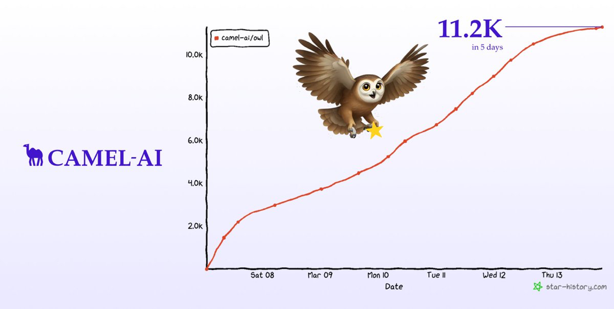
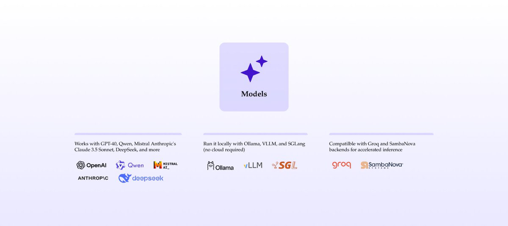
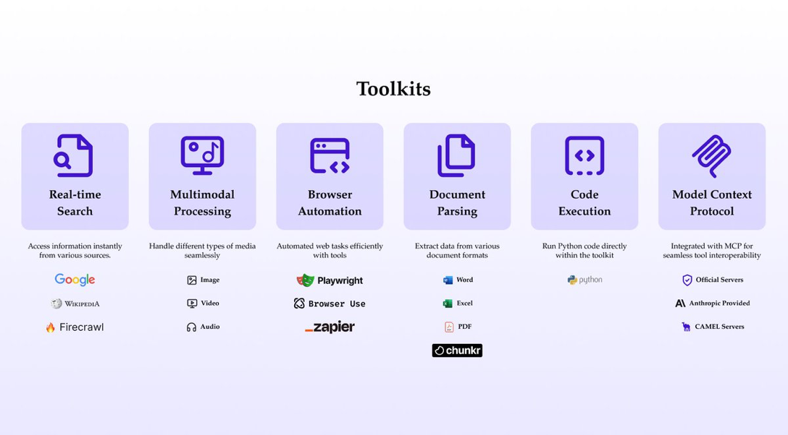

Last week felt like a wild for AI agents. If you’ve been following the space, you probably saw the buzz around [MANUS](https://manus.im/). Manus AI grabbed everyone’s attention. A general AI agent system (impressive, no doubt). But there was a catch, it wasn’t open-source, and you needed an invite just to try it out. Cool tech, but limited access.

We wanted to change that.  
So we did.

We rolled out **OWL**, an **autonomous**, open-source general AI agent built on top of the CAMEL-AI framework. No paywalls. 100% open and ready to use.

**And in just 5 days?**  
→ 11.2K+ GitHub stars  
→ Ranked #1 on GAIA among open source general agents  
→ A community that’s already building, testing, and scaling with it

This is more than a project. OWL is **our answer to the need for accessible, scalable, and autonomous agent frameworks**. We’ve made some real advancements in pushing the boundaries of what autonomous AI agents can do, without the barriers of closed systems.

Let’s take a closer look at why OWL is making waves and why it might be exactly what you’ve been looking for.

## A Modern, Modular Tech Stack

OWL by CAMEL-AI hits 11.2K stars in just 5 days

At CAMEL-AI, we’re all about making life easier for developers, AI researchers, and anyone exploring multi-agent systems.

#### **With OWL, you get:**

**‍**✅ Seamless multi-agent orchestration, thanks to the CAMEL-AI framework  
✅ Built-in Docker support for easy deployment—whether you’re on cloud or local  
✅ A clean, modular Python setup for flexibility and fast prototyping

👉 Ready to try OWL? Jump straight to [GitHub](https://github.com/camel-ai/owl) or keep reading ↓

## State-of-the-Art Model Support

Seamlessly integrate top-tier models like GPT-4o, Claude, Mistral, and DeepSeek — locally or on the cloud.

With OWL, you’re not tied to one model. We built it to be flexible, adaptable, and compatible with the best AI has to offer.

**Cloud-based & Local Models**  
Supports [**GPT-4o**](https://openai.com/index/hello-gpt-4o/), [**Qwen**](https://chat.qwen.ai/), [**Mistral**](https://mistral.ai/), [**Claude 3.5 Sonnet**](https://claude.ai/), [**DeepSeek**](https://www.deepseek.com/), and more.

**Run Locally (Privacy-First)**  
Use [**Ollama**](https://ollama.com/), [**vLLM**](https://docs.vllm.ai/en/latest/), and [**SGLang**](https://github.com/sgl-project/sglang) for on-premises deployments (no cloud needed.)

**Blazing-Fast Inference**  
→ Works with [**Groq**](https://groq.com/) and [**SambaNova**](https://sambanova.ai/) backends for lightning-fast performance.

👉 [See Supported Models](https://docs.camel-ai.org/key_modules/models.html)

## Toolkits That Does It All

30+ powerful toolkits built into CAMEL-AI — enabling browser automation, multimodal input, code execution, and seamless MCP protocol support.

We built a full **autonomous multi-agent system**, packed with 30+ toolkits.

**Real-Time Search & Extraction**  
Pull data from Google, Wikipedia, and scrape at scale with [**Firecrawl**](https://www.firecrawl.dev/).

**Multimodal Processing**  
Analyze images, videos, and audio files effortlessly.

**Browser Automation**  
Automate browser tasks using [**Playwright**](https://playwright.dev/), [**Zapier**](https://zapier.com/), and [**Browseruse**.](https://browser-use.com/)

**Document Parsing & Code Execution**  
Handle Word, Excel, PDF files via [**Chunkr**](https://chunkr.ai/). Run Python code natively.

**MCP Integration**  
→ Built-in support for [**Anthropic’s Model Context Protocol (MCP)**](https://www.anthropic.com/news/model-context-protocol) for seamless tool interoperability.

👉 [See the Full Toolkit List](https://docs.camel-ai.org/key_modules/tools.html#built-in-toolkits)

## Why OWL Is Different (And Why It Matters)

We’re not here to compete on hype. We’re here to offer a **fully autonomous**, open-source alternative that anyone can build with.

- **100% Open-Source** → no fees, no invite codes
- **Runs Locally or in the Cloud** → privacy & scalability
- **Ranks #1 on GAIA Benchmark** → among open-source agent frameworks
- **Backed by an Active Community** → join us on [Discord](https://discord.com/invite/CNcNpquyDc), [Reddit](https://www.reddit.com/r/CamelAI/), and WeChat

### Thats Eveything:

They promised the future of AI agents, **We open-sourced it. 🦉**

It’s clear the AI community has been waiting for something like this that anyone can build on, without gatekeeping.

OWL is just our first step, and we’re beyond excited to see what you create with it.

👉 Try OWL today → [GitHub Link](https://github.com/camel-ai/owl)  
👉 Join the community → [CAMEL-AI Discord](https://discord.com/invite/CNcNpquyDc)

From everyone at CAMEL-AI, thank you for your amazing support.  
Let’s keep building the future of open-source AI, together! 🐫🦉🚀

Massive thanks to our incredible community! Because of your support. Let’s keep building the future of open-source AI together!
